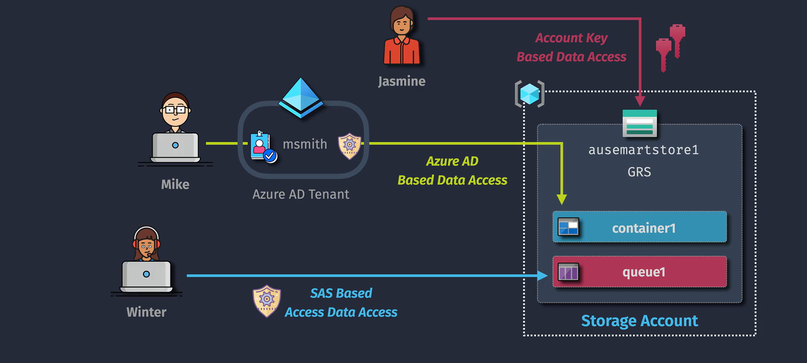
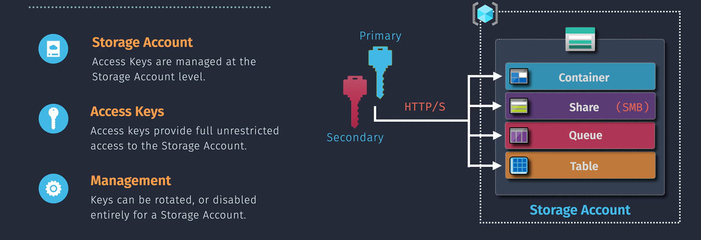
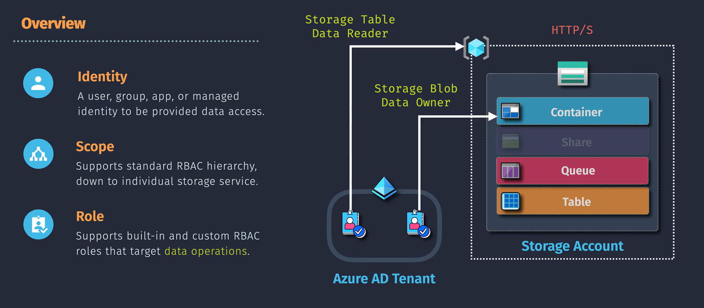
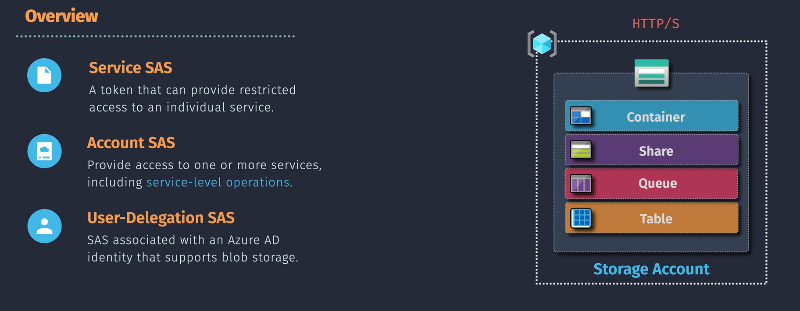

# Azure Storage Access Control

**Azure Storage Access Control** refers to the methods and mechanisms used to manage who can access your Azure Storage resources (such as Blob Storage, File Storage, Queue Storage, and Table Storage) and what actions they can perform. Proper access control ensures that your data is secure and only accessible to authorized users and applications.



## Control Access Methods

Azure offers several ways to control access to your storage accounts:

### 1. Access Keys



**Access Keys** are automatically generated when you create a storage account. They provide full access to all the data and configurations in the storage account. Azure generates two keys to support key rotation without downtime, enhancing security.

- **Types:**

  - **Primary Key:** Full access to all storage services.
  - **Secondary Key:** Can be used interchangeably with the primary key for redundancy. For example, if your storage account uses **PrimaryKey** for access, generate a new key and update your applications to use the new **SecondaryKey**. Then, regenerate the PrimaryKey and switch back once updated, ensuring continuous and secure access.

**Use Case:** Typically used for administrative tasks or when integrating with applications that require full access.

### 2. Azure Role-Based Access Control (RBAC)



**Azure RBAC** allows you to assign roles to users, groups, or applications to grant specific permissions to Azure resources.

- **Roles:** Define a set of permissions. Common roles include:

  - **Storage Blob Data Owner:** have full access to Blob data.
  - **Storage Blob Data Contributor:** Can read and write Blob data.
  - **Storage Blob Data Reader:** Can read Blob data.

- **Scopes:** Determine where the roles apply. Scopes can be:
  - **Subscription:** Applies to all resources within a subscription.
  - **Resource Group:** Applies to all resources within a resource group.
  - **Resource:** Applies to a specific resource, like a storage account.

**Use Case:** Granting a developer access to manage Blob Storage without giving them full access to the entire storage account.

### 3. Shared Access Signatures (SAS)



**SAS** provides a way to grant limited access to your storage resources without sharing your account keys.

- **Types of SAS:**

  - **Service SAS:** Grants access to specific services (Blob, File, Queue, Table).
  - **Account SAS:** Grants access to multiple services within a storage account.
  - **User Delegation SAS:** Uses Azure AD credentials for enhanced security.

- **Parameters:** Define what the SAS can access, permissions (read, write, delete), and the time frame for access.

**Use Case:** Allowing a client application to upload files to Blob Storage without exposing your storage account keys.

## Protocols of Access Methods

Azure Storage data can be accessed via REST API, NFS (Network File System), and SMB (Server Message Block) protocols, each catering to different data access and integration needs.


### 1. **REST API**

The Azure Storage REST API provides a programmatic way to interact with Azure Storage services. It allows you to perform operations like uploading, downloading, and managing data in Blob Storage, Table Storage, and Queue Storage. This method is particularly useful for custom applications and integrations.

### 2. **NFS (Network File System)**

Azure supports NFS 3.0 protocol for Azure Blob Storage and Azure Files. This allows you to access your Azure Storage data as if it were a local network file system. It's ideal for scenarios where you need high-performance file storage accessible by Linux and UNIX systems.

### 3. **SMB (Server Message Block)**

Azure Files supports the SMB protocol, which enables file shares to be accessed by Windows, macOS, and Linux systems. This is perfect for applications that require shared access to files and compatibility with on-premises systems.

## Implementation of Access Control

Securing your Azure Blob Storage is essential, and Azure provides multiple access control methods to ensure your data remains protected while being accessible to authorized users and applications. Below are the primary access control methods—**Azure Role-Based Access Control (RBAC)**, **Shared Access Signatures (SAS)**, and **Access Keys**—along with clear and concise examples on how to implement them effectively.

### A. Azure Role-Based Access Control (RBAC)

RBAC allows you to manage who has access to Azure resources, what they can do with those resources, and what areas they have access to. It's ideal for scenarios where you need to grant specific permissions to users, groups, or applications without exposing access keys.

#### Using Azure Portal

1. **Navigate to Your Storage Account**

   - Log in to the [Azure Portal](https://portal.azure.com/).
   - Select **"Storage Accounts"** from the left-hand menu.
   - Click on your desired storage account.

2. **Configure RBAC**
   - In the storage account's menu, select **"Access Control (IAM)"**.
   - Click **"Add"** and then **"Add role assignment"**.
   - **Select a Role**: Choose a role like **"Storage Blob Data Contributor"**.
   - **Assign Access To**: Select **"User, group, or service principal"**.
   - **Select Members**: Choose the user, group, or application to assign the role to.
   - Click **"Save"** to apply the role assignment.

#### Using Azure CLI

```bash
# Log in to Azure
az login

# Assign RBAC role
az role assignment create \
  --assignee johndoe@example.com \
  --role "Storage Blob Data Contributor" \
  --scope "/subscriptions/12345678-1234-1234-1234-123456789abc/resourceGroups/MyResourceGroup/providers/Microsoft.Storage/storageAccounts/MyStorageAccount"
```

#### Use Case Example: Azure-Hosted Application with Managed Identity

**Scenario:** A web application hosted on Azure App Service needs to read and write blobs in a storage account.

**Implementation Steps:**

1. **Enable Managed Identity** for your Azure App Service.
2. **Assign the "Storage Blob Data Contributor"** role to the App Service's Managed Identity using RBAC.

**.NET Application Example:**

```csharp
using Azure.Identity;
using Azure.Storage.Blobs;

// Initialize the credential using DefaultAzureCredential, which leverages Managed Identity when running on Azure
var credential = new DefaultAzureCredential();

// Create a BlobServiceClient using the storage account URI and the credential
var blobServiceClient = new BlobServiceClient(new Uri("https://MyStorageAccount.blob.core.windows.net"), credential);

// Example: List all containers in the storage account
await foreach (var container in blobServiceClient.GetBlobContainersAsync())
{
    Console.WriteLine(container.Name);
}
```

**Key Points:**

- **Managed Identity** ensures secure and seamless authentication without managing credentials.
- **DefaultAzureCredential** automatically handles authentication, leveraging Managed Identity when running on Azure.

---

### B. Shared Access Signatures (SAS)

SAS provides a way to grant limited access to your storage resources without exposing your account keys. You can specify permissions, the resources accessible, and the time frame during which the SAS is valid.

#### Using Azure Portal

1. **Navigate to Your Storage Account**

   - Log in to the [Azure Portal](https://portal.azure.com/).
   - Select **"Storage Accounts"** and choose your storage account.

2. **Generate SAS Token**
   - Click on **"Shared access signature"** in the storage account menu.
   - **Configure SAS Parameters**:
     - **Allowed Services**: Select **Blob**.
     - **Allowed Resource Types**: Choose **Container** and **Object**.
     - **Allowed Permissions**: Check **Read**, **Write**, **Delete**, **List** as needed.
     - **Start and Expiry Time**: Set the validity period.
     - **Allowed Protocols**: Select **HTTPS only** for security.
   - Click **"Generate SAS and connection string"**.
   - **Copy the SAS Token** and **Blob SAS URL** for use in your application.

#### Using Azure CLI

```bash
# Generate SAS Token for a Blob
az storage blob generate-sas \
  --account-name MyStorageAccount \
  --container-name mycontainer \
  --name myblob.txt \
  --permissions rwdl \
  --expiry $(date -u -d "1 hour" '+%Y-%m-%dT%H:%MZ') \
  --output tsv
```

#### Use Case Example: Client-Side Uploads to Blob Storage

**Scenario:** A web application allows users to upload images directly to Azure Blob Storage without passing through your server.

**Implementation Steps:**

1. **Generate a SAS token** with **Write** permissions for the target container.
2. **Send the SAS URL** to the client.
3. **Client Application (JavaScript Example):**

```javascript
const sasUrl = "https://MyStorageAccount.blob.core.windows.net/mycontainer/myblob.txt?<SASToken>";

// Function to upload a file using Fetch API
async function uploadFile(file) {
  const response = await fetch(sasUrl, {
    method: "PUT",
    headers: {
      "x-ms-blob-type": "BlockBlob",
      "Content-Type": file.type,
    },
    body: file,
  });

  if (response.ok) {
    console.log("Upload successful");
  } else {
    console.error("Upload failed");
  }
}
```

**Benefits:**

- **Reduced Server Load**: Files are uploaded directly to Blob Storage.
- **Enhanced Security**: SAS tokens limit access and time frame.

---

### C. Access Keys

Access Keys provide full access to your storage account. They should be handled securely and rotated regularly to maintain security. Use them sparingly, primarily for backend services that require complete control.

#### Using Azure Portal

1. **Navigate to Your Storage Account**

   - Log in to the [Azure Portal](https://portal.azure.com/).
   - Select **"Storage Accounts"** and choose your storage account.

2. **Access Keys**
   - Click on **"Access keys"** in the storage account menu.
   - **View Keys**: You'll see **Key1** and **Key2** along with their connection strings.
   - **Regenerate Keys**: Click **"Regenerate key1"** or **"Regenerate key2"** if needed.
   - **Copy Connection String**: Use the **"Copy"** button to copy the desired key for your applications.

#### Using Azure CLI

```bash
# Retrieve Access Keys
az storage account keys list \
  --resource-group MyResourceGroup \
  --account-name MyStorageAccount \
  --output table

# Regenerate an Access Key
az storage account keys renew \
  --resource-group MyResourceGroup \
  --account-name MyStorageAccount \
  --key key1
```

#### Use Case Example: Backend Service Requiring Full Access

**Scenario:** A backend service needs to perform various operations on Blob Storage, including creating, reading, updating, and deleting blobs.

**Implementation Steps:**

1. **Store the Access Key** securely in a configuration file or environment variable (preferably using Azure Key Vault).
2. **Use the Access Key** in your application to authenticate with the storage account.

**.NET Application Example:**

```csharp
using Azure.Storage.Blobs;

// Your storage account connection string
string connectionString = "DefaultEndpointsProtocol=https;AccountName=MyStorageAccount;AccountKey=YourAccessKey;EndpointSuffix=core.windows.net";

// Create a BlobServiceClient using the connection string
var blobServiceClient = new BlobServiceClient(connectionString);

// Example: List all containers in the storage account
await foreach (var container in blobServiceClient.GetBlobContainersAsync())
{
    Console.WriteLine(container.Name);
}
```

**Security Considerations:**

- **Store Securely**: Use Azure Key Vault or environment variables to protect the connection string.
- **Rotate Regularly**: Change keys periodically to minimize the risk of unauthorized access.

## Best Practices

1. **Use RBAC Over Access Keys:**

   - Prefer RBAC for managing permissions as it offers more granular control and better security.

2. **Limit SAS Token Permissions and Lifetimes:**

   - Grant only the necessary permissions and set appropriate expiry times to minimize security risks.

3. **Rotate Access Keys Regularly:**

   - If you must use access keys, rotate them regularly to reduce the risk of unauthorized access.

4. **Leverage Azure Key Vault:**

   - Store and manage your SAS tokens and access keys securely using Azure Key Vault.

5. **Monitor and Audit Access:**

   - Use Azure Monitor and Azure Activity Logs to track access and detect any unusual activities.

6. **Implement Network Security:**

   - Restrict access to your storage accounts using Network Security Groups (NSGs) and firewall rules.

7. **Use HTTPS:**

   - Ensure that all access to your storage accounts is done over secure HTTPS connections to protect data in transit.

8. **Apply the Principle of Least Privilege:**
   - Assign only the permissions necessary for users and applications to perform their tasks.

## Summary

| **Feature**     | **Azure RBAC**                                     | **Shared Access Signatures (SAS)**              | **Access Keys**                                           |
| --------------- | -------------------------------------------------- | ----------------------------------------------- | --------------------------------------------------------- |
| **Purpose**     | Assign specific roles to users/groups/applications | Grant limited access to storage resources       | Provide full access to storage account                    |
| **Granularity** | Fine-grained control over permissions              | Controlled permissions with time limits         | Full control without restrictions                         |
| **Security**    | High - uses Azure AD for authentication            | Medium - exposure risk if SAS tokens are leaked | Low - high risk if keys are compromised                   |
| **Management**  | Managed through Azure IAM                          | Managed per resource with specific parameters   | Requires secure storage and regular rotation              |
| **Use Cases**   | Assigning roles like Reader, Contributor           | Temporary access for clients/applications       | Administrative tasks and applications needing full access |
| **Integration** | Seamlessly integrates with Azure services          | Can be used in URLs and APIs                    | Used in application configurations and scripts            |
