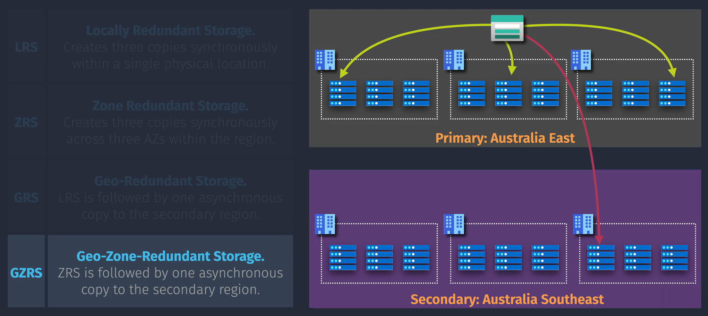
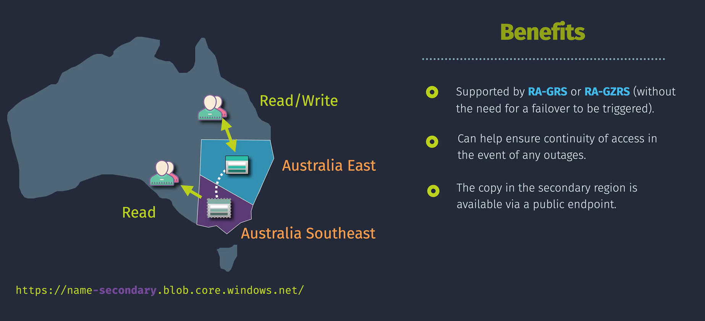
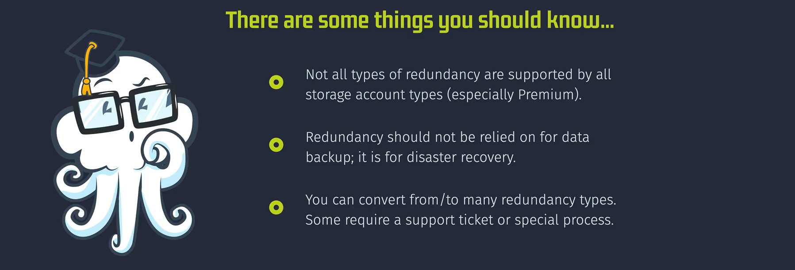
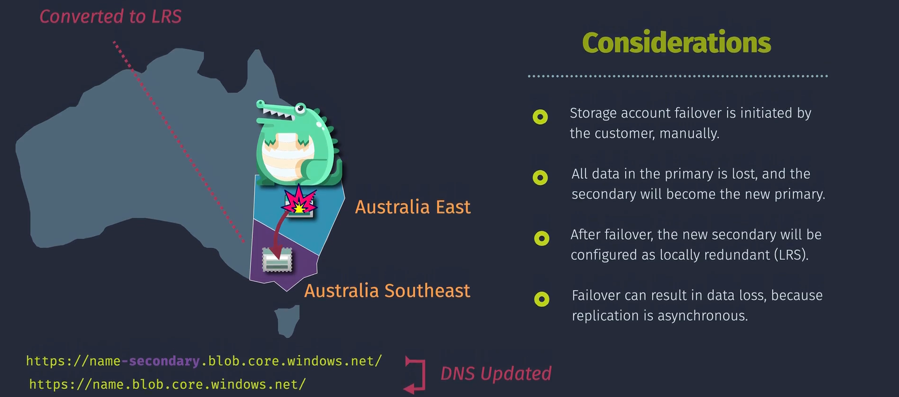

# Azure Storage Redundancy

**Azure Storage Redundancy** ensures your data is replicated across different locations to provide high availability and durability. By replicating data, Azure protects against hardware failures, network outages, and other disruptions, ensuring your applications remain resilient and your data stays accessible.

## Types of Storage Redundancy

Azure offers several redundancy options to cater to different availability and durability needs:

### 1. Locally Redundant Storage (LRS)

- **Description**: Keeps three copies of your data within a single data center.
- **Use Case**: Protects against local hardware failures.

### 2. Zone-Redundant Storage (ZRS)

- **Description**: Replicates your data across three availability zones within a region.
- **Use Case**: Protects against data center failures within the same region.

### 3. Geo-Redundant Storage (GRS)

- **Description**: LRS replicated to a secondary region asynchronously.
- **Use Case**: Provides disaster recovery protection against regional outages.

### 4. Geo-Zone-Redundant Storage (GZRS)

- **Description**: Combines ZRS and GRS, replicating data across availability zones in the primary region and to a secondary region.
- **Use Case**: Protects against both zone-level and regional failures.

### Secondary Read Access Options

#### 5. Read-Access Geo-Redundant Storage (RA-GRS)

- **Description**: Similar to GRS but allows read access to the data in the secondary region.
- **Use Case**: Enables reading data from the secondary region during a regional outage.

#### 6. Read-Access Geo-Zone-Redundant Storage (RA-GZRS)

- **Description**: Combines GZRS with read access to the secondary region.
- **Use Case**: Provides the highest level of availability and protection with read access from the secondary region.

## Implementing Storage Redundancy

some redundancy options, such as switching from LRS to ZRS, GRS, or RA-GRS, might require Azure support assistance and cannot be directly changed via the Azure Portal or CLI

**Using Azure Portal:**

1. **Navigate to Storage Account:**

   - Log in to the [Azure Portal](https://portal.azure.com/).
   - Click on **"Storage accounts"** and select **"Create"** to make a new storage account or select an existing one.

2. **Configure Redundancy:**

   - In the **"Basics"** tab, under **"Replication"**, choose the desired redundancy option (LRS, ZRS, GRS, or RA-GRS).
   - Complete other required configurations.

3. **Review and Create:**
   - Review your settings and click **"Create"** to deploy the storage account with the selected redundancy.

## Important Considerations

1. **Cost Implications**:

   - Higher redundancy options (like GRS, GZRS, RA-GRS, and RA-GZRS) provide greater data protection but come with higher costs. It's important to balance your redundancy needs with your budget.

2. **Data Consistency**:

   - For GRS and RA-GRS, data is replicated asynchronously to the secondary region, which means there might be a slight lag between the primary and secondary regions. Plan accordingly for applications that require strict consistency.

3. **Access Times**:

   - LRS and ZRS offer faster access times within the same region since the data doesn't need to travel as far. GRS and RA-GRS might have slightly longer access times due to cross-region replication.

## Summary Table

Here's a quick reference table summarizing the key characteristics of each redundancy type:

| Redundancy Type | Description                                                    | Use Case                                        |
| --------------- | -------------------------------------------------------------- | ----------------------------------------------- |
| LRS             | Keeps three copies within a single data center                 | Protects against local hardware failures        |
| ZRS             | Replicates across three availability zones within a region     | Protects against data center failures           |
| GRS             | LRS + async replication to a secondary region                  | Disaster recovery for regional outages          |
| GZRS            | Combines ZRS and GRS with replication across zones and regions | Both zone-level and regional failure protection |
| RA-GRS          | GRS with read access to secondary region                       | Read from secondary region during outages       |
| RA-GZRS         | GZRS with read access to secondary region                      | Highest availability with read access           |
