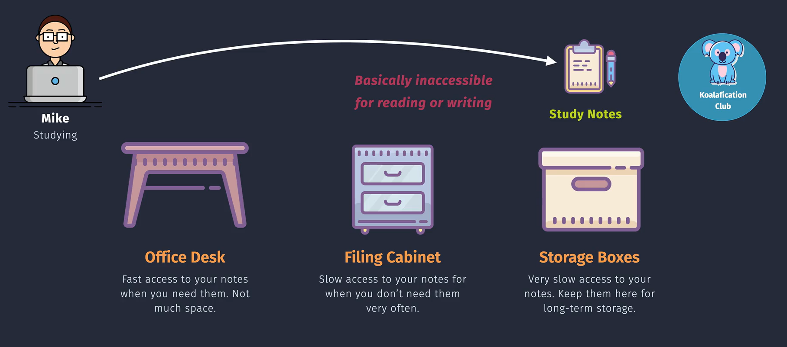
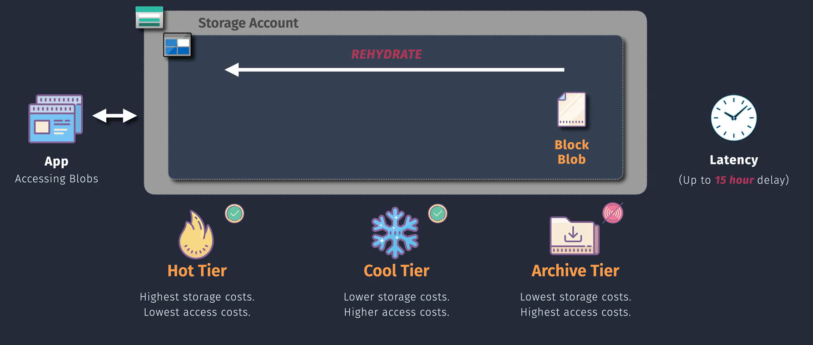
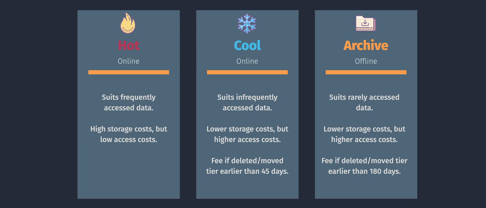

# Blob Storage Access Tiers

**Azure Blob Storage Access Tiers**allow you to optimize your storage costs by storing your data in the most cost-effective manner based on how frequently and how quickly you need to access it. There are three primary access tiers: **Hot**, **Cool**, and **Archive**.




- **Hot Tier:** Optimized for data that is accessed frequently.
- **Cool Tier:** Designed for data that is infrequently accessed and stored for at least 30 days.
- **Archive Tier:** Best for data that is rarely accessed and stored for at least 180 days.

## Types of Access Tiers



### 1. Hot Tier

- **Description:**

  - Optimized for storing data that is accessed frequently.
  - Higher storage costs but lower access costs.

- **Use Cases:**

  - Active data used by applications.
  - Content distribution like images and videos.
  - Data analytics and real-time processing.

- **Benefits:**
  - Fast access to data.
  - Ideal for scenarios requiring high performance.

### 2. Cool Tier

- **Description:**

  - Optimized for storing data that is accessed infrequently.
  - Lower storage costs compared to Hot Tier but higher access costs.

- **Use Cases:**

  - Backup and disaster recovery data.
  - Data that is retained for long-term but accessed occasionally.
  - Older media content not frequently accessed.

- **Benefits:**
  - Cost-effective for infrequently accessed data.
  - Suitable for data retention policies.

### 3. Archive Tier

- **Description:**

  - Optimized for storing data that is rarely accessed and stored for long periods.
  - Lowest storage costs but highest access costs and latency.

- **Use Cases:**

  - Long-term archival of compliance data.
  - Historical data storage.
  - Media archives and large-scale backups.

- **Benefits:**
  - Extremely cost-effective for long-term storage.
  - Suitable for data that does not require immediate access.

## Changing Access Tiers

You can change the access tier of your blobs based on your needs. This can be done using the Azure Portal, Azure CLI, or Azure PowerShell.

### Using Azure Portal

1. **Navigate to Blob Storage:**

   - Go to the [Azure Portal](https://portal.azure.com/).
   - Select **"Storage Accounts"** and choose your storage account.
   - Navigate to **"Containers"** and select the desired container.

2. **Change Access Tier:**
   - Select the blob(s) you want to modify.
   - Click on **"Change tier"**.
   - Choose the desired tier (Hot, Cool, Archive).
   - Confirm the change.

### Using Azure CLI

```bash
# Change blob tier to Cool
az storage blob set-tier \
  --container-name <ContainerName> \
  --name <BlobName> \
  --tier Cool \
  --account-name <StorageAccount>

# Change blob tier to Archive
az storage blob set-tier \
  --container-name <ContainerName> \
  --name <BlobName> \
  --tier Archive \
  --account-name <StorageAccount>
```

**Example:**

```bash
az storage blob set-tier \
  --container-name mycontainer \
  --name myblob.txt \
  --tier Cool \
  --account-name mystorageaccount
```

## Choosing the Right Access Tier

- **Hot Tier:** Choose for data that requires frequent access and low latency.
- **Cool Tier:** Select for data accessed less frequently but needs to be available without long retrieval times.
- **Archive Tier:** Use for data that is rarely accessed and can tolerate high latency during retrieval.

**Tip:** You can change the access tier of your data as its access patterns evolve over time.
