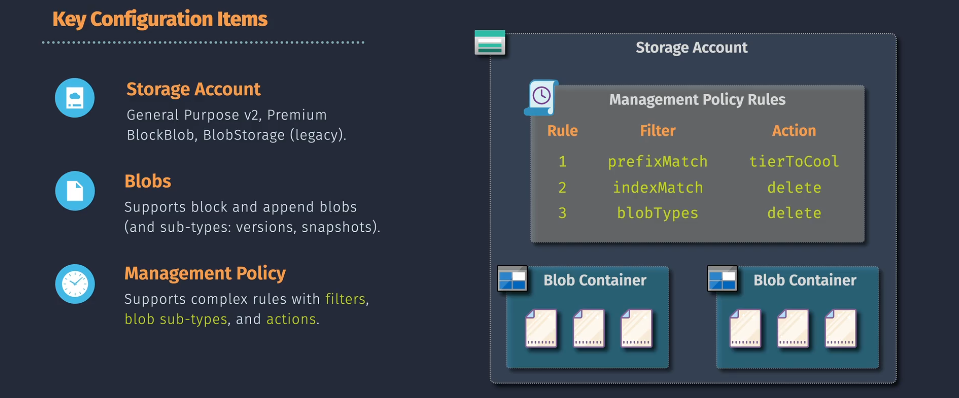

# Blob Storage Lifecycle Management

**Blob Storage Lifecycle Management** is a policy-based feature in Azure that allows you to define rules to automatically transition your blob data between different access tiers or delete them after a specified period. This automation helps in reducing storage costs by ensuring that data resides in the most cost-effective tier based on its usage.


- **Access Tiers:**

  - **Hot:** For frequently accessed data.
  - **Cool:** For infrequently accessed data.
  - **Archive:** For rarely accessed data.

- **Actions:**
  - **Move to a Cooler Tier:** Transition blobs to a lower-cost tier when they become less frequently accessed.
  - **Delete Blobs:** Automatically remove blobs that are no longer needed.

## Key Features

- **Automated Tier Transition:** Automatically move blobs between Hot, Cool, and Archive tiers based on defined rules.
- **Scheduled Deletion:** Set policies to delete blobs after a certain period, helping manage data retention.
- **Multiple Rules:** Create multiple rules to handle different data lifecycle scenarios within the same storage account.
- **Cost Optimization:** Reduce storage costs by ensuring data is stored in the most appropriate tier.
- **Flexibility:** Customize rules based on blob age, last access time, or other criteria.

## Key Components



1. **Storage Account:** **General Purpose v2**, **Premium BlockBlob**, **BlobStorage** (legacy)
1. **Blobs:** supported **block** and **append blobs** (and sub-types: **version**, **snapshots**)
1. **Management Policy:** support complex rules with filters, blob sub-types, and actions.

## Implementing Lifecycle Management

You can set up Blob Storage Lifecycle Management using the **Azure Portal** or **Azure CLI**. Below are the steps for each method.

### Using Azure Portal

1. **Navigate to Storage Account:**

   - Log in to the [Azure Portal](https://portal.azure.com/).
   - Click on **"Storage Accounts"** and select your storage account.

2. **Access Lifecycle Management:**

   - In the storage account's menu, scroll down to **"Blob service"**.
   - Click on **"Lifecycle management"**.

3. **Add a Rule:**
   - Click **"Add rule"**.
   - **Name:** Enter a name for the rule (e.g., `MoveToCool`).
   - **Scope:** Choose the scope of the rule (e.g., entire storage account or specific containers).
   - **Filter Set:** Define filters based on blob name patterns or blob types (optional).
   - **Add Transition:**
     - Select the **"Transition blob to cool tier"** or **"Transition blob to archive tier"**.
     - Specify the number of days after creation or last modification when the transition should occur.
   - **Add Deletion (Optional):**
     - Choose to delete blobs after a certain period.
   - **Review and Add:**
     - Review the rule settings.
     - Click **"Add rule"** to save and apply the rule.

### Using Azure CLI

1. **Install Azure CLI:**

   - Ensure you have the [Azure CLI](https://docs.microsoft.com/cli/azure/install-azure-cli) installed.

2. **Log In to Azure:**

   ```bash
   az login
   ```

3. **Create a Lifecycle Management Rule:**

   - **Example:** Move blobs to Cool tier after 30 days and delete after 365 days.

   ```bash
   az storage account management-policy create \
     --account-name <StorageAccount> \
     --resource-group <ResourceGroup> \
     --policy '{
       "rules": [
         {
           "name": "MoveToCoolAndDelete",
           "enabled": true,
           "type": "Lifecycle",
           "definition": {
             "filters": {
               "blobTypes": ["blockBlob"],
               "prefixMatch": ["container-name/"]
             },
             "actions": {
               "baseBlob": {
                 "tierToCool": {
                   "daysAfterModificationGreaterThan": 30
                 },
                 "delete": {
                   "daysAfterModificationGreaterThan": 365
                 }
               }
             }
           }
         }
       ]
     }'
   ```

   - **Replace `<StorageAccount>` and `<ResourceGroup>`** with your storage account name and resource group.
