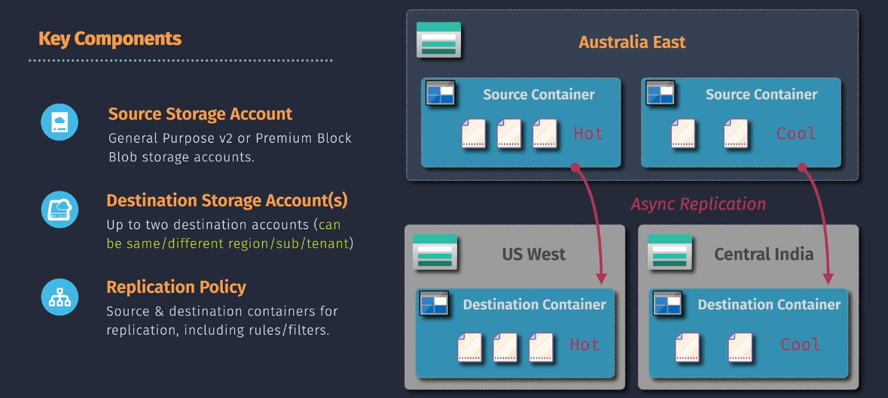

# Azure Block Blob Object Replication

**Block Blob Object Replication** is a feature in Azure Storage that automatically copies block blobs from a source storage account to a destination storage account. This replication is asynchronous and can be configured to meet various data redundancy and availability requirements.

- **Source Account:** The Azure Storage account where the original block blobs reside.
- **Destination Account:** The Azure Storage account where the block blobs are replicated.
- **Scope:** Replication can be set at the container level, allowing selective replication of specific data.



## Key Features

- **Automated Replication:** Automatically replicates block blobs without manual intervention.
- **Asynchronous Process:** Ensures that replication does not impact the performance of your applications.
- **Selective Replication:** Choose specific containers to replicate based on your needs.
- **Cross-Region Support:** Replicate data across different Azure regions for disaster recovery and global distribution.
- **Consistency:** Maintains data consistency between source and destination accounts.
- **Monitoring:** Integrates with Azure Monitor for tracking replication status and performance.

## Benefits

- **Enhanced Data Availability:** Ensures your data is available even if one region faces outages.
- **Disaster Recovery:** Provides a backup of your data in a different location, safeguarding against data loss.
- **Global Data Distribution:** Distribute data closer to your users for improved access speeds and performance.
- **Simplified Management:** Automates the replication process, reducing the need for manual data transfers.
- **Cost-Effective:** Optimize storage costs by choosing appropriate replication strategies based on your requirements.

## Implementing Block Blob Object Replication

You can set up Block Blob Object Replication using the **Azure Portal** or **Azure CLI**. Below are the steps for each method.

### Using Azure Portal

1. **Navigate to Source Storage Account:**

   - Log in to the [Azure Portal](https://portal.azure.com/).
   - Click on **"Storage Accounts"** and select your **source storage account**.

2. **Access Replication Settings:**

   - In the storage account's menu, scroll down to **"Data management"**.
   - Click on **"Object replication"**.

3. **Add a Replication Rule:**

   - Click on **"Add replication rule"**.
   - **Rule Name:** Enter a name for the replication rule (e.g., `ReplicateToUSWest`).
   - **Source Container:** Select the container from the source account you want to replicate.
   - **Destination Storage Account:** Choose your **destination storage account** from the dropdown.
   - **Destination Container:** Select or create a container in the destination account.
   - **Additional Options:**
     - **Filter:** Optionally, set filters based on blob name prefixes.
     - **Replication Conditions:** Define conditions like blob type (ensure it's set to block blobs).
   - **Review and Create:**
     - Review the settings and click **"Create"** to apply the replication rule.

4. **Verify Replication:**
   - Once the rule is created, new block blobs added to the source container will automatically replicate to the destination container based on the defined rules.

### Using Azure CLI

1. **Install Azure CLI:**

   - Ensure you have the [Azure CLI](https://docs.microsoft.com/cli/azure/install-azure-cli) installed on your machine.

2. **Log In to Azure:**

   ```bash
   az login
   ```

3. **Create a Replication Policy:**

   - Define a JSON file (`replication-policy.json`) with the replication rules.

   ```json
   {
     "rules": [
       {
         "ruleName": "ReplicateToUSWest",
         "sourceContainer": "source-container",
         "destinationAccount": "destinationaccountname",
         "destinationContainer": "destination-container",
         "filter": {
           "blobTypes": ["blockBlob"],
           "prefixMatch": ["prefix/"]
         }
       }
     ]
   }
   ```

4. **Apply the Replication Policy:**

   ```bash
   az storage account object-replication-policy create \
     --account-name <SourceStorageAccount> \
     --resource-group <ResourceGroup> \
     --policy @replication-policy.json
   ```

   **Example:**

   ```bash
   az storage account object-replication-policy create \
     --account-name mysourceaccount \
     --resource-group myresourcegroup \
     --policy @replication-policy.json
   ```

5. **Verify Replication:**
   - Check the status of replication to ensure it's active and functioning as expected.

## Summary

**Azure Block Blob Object Replication** is a powerful feature that enhances the resilience and availability of your data by automatically copying block blobs from a source storage account to a destination storage account. This replication ensures that your data remains accessible even in the face of regional outages or disasters, supporting robust disaster recovery and global data distribution strategies.

By implementing **Block Blob Object Replication**, you can:

- **Ensure Data Redundancy:** Protect your data against failures by having multiple copies across different storage accounts and regions.
- **Enhance Availability:** Maintain continuous access to your data, supporting high-availability applications and services.
- **Optimize Costs and Performance:** Select appropriate storage tiers for replicated data to balance cost and access requirements.
- **Simplify Management:** Automate the replication process, reducing the need for manual data transfers and ensuring consistent data availability.
- **Support Compliance and Security:** Meet regulatory requirements by replicating data to specific regions and securing it with Azure's robust access control mechanisms.

**Key Actions:**

- **Define Clear Replication Policies:** Establish rules that align with your business needs and data access patterns.
- **Secure Both Source and Destination Accounts:** Implement RBAC, SAS, and Access Keys to protect your data throughout the replication process.
- **Monitor Replication Health:** Regularly check the status and performance of your replication setup to ensure it operates smoothly.
- **Plan for Disaster Recovery:** Use replication as part of your comprehensive disaster recovery plan to minimize downtime and data loss.
