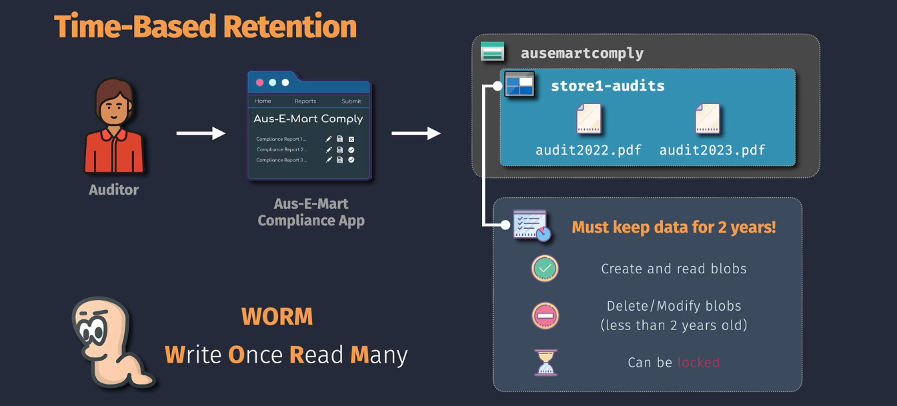
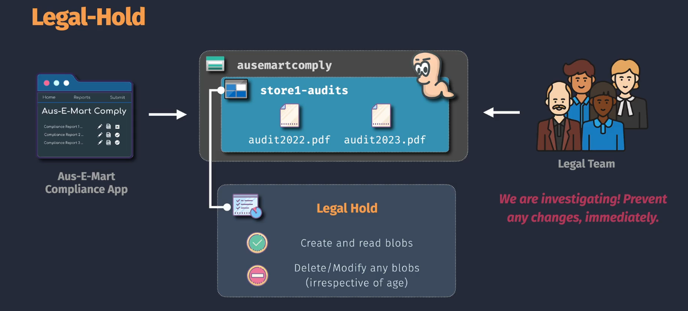

# Immutable Blob Storage

**Immutable Blob Storage** in Azure provides a way to make blob data non-modifiable and non-deletable for a specified period or until a legal hold is removed. This ensures that data remains in its original state, protecting it from tampering and ensuring compliance with regulatory requirements.

- **Write Once, Read Many (WORM):** Allows data to be written once and read multiple times without alteration.
- **Retention Policies:** Define how long the data must remain immutable.
- **Legal Hold:** Prevents data from being modified or deleted indefinitely until the hold is released.

## Use Cases

1. **Regulatory Compliance:**

   - Ensure data retention policies meet industry regulations requiring data to be preserved for a certain period.

2. **Legal Evidence Preservation:**

   - Maintain unaltered data for legal investigations and audits.

3. **Data Archiving:**

   - Store historical data that should not be modified for long-term records.

4. **Financial Records:**

   - Protect financial transactions and records from tampering.

5. **Healthcare Data:**
   - Secure patient records and sensitive health information against unauthorized changes.

## Types of Immutable Blob Storage

Azure Immutable Blob Storage offers two primary mechanisms to enforce data immutability:

### 1. Time-Based Retention



**Time-Based Retention** ensures that your blob data remains immutable for a specified number of days. After the retention period expires, the blobs can be modified or deleted based on your policies.

- **Description:**

  - Data cannot be modified or deleted during the retention period.
  - Automatically expires after the defined period, allowing normal operations thereafter.

- **Use Cases:**

  - Compliance with data retention regulations requiring data to be preserved for a certain period.
  - Protecting historical records that should remain unchanged for auditing purposes.

- **Benefits:**
  - Automates data protection without manual intervention.
  - Ensures compliance with industry-specific regulations.
  - Reduces the risk of accidental or malicious data alterations.

### 2. Legal Hold



**Legal Hold** preserves blob data indefinitely until the hold is explicitly removed. This is particularly useful during legal investigations or when data must be preserved beyond standard retention periods.

- **Description:**

  - Data remains immutable until the legal hold is lifted.
  - No automatic expiration; requires manual intervention to remove the hold.

- **Use Cases:**

  - Legal investigations where data integrity is paramount.
  - Ensuring data preservation during litigation or regulatory inquiries.

- **Benefits:**
  - Provides indefinite data protection as required by legal scenarios.
  - Ensures data integrity during sensitive periods.
  - Facilitates compliance with legal and regulatory mandates.

## Implementing Immutable Blob Storage

You can set up Immutable Blob Storage using the **Azure Portal**, **Azure CLI**, or **Azure PowerShell**. Below are the steps for each method, categorized by the type of immutability you wish to implement.

### A. Time-Based Retention

#### Using Azure Portal

1. **Navigate to Storage Account:**

   - Go to the [Azure Portal](https://portal.azure.com/).
   - Click on **"Storage Accounts"** and select your storage account.

2. **Access Blob Containers:**

   - In the storage account's menu, scroll down to **"Data storage"**.
   - Click on **"Containers"** and select the desired container or create a new one.

3. **Enable Time-Based Retention:**

   - In the container's menu, click on **"Immutable blob storage"**.
   - Click **"Add policy"**.
   - **Policy Name:** Enter a name for the policy (e.g., `ComplianceRetention`).
   - **Immutability Policy Type:** Select **"Time-based retention"**.
   - **Set Retention Period:** Enter the number of days the data should remain immutable (e.g., 30 days).
   - **Review and Apply:** Click **"Save"** to apply the policy.

4. **Verify Policy:**
   - Ensure that the policy is listed under **"Immutable blob storage"** for the container.

#### Using Azure CLI

```bash
# Log in to Azure
az login

# Create a container with a time-based retention policy of 30 days
az storage container create \
  --name mycontainer \
  --account-name mystorageaccount \
  --immutability-policy "enabled=true;immutabilityPeriod=30"
```

**Example:**

```bash
az storage container create \
  --name compliance-data \
  --account-name mystorageaccount \
  --immutability-policy "enabled=true;immutabilityPeriod=90"
```

### B. Legal Hold

#### Using Azure Portal

1. **Navigate to Storage Account:**

   - Go to the [Azure Portal](https://portal.azure.com/).
   - Click on **"Storage Accounts"** and select your storage account.

2. **Access Blob Containers:**

   - In the storage account's menu, scroll down to **"Data storage"**.
   - Click on **"Containers"** and select the desired container or create a new one.

3. **Apply Legal Hold:**

   - In the container's menu, click on **"Immutable blob storage"**.
   - Click **"Add policy"**.
   - **Policy Name:** Enter a name for the policy (e.g., `LegalHoldPolicy`).
   - **Immutability Policy Type:** Select **"Legal hold"**.
   - **Legal Hold Name:** Enter a name for the legal hold (e.g., `InvestigationHold`).
   - **Review and Apply:** Click **"Save"** to apply the policy.

4. **Verify Policy:**
   - Ensure that the legal hold is listed under **"Immutable blob storage"** for the container.

#### Using Azure CLI

```bash
# Log in to Azure
az login

# Apply a legal hold named "InvestigationHold" to a container
az storage container legal-hold add \
  --account-name mystorageaccount \
  --container-name mycontainer \
  --legal-hold "InvestigationHold"
```

**Example:**

```bash
az storage container legal-hold add \
  --account-name mystorageaccount \
  --container-name compliance-data \
  --legal-hold "AuditHold"
```

## Summary

**Azure Immutable Blob Storage** is a vital feature for organizations that require strict data protection and compliance with regulatory standards. By implementing **Time-Based Retention Policies** and **Legal Holds**, you can ensure that your blob data remains unaltered and undeletable for the necessary duration, protecting it from tampering and ensuring its integrity.

| **Policy Type**          | **Description**                                         | **Retention Period**         | **Modification/Deletion**                   | **Use Case**                                |
| ------------------------ | ------------------------------------------------------- | ---------------------------- | ------------------------------------------- | ------------------------------------------- |
| **Time-Based Retention** | Data remains immutable for a specified number of days.  | Configurable (e.g., 30 days) | Not allowed until retention period expires. | Compliance with data retention regulations. |
| **Legal Hold**           | Data remains immutable until the legal hold is removed. | Indefinite until removal     | Not allowed until legal hold is lifted.     | Preserving data for legal investigations.   |
