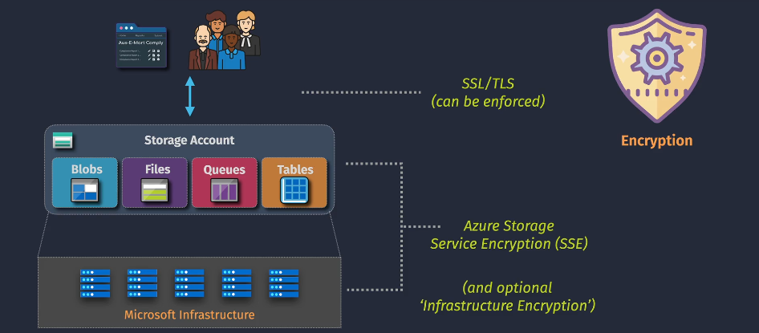
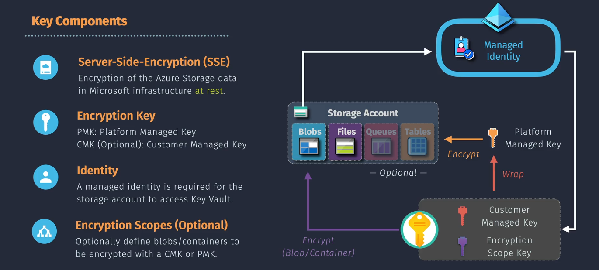

# Azure Storage Encryption

**Azure Storage Encryption** automatically encrypts data before storing it and decrypts it during retrieval, ensuring that data remains secure while at rest. Encryption helps protect your data from unauthorized access and fulfills compliance requirements for data protection.



- **Encryption at Rest:** Protects data stored on disk.
- **Transparent Encryption:** Encryption and decryption processes are seamless and do not require changes to your applications.

## Types of Storage Encryption

Azure provides two primary encryption methods to protect your data:

### **1. Server-Side Encryption (SSE)**

**Server-Side Encryption** encrypts your data on the server before it is persisted to Azure Storage and decrypts it when accessed. This process is managed entirely by Azure, requiring no additional configuration from the user.

- **Automatic Encryption:** Data is encrypted automatically upon upload.
- **Supported Services:** Blob Storage, File Storage, Queue Storage, and Table Storage.
- **Encryption Algorithms:** AES-256 is used for encryption.

#### **Subtypes of SSE:**

- **SSE with Microsoft-Managed Keys (SSE-MSK):** Azure manages the encryption keys.
- **SSE with Customer-Managed Keys (SSE-CMK):** You provide and manage your own encryption keys using Azure Key Vault.

### **2. Client-Side Encryption (CSE)**

**Client-Side Encryption** allows you to encrypt data on the client-side before uploading it to Azure Storage. Decryption occurs on the client-side when retrieving the data.

- **Full Control:** You manage the encryption and decryption processes.
- **Encryption Libraries:** Utilize Azure SDKs or other encryption libraries.
- **Use Cases:** Scenarios requiring end-to-end encryption and full control over encryption keys.

## Key Components



### Storage Account Types

To utilize **Azure Storage Encryption**, you must use the appropriate storage account type that supports encryption features:

- **General-purpose v2 (GPv2) Storage Accounts:**

  - Supports all Azure Storage features, including SSE and CSE.
  - Recommended for most scenarios requiring comprehensive storage solutions.

- **BlockBlobStorage Accounts:**
  - Optimized for workloads requiring high throughput and low latency.
  - Supports SSE and is ideal for block blob storage scenarios.

**Note:** Immutable storage features are available in GPv2 and BlockBlobStorage accounts but not in General-purpose v1 or BlobStorage accounts.

### Encryption Keys and Key Management

Managing encryption keys is critical for maintaining data security. Azure offers several options:

- **Microsoft-Managed Keys (SSE-MSK):**

  - Azure handles key management, rotation, and security.

- **Customer-Managed Keys (SSE-CMK):**

  - You create and manage encryption keys using **Azure Key Vault**.
  - Provides greater control and flexibility over key management.

- **Client-Side Encryption Keys (CSE):**
  - Managed entirely on the client-side.
  - You retain full control over encryption and decryption processes.

**Azure Key Vault** is integral for managing customer-managed keys, providing secure storage and access policies for encryption keys.

## Implementing Azure Storage Encryption

Azure Storage Encryption can be implemented using the **Azure Portal**, **Azure CLI**, or **Azure PowerShell**. Below are the steps for each encryption type.

### A. Server-Side Encryption

#### Using Azure Portal

1. **Navigate to Storage Account:**

   - Go to the [Azure Portal](https://portal.azure.com/).
   - Click on **"Storage Accounts"** and select your storage account.

2. **Access Encryption Settings:**

   - In the storage account's menu, scroll down to **"Data protection"**.
   - Click on **"Encryption"**.

3. **Configure Encryption:**

   - **Service Encryption:** Ensure that **"Microsoft managed keys"** is selected for SSE-MSK.
   - **Customer-Managed Keys (Optional):**
     - Select **"Customer managed keys"**.
     - Choose your **Key Vault** and **Key** from the dropdown menus.

4. **Save Settings:**
   - Click **"Save"** to apply the encryption settings.

#### Using Azure CLI

```bash
# Log in to Azure
az login

# Enable SSE with Microsoft-Managed Keys
az storage account update \
  --name <StorageAccount> \
  --resource-group <ResourceGroup> \
  --encryption-services blob,file \
  --encryption-key-source Microsoft.Storage
```

**Example:**

```bash
az storage account update \
  --name mystorageaccount \
  --resource-group myresourcegroup \
  --encryption-services blob,file \
  --encryption-key-source Microsoft.Storage
```

### B. Client-Side Encryption

#### Using Azure SDKs

Client-side encryption typically involves using Azure SDKs to encrypt data before uploading it to Azure Storage. Below is an example using the Azure Storage Blobs SDK for .NET.

##### Example: .NET

```csharp
using Azure.Storage.Blobs;
using Azure.Storage.Blobs.Specialized;
using System.Security.Cryptography;
using System.Text;

// Initialize Blob Client
BlobServiceClient blobServiceClient = new BlobServiceClient(connectionString);
BlobContainerClient containerClient = blobServiceClient.GetBlobContainerClient("mycontainer");

// Generate Encryption Key
byte[] key = new byte[32]; // 256-bit key
using (var rng = RandomNumberGenerator.Create())
{
    rng.GetBytes(key);
}

// Initialize Blob Client with Encryption Policy
BlobClient blobClient = containerClient.GetBlobClient("myblob.txt");
BlockBlobClient blockBlobClient = blobClient.GetBlockBlobClient();

// Upload Encrypted Data
string data = "Sensitive data to encrypt";
byte[] encryptedData = EncryptData(Encoding.UTF8.GetBytes(data), key);

using (var stream = new MemoryStream(encryptedData))
{
    blockBlobClient.Upload(stream, overwrite: true);
}

// Encryption Method
static byte[] EncryptData(byte[] data, byte[] key)
{
    using Aes aes = Aes.Create();
    aes.Key = key;
    aes.GenerateIV();
    using var encryptor = aes.CreateEncryptor(aes.Key, aes.IV);
    using var ms = new MemoryStream();
    ms.Write(aes.IV, 0, aes.IV.Length); // Prepend IV
    using var cs = new CryptoStream(ms, encryptor, CryptoStreamMode.Write);
    cs.Write(data, 0, data.Length);
    cs.FlushFinalBlock();
    return ms.ToArray();
}
```

**Note:** Ensure that encryption keys are securely stored and managed, preferably using **Azure Key Vault**.

## Benefits

- **Data Security:** Protects sensitive information from unauthorized access and breaches.
- **Compliance:** Meets regulatory requirements for data protection and retention.
- **Transparency:** Encryption and decryption processes are seamless and do not impact application performance.
- **Flexibility:** Choose between Microsoft-managed and customer-managed keys based on your security needs.
- **Integration:** Easily integrates with Azure Key Vault for robust key management.

## Best Practices

1. **Use Customer-Managed Keys for Enhanced Control:**

   - Manage your own encryption keys using Azure Key Vault for greater security and compliance.

2. **Implement Key Rotation:**

   - Regularly rotate encryption keys to minimize the risk of key compromise.

3. **Secure Access to Key Vault:**

   - Use RBAC and access policies to restrict who can access and manage your encryption keys.

4. **Enable Encryption for All Services:**

   - Ensure that all supported storage services (Blob, File, Queue, Table) have encryption enabled.

5. **Monitor Encryption Status:**

   - Use Azure Monitor and Azure Security Center to track encryption status and detect any anomalies.

6. **Backup Encryption Keys:**

   - Maintain backups of your encryption keys to prevent data loss in case of key vault issues.

7. **Adopt the Principle of Least Privilege:**

   - Grant only necessary permissions to users and applications interacting with storage accounts and key vaults.

8. **Audit and Compliance:**
   - Regularly audit encryption settings and key management practices to ensure compliance with organizational policies and regulations.

## Summary Table

| **Feature**             | **Server-Side Encryption (SSE)**                         | **Client-Side Encryption (CSE)**                   |
| ----------------------- | -------------------------------------------------------- | -------------------------------------------------- |
| **Encryption Location** | Managed by Azure on the server                           | Managed by the client before uploading             |
| **Key Management**      | Microsoft-Managed or Customer-Managed via Key Vault      | Managed entirely by the client                     |
| **Supported Services**  | Blob Storage, File Storage, Queue Storage, Table Storage | Primarily Blob Storage                             |
| **Transparency**        | Transparent to applications                              | Requires application-level implementation          |
| **Use Cases**           | General data protection and compliance                   | Scenarios requiring end-to-end encryption          |
| **Performance Impact**  | Minimal impact as encryption is handled by Azure         | May introduce additional latency due to encryption |
| **Cost Implications**   | Included in storage costs                                | Additional costs for key management and processing |
| **Flexibility**         | Limited to encryption configurations provided by Azure   | Full control over encryption algorithms and keys   |

## 💡 Key Takeaways

1. **Comprehensive Data Protection:** Azure Storage Encryption ensures your data is secure both at rest and during transit, protecting it from unauthorized access.
2. **Flexible Key Management:** Choose between Microsoft-managed keys for simplicity or customer-managed keys for enhanced control and compliance.
3. **Seamless Integration:** Encryption integrates smoothly with other Azure services, enabling a secure and efficient storage environment.
4. **Automated and Transparent:** Server-Side Encryption offers automated protection without requiring changes to your applications, ensuring minimal operational overhead.
5. **Enhanced Compliance:** Meet various regulatory standards by implementing robust encryption practices and managing encryption keys effectively.
6. **Monitor and Audit:** Continuously monitor encryption status and key usage to maintain security and compliance.

---

## 📌 Final Summary

**Azure Storage Encryption** is a vital security feature that protects your data at rest by encrypting it automatically. Whether you choose **Server-Side Encryption (SSE)** for automated protection or **Client-Side Encryption (CSE)** for end-to-end security, Azure provides flexible options to meet your organization's data security and compliance needs.

**Key Actions:**

- **Enable Encryption:** Ensure that all relevant storage accounts have encryption enabled to protect data automatically.
- **Manage Encryption Keys:** Decide between Microsoft-managed and customer-managed keys based on your control and compliance requirements.
- **Implement Best Practices:** Follow best practices such as key rotation, secure access to key vaults, and regular auditing to maintain robust encryption standards.
- **Monitor and Audit:** Utilize Azure Monitor and Azure Security Center to keep track of encryption status and detect potential security issues.
