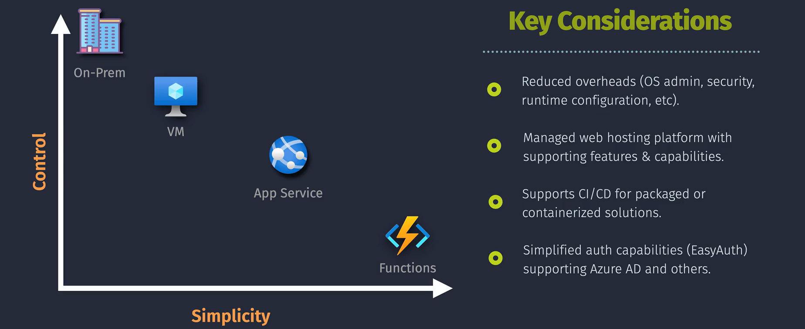
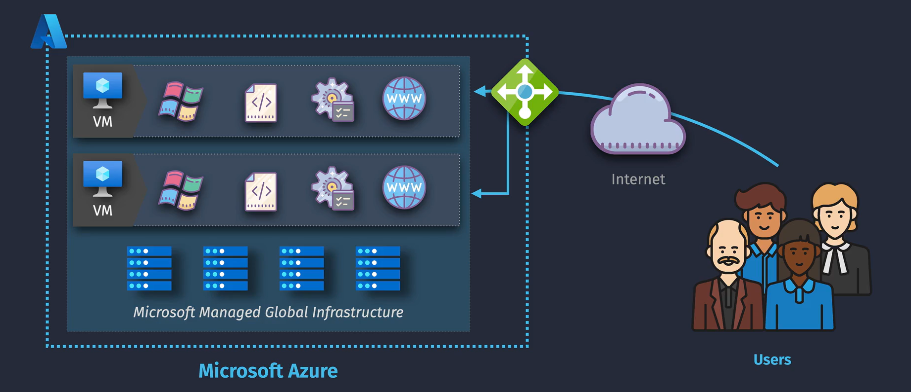
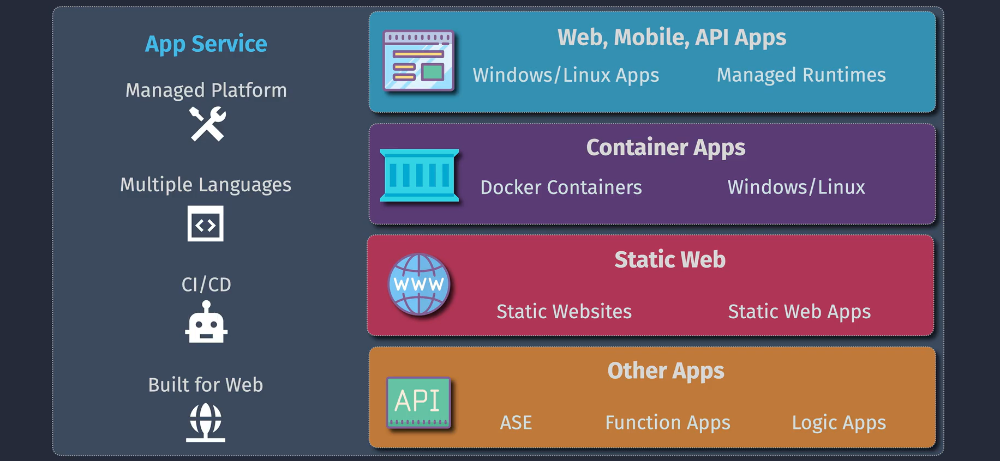
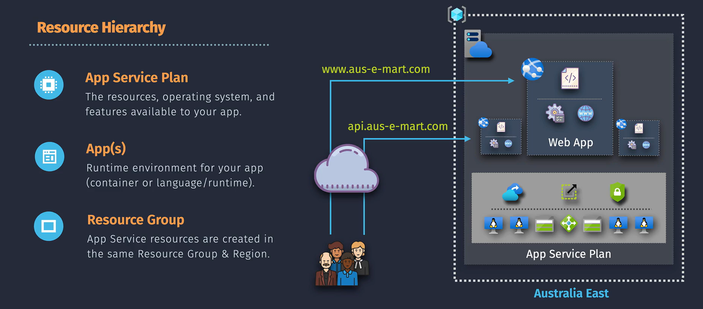
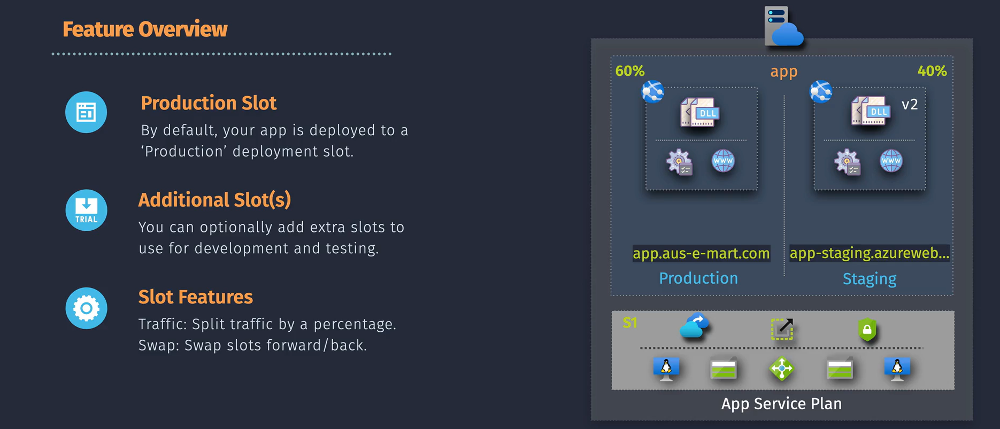
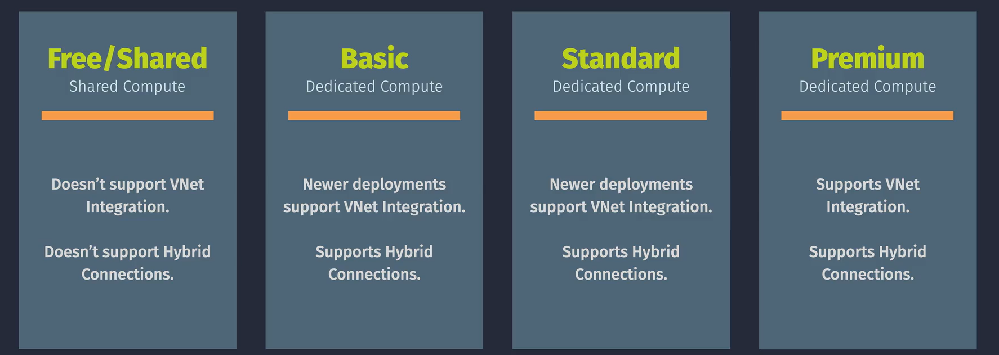
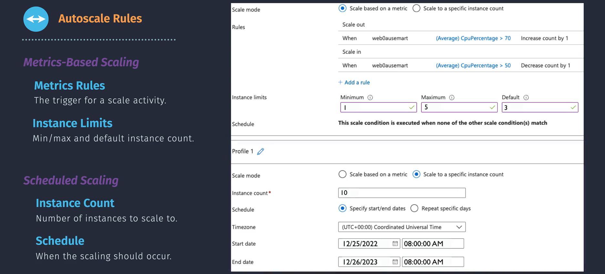
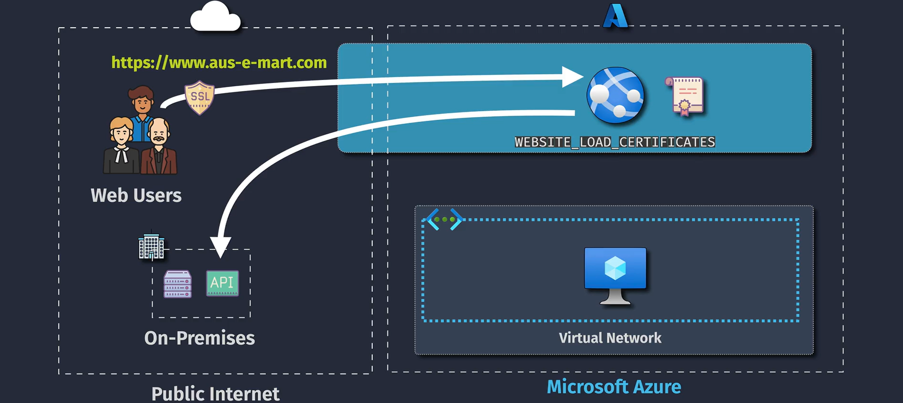
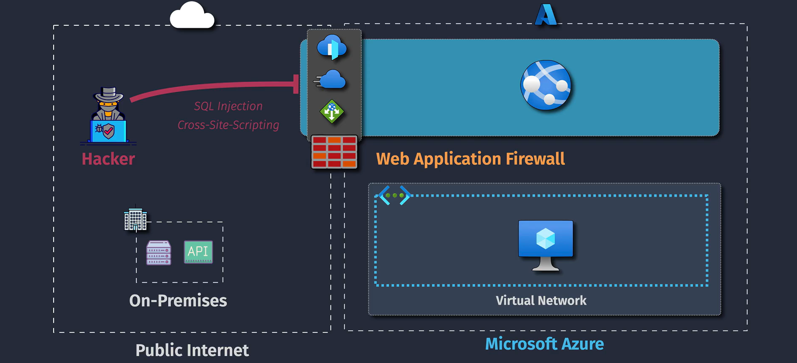

# App Hosting

## App Service Overview

### Resource Hierarchy

#### 1. App Service Plan

#### 2. App

#### 3. Resource Group

## App Service Deployment

### Deployment Slot

## App Service Networking

### 1. Inbound Connectivity

### 2. VNet Integration (for outbound connectivity for app service)

### 3. Hybrid Connections (for on-premises outbound connectivity for app service)

### Networking SKUs

## App Service Autoscaling

## App Service Security

### Encryption Connection

### Secure Data Storage

### Network Security

