# Azure App Hosting with App Service

Azure App Service is a fully managed platform for hosting web applications, REST APIs, and mobile backends. It supports multiple programming languages and frameworks, enabling developers to build, deploy, and scale applications seamlessly.

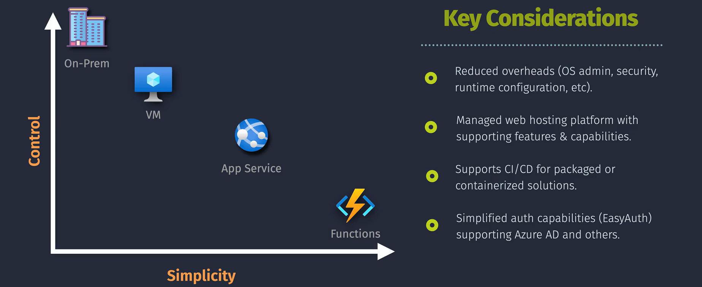
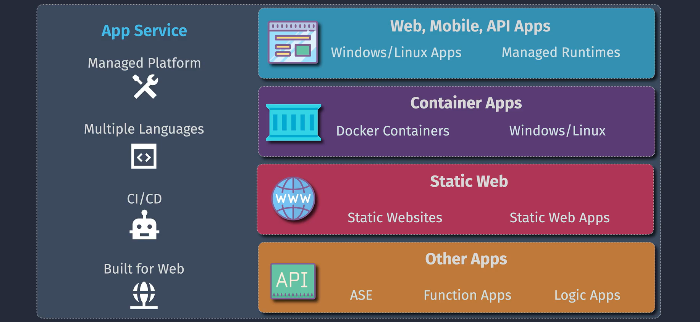

## App Service Overview

Azure App Service simplifies the process of deploying and managing applications by removing the need to manage underlying infrastructure.

### Key Benefits

- **High Availability**: Built-in load balancing and fault tolerance.
- **Language Support**: .NET, Java, Python, PHP, Node.js, Ruby, and custom runtimes via containers.
- **Integrated DevOps**: CI/CD support with GitHub, Azure DevOps, and other platforms.
- **Scaling**: Autoscaling capabilities to handle varying workloads efficiently.
- **Security**: Built-in authentication, encryption, and secure networking options.

### Comparison: Without vs. With App Service

- **Without App Service**: Developers must manage servers, networking, and scaling manually.
  
- **With App Service**: Infrastructure is fully managed, allowing developers to focus on application development and logic.
  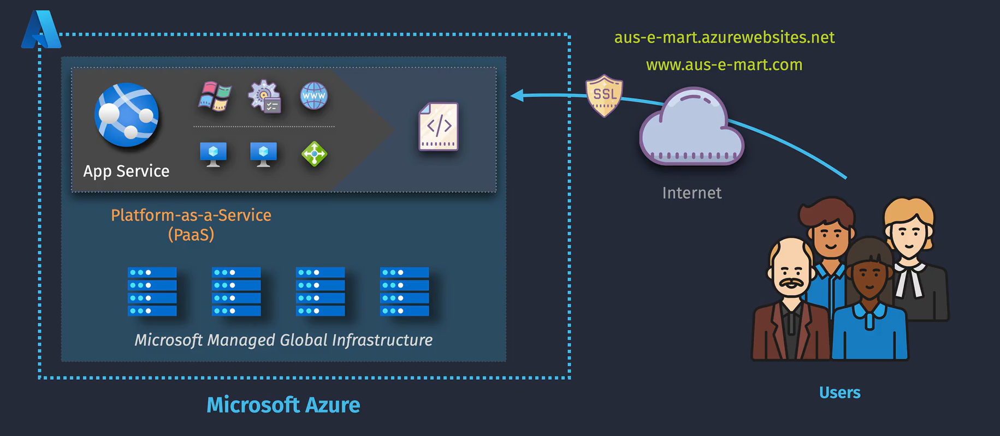

## Resource Hierarchy

Azure App Service operates within a clear hierarchy to organize resources effectively.

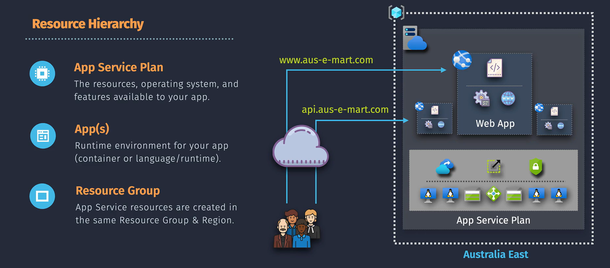

### 1. **App Service Plan**

- Defines the compute resources for hosting your app.
- Pricing tiers: Free, Shared, Basic, Standard, Premium, and Isolated.
- Determines features like scaling, custom domains, SSL support, and dedicated resources.

### 2. **App**

- The individual application hosted within an App Service Plan.
- Supports multiple deployment slots for staging, testing, and production environments.

### 3. **Resource Group**

- A logical container for related resources.
- Simplifies resource management, access control, and billing.

## App Service Deployment

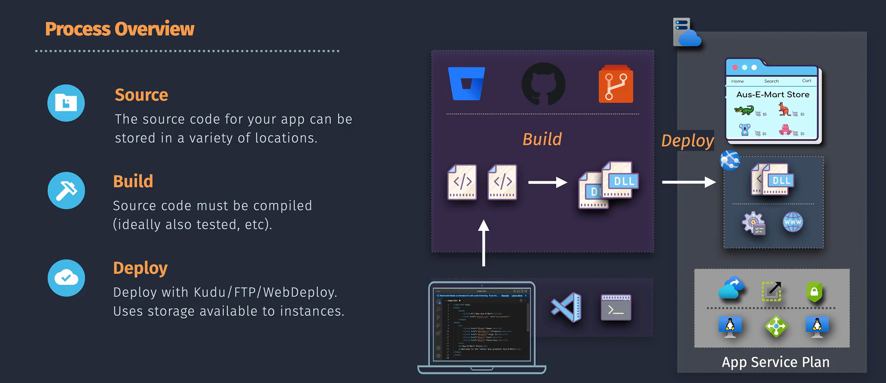

Azure App Service provides versatile deployment options for seamless application delivery.

### Deployment Methods:

- **Git/FTP Deployment**: Push your code directly using Git or FTP.
- **Azure DevOps/GitHub Actions**: Automate CI/CD pipelines for continuous integration and deployment.
- **ZIP/Container Deployment**: Deploy pre-packaged applications or Docker containers for greater flexibility.
- **ARM Templates**: Automate resource provisioning and deployments.

### Deployment Slots:

- **Overview**: Create separate slots (e.g., staging, production) to test updates without affecting live environments.
- **Features**:
  - Swap slots instantly to promote changes with zero downtime.
  - Isolate testing environments from production while sharing the same App Service Plan.

## App Service Networking

Azure App Service offers advanced networking features to secure and optimize connectivity.

### 1. **Inbound Connectivity**

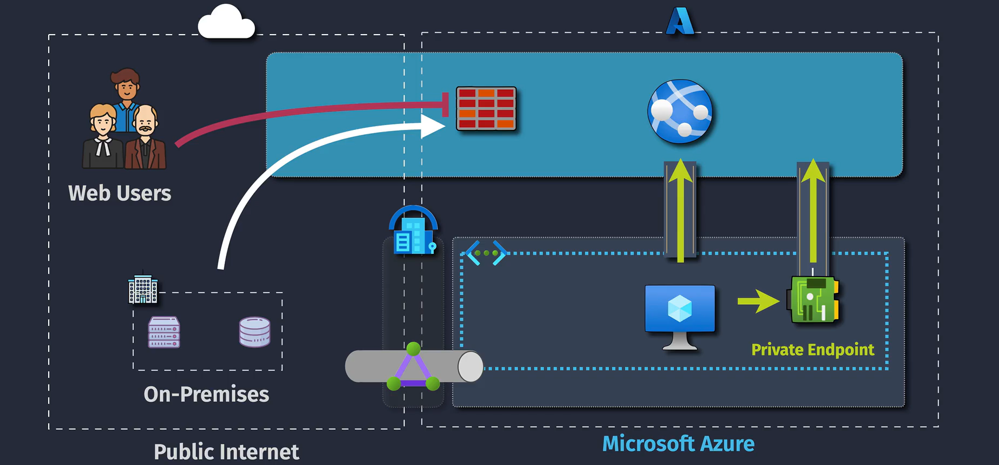

- Public endpoints allow custom domains and SSL configurations.
- Restrict access using IP restrictions or private endpoints to improve security.

### 2. **VNet Integration (Outbound Connectivity)**

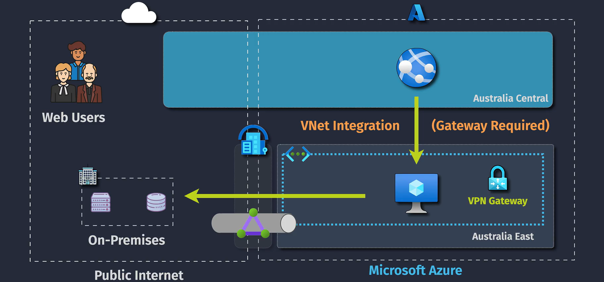

- Connects App Service to Azure Virtual Networks for secure communication with other Azure services.
- Ideal for accessing databases, storage, or other resources within a virtual network.

### 3. **Hybrid Connections (On-Premises Connectivity)**

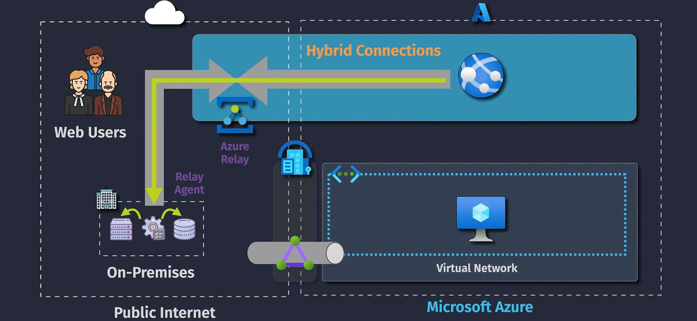

- Enables apps to securely access on-premises resources without requiring complex VPN configurations.
- Suitable for hybrid environments that integrate on-premises systems with cloud-hosted apps.

### Networking SKUs

- Define the range of networking capabilities based on pricing tiers and app requirements.

## App Service Autoscaling

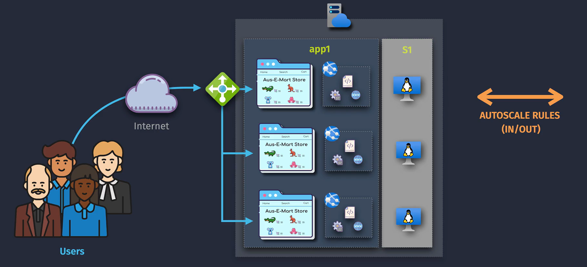
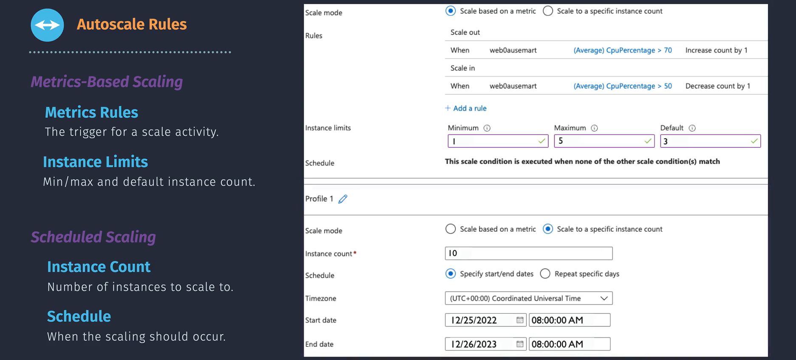

Azure App Service provides flexible autoscaling features to handle varying workloads effectively.

### Features:

- **Horizontal Scaling**: Automatically add or remove instances based on demand.
- **Vertical Scaling**: Increase or decrease the compute resources for your app.
- **Rules-Based Scaling**: Define custom scaling rules triggered by metrics like CPU usage, memory consumption, or HTTP request count.

## App Service Security

Azure App Service ensures robust security for applications, data, and communication.

### 1. **Encryption Connections**

- Supports HTTPS for secure communication.
- Data at rest is encrypted with Azure Storage encryption.

### 2. **Secure Data Storage**

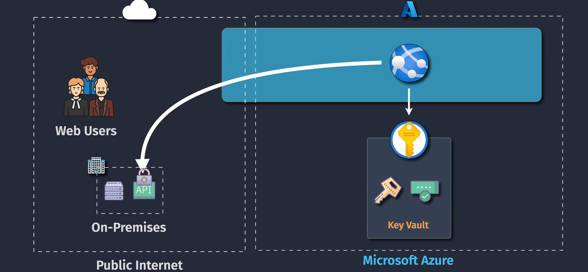

- Integration with Azure Key Vault for managing secrets, certificates, and encryption keys.
- Prevents unauthorized access to sensitive data.

### 3. **Network Security**

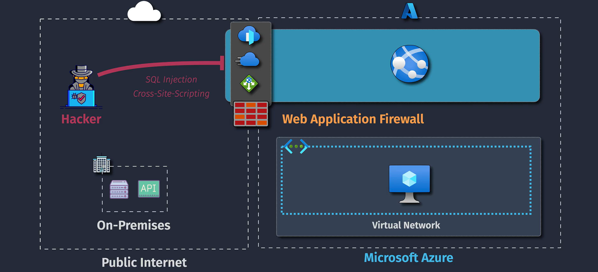

- Leverages network security groups (NSGs) and private endpoints for controlled access.
- Built-in firewall rules and DDoS protection enhance security against threats.
