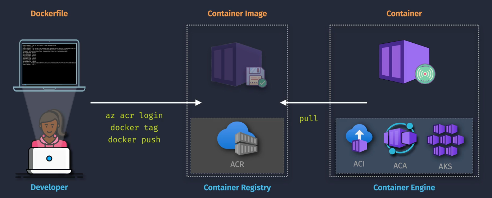
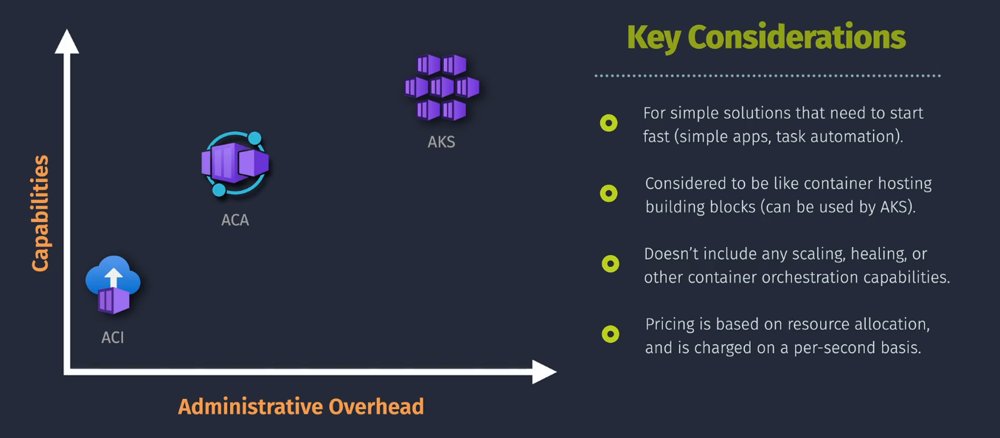
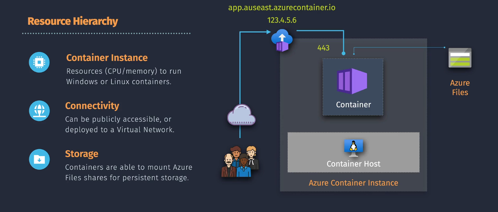
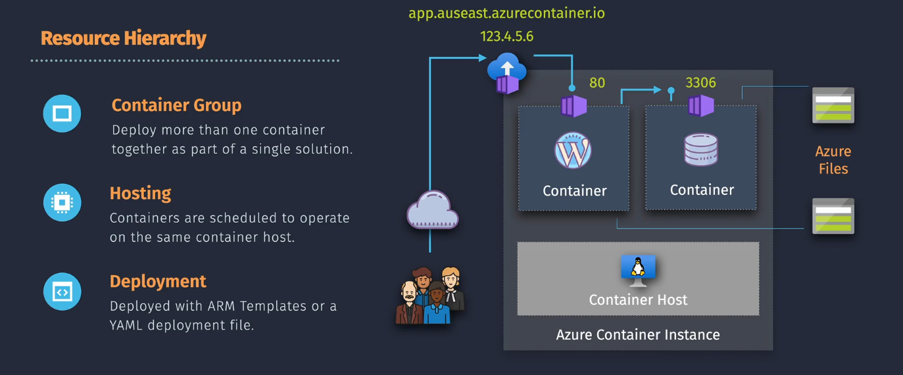
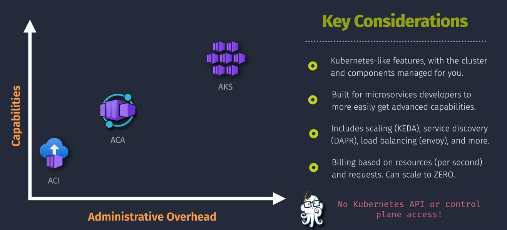
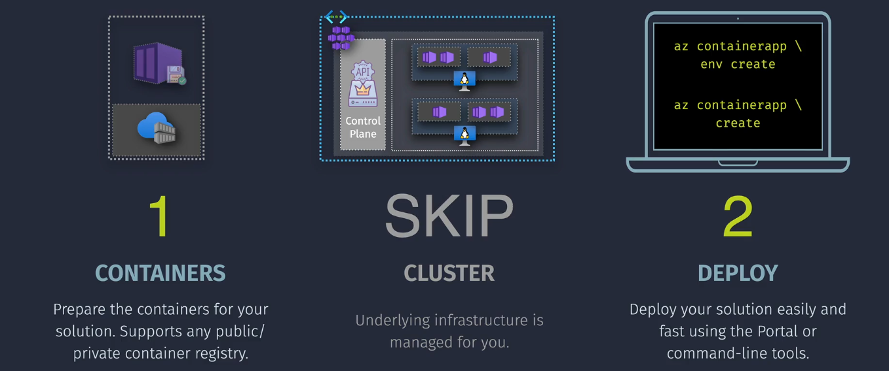
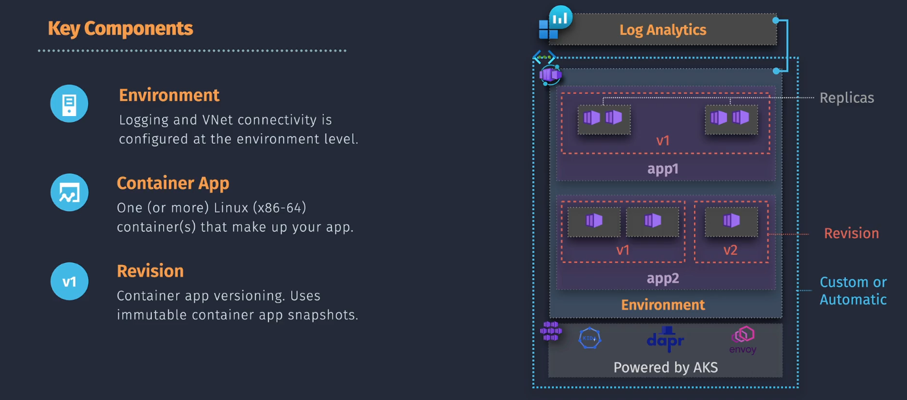
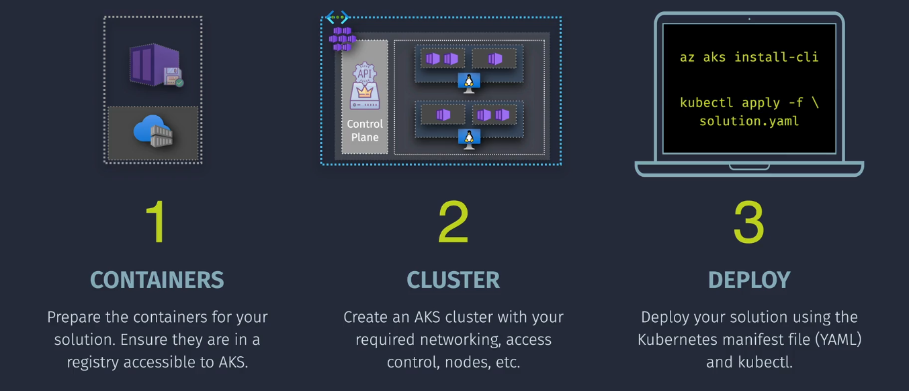
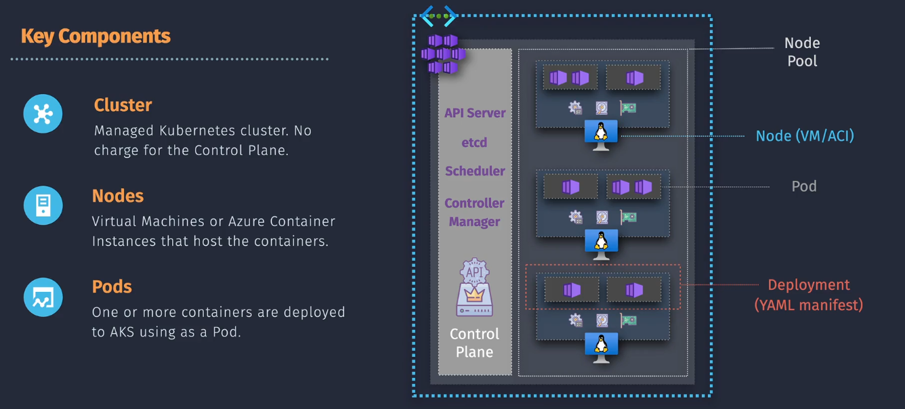

# Container Hosting

## Azure Container Registry (ACR)



### What is Azure Container Registry?

**Azure Container Registry (ACR)** is a private Docker registry service provided by Microsoft Azure. It allows you to store and manage container images and artifacts securely within your Azure environment. ACR integrates seamlessly with Azure Kubernetes Service (AKS), Azure Container Instances (ACI), and other Azure services, facilitating streamlined development and deployment workflows.

- **Private Registry:** Securely store your container images.
- **Integration:** Seamlessly integrates with Azure DevOps, GitHub Actions, and other CI/CD tools.
- **Scalability:** Supports large-scale container deployments with geo-replication and high availability.

### Key Features

- **Automated Builds:** Automatically build container images from your source code repositories.
- **Geo-Replication:** Distribute your container images across multiple Azure regions for faster access and redundancy.
- **Security:** Supports image signing and vulnerability scanning to ensure the integrity and security of your container images.
- **ACR Tasks:** Automate container image builds and deployments with customizable pipelines.
- **Webhook Support:** Trigger external processes or notifications based on registry events.
- **Integrated with Azure Active Directory (Azure AD):** Manage access using role-based access control (RBAC).

### Pricing and Plans

Azure Container Registry offers different tiers to suit various needs:

| **Tier**     | **Features**                                                    | **Approximate Monthly Cost**                   |
| ------------ | --------------------------------------------------------------- | ---------------------------------------------- |
| **Basic**    | - Suitable for development and testing<br>- Single Azure region | Starting at **\$0.167 per day** (≈ \$5/month)  |
| **Standard** | - Geo-replication<br>- Increased storage and throughput         | Starting at **\$0.550 per day** (≈ \$16/month) |
| **Premium**  | - Advanced security features<br>- Unlimited geo-replication     | Starting at **\$2.750 per day** (≈ \$82/month) |

**Factors Affecting Cost:**

- **Storage Usage:** Amount of data stored in the registry.
- **Data Transfer:** Outbound data transfers across regions.
- **Geo-Replication:** Number of replicated regions.

**Note:** Prices are approximate and can vary based on the Azure region. For precise estimates, visit the [Azure Pricing Calculator](images/https://azure.microsoft.com/pricing/calculator/).

### Building and Pushing Images Without ACR Tasks

1. Install Docker.
2. Log in to ACR using Azure CLI.
3. Build the Docker image locally.
4. Push the image to ACR.

#### Step 1: Install Docker

Ensure Docker is installed on your local machine. You can download it from the [Docker website](images/https://www.docker.com/get-started).

#### Step 2: Log in to ACR

Use the Azure CLI to log in to your Azure Container Registry.

```bash
az login
az acr login --name <YourACRName>
```

#### Step 3: Build the Docker Image

Navigate to your project directory and build the Docker image.

```bash
docker build -t <YourACRName>.azurecr.io/<RepositoryName>:<Tag> .

docker build -t myacr.azurecr.io/myapp:v1 .
```

#### Step 4: Push the Image to ACR

Push the built image to your Azure Container Registry.

```bash
docker push <YourACRName>.azurecr.io/<RepositoryName>:<Tag>

docker push myacr.azurecr.io/myapp:v1
```

### Building and Pushing Images With ACR Tasks

1. Install Azure CLI and log in.
2. Create an ACR Task linked to your source repository.
3. Configure triggers for automatic builds.
4. Run the task manually or automatically based on triggers.
5. Verify the built image in ACR.

#### Step 1: Install Azure CLI

Ensure you have the [Azure CLI](images/https://docs.microsoft.com/cli/azure/install-azure-cli) installed on your machine.

#### Step 2: Log in to Azure

```bash
az login
```

#### Step 3: Create an ACR Task

Use the Azure CLI to create a task that builds and pushes your container image whenever there is a commit to your source repository.

```bash
az acr task create \
  --registry <YourACRName> \
  --name <TaskName> \
  --image <RepositoryName>:{{.Run.ID}} \
  --context <RepositoryURL> \
  --file <DockerfilePath> \
  --git-access-token <YourGitAccessToken>
```

**Parameters:**

- `<YourACRName>`: Your Azure Container Registry name.
- `<TaskName>`: A name for your ACR Task.
- `<RepositoryName>`: Name of your container repository.
- `<RepositoryURL>`: URL of your source code repository (e.g., GitHub).
- `<DockerfilePath>`: Path to your Dockerfile in the repository.
- `<YourGitAccessToken>`: Personal access token for your Git repository.

**Example:**

```bash
az acr task create \
  --registry myacr \
  --name myapp-task \
  --image myapp:{{.Run.ID}} \
  --context https://github.com/username/myapp.git \
  --file Dockerfile \
  --git-access-token ghp_XXXXXXXXXXXXXXXXXXXX
```

#### Step 4: Run the ACR Task

Trigger the task manually or set up automatic triggers based on repository events.

**Manual Trigger:**

```bash
az acr task run --registry <YourACRName> --name <TaskName>

az acr task run --registry myacr --name myapp-task
```

**Automatic Triggers:**

You can configure the task to automatically trigger on code commits or on a schedule by specifying additional parameters during task creation.

#### Step 5: Verify the Image in ACR

List the images in your registry to verify that the image has been built and pushed successfully.

```bash
az acr repository list --name <YourACRName> --output table

az acr repository list --name myacr --output table
```

## Azure Container Service Types



Azure offers several container services to deploy and manage your containerized applications effectively. The primary services include:

1. [Azure Container Instances (ACI)](images/#1-azure-container-instance)
2. [Azure Container Apps (ACA)](images/#2-azure-container-apps)
3. [Azure Kubernetes Service (AKS)](images/#3-azure-kubernetes-service-aks)

## 1. Azure Container Instance

### What is Azure Container Instance (ACI)?

**Azure Container Instances (ACI)** is a serverless container service that allows you to run containers on-demand without managing the underlying infrastructure. It's ideal for scenarios where you need to quickly deploy containers without the overhead of managing virtual machines or orchestration platforms.

### Key Features

- **Fast Deployment:** Launch containers in seconds without provisioning VMs.
- **No Infrastructure Management:** Focus solely on your containers without worrying about the underlying servers.
- **Flexible Configuration:** Choose the number of CPUs, memory, and storage for each container.
- **Support for Linux and Windows Containers:** Run a wide range of applications.
- **Integration with Virtual Networks:** Securely connect containers to your existing Azure resources.

### Use Case

- **Simple Applications:** Deploy single-container applications without the need for orchestration.
- **Batch Jobs:** Run short-lived tasks and batch processing jobs.
- **Testing and Development:** Quickly spin up containers for testing purposes without infrastructure overhead.
- **Event-Driven Processing:** Handle events and triggers with containerized functions.

### Pricing and Plans

ACI charges based on the resources you allocate and the duration they run.

| **Resource**   | **Unit**                | **Approximate Cost**                   |
| -------------- | ----------------------- | -------------------------------------- |
| **CPU**        | Per vCPU per second     | **\$0.000016** per vCPU-second         |
| **Memory**     | Per GB per second       | **\$0.000004** per GB-second           |
| **Storage**    | Per GB per month        | **\$0.06** per GB-month (Standard HDD) |
| **Networking** | Per GB of outbound data | **\$0.087** per GB                     |

**Example:**

Running a container with 2 vCPUs and 4 GB memory for 24 hours:

- **CPU Cost:** 2 vCPUs × 24 × 3600 seconds × $0.000016 = **$2.7648\*\*
- **Memory Cost:** 4 GB × 24 × 3600 seconds × $0.000004 = **$1.3824\*\*
- **Total Cost:** Approximately **\$4.1472** (excluding storage and networking)

**Factors Affecting Cost:**

- **Resource Allocation:** Number of vCPUs and amount of memory allocated.
- **Runtime Duration:** Total time containers are running.
- **Data Transfer:** Amount of outbound data transferred.

**Note:** Prices are approximate and can vary based on the Azure region. For precise estimates, visit the [Azure Pricing Calculator](images/https://azure.microsoft.com/pricing/calculator/).

### Single Container Instance



- **Description:** Run individual containers independently, ideal for isolated tasks or simple applications.
- **Benefits:** Minimal setup, quick deployment, and cost-effective for short-lived containers.

**Example: Deploying a Simple Web Server**

1. **Run a Docker Container:**

   ```bash
   az container create \
     --resource-group myResourceGroup \
     --name mycontainer \
     --image nginx \
     --cpu 1 \
     --memory 1.5 \
     --port 80 \
     --ip-address public
   ```

2. **Access the Web Server:**

   After deployment, retrieve the public IP address and navigate to it in your browser to see the Nginx welcome page.

### Group Container Instances



- **Description:** Run multiple containers together in a group, sharing resources and networking.
- **Benefits:** Enables multi-container applications, such as a web server and a database running side by side.

**Example: Deploying a Multi-Container Application**

1. **Create a YAML Configuration File (`container-group.yaml`):**

   ```yaml
   apiVersion: 2018-10-01
   location: eastus
   name: mycontainergroup
   properties:
     containers:
       - name: webapp
         properties:
           image: nginx
           resources:
             requests:
               cpu: 1
               memoryInGB: 1.5
           ports:
             - port: 80
       - name: backend
         properties:
           image: busybox
           command: ["sh", "-c", "echo Hello from backend && sleep 3600"]
           resources:
             requests:
               cpu: 0.5
               memoryInGB: 1
     osType: Linux
     ipAddress:
       type: Public
       ports:
         - protocol: TCP
           port: 80
   ```

2. **Deploy the Container Group:**

   ```bash
   az container create --resource-group myResourceGroup --file container-group.yaml
   ```

3. **Access the Web Application:**

   Retrieve the public IP address and navigate to it in your browser to access the Nginx web server. The backend container runs alongside the web server, handling backend processes.

## 2. Azure Container Apps





### What is Azure Container Apps (ACA)?

**Azure Container Apps (ACA)** is a serverless container service designed for running microservices and applications without managing the underlying infrastructure. It abstracts away the complexities of orchestrators like Kubernetes, allowing developers to focus on building scalable and event-driven applications.

### Key Features

- **Serverless Scaling:** Automatically scales your applications based on demand, including zero instances when idle.
- **Event-Driven Architecture:** Supports triggers from events such as HTTP requests, Azure Event Grid, and more.
- **Microservices Support:** Easily deploy and manage microservices architectures.
- **Integration with Dapr:** Leverage the Distributed Application Runtime (Dapr) for building resilient microservices.
- **Environment Management:** Organize your container apps into environments for better resource management and isolation.
- **Managed Infrastructure:** No need to manage servers or orchestrators, simplifying deployment and operations.

### Use Case

- **Microservices:** Deploy scalable microservices without managing infrastructure.
- **Event-Driven Applications:** Build applications that respond to events and triggers seamlessly.
- **Background Processing:** Run background tasks and workflows efficiently.
- **APIs and Webhooks:** Host APIs and webhooks with automatic scaling based on traffic.

### Pricing and Plans

ACA offers a serverless pricing model, charging based on the resources consumed during execution.

| **Resource**           | **Unit**                 | **Approximate Cost**            |
| ---------------------- | ------------------------ | ------------------------------- |
| **vCPU**               | Per vCPU-second          | **\$0.000013** per vCPU-second  |
| **Memory**             | Per GB-second            | **\$0.0000018** per GB-second   |
| **Environment**        | Per instance per hour    | **\$0.20** per environment-hour |
| **Ingress and Egress** | Per GB of data processed | **\$0.087** per GB              |

**Example:**

Running a container app with 1 vCPU and 2 GB memory for 1,000 seconds:

- **CPU Cost:** 1 vCPU × 1,000 seconds × $0.000013 = **$0.013\*\*
- **Memory Cost:** 2 GB × 1,000 seconds × $0.0000018 = **$0.0036\*\*
- **Total Cost:** Approximately **\$0.0166** (excluding environment and networking costs)

**Factors Affecting Cost:**

- **Resource Consumption:** Number of vCPUs and amount of memory used during execution.
- **Execution Time:** Duration of container execution.
- **Data Transfer:** Amount of data processed and transferred.

**Note:** Prices are approximate and can vary based on the Azure region. For precise estimates, visit the [Azure Pricing Calculator](images/https://azure.microsoft.com/pricing/calculator/).

### Examples

#### Example 1: Deploying a Serverless Web Application with ACA

1. **Create an Environment:**

   ```bash
   az containerapp env create \
     --name myenvironment \
     --resource-group myResourceGroup \
     --location eastus
   ```

2. **Deploy a Container App:**

   ```bash
   az containerapp create \
     --name mywebapp \
     --resource-group myResourceGroup \
     --environment myenvironment \
     --image myacr.azurecr.io/myapp:v1 \
     --target-port 80 \
     --ingress 'external'
   ```

3. **Access the Web Application:**

   Retrieve the FQDN (Fully Qualified Domain Name) of the deployed container app.

   ```bash
   az containerapp show --name mywebapp --resource-group myResourceGroup --query properties.configuration.ingress.fqdn --output tsv
   ```

   Open the retrieved FQDN in your browser to access the web application.

#### Example 2: Running an Event-Driven Function with ACA

1. **Create an Environment:**

   ```bash
   az containerapp env create \
     --name eventenv \
     --resource-group myResourceGroup \
     --location eastus
   ```

2. **Deploy a Container App Triggered by HTTP Requests:**

   ```bash
   az containerapp create \
     --name myeventapp \
     --resource-group myResourceGroup \
     --environment eventenv \
     --image myacr.azurecr.io/myeventapp:v1 \
     --target-port 8080 \
     --ingress 'external' \
     --min-replicas 0 \
     --max-replicas 10
   ```

3. **Trigger the Event:**

   Send an HTTP request to the app's FQDN to trigger the event-driven function.

   ```bash
   curl http://<YourAppFQDN>/trigger
   ```

4. **Scale Based on Demand:**

   ACA automatically scales the number of instances based on incoming requests.

---

## 3. Azure Kubernetes Service (AKS)




### What is Azure Kubernetes Service (AKS)?

**Azure Kubernetes Service (AKS)** is a managed Kubernetes service that simplifies deploying, managing, and scaling containerized applications using Kubernetes. AKS handles critical tasks such as health monitoring and maintenance, enabling you to focus on developing your applications rather than managing the infrastructure.

### Key Features

- **Managed Kubernetes:** Fully managed control plane, reducing the operational overhead of managing Kubernetes clusters.
- **Auto-Scaling:** Automatically scale your applications and nodes based on demand.
- **Integrated Developer Tools:** Seamlessly integrates with Azure DevOps, GitHub Actions, and other CI/CD tools.
- **Advanced Networking:** Supports Azure CNI, network policies, and service mesh integration.
- **Security and Compliance:** Integrates with Azure Active Directory and offers role-based access control (RBAC) for enhanced security.
- **Monitoring and Logging:** Built-in integration with Azure Monitor and Azure Log Analytics for comprehensive observability.

### Use Case

- **Complex Applications:** Deploy and manage complex, multi-container applications requiring orchestration.
- **Microservices Architecture:** Implement and manage microservices with Kubernetes.
- **Enterprise Solutions:** Suitable for large-scale, enterprise-grade applications requiring high availability and scalability.
- **DevOps and CI/CD:** Integrate with CI/CD pipelines for automated deployments and updates.

### Pricing and Plans

AKS itself is free; however, you pay for the underlying resources used by your Kubernetes clusters.

| **Resource**   | **Cost**                                                                                                             |
| -------------- | -------------------------------------------------------------------------------------------------------------------- |
| **Node VMs**   | Based on the VM size and number of nodes. For example, a Standard_DS2_v2 VM costs approximately **\$0.10 per hour**. |
| **Storage**    | Charges for persistent storage (e.g., Azure Disks). Starting at **\$0.05 per GB per month**                          |
| **Networking** | Inbound data is free; outbound data starts at **\$0.087 per GB**                                                     |
| **Add-ons**    | Additional services like Azure Monitor may incur extra costs.                                                        |

**Example:**

Running a cluster with 3 Standard_DS2_v2 VMs for 30 days:

- **VM Cost:** 3 VMs × 24 hours × 30 days × $0.10 = **$216\*\*
- **Storage Cost:** 100 GB × $0.05 = **$5\*\*
- **Total Cost:** Approximately **\$221** (excluding networking and add-ons)

**Factors Affecting Cost:**

- **Cluster Size:** Number and type of VM instances in the cluster.
- **Storage Requirements:** Amount and type of persistent storage used.
- **Networking:** Data transfer costs based on usage.
- **Additional Services:** Monitoring, logging, and other integrated services.

**Note:** Prices are approximate and can vary based on the Azure region. For precise estimates, visit the [Azure Pricing Calculator](images/https://azure.microsoft.com/pricing/calculator/).

### Examples

#### Example 1: Deploying a Multi-Tier Web Application with AKS

1. **Create a Resource Group:**

   ```bash
   az group create --name myAKSResourceGroup --location eastus
   ```

2. **Create an AKS Cluster:**

   ```bash
   az aks create \
     --resource-group myAKSResourceGroup \
     --name myAKSCluster \
     --node-count 3 \
     --enable-addons monitoring \
     --generate-ssh-keys
   ```

3. **Connect to the AKS Cluster:**

   ```bash
   az aks get-credentials --resource-group myAKSResourceGroup --name myAKSCluster
   ```

4. **Deploy a Multi-Tier Application:**

   Create Kubernetes deployments and services for the frontend and backend.

   ```yaml
   # frontend-deployment.yaml
   apiVersion: apps/v1
   kind: Deployment
   metadata:
     name: frontend
   spec:
     replicas: 3
     selector:
       matchLabels:
         app: frontend
     template:
       metadata:
         labels:
           app: frontend
       spec:
         containers:
           - name: frontend
             image: myacr.azurecr.io/frontend:v1
             ports:
               - containerPort: 80
   ```

   ```yaml
   # backend-deployment.yaml
   apiVersion: apps/v1
   kind: Deployment
   metadata:
     name: backend
   spec:
     replicas: 3
     selector:
       matchLabels:
         app: backend
     template:
       metadata:
         labels:
           app: backend
       spec:
         containers:
           - name: backend
             image: myacr.azurecr.io/backend:v1
             ports:
               - containerPort: 8080
   ```

5. **Apply the Deployments:**

   ```bash
   kubectl apply -f frontend-deployment.yaml
   kubectl apply -f backend-deployment.yaml
   ```

6. **Expose the Deployments as Services:**

   ```bash
   kubectl expose deployment frontend --type=LoadBalancer --port=80 --target-port=80
   kubectl expose deployment backend --type=ClusterIP --port=8080 --target-port=8080
   ```

7. **Access the Application:**

   Retrieve the external IP address of the frontend service.

   ```bash
   kubectl get service frontend
   ```

   Open the external IP address in your browser to access the multi-tier web application.

#### Example 2: Scaling Applications Automatically with AKS

1. **Enable Cluster Autoscaler:**

   When creating the AKS cluster, you can enable autoscaling by specifying the `--enable-cluster-autoscaler` flag and setting the minimum and maximum node counts.

   ```bash
   az aks create \
     --resource-group myAKSResourceGroup \
     --name myAKSCluster \
     --node-count 3 \
     --enable-cluster-autoscaler \
     --min-count 1 \
     --max-count 5 \
     --enable-addons monitoring \
     --generate-ssh-keys
   ```

2. **Deploy an Application with Horizontal Pod Autoscaler (HPA):**

   ```yaml
   # hpa.yaml
   apiVersion: autoscaling/v2beta2
   kind: HorizontalPodAutoscaler
   metadata:
     name: frontend-hpa
   spec:
     scaleTargetRef:
       apiVersion: apps/v1
       kind: Deployment
       name: frontend
     minReplicas: 3
     maxReplicas: 10
     metrics:
       - type: Resource
         resource:
           name: cpu
           target:
             type: Utilization
             averageUtilization: 50
   ```

3. **Apply the HPA:**

   ```bash
   kubectl apply -f hpa.yaml
   ```

4. **Monitor Scaling:**

   The HPA automatically scales the number of frontend pods based on CPU utilization, ensuring optimal performance and resource usage.

#### Example 3: Deploying a Stateful Application with AKS

1. **Create a Persistent Volume Claim (PVC):**

   ```yaml
   # pvc.yaml
   apiVersion: v1
   kind: PersistentVolumeClaim
   metadata:
     name: db-pvc
   spec:
     accessModes:
       - ReadWriteOnce
     resources:
       requests:
         storage: 10Gi
   ```

2. **Apply the PVC:**

   ```bash
   kubectl apply -f pvc.yaml
   ```

3. **Deploy a StatefulSet:**

   ```yaml
   # statefulset.yaml
   apiVersion: apps/v1
   kind: StatefulSet
   metadata:
     name: mongodb
   spec:
     serviceName: "mongodb"
     replicas: 3
     selector:
       matchLabels:
         app: mongodb
     template:
       metadata:
         labels:
           app: mongodb
       spec:
         containers:
           - name: mongodb
             image: mongo:4.2
             ports:
               - containerPort: 27017
             volumeMounts:
               - name: mongo-persistent-storage
                 mountPath: /data/db
     volumeClaimTemplates:
       - metadata:
           name: mongo-persistent-storage
         spec:
           accessModes: ["ReadWriteOnce"]
           resources:
             requests:
               storage: 10Gi
   ```

4. **Apply the StatefulSet:**

   ```bash
   kubectl apply -f statefulset.yaml
   ```

5. **Verify the Deployment:**

   ```bash
   kubectl get pods
   ```

   Ensure that the MongoDB pods are running with their respective persistent storage.

#### Example 4: Implementing Blue-Green Deployment with AKS

1. **Deploy the Current Version (Blue):**

   ```yaml
   # blue-deployment.yaml
   apiVersion: apps/v1
   kind: Deployment
   metadata:
     name: myapp-blue
   spec:
     replicas: 3
     selector:
       matchLabels:
         app: myapp
         version: blue
     template:
       metadata:
         labels:
           app: myapp
           version: blue
       spec:
         containers:
           - name: myapp
             image: myacr.azurecr.io/myapp:blue
             ports:
               - containerPort: 80
   ```

2. **Apply the Blue Deployment:**

   ```bash
   kubectl apply -f blue-deployment.yaml
   ```

3. **Create a Service to Route Traffic to Blue:**

   ```yaml
   # service.yaml
   apiVersion: v1
   kind: Service
   metadata:
     name: myapp-service
   spec:
     selector:
       app: myapp
     ports:
       - protocol: TCP
         port: 80
         targetPort: 80
     type: LoadBalancer
   ```

4. **Apply the Service:**

   ```bash
   kubectl apply -f service.yaml
   ```

5. **Deploy the New Version (Green):**

   ```yaml
   # green-deployment.yaml
   apiVersion: apps/v1
   kind: Deployment
   metadata:
     name: myapp-green
   spec:
     replicas: 3
     selector:
       matchLabels:
         app: myapp
         version: green
     template:
       metadata:
         labels:
           app: myapp
           version: green
       spec:
         containers:
           - name: myapp
             image: myacr.azurecr.io/myapp:green
             ports:
               - containerPort: 80
   ```

6. **Apply the Green Deployment:**

   ```bash
   kubectl apply -f green-deployment.yaml
   ```

7. **Switch Traffic to Green:**

   Update the service selector to route traffic to the green version.

   ```yaml
   # service-update.yaml
   apiVersion: v1
   kind: Service
   metadata:
     name: myapp-service
   spec:
     selector:
       app: myapp
       version: green
     ports:
       - protocol: TCP
         port: 80
         targetPort: 80
     type: LoadBalancer
   ```

8. **Apply the Service Update:**

   ```bash
   kubectl apply -f service-update.yaml
   ```

9. **Verify the Deployment:**

   Ensure that traffic is now routed to the green version of the application. Monitor for any issues before decommissioning the blue deployment.

## Comparison

| **Service**                         | **Use Cases**                                     | **Features**                                                   | **Pricing Model**                                                | **Best For**                               |
| ----------------------------------- | ------------------------------------------------- | -------------------------------------------------------------- | ---------------------------------------------------------------- | ------------------------------------------ |
| **Azure Container Registry (ACR)**  | Storing and managing container images             | Private registry, automated builds, geo-replication, ACR Tasks | Tier-based (Basic, Standard, Premium)                            | CI/CD pipelines, multi-region deployments  |
| **Azure Container Instances (ACI)** | Running single containers, testing                | No server management, quick deployment                         | Pay-as-you-go based on vCPU, memory, storage, and networking     | Simple applications, batch jobs            |
| **Azure Kubernetes Service (AKS)**  | Orchestrating multi-container apps, microservices | Managed Kubernetes, scalability, integration                   | Free for AKS; pay for underlying VMs and resources               | Complex applications, enterprise solutions |
| **Azure Container Apps (ACA)**      | Serverless, event-driven applications             | Serverless scaling, event-driven architecture                  | Pay-as-you-go based on vCPU, memory, environment, and networking | Microservices, background tasks, APIs      |

## Summary

Azure provides a comprehensive suite of container services tailored to different needs:

- **Azure Container Registry (ACR):** Securely store and manage your container images with advanced features like automated builds and geo-replication.
- **Azure Container Instances (ACI):** Quickly deploy and run single or group containers without managing infrastructure, ideal for simple tasks and testing.
- **Azure Kubernetes Service (AKS):** Deploy and manage complex, scalable Kubernetes clusters with ease, suitable for enterprise-grade applications.
- **Azure Container Apps (ACA):** Run serverless, event-driven containerized applications without worrying about the underlying infrastructure, perfect for microservices and background tasks.
