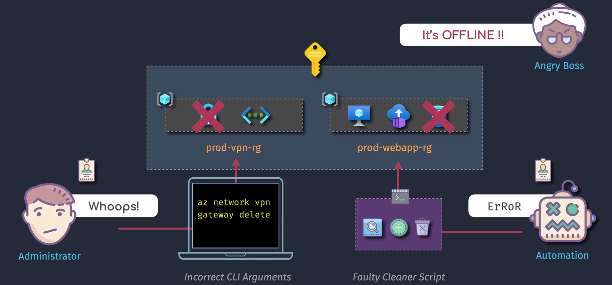

# Resource Locks in Azure

Resource locks in Azure are a feature that allows you to prevent accidental deletion or modification of critical resources. These locks can be applied to subscriptions, resource groups, or individual resources, and they override any permissions that users might have.

## Practical Example

Imagine you have a critical storage account that contains important data. You can apply a **ReadOnly** lock to this storage account to prevent accidental deletion or modification. This ensures that even users with administrative permissions can't make changes to the storage account.

## Types of Resource Locks

1. **CanNotDelete**: Users can read and modify a resource, but they can't delete it.
2. **ReadOnly**: Users can read a resource, but they can't delete or modify it.

## Key Features

1. **Scope**: Locks can be applied at different levels, including subscriptions, resource groups, and individual resources.
2. **Inheritance**: When a lock is applied to a parent scope, all resources within that scope inherit the same lock.
3. **Overrides Permissions**: Locks override any user permissions, ensuring that even users with high-level access can't delete or modify locked resources.

## Important Considerations

1. **Lock Application**: Locks only apply to control plane operations (e.g., deleting or modifying resources) and not to data plane operations (e.g., reading or writing data within the resource).
2. **Lock Removal**: Removing a lock requires appropriate permissions, and the lock can only be removed if it was created with the same level of permissions.
3. **Impact on Operations**: Locks can impact operations such as deleting a resource group that contains locked resources. The deletion will be blocked if any resource within the group is locked.
4. **Azure Portal and CLI**: You can apply locks through the Azure portal, PowerShell, or Azure CLI.
