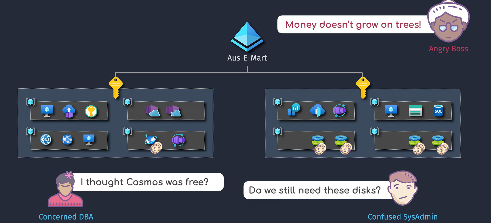
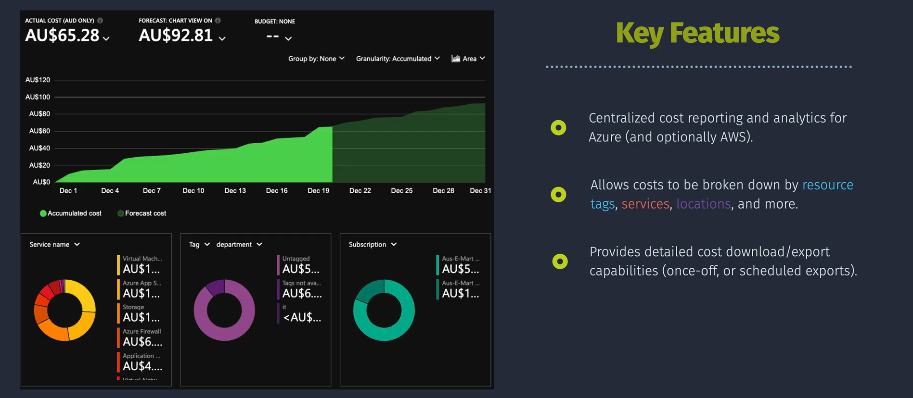
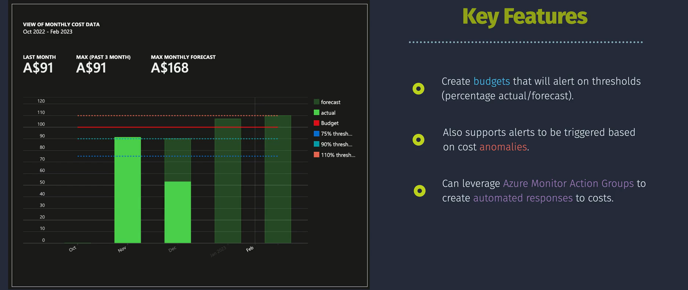
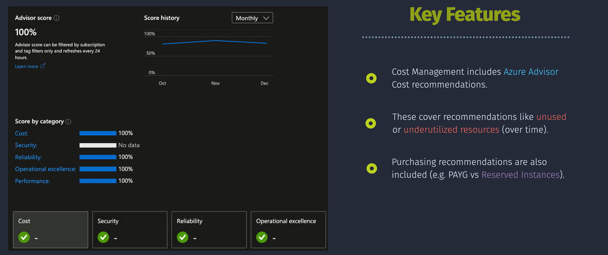

# Cost Management in Azure

Managing costs in Azure is like keeping track of your allowance. You want to make sure you're spending wisely, saving money where you can, and knowing where every dollar goes. **Azure Cost Management** helps you monitor, allocate, and optimize your cloud spending, ensuring you get the best value from your Azure resources.

## Cost Analysis

**Cost Analysis** is a tool in Azure that lets you see how much you're spending on your Azure services. It provides detailed reports and visualizations to help you understand your cloud costs over time.

### Example

Imagine you have several virtual machines (VMs) running in Azure. With Cost Analysis, you can see how much each VM costs per month, identify which one is the most expensive, and decide if you need to resize or shut down any VMs to save money.

### Key Features

- **Detailed Reporting:** View costs by service, resource group, subscription, or tag.
- **Customizable Views:** Filter and group data to focus on specific areas of interest.
- **Time Range Selection:** Analyze costs over different periods, such as daily, monthly, or yearly.
- **Export Options:** Download reports for offline analysis or sharing with your team.

### How to Use Cost Analysis

1. **Access Cost Analysis:**

   - Log in to the [Azure Portal](https://portal.azure.com/).
   - Navigate to **"Cost Management + Billing"** in the left-hand menu.
   - Click on **"Cost Management"** and then **"Cost Analysis"**.

2. **View Your Costs:**

   - Select the **Subscription** you want to analyze.
   - Choose the **Time Range** (e.g., last month, last 7 days).
   - Use **Filters** to narrow down by **Resource Group**, **Service Name**, or **Tags**.

3. **Analyze the Data:**

   - Use the **chart options** to switch between different visualizations (e.g., bar chart, pie chart).
   - Identify **trends** and **spikes** in your spending.

4. **Export Reports:**
   - Click on **"Export"** to download your cost data as a CSV or Excel file for further analysis.

## Alerts and Budgets

**Alerts and Budgets** help you set spending limits and receive notifications when your costs approach or exceed these limits. This ensures you stay within your financial plans and avoid unexpected charges.

### Example

Suppose your monthly budget for Azure services is $1,000. You can set up alerts to notify you when your spending reaches $500 (50%), $750 (75%), and $900 (90%). This way, you can take action, such as optimizing resources or pausing non-essential services, before exceeding your budget.

### Key Features

- **Budgets:** Set a spending limit for a specific period (e.g., monthly).
- **Alerts:** Receive notifications when your spending reaches certain thresholds (e.g., 50%, 75%, 90% of your budget).
- **Action Groups:** Define who gets notified and how (e.g., email, SMS, webhook).

### How to Set Up Budgets and Alerts

1. **Create a Budget:**

   - Go to **"Cost Management + Billing"** in the Azure Portal.
   - Click on **"Budgets"** under **"Cost Management"**.
   - Click **"Add"** to create a new budget.
   - Define the **Scope** (subscription or resource group), **Amount**, and **Time Period**.
   - Click **"Next"** to configure alert conditions.

2. **Configure Alerts:**

   - Set **Thresholds** (e.g., 50%, 75%, 90% of the budget).
   - Choose or create an **Action Group** to specify who gets notified and how.
   - Review and **Create** the budget.

3. **Monitor Alerts:**
   - Once set up, Azure will automatically send notifications based on your defined thresholds.
   - You can view triggered alerts in the **"Alerts"** section under **"Cost Management"**.

## Advisor Recommendations

**Azure Advisor** is a free service that provides personalized recommendations to optimize your Azure resources for cost, performance, security, and reliability. It analyzes your usage patterns and suggests ways to improve efficiency and reduce costs.

### Example

Azure Advisor might recommend that one of your VMs is consistently running at 10% CPU usage. By resizing this VM to a smaller size, you can save money without affecting performance, as the workload doesn't require high CPU resources.

### Key Features

- **Cost Optimization:** Identify underutilized resources and recommend resizing or shutting them down.
- **Performance Improvements:** Suggest changes to enhance the performance of your applications.
- **Security Enhancements:** Highlight security vulnerabilities and recommend fixes.
- **Reliability Enhancements:** Provide suggestions to improve the availability and resilience of your services.

### How to Use Advisor Recommendations

1. **Access Azure Advisor:**

   - Log in to the [Azure Portal](https://portal.azure.com/).
   - Navigate to **"Advisor"** in the left-hand menu.

2. **Review Recommendations:**

   - Azure Advisor categorizes recommendations into **Cost**, **Performance**, **Security**, and **Reliability**.
   - Click on each category to see detailed suggestions.

3. **Implement Recommendations:**

   - For **Cost Optimization**, consider resizing VMs, deleting unused resources, or using reserved instances.
   - Follow the provided steps or links to implement each recommendation.

4. **Track Progress:**
   - Monitor the **"Impact"** and **"Status"** of each recommendation to see the benefits of your optimizations.

## Important Considerations

### Notes and Tips

- **Data Granularity:** Cost Management provides detailed insights, but be aware of the **data granularity** and **retention periods** to ensure you have the necessary historical data.
- **Tags:** Use **tags** to categorize and track costs by department, project, or environment. This makes cost analysis more manageable and accurate.
- **Resource Lifecycle:** Regularly review the lifecycle of your resources. Decommission or delete resources that are no longer needed to avoid unnecessary costs.
- **Reserved Instances:** Consider purchasing **Reserved Instances** for predictable workloads to benefit from significant cost savings compared to pay-as-you-go pricing.
- **Auto-scaling:** Implement **auto-scaling** for services that support it to automatically adjust resources based on demand, optimizing both performance and cost.

### Common Pitfalls

- **Ignoring Small Costs:** Small, recurring costs can add up over time. Regularly review and manage all resources, including those with low usage.
- **Lack of Tagging:** Without proper tagging, tracking and allocating costs becomes challenging. Ensure all resources are appropriately tagged.
- **Over-provisioning:** Allocating more resources than necessary leads to higher costs. Use Azure Advisor recommendations to right-size your resources.

## Recommendations and Best Practices

### 1. **Implement Proper Tagging**

- **Why:** Helps in organizing and tracking costs by different categories like departments, projects, or environments.
- **How:** Define a consistent tagging strategy and apply tags to all resources.

### 2. **Regularly Review Cost Reports**

- **Why:** Keeps you informed about your spending patterns and helps identify areas for optimization.
- **How:** Schedule regular reviews of Cost Analysis reports and adjust your budget and resources accordingly.

### 3. **Set Up Budgets and Alerts**

- **Why:** Prevents unexpected overspending and keeps your costs within planned limits.
- **How:** Use Azure Cost Management to create budgets and configure alerts for different spending thresholds.

### 4. **Leverage Azure Advisor Recommendations**

- **Why:** Provides actionable insights to optimize costs, improve performance, and enhance security.
- **How:** Regularly check Azure Advisor and implement its recommendations, especially for cost optimization.

### 5. **Use Reserved Instances and Savings Plans**

- **Why:** Offers significant discounts for long-term commitments compared to pay-as-you-go pricing.
- **How:** Identify resources with predictable usage and purchase Reserved Instances or Savings Plans accordingly.

### 6. **Enable Auto-scaling**

- **Why:** Automatically adjusts resources based on demand, ensuring you only pay for what you use.
- **How:** Configure auto-scaling settings for services that support it, such as Virtual Machine Scale Sets or App Services.

### 7. **Optimize Storage Costs**

- **Why:** Storage can be a significant part of your Azure costs.
- **How:** Use appropriate storage tiers based on access frequency, delete unused data, and implement lifecycle management policies.

### 8. **Monitor and Manage Unused Resources**

- **Why:** Unused or underutilized resources contribute to unnecessary costs.
- **How:** Regularly audit your Azure environment to identify and decommission unused resources.

### 9. **Educate Your Team**

- **Why:** Ensures everyone understands cost implications and follows best practices to manage Azure spending.
- **How:** Provide training and resources on Azure Cost Management and encourage cost-aware culture within your organization.

### 10. **Automate Cost Management Tasks**

- **Why:** Reduces manual effort and minimizes the risk of human error in managing costs.
- **How:** Use Azure Automation and scripts to automate routine cost management tasks, such as resource tagging or shutting down non-essential services during off-hours.

## Summary

**Azure Cost Management** is an essential tool for monitoring, allocating, and optimizing your cloud spending. By leveraging features like **Cost Analysis**, **Alerts and Budgets**, and **Advisor Recommendations**, you can gain deep insights into your Azure costs, set financial boundaries, and implement strategies to reduce expenses without compromising performance.

- **Cost Analysis:** Provides detailed visibility into your Azure spending, helping you track and understand where your money is going.
- **Alerts and Budgets:** Enables proactive management of your costs by setting spending limits and receiving notifications when thresholds are met.
- **Advisor Recommendations:** Offers personalized suggestions to optimize your resources, enhance performance, and save money.
- **Best Practices:** Implement tagging, regularly review cost reports, set up budgets, leverage reserved instances, enable auto-scaling, optimize storage, manage unused resources, educate your team, and automate cost management tasks to maximize cost efficiency.
