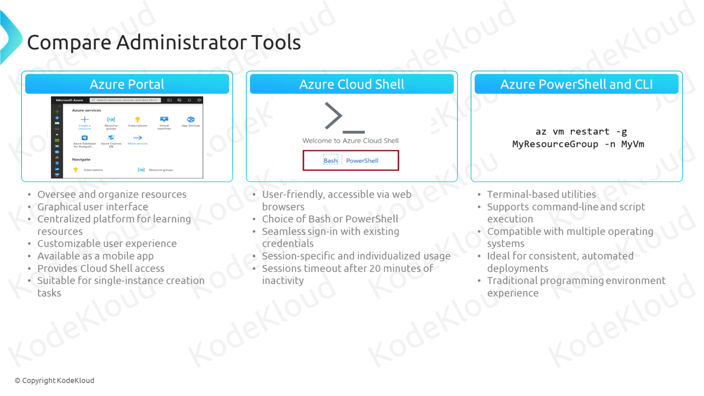

# Azure Administrator Tools



Managing an Azure environment is like being the conductor of a large orchestra. To ensure everything runs smoothly, you need the right tools to manage, automate, and monitor your resources effectively. **Azure Administrator Tools** are the essential instruments that help Azure administrators orchestrate their cloud infrastructure efficiently. This guide explores four key tools: **Azure Portal**, **Azure Cloud Shell**, **Azure PowerShell**, and **Azure CLI**, providing examples and best practices for each.

## 1. Azure Portal

### **What It Is:**

The **Azure Portal** is a web-based graphical user interface (GUI) that allows you to manage all your Azure resources from one place. Think of it as the dashboard of a car, giving you a visual overview and control over everything in your Azure environment.

### **Example: Creating a Virtual Machine via Azure Portal**

1. **Log in to Azure Portal:**

   - Go to [Azure Portal](https://portal.azure.com/) and sign in with your Azure account.

2. **Navigate to Virtual Machines:**

   - In the left-hand menu, click on **"Virtual Machines"**.

3. **Create a New VM:**

   - Click on **"Add"** to create a new virtual machine.
   - Fill in the required details such as **Name**, **Region**, **Size**, and **Image** (e.g., Windows Server 2022).

4. **Configure Settings:**

   - Set up networking, storage, and security configurations as needed.
   - Review and create the VM by clicking **"Review + create"** and then **"Create"**.

5. **Monitor Deployment:**
   - Track the deployment progress in the **"Notifications"** area.
   - Once deployed, access the VM from the **"Virtual Machines"** section.

### **Key Features:**

- **User-Friendly Interface:** Intuitive design with drag-and-drop capabilities.
- **Resource Management:** Easily create, configure, and manage Azure resources.
- **Dashboards:** Customize dashboards to monitor key metrics and resources.
- **Integrated Tools:** Access to monitoring, diagnostics, and security tools directly within the portal.
- **Role-Based Access Control (RBAC):** Assign permissions to users to control access to resources.

### **Use Cases:**

- **Resource Provisioning:** Quickly deploy new resources like virtual machines, databases, and storage accounts.
- **Monitoring and Diagnostics:** View resource health, performance metrics, and logs.
- **Configuration Management:** Adjust settings and configurations of existing resources.
- **Cost Management:** Analyze and optimize cloud spending through integrated cost analysis tools.

## 2. Azure PowerShell

### **What It Is:**

**Azure PowerShell** is a set of cmdlets (command-line tools) built on the PowerShell framework, designed specifically for managing Azure resources. It's like having a powerful toolkit that lets you automate complex tasks with simple commands.

### **Example: Automating the Deployment of a Resource Group**

1. **Install Azure PowerShell:**

   - If not already installed, install Azure PowerShell by running:

     ```powershell
     Install-Module -Name Az -AllowClobber -Scope CurrentUser
     ```

2. **Connect to Azure Account:**

   - Sign in to your Azure account:

     ```powershell
     Connect-AzAccount
     ```

3. **Create a Resource Group:**

   - Run the following command to create a new resource group:

     ```powershell
     New-AzResourceGroup -Name MyResourceGroup -Location EastUS
     ```

   - **Explanation:** This command creates a resource group named `MyResourceGroup` in the `EastUS` region.

4. **Verify Creation:**

   - List all resource groups to confirm:

     ```powershell
     Get-AzResourceGroup | Format-Table
     ```

   - **Output:**

     ```ini
     ResourceGroupName Location ProvisioningState
     ----------------- -------- -------------

     MyResourceGroup   EastUS   Succeeded
     ```

### **Key Features:**

- **Automation:** Automate repetitive tasks and deployments with scripts.
- **Scripting Capabilities:** Create complex scripts to manage resources efficiently.
- **Integration with CI/CD:** Integrate with Continuous Integration and Continuous Deployment pipelines for automated deployments.
- **Powerful Command Set:** Access a wide range of cmdlets to manage virtually every aspect of Azure resources.

### **Use Cases:**

- **Automated Deployments:** Deploy and configure resources automatically as part of a DevOps pipeline.
- **Batch Operations:** Perform bulk operations on multiple resources simultaneously.
- **Resource Management:** Manage, update, and delete resources through scripts.
- **Custom Automation:** Develop custom scripts tailored to your organization's specific needs.

## 3. Azure CLI

### **What It Is:**

The **Azure CLI** (Command-Line Interface) is a cross-platform command-line tool for managing Azure resources. It's similar to Azure PowerShell but designed to be more straightforward for users familiar with traditional command-line interfaces.

### **Example: Creating and Configuring a Web App Using Azure CLI**

1. **Install Azure CLI:**

   - Download and install Azure CLI from [here](https://docs.microsoft.com/cli/azure/install-azure-cli).

2. **Sign In to Azure:**

   - Open your terminal and sign in:

     ```bash
     az login
     ```

3. **Create a Resource Group:**

   - Run the following command:

     ```bash
     az group create --name MyWebAppGroup --location westus
     ```

4. **Create a Web App:**

   - Use the following command to create a new web app:

     ```bash
     az webapp create --resource-group MyWebAppGroup --plan MyAppServicePlan --name MyUniqueWebAppName --runtime "DOTNET|6.0"
     ```

   - **Explanation:** This command creates a web app named `MyUniqueWebAppName` using the .NET 6.0 runtime in the specified resource group and app service plan.

5. **Deploy Code to the Web App:**

   - Deploy your code repository (e.g., from GitHub) using:

     ```bash
     az webapp deployment source config --name MyUniqueWebAppName --resource-group MyWebAppGroup --repo-url https://github.com/username/repo.git --branch main --manual-integration
     ```

6. **Verify Deployment:**

   - Open the web app in your browser:

     ```bash
     az webapp browse --name MyUniqueWebAppName --resource-group MyWebAppGroup
     ```

### **Key Features:**

- **Cross-Platform:** Available on Windows, macOS, and Linux.
- **Simplicity:** Designed for ease of use with straightforward commands.
- **Scripting and Automation:** Easily integrate with shell scripts and automation tools.
- **Extensibility:** Supports custom scripts and extensions for advanced management.

### **Use Cases:**

- **Resource Provisioning:** Quickly create and configure Azure resources from the command line.
- **Automation Scripts:** Develop scripts to automate complex workflows and deployments.
- **DevOps Integration:** Integrate with CI/CD pipelines for seamless deployments and updates.
- **Lightweight Management:** Perform quick tasks without the overhead of a GUI or complex scripting languages.

## 4. Azure Cloud Shell

### **What It Is:**

**Azure Cloud Shell** is a browser-based shell environment provided by Azure, equipped with pre-installed tools for managing Azure resources. It's like having a command center accessible from any device with internet connectivity.

### **Example: Deploying a Resource Group Using Azure Cloud Shell**

1. **Access Azure Cloud Shell:**

   - In the Azure Portal, click on the **"Cloud Shell"** icon in the top-right corner.
   - Choose between **Bash** or **PowerShell** as your preferred shell environment.

2. **Create a Resource Group:**

   - In the Cloud Shell, run the following command to create a new resource group:

     ```bash
     az group create --name MyResourceGroup --location eastus
     ```

   - **Explanation:** This command creates a resource group named `MyResourceGroup` in the `eastus` region.

3. **Verify Creation:**

   - List all resource groups to confirm creation:

     ```bash
     az group list --output table
     ```

   - **Output:**

     ```ini
     Name            Location    Status
     --------------  ----------  --------
     MyResourceGroup eastus      Succeeded
     ```

### **Key Features:**

- **Pre-Installed Tools:** Comes with Azure CLI, Azure PowerShell, and other essential utilities.
- **Cross-Platform Access:** Accessible from any web browser, including mobile devices.
- **Persistent Storage:** Automatically mounts a file share to save your scripts and configurations.
- **Integrated Authentication:** Uses your Azure Portal credentials for seamless access.

### **Use Cases:**

- **Quick Management Tasks:** Perform immediate tasks without setting up a local environment.
- **Script Execution:** Run scripts to automate deployments and configurations.
- **Learning and Testing:** Experiment with Azure commands and scripts in a safe environment.
- **Remote Administration:** Manage Azure resources from anywhere without the need for VPN or local tools.

## **Key Differences** 🌟

| **Feature**       | **Azure Portal**                                     | **Azure PowerShell**                                 | **Azure CLI**                                        | **Azure Cloud Shell**                                    |
| ----------------- | ---------------------------------------------------- | ---------------------------------------------------- | ---------------------------------------------------- | -------------------------------------------------------- |
| **Interface**     | Graphical User Interface (GUI)                       | Command-line interface (PowerShell)                  | Command-line interface (Bash, PowerShell compatible) | Browser-based shell environment                          |
| **Ease of Use**   | User-friendly with visual elements                   | Requires familiarity with PowerShell syntax          | Simple and straightforward commands                  | Easy access with pre-installed tools                     |
| **Automation**    | Limited automation through UI                        | High level of automation with scripting capabilities | High level of automation with scripting capabilities | Supports scripting but primarily for manual tasks        |
| **Access**        | Accessible via web browser                           | Requires installation on local machine               | Cross-platform; install on local or use Cloud Shell  | Accessible via web browser                               |
| **Integration**   | Integrated with Azure services and dashboards        | Integrates with PowerShell scripts and modules       | Integrates with shell scripts and CI/CD pipelines    | Integrated with Azure services and Cloud Shell scripts   |
| **Customization** | Custom dashboards and resource views                 | Highly customizable with PowerShell scripts          | Highly customizable with shell scripts and tools     | Customize with scripts and command-line tools            |
| **Use Cases**     | Resource provisioning, monitoring, and configuration | Automating deployments, batch operations             | Automating deployments, lightweight management       | Quick management tasks, script execution from any device |

### **Detailed Scope Explanation:**

- **Azure Portal:**

  - **Scope:** Entire Azure environment with visual management.
  - **Example:** Creating and managing virtual networks, deploying resources through GUI.

- **Azure PowerShell:**

  - **Scope:** PowerShell-based management with extensive scripting capabilities.
  - **Example:** Automating resource provisioning, integrating with PowerShell workflows.

- **Azure CLI:**

  - **Scope:** Cross-platform command-line tool for resource management.
  - **Example:** Deploying applications, managing services through simple commands.

- **Azure Cloud Shell:**

  - **Scope:** Command-line management accessible from any device.
  - **Example:** Running deployment scripts, managing resources without local setup.

## **Important Considerations** 📌

### **Choose the Right Tool for the Task:**

- **Azure Portal:** Ideal for beginners and tasks that benefit from a visual interface.
- **Azure PowerShell:** Best for complex automation tasks and integration with PowerShell-based workflows.
- **Azure CLI:** Suited for cross-platform scripting and lightweight management tasks.
- **Azure Cloud Shell:** Perfect for quick, on-the-go management without local installations.

### **Security Practices:**

- **Access Control:** Use **Azure RBAC** to control who can access and use these tools.
- **Secure Credentials:** Ensure that authentication methods are secure, especially when using scripts.
- **Audit Logs:** Monitor and review logs to track usage and detect any unauthorized activities.

### **Performance and Cost:**

- **Efficiency:** Automate repetitive tasks to save time and reduce errors.
- **Cost Management:** Monitor the usage of these tools to ensure they are used efficiently without incurring unnecessary costs.

### **Learning Curve:**

- **Training:** Invest time in learning the command syntax and capabilities of each tool.
- **Documentation:** Utilize Azure’s extensive documentation and tutorials to build proficiency.

## **Recommendations and Best Practices** 🌈

1. **Start with Azure Portal:**

   - Use the Azure Portal to familiarize yourself with Azure services and resource configurations through a visual interface.

2. **Leverage Azure Cloud Shell for Flexibility:**

   - Use Cloud Shell when you need to manage resources from different devices without setting up local tools.

3. **Automate with Azure PowerShell:**

   - Develop PowerShell scripts to automate complex and repetitive tasks, integrating them into your DevOps pipelines for continuous deployment.

4. **Use Azure CLI for Cross-Platform Needs:**

   - Utilize Azure CLI for managing resources on various operating systems, integrating with shell scripts for streamlined workflows.

5. **Implement Version Control for Scripts:**

   - Store your PowerShell and CLI scripts in version control systems like Git to track changes and collaborate with your team.

6. **Combine Tools for Maximum Efficiency:**

   - Use Azure Portal for initial setups and visual monitoring, then switch to Cloud Shell, PowerShell, or CLI for automation and bulk operations.

7. **Regularly Update Tools:**

   - Keep Azure PowerShell and CLI up to date to benefit from the latest features and security patches.

8. **Monitor and Optimize Usage:**

   - Regularly review how these tools are being used and optimize scripts and commands for better performance and cost-efficiency.

9. **Educate Your Team:**

   - Provide training sessions and resources to ensure that all team members are proficient in using the different Azure Administrator Tools.

10. **Adhere to Security Best Practices:**
    - Implement multi-factor authentication (MFA), use managed identities, and follow the principle of least privilege to secure access to these tools.

## **Summary** 📚

Managing an Azure environment effectively requires the right set of tools to handle various tasks, from resource provisioning to automation and monitoring. **Azure Administrator Tools**—**Azure Portal**, **Azure Cloud Shell**, **Azure PowerShell**, and **Azure CLI**—offer a range of capabilities tailored to different needs and preferences.

- **Azure Portal:** Provides a user-friendly GUI for managing resources visually.
- **Azure PowerShell:** Enables powerful automation and scripting for complex tasks.
- **Azure CLI:** Delivers a straightforward, cross-platform command-line tool for managing resources efficiently.
- **Azure Cloud Shell:** Offers a flexible, browser-based shell with pre-installed tools for quick management.

By understanding the strengths and use cases of each tool, you can choose the right one for the task at hand, streamline your workflows, and maintain a secure and optimized Azure environment.

## 📊 Additional Resources

- [Azure Portal Documentation](https://docs.microsoft.com/azure/azure-portal/azure-portal-overview)
- [Azure Cloud Shell Documentation](https://docs.microsoft.com/azure/cloud-shell/overview)
- [Azure PowerShell Documentation](https://docs.microsoft.com/powershell/azure/new-azureps-module-az?view=azps-9.0.0)
- [Azure CLI Documentation](https://docs.microsoft.com/cli/azure/)
- [Azure Administrator Best Practices](https://docs.microsoft.com/azure/administrator/azure-administrator-best-practices)
- [Azure Quickstart Templates](https://github.com/Azure/azure-quickstart-templates)
- [Azure Automation Documentation](https://docs.microsoft.com/azure/automation/)
- [Azure DevOps Documentation](https://docs.microsoft.com/azure/devops/?view=azure-devops)
- [Azure Security Best Practices](https://docs.microsoft.com/azure/security/fundamentals/best-practices)
