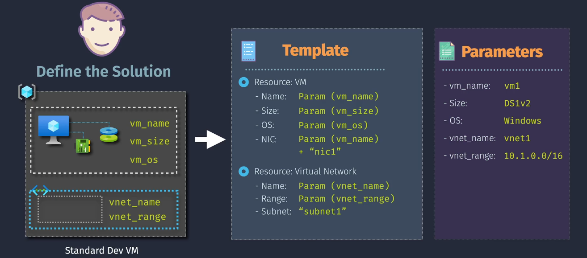
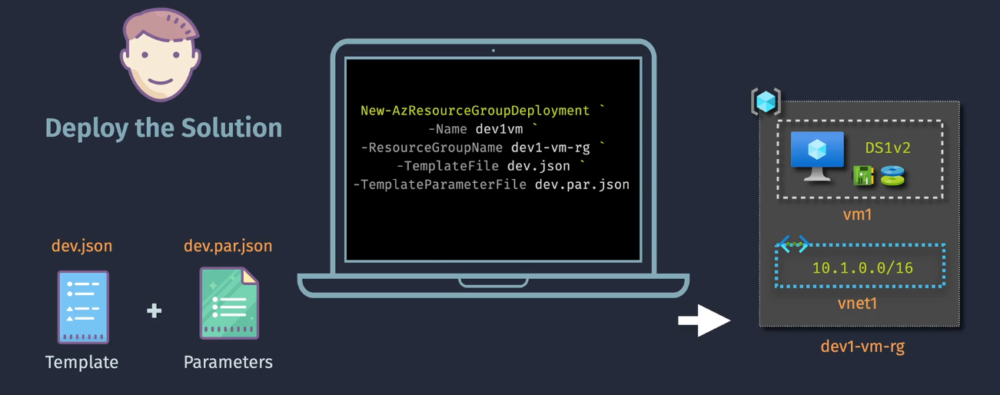
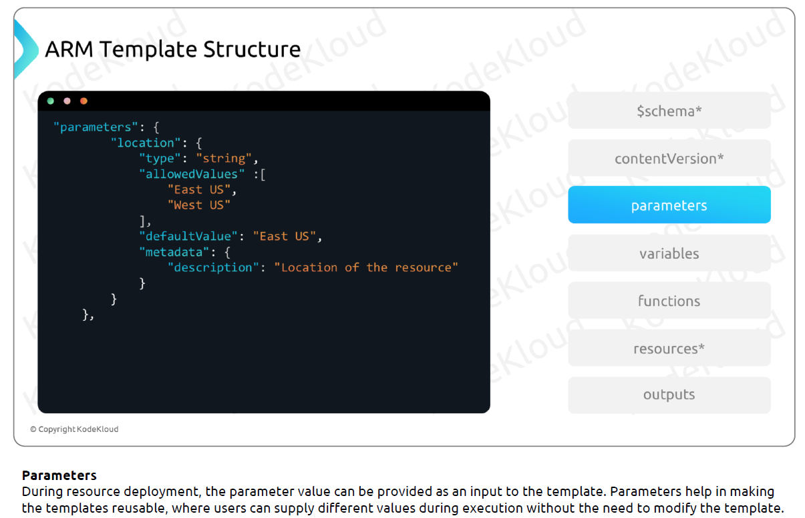
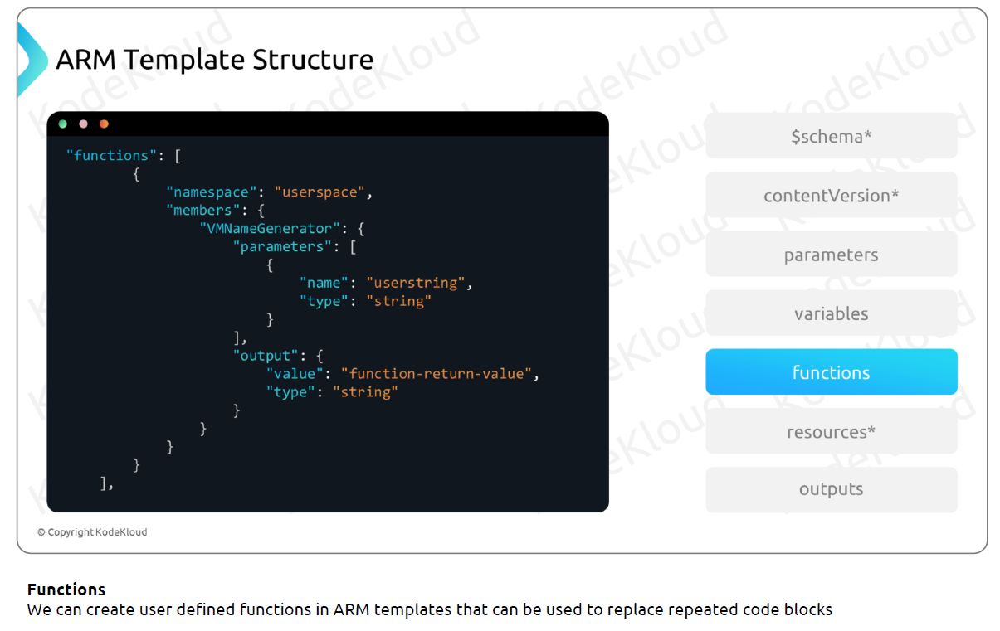
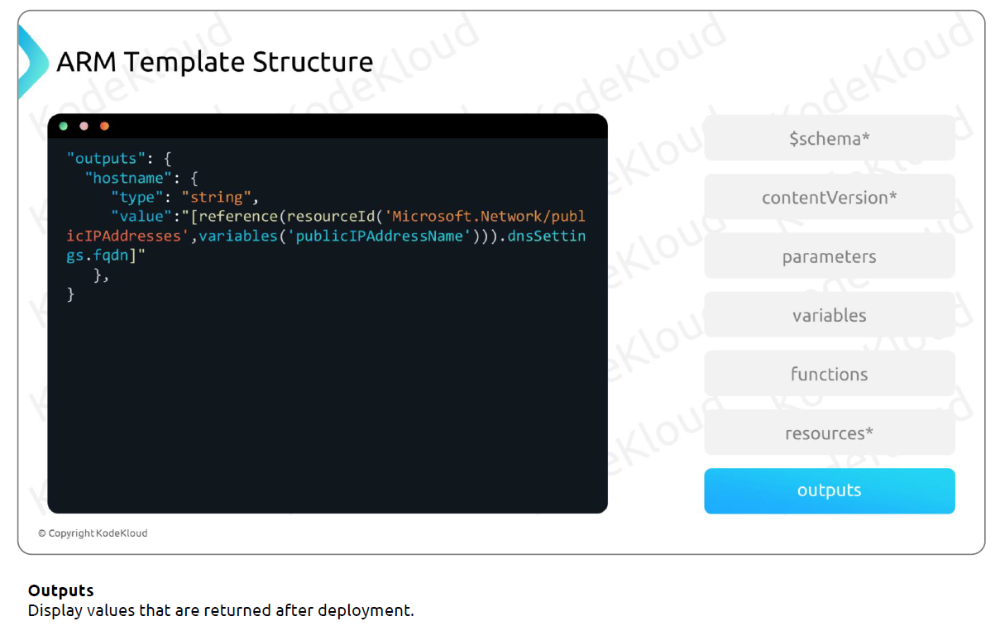

# ARM Templates

Imagine you want to build the same LEGO house every time you play. Instead of putting each brick one by one, you have a special instruction book that tells you exactly where every brick goes. **ARM Templates** work like that instruction book for your Azure resources. They help you create, manage, and deploy your Azure services in a consistent and repeatable way.

## What Are ARM Templates?





**ARM Templates** are JSON (JavaScript Object Notation) files that define the infrastructure and configuration for your Azure resources. They let you describe what resources you need (like virtual machines, storage accounts, and networks) and how they should be set up. When you use an ARM Template, Azure reads the instructions and builds everything for you automatically.

## Key Features

- **Infrastructure as Code (IaC):** Define your infrastructure using code, making it easy to version, share, and reuse.
- **Declarative Syntax:** Specify **what** you want, and Azure takes care of the **how**.
- **Idempotent Deployments:** You can run the same template multiple times without causing errors, ensuring resources are created only if they don't exist.
- **Consistent Environments:** Ensure that different environments (development, testing, production) are set up the same way.

## Use Cases

- **Automated Deployments:** Quickly deploy entire environments with multiple resources consistently.
- **Environment Consistency:** Ensure development, testing, and production environments are identical.
- **Version Control:** Track changes to your infrastructure over time by storing templates in version control systems like Git.
- **Disaster Recovery:** Recreate your infrastructure in a different region in case of a failure.

## JSON File Structure








## Key Components

### 1. **Parameters**

- **What They Are:** Inputs that you provide when deploying the template.
- **Why They’re Important:** Allow you to customize deployments without changing the template code.
- **Example:**

  ```json
  "parameters": {
    "vmName": {
      "type": "string",
      "defaultValue": "MyVM",
      "metadata": {
        "description": "Name of the virtual machine."
      }
    }
  }
  ```

### 2. **Variables**

- **What They Are:** Values that are used multiple times within the template.
- **Why They’re Important:** Simplify the template by avoiding repetition.
- **Example:**

  ```json
  "variables": {
    "location": "[resourceGroup().location]"
  }
  ```

### 3. **Resources**

- **What They Are:** The Azure services you want to create (e.g., VMs, storage accounts).
- **Why They’re Important:** Define what is being deployed.
- **Example:**

  ```json
  "resources": [
    {
      "type": "Microsoft.Compute/virtualMachines",
      "name": "[parameters('vmName')]",
      "apiVersion": "2021-07-01",
      "location": "[variables('location')]",
      "properties": {
        // VM properties here
      }
    }
  ]
  ```

### 4. **Outputs**

- **What They Are:** Information you want to get after the deployment.
- **Why They’re Important:** Provide details like resource IDs or connection strings.
- **Example:**

  ```json
  "outputs": {
    "vmId": {
      "type": "string",
      "value": "[resourceId('Microsoft.Compute/virtualMachines', parameters('vmName'))]"
    }
  }
  ```

## How to Use ARM Templates

### Example: Deploying a Virtual Machine

Let’s create a simple ARM Template to deploy a virtual machine (VM) in Azure.

### Step 1: Create the Template File

Create a file named `azuredeploy.json` with the following content:

```json
{
  "$schema": "https://schema.management.azure.com/schemas/2019-04-01/deploymentTemplate.json#",
  "contentVersion": "1.0.0.0",
  "parameters": {
    "vmName": {
      "type": "string",
      "defaultValue": "MyVM",
      "metadata": {
        "description": "Name of the virtual machine."
      }
    },
    "adminUsername": {
      "type": "string",
      "metadata": {
        "description": "Username for the virtual machine."
      }
    },
    "adminPassword": {
      "type": "securestring",
      "metadata": {
        "description": "Password for the virtual machine."
      }
    }
  },
  "variables": {
    "location": "[resourceGroup().location]"
  },
  "resources": [
    {
      "type": "Microsoft.Compute/virtualMachines",
      "name": "[parameters('vmName')]",
      "apiVersion": "2021-07-01",
      "location": "[variables('location')]",
      "properties": {
        "hardwareProfile": {
          "vmSize": "Standard_DS1_v2"
        },
        "osProfile": {
          "computerName": "[parameters('vmName')]",
          "adminUsername": "[parameters('adminUsername')]",
          "adminPassword": "[parameters('adminPassword')]"
        },
        "storageProfile": {
          "imageReference": {
            "publisher": "MicrosoftWindowsServer",
            "offer": "WindowsServer",
            "sku": "2019-Datacenter",
            "version": "latest"
          },
          "osDisk": {
            "createOption": "FromImage"
          }
        },
        "networkProfile": {
          "networkInterfaces": [
            {
              "id": "[resourceId('Microsoft.Network/networkInterfaces', concat(parameters('vmName'), 'NIC'))]"
            }
          ]
        }
      }
    },
    {
      "type": "Microsoft.Network/networkInterfaces",
      "name": "[concat(parameters('vmName'), 'NIC')]",
      "apiVersion": "2021-02-01",
      "location": "[variables('location')]",
      "properties": {
        "ipConfigurations": [
          {
            "name": "ipconfig1",
            "properties": {
              "subnet": {
                "id": "[variables('subnetRef')]"
              },
              "privateIPAllocationMethod": "Dynamic"
            }
          }
        ]
      }
    }
  ],
  "outputs": {
    "vmId": {
      "type": "string",
      "value": "[resourceId('Microsoft.Compute/virtualMachines', parameters('vmName'))]"
    }
  }
}
```

### Step 2: Deploy the Template

You can deploy the template using Azure Portal, Azure CLI, or Azure PowerShell. Here, we’ll use Azure CLI.

1. **Open Azure CLI:**

   - You can use the [Azure Cloud Shell](https://shell.azure.com/) in your browser or install Azure CLI locally.

2. **Log In to Azure:**

   ```bash
   az login
   ```

3. **Create a Resource Group (if not already created):**

   ```bash
   az group create --name MyResourceGroup --location eastus
   ```

4. **Deploy the Template:**

   ```bash
   az deployment group create \
     --resource-group MyResourceGroup \
     --template-file azuredeploy.json \
     --parameters vmName=MyTestVM adminUsername=azureuser adminPassword=YourPassword123!
   ```

5. **Verify Deployment:**
   - Check the Azure Portal under **Resource Groups > MyResourceGroup** to see your deployed VM and network interface.

### Step 3: Access the Virtual Machine

Once deployed, you can connect to your VM using Remote Desktop Protocol (RDP) with the credentials you provided.

## Common Tasks Using PowerShell and Azure CLI

Managing ARM Templates efficiently often involves automating common tasks such as deployment, review, exporting/downloading templates, and accepting Marketplace terms. Both PowerShell and Azure CLI offer robust commands to facilitate these operations. Below are the common tasks with corresponding commands and examples for each tool.

### 1. Deploy ARM Templates

Deploying ARM Templates automates the provisioning of Azure resources, ensuring consistency and repeatability.

#### **Azure CLI**

Use the `az deployment group create` command to deploy an ARM Template to a specific resource group.

**Example with Inline Parameters:**

```bash
az deployment group create \
  --resource-group MyResourceGroup \
  --template-file azuredeploy.json \
  --parameters vmName=MyTestVM adminUsername=azureuser adminPassword=YourPassword123!
```

**Example with Parameter File:**

```bash
az deployment group create \
  --resource-group MyResourceGroup \
  --template-file azuredeploy.json \
  --parameters @azuredeploy.parameters.json
```

#### **PowerShell**

Use the `New-AzResourceGroupDeployment` cmdlet to deploy an ARM Template.

**Example with Inline Parameters:**

```powershell
New-AzResourceGroupDeployment `
  -ResourceGroupName "MyResourceGroup" `
  -TemplateFile "azuredeploy.json" `
  -vmName "MyTestVM" `
  -adminUsername "azureuser" `
  -adminPassword (ConvertTo-SecureString "YourPassword123!" -AsPlainText -Force)
```

**Example with Parameter File:**

```powershell
New-AzResourceGroupDeployment `
  -ResourceGroupName "MyResourceGroup" `
  -TemplateFile "azuredeploy.json" `
  -TemplateParameterFile "azuredeploy.parameters.json"
```

---

### 2. Review Deployment Status

Monitoring deployment status ensures that resources are provisioned correctly and helps in troubleshooting any issues.

#### **Azure CLI**

**Show Details of a Specific Deployment:**

```bash
az deployment group show \
  --resource-group MyResourceGroup \
  --name MyDeploymentName
```

**List All Deployments in a Resource Group:**

```bash
az deployment group list --resource-group MyResourceGroup
```

#### **PowerShell**

**Get Details of a Specific Deployment:**

```powershell
Get-AzResourceGroupDeployment `
  -ResourceGroupName "MyResourceGroup" `
  -Name "MyDeploymentName"
```

**List All Deployments in a Resource Group:**

```powershell
Get-AzResourceGroupDeployment -ResourceGroupName "MyResourceGroup"
```

---

### 3. Export/Download ARM Templates

Exporting ARM Templates allows you to capture the current state of your Azure resources, facilitating backup, replication, or modification.

#### **Azure CLI**

**Export an ARM Template from a Resource Group:**

```bash
az group export --name MyResourceGroup --output json > exported-template.json
```

**Note:** Some resources may not be exportable, and manual adjustments might be necessary.

#### **PowerShell**

**Export an ARM Template from a Resource Group:**

```powershell
Export-AzResourceGroup `
  -ResourceGroupName "MyResourceGroup" `
  -Path "exported-template.json"
```

**Note:** Similar to Azure CLI, some resources may require manual editing after export.

---

### 4. Accept Marketplace Terms

Before deploying certain Marketplace offerings, you must accept their terms and conditions. This step is crucial for automated deployments.

#### **Azure CLI**

Use the `az vm image terms accept` command to accept the terms for a specific Marketplace image.

**Example: Accept Terms for a Windows Server Image:**

```bash
az vm image terms accept \
  --publisher MicrosoftWindowsServer \
  --offer WindowsServer \
  --sku 2019-Datacenter
```

#### **PowerShell**

Use the `Set-AzMarketplaceTerms` cmdlet to accept the terms for a specific Marketplace offer.

**Example: Accept Terms Using PowerShell:**

```powershell
Set-AzMarketplaceTerms `
  -Publisher "MicrosoftWindowsServer" `
  -Product "WindowsServer" `
  -Name "2019-Datacenter" `
  -Accept
```

**Parameters Explained:**

- `-Publisher`: The publisher of the Marketplace offer.
- `-Product`: The product name of the Marketplace offer.
- `-Name`: The SKU name of the Marketplace offer.
- `-Accept`: A switch parameter that accepts the terms.

**Note:** Ensure you have the necessary permissions and have the correct publisher, offer, and SKU details.

## Important Considerations

### Notes and Tips

- **Modular Templates:** Break down large templates into smaller, reusable modules for better manageability.
- **Secure Parameters:** Use `securestring` for sensitive information like passwords to keep them secure.
- **Validate Templates:** Always validate your templates before deployment to catch errors early.

  ```bash
  az deployment group validate --resource-group MyResourceGroup --template-file azuredeploy.json --parameters vmName=MyTestVM adminUsername=azureuser adminPassword=YourPassword123!
  ```

- **Use Outputs Wisely:** Provide useful information from your deployments through outputs, such as resource IDs or connection strings.

### Common Pitfalls

- **Syntax Errors:** JSON syntax must be correct; missing commas or brackets can cause deployment failures.
- **Incorrect Resource Dependencies:** Ensure resources are created in the right order, especially when they depend on each other.
- **Overly Complex Templates:** Keep templates as simple as possible. Use linked templates or nested deployments for complex scenarios.
- **Hardcoding Values:** Avoid hardcoding values. Use parameters to make templates flexible and reusable.

## Recommendations and Best Practices

1. **Use Parameters and Variables:**

   - **Why:** Makes templates flexible and reusable across different environments.
   - **How:** Define parameters for values that change and variables for values used multiple times.

2. **Modularize Templates:**

   - **Why:** Enhances readability and maintainability.
   - **How:** Split large templates into smaller, linked templates for different components.

3. **Version Control Your Templates:**

   - **Why:** Track changes, collaborate with your team, and roll back if needed.
   - **How:** Store templates in a Git repository.

4. **Validate Before Deploying:**

   - **Why:** Prevent deployment failures and ensure templates are error-free.
   - **How:** Use the `az deployment group validate` command or validation tools in Azure Portal.

5. **Secure Sensitive Data:**

   - **Why:** Protect credentials and sensitive information.
   - **How:** Use `securestring` for passwords and consider using Azure Key Vault for secrets.

6. **Leverage Azure Resource Manager Features:**

   - **Why:** Utilize built-in functionalities to enhance deployments.
   - **How:** Use dependencies, outputs, and linked templates effectively.

7. **Document Your Templates:**

   - **Why:** Helps others understand the purpose and structure of your templates.
   - **How:** Add comments and metadata within your templates to explain different sections.

8. **Automate Deployments:**

   - **Why:** Streamlines the deployment process and reduces manual effort.
   - **How:** Integrate ARM Templates with CI/CD pipelines using Azure DevOps or GitHub Actions.

9. **Use Built-in Templates as Starting Points:**

   - **Why:** Saves time and ensures best practices.
   - **How:** Explore Azure Quickstart Templates on [GitHub](https://github.com/Azure/azure-quickstart-templates) and customize them as needed.

10. **Monitor and Manage Deployments:**
    - **Why:** Ensure deployments are successful and resources are running as expected.
    - **How:** Use Azure Portal, Azure CLI, or Azure PowerShell to monitor deployment status and resource health.

## Summary

**ARM Templates** are powerful tools that allow you to define and deploy your Azure infrastructure as code. By using JSON files to describe your resources and their configurations, ARM Templates ensure consistency, repeatability, and efficiency in managing your Azure environment.

- **Infrastructure as Code:** Treat your infrastructure like software, enabling version control and automation.
- **Declarative Deployments:** Specify what you want, and Azure handles the how.
- **Consistency and Repeatability:** Deploy the same setup across multiple environments without manual intervention.
- **Automation and Integration:** Integrate with CI/CD pipelines for streamlined deployments.

## 📊 Additional Resources

- [Azure Resource Manager Documentation](https://docs.microsoft.com/azure/azure-resource-manager/)
- [Quickstart: Deploy a virtual machine using an ARM template](https://docs.microsoft.com/azure/azure-resource-manager/templates/quickstart-create-templates-use-the-portal)
- [Azure Quickstart Templates on GitHub](https://github.com/Azure/azure-quickstart-templates)
- [ARM Template Reference](https://docs.microsoft.com/azure/templates/)
- [Best Practices for ARM Templates](https://docs.microsoft.com/azure/azure-resource-manager/templates/best-practices)
- [Azure Resource Manager REST API](https://docs.microsoft.com/rest/api/resources/)
- [Learn ARM Templates](https://docs.microsoft.com/learn/modules/intro-to-arm-templates/)
