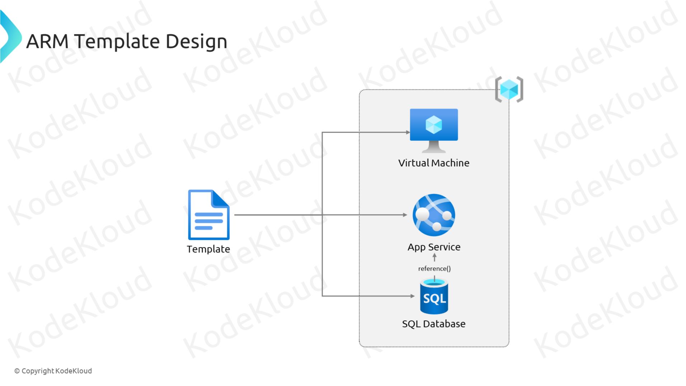
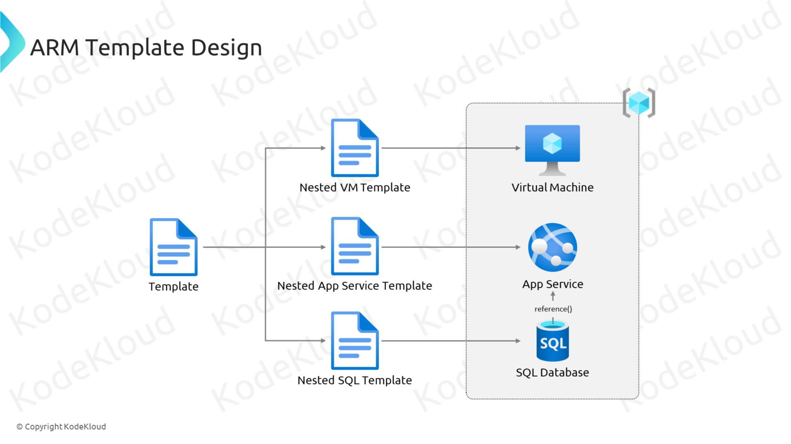
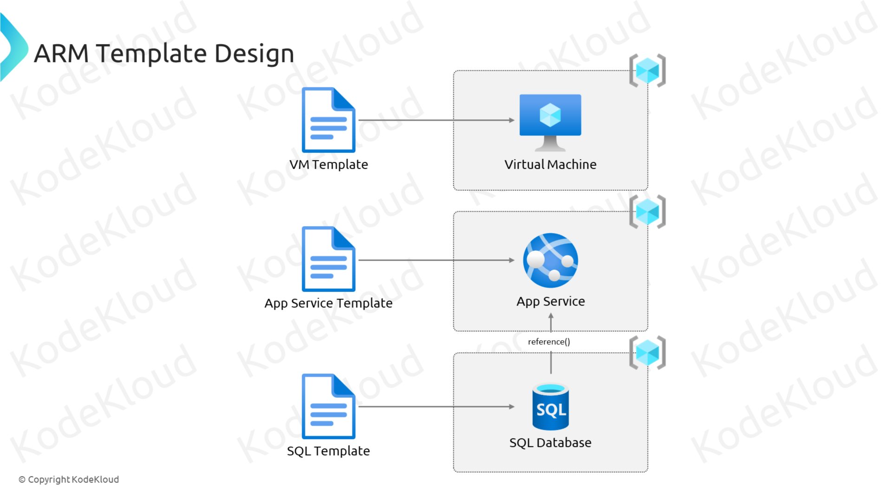

# ARM Template Design

Designing ARM Templates effectively ensures that your deployments are scalable, maintainable, and easy to manage. Here are key design principles and strategies to consider when creating ARM Templates.





## 1. **Modularization**

- **What It Is:** Breaking down large, complex templates into smaller, reusable modules.
- **Why It’s Important:** Enhances readability, maintainability, and reusability of your templates.
- **How to Implement:**

  - **Linked Templates:** Reference other templates within your main template using the `Microsoft.Resources/deployments` resource type.
  - **Example:**

    ```json
    {
      "type": "Microsoft.Resources/deployments",
      "name": "linkedTemplateDeployment",
      "apiVersion": "2021-04-01",
      "properties": {
        "mode": "Incremental",
        "templateLink": {
          "uri": "https://path-to-your-linked-template.json",
          "contentVersion": "1.0.0.0"
        },
        "parameters": {
          "parameter1": {
            "value": "value1"
          }
        }
      }
    }
    ```

## 2. **Nested Templates**

- **What It Is:** Embedding one ARM Template within another to handle complex deployments.
- **Why It’s Important:** Simplifies management of interdependent resources and promotes reusability.
- **How to Implement:**

  - **Define Nested Deployments:** Use the `Microsoft.Resources/deployments` resource type to include nested templates.
  - **Example:**

    ```json
    {
      "type": "Microsoft.Resources/deployments",
      "name": "nestedDeployment",
      "apiVersion": "2021-04-01",
      "properties": {
        "mode": "Incremental",
        "template": {
          "$schema": "https://schema.management.azure.com/schemas/2019-04-01/deploymentTemplate.json#",
          "contentVersion": "1.0.0.0",
          "resources": [
            // Nested resources here
          ]
        },
        "parameters": {
          "param1": {
            "value": "value1"
          }
        }
      }
    }
    ```

## 3. **Parameterization and Reusability**

- **What It Is:** Using parameters and variables to make templates flexible and adaptable to different environments.
- **Why It’s Important:** Facilitates reuse of templates across multiple deployments with varying configurations.
- **How to Implement:**

  - **Define Parameters:** Allow users to input values during deployment.
  - **Use Variables:** Store values that are used multiple times within the template.
  - **Example:**

    ```json
    "parameters": {
      "storageAccountName": {
        "type": "string",
        "metadata": {
          "description": "Name of the storage account."
        }
      }
    },
    "variables": {
      "storageSku": "Standard_LRS"
    }
    ```

## 4. **Error Handling and Validation**

- **What It Is:** Implementing checks and validations to ensure template integrity and successful deployments.
- **Why It’s Important:** Prevents deployment failures and ensures resources are provisioned correctly.
- **How to Implement:**

  - **Use the `conditions` Property:** Control the deployment of resources based on certain conditions.
  - **Example:**

    ```json
    "resources": [
      {
        "type": "Microsoft.Storage/storageAccounts",
        "name": "[parameters('storageAccountName')]",
        "apiVersion": "2021-04-01",
        "location": "[variables('location')]",
        "condition": "[equals(parameters('deployStorage'), 'true')]",
        "properties": {
          "sku": {
            "name": "[variables('storageSku')]"
          },
          "kind": "StorageV2",
          "accessTier": "Hot"
        }
      }
    ]
    ```

## 5. **Consistent Naming Conventions**

- **What It Is:** Applying a standardized naming scheme for resources.
- **Why It’s Important:** Improves organization, manageability, and ease of identification.
- **How to Implement:**

  - **Use Parameters and Functions:** Dynamically generate resource names.
  - **Example:**

    ```json
    "name": "[concat(parameters('vmName'), '-vm')]"
    ```

## 6. **Security Best Practices**

- **What It Is:** Ensuring that templates adhere to security standards and best practices.
- **Why It’s Important:** Protects your infrastructure from vulnerabilities and unauthorized access.
- **How to Implement:**

  - **Use Secure Parameters:** Protect sensitive information using `securestring`.
  - **Implement Role-Based Access Control (RBAC):** Assign appropriate permissions to deployed resources.
  - **Example:**

    ```json
    "parameters": {
      "adminPassword": {
        "type": "securestring",
        "metadata": {
          "description": "Password for the virtual machine."
        }
      }
    }
    ```

## 7. **Documentation and Comments**

- **What It Is:** Adding descriptive comments and metadata within your templates.
- **Why It’s Important:** Enhances understanding and maintainability, especially for collaborative projects.
- **How to Implement:**

  - **Use the `metadata` Property:** Provide descriptions for parameters, variables, and resources.
  - **Example:**

    ```json
    "parameters": {
      "vmName": {
        "type": "string",
        "defaultValue": "MyVM",
        "metadata": {
          "description": "Name of the virtual machine."
        }
      }
    }
    ```
