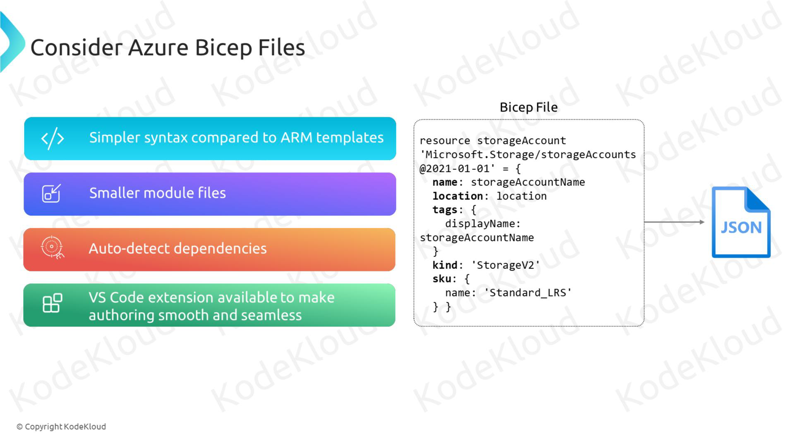
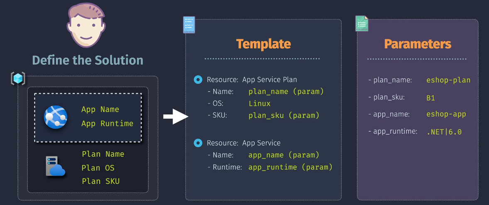
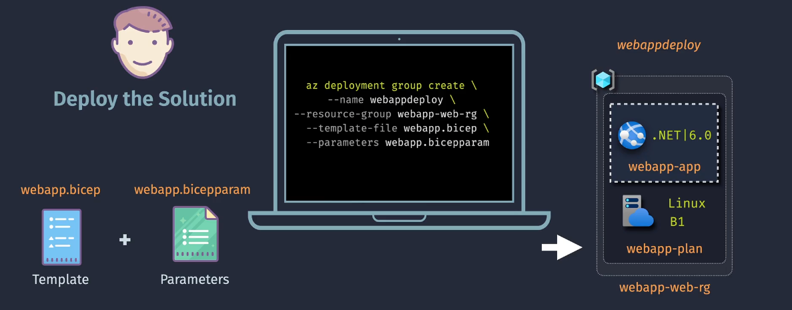
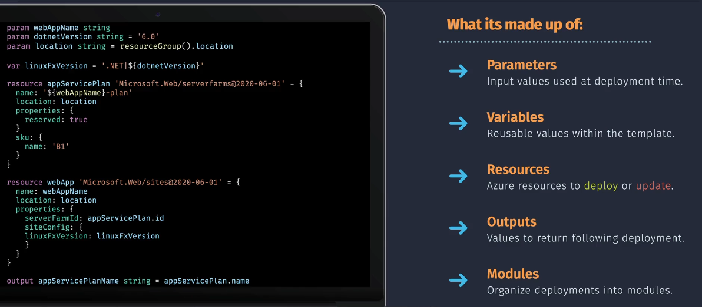

# Bicep Files

## Introduction



Building and managing Azure infrastructure can be complex, especially when dealing with numerous resources and configurations. **Bicep** addresses this challenge by providing a more streamlined and readable syntax compared to traditional ARM Templates. Whether you're a beginner or an experienced Azure user, Bicep simplifies the process of defining, deploying, and managing your cloud resources.

## What Is Bicep?




**Bicep** is a domain-specific language (DSL) for deploying Azure resources declaratively. It acts as an abstraction layer over JSON-based ARM Templates, offering a more concise and easier-to-read syntax. Bicep is fully integrated with Azure Resource Manager (ARM), ensuring that it supports all the latest Azure features and services.

## Key Features

- **Simplified Syntax:** More concise and readable compared to ARM Templates.
- **Modularity:** Break down deployments into reusable modules.
- **IntelliSense and Tooling:** Enhanced support in IDEs for easier authoring.
- **Type Safety:** Bicep provides type checking to catch errors early.
- **Seamless Integration:** Transpiles to ARM Templates, ensuring full compatibility with Azure Resource Manager.

## Key Components



Similar to ARM Templates, Bicep files consist of several key components that define and configure your Azure resources.

### 1. Parameters

- **What They Are:** Inputs provided during deployment to customize the template.
- **Why They’re Important:** Enable flexibility and reusability by allowing dynamic values.
- **Example:**

  ```bicep
  param vmName string = 'MyVM'
  param adminUsername string
  param adminPassword secureString
  ```

### 2. Variables

- **What They Are:** Values computed within the template that can be reused.
- **Why They’re Important:** Simplify templates by avoiding repetition.
- **Example:**

  ```bicep
  var location = resourceGroup().location
  var vmSize = 'Standard_DS1_v2'
  ```

### 3. Resources

- **What They Are:** Azure services you want to deploy (e.g., VMs, storage accounts).
- **Why They’re Important:** Define the infrastructure components to be provisioned.
- **Example:**

  ```bicep
  resource vm 'Microsoft.Compute/virtualMachines@2021-07-01' = {
    name: vmName
    location: location
    properties: {
      hardwareProfile: {
        vmSize: vmSize
      }
      osProfile: {
        computerName: vmName
        adminUsername: adminUsername
        adminPassword: adminPassword
      }
      storageProfile: {
        imageReference: {
          publisher: 'MicrosoftWindowsServer'
          offer: 'WindowsServer'
          sku: '2019-Datacenter'
          version: 'latest'
        }
        osDisk: {
          createOption: 'FromImage'
        }
      }
      networkProfile: {
        networkInterfaces: [
          {
            id: nic.id
          }
        ]
      }
    }
  }
  ```

### 4. Outputs

- **What They Are:** Information returned after deployment.
- **Why They’re Important:** Provide details like resource IDs or connection strings.
- **Example:**

  ```bicep
  output vmId string = vm.id
  output adminUsernameOutput string = adminUsername
  ```

### 5. Modules

- **What They Are:** Reusable Bicep files that encapsulate specific functionalities or resource groups.
- **Why They’re Important:** Promote reusability and maintainability by allowing you to break down complex deployments.
- **Example:**

  ```bicep
  module storageModule 'storage.bicep' = {
    name: 'storageDeployment'
    params: {
      storageAccountName: 'mystorageacct'
    }
  }
  ```

### 6. Functions

Bicep supports a variety of built-in functions that enhance the flexibility and dynamism of your templates. Additionally, while Bicep doesn't support defining custom functions within the language itself, you can achieve similar modularity and reuse through modules.

#### Built-in Functions

Bicep provides numerous built-in functions categorized as follows:

- **String Functions:** `concat`, `substring`, `toLower`, `toUpper`, etc.
- **Logical Functions:** `if`, `equals`, `and`, `or`, etc.
- **Reference Functions:** `resourceId`, `reference`, `listKeys`, etc.
- **List Functions:** `length`, `contains`, `first`, `last`, etc.
- **Array Functions:** `union`, `intersection`, `unique`, etc.
- **Math Functions:** `add`, `subtract`, `multiply`, `divide`, etc.
- **Template Functions:** `resourceGroup`, `deployment`, etc.

#### Common Bicep Functions

1. **`concat`**

   - **Description:** Concatenates two or more strings.
   - **Example:**

     ```bicep
     concat('vm-', vmName)
     ```

2. **`resourceId`**

   - **Description:** Returns the resource ID for a given resource.
   - **Example:**

     ```bicep
     resourceId('Microsoft.Network/networkInterfaces', '${vmName}NIC')
     ```

3. **`if`**

   - **Description:** Returns one of two values depending on a condition.
   - **Example:**

     ```bicep
     if (environment == 'production') {
       vmSize: 'Standard_DS2_v2'
     } else {
       vmSize: 'Standard_DS1_v2'
     }
     ```

4. **`substring`**

   - **Description:** Extracts a substring from a string.
   - **Example:**

     ```bicep
     substring(vmName, 0, 3)
     ```

5. **`length`**

   - **Description:** Returns the length of a string or array.
   - **Example:**

     ```bicep
     length(storageAccounts)
     ```

6. **`toLower`**

   - **Description:** Converts a string to lowercase.
   - **Example:**

     ```bicep
     toLower(vmName)
     ```

7. **`unique`**

   - **Description:** Returns a unique array by removing duplicates.
   - **Example:**

     ```bicep
     unique(['tag1', 'tag2', 'tag1'])
     ```

#### Example: Using Built-in Functions in Bicep

```bicep
param vmName string = 'MyVM'
param environment string = 'development'

var location = resourceGroup().location
var vmSize = if (environment == 'production') 'Standard_DS2_v2' else 'Standard_DS1_v2'
var nicName = concat(vmName, 'NIC')

resource nic 'Microsoft.Network/networkInterfaces@2021-02-01' = {
  name: nicName
  location: location
  properties: {
    ipConfigurations: [
      {
        name: 'ipconfig1'
        properties: {
          subnet: {
            id: '/subscriptions/{subscription-id}/resourceGroups/{resource-group}/providers/Microsoft.Network/virtualNetworks/{vnet}/subnets/{subnet}'
          }
          privateIPAllocationMethod: 'Dynamic'
        }
      }
    ]
  }
}

resource vm 'Microsoft.Compute/virtualMachines@2021-07-01' = {
  name: vmName
  location: location
  properties: {
    hardwareProfile: {
      vmSize: vmSize
    }
    osProfile: {
      computerName: vmName
      adminUsername: 'azureuser'
      adminPassword: 'YourPassword123!'
    }
    storageProfile: {
      imageReference: {
        publisher: 'MicrosoftWindowsServer'
        offer: 'WindowsServer'
        sku: '2019-Datacenter'
        version: 'latest'
      }
      osDisk: {
        createOption: 'FromImage'
      }
    }
    networkProfile: {
      networkInterfaces: [
        {
          id: nic.id
        }
      ]
    }
  }
}

output vmId string = vm.id
output vmSizeOutput string = vmSize
```

#### Custom Functions

While Bicep doesn't support defining custom functions within the language itself, you can achieve similar functionality through the use of **modules**. Modules allow you to encapsulate and reuse code across multiple Bicep files, promoting modularity and maintainability.

## Common Tasks

Managing Bicep files efficiently involves automating common tasks such as deployment, review, exporting/downloading templates, and accepting Marketplace terms. Both PowerShell and Azure CLI offer robust commands to facilitate these operations. Below are the common tasks with corresponding commands and examples for each tool.

### 1. Deploy Bicep Files

Deploying Bicep files automates the provisioning of Azure resources, ensuring consistency and repeatability.

#### **Azure CLI**

Use the `az deployment group create` command to deploy a Bicep file to a specific resource group.

**Example with Inline Parameters:**

```bash
az deployment group create \
  --resource-group MyResourceGroup \
  --template-file main.bicep \
  --parameters vmName=MyTestVM adminUsername=azureuser adminPassword=YourPassword123! environment=production
```

**Example with Parameter File:**

```bash
az deployment group create \
  --resource-group MyResourceGroup \
  --template-file main.bicep \
  --parameters @main.parameters.json
```

#### **PowerShell**

Use the `New-AzResourceGroupDeployment` cmdlet to deploy a Bicep file.

**Example with Inline Parameters:**

```powershell
New-AzResourceGroupDeployment `
  -ResourceGroupName "MyResourceGroup" `
  -TemplateFile "main.bicep" `
  -vmName "MyTestVM" `
  -adminUsername "azureuser" `
  -adminPassword (ConvertTo-SecureString "YourPassword123!" -AsPlainText -Force) `
  -environment "production"
```

**Example with Parameter File:**

```powershell
New-AzResourceGroupDeployment `
  -ResourceGroupName "MyResourceGroup" `
  -TemplateFile "main.bicep" `
  -TemplateParameterFile "main.parameters.json"
```

### 2. Review Deployment Status

Monitoring deployment status ensures that resources are provisioned correctly and helps in troubleshooting any issues.

#### **Azure CLI**

**Show Details of a Specific Deployment:**

```bash
az deployment group show \
  --resource-group MyResourceGroup \
  --name MyDeploymentName
```

**List All Deployments in a Resource Group:**

```bash
az deployment group list --resource-group MyResourceGroup
```

#### **PowerShell**

**Get Details of a Specific Deployment:**

```powershell
Get-AzResourceGroupDeployment `
  -ResourceGroupName "MyResourceGroup" `
  -Name "MyDeploymentName"
```

**List All Deployments in a Resource Group:**

```powershell
Get-AzResourceGroupDeployment -ResourceGroupName "MyResourceGroup"
```

### 3. Export/Download Bicep Files

Exporting Bicep files allows you to capture the current state of your Azure resources, facilitating backup, replication, or modification.

#### **Azure CLI**

**Export a Bicep File from a Resource Group:**

```bash
az group export --name MyResourceGroup --output bicep > exported-template.bicep
```

**Note:** Some resources may not be exportable, and manual adjustments might be necessary.

#### **PowerShell**

**Export a Bicep File from a Resource Group:**

```powershell
Export-AzResourceGroup `
  -ResourceGroupName "MyResourceGroup" `
  -Path "exported-template.bicep"
```

**Note:** Similar to Azure CLI, some resources may require manual editing after export.

### 4. Convert to ARM

To convert a Bicep file to an ARM template using both Azure CLI and PowerShell, follow these steps:

#### Using Azure CLI

1. **Install Bicep CLI**: Make sure you have the Bicep CLI installed. You can install it using the following command:

   ```sh
   az bicep install
   ```

2. **Convert Bicep to ARM**: Use the `build` command to convert your Bicep file to an ARM template. For example:

   ```sh
   az bicep build --file main.bicep --outfile main.json
   ```

   This command will create an ARM template file named `main.json` from your `main.bicep` file.

#### Using PowerShell

1. **Install Bicep CLI**: Ensure you have the Bicep CLI installed. You can install it using the following command:

   ```powershell
   bicep install
   ```

2. **Convert Bicep to ARM**: Use the `bicep build` command to convert your Bicep file to an ARM template. For example:

   ```powershell
   bicep build --file main.bicep --outfile main.json
   ```

   This command will create an ARM template file named `main.json` from your `main.bicep` file.

### Summary of Common Commands

| Task                   | Azure CLI Command                                                                                         | PowerShell Cmdlet/Script                                                                                              |
| ---------------------- | --------------------------------------------------------------------------------------------------------- | --------------------------------------------------------------------------------------------------------------------- |
| **Deploy Bicep**       | `az deployment group create --resource-group MyResourceGroup --template-file main.bicep`                  | `New-AzResourceGroupDeployment -ResourceGroupName "MyResourceGroup" -TemplateFile "main.bicep"`                       |
| **Review Deployment**  | `az deployment group show --resource-group MyResourceGroup --name MyDeploymentName`                       | `Get-AzResourceGroupDeployment -ResourceGroupName "MyResourceGroup" -Name "MyDeploymentName"`                         |
| **List Deployments**   | `az deployment group list --resource-group MyResourceGroup`                                               | `Get-AzResourceGroupDeployment -ResourceGroupName "MyResourceGroup"`                                                  |
| **Export Bicep**       | `az group export --name MyResourceGroup --output bicep > exported-template.bicep`                         | `Export-AzResourceGroup -ResourceGroupName "MyResourceGroup" -Path "exported-template.bicep"`                         |
| **Accept Marketplace** | `az vm image terms accept --publisher MicrosoftWindowsServer --offer WindowsServer --sku 2019-Datacenter` | `Set-AzMarketplaceTerms -Publisher "MicrosoftWindowsServer" -Product "WindowsServer" -Name "2019-Datacenter" -Accept` |

### Best Practices

- **Automate with Scripts:** Incorporate these commands into your PowerShell scripts or Azure CLI scripts to automate repetitive tasks.
- **Use Parameter Files:** When deploying templates, use parameter files to manage configurations, enhancing reusability and maintainability.
- **Secure Sensitive Information:** Always handle sensitive data like passwords securely. Use `secureString` in Bicep and avoid hardcoding credentials.
- **Monitor Deployments:** Regularly review deployment statuses to quickly identify and resolve issues.
- **Version Control:** Store your deployment scripts, Bicep files, and parameter files in a version control system like Git to track changes and collaborate effectively.

## Comparison: Bicep vs. ARM Templates

| Feature             | ARM Templates                                 | Bicep                                           |
| ------------------- | --------------------------------------------- | ----------------------------------------------- |
| **Syntax**          | JSON-based, verbose                           | Simplified, declarative DSL                     |
| **Readability**     | Can be complex and hard to read               | Cleaner and more intuitive                      |
| **Modularity**      | Supported through nested and linked templates | Native support with modules                     |
| **Tooling Support** | Basic support                                 | Enhanced with Visual Studio Code extensions     |
| **Error Handling**  | Limited error messages                        | Better error diagnostics and type checking      |
| **Learning Curve**  | Steeper due to JSON complexity                | Gentler, especially for those familiar with ARM |
| **Maintenance**     | Can become unwieldy with large templates      | Easier to manage and maintain                   |
| **Transpilation**   | N/A                                           | Compiles down to ARM Templates                  |

## ARM Template Design Principles in Bicep

Designing Bicep files effectively ensures that your deployments are scalable, maintainable, and easy to manage. Here are key design principles and strategies to consider when creating Bicep files.

### 1. Modularization

- **What It Is:** Breaking down large, complex templates into smaller, reusable modules.
- **Why It’s Important:** Enhances readability, maintainability, and reusability of your templates.
- **How to Implement:**

  - **Create Modules:** Define separate Bicep files for different components (e.g., storage, networking, compute).
  - **Reference Modules:** Use the `module` keyword to include modules in your main Bicep file.
  - **Example:**

    ```bicep
    module storageModule './storage.bicep' = {
      name: 'storageDeployment'
      params: {
        storageAccountName: 'mystorageacct'
        location: 'eastus'
      }
    }
    ```

### 2. Parameterization and Reusability

- **What It Is:** Using parameters and variables to make templates flexible and adaptable to different environments.
- **Why It’s Important:** Facilitates reuse of templates across multiple deployments with varying configurations.
- **How to Implement:**

  - **Define Parameters:** Allow users to input values during deployment.
  - **Use Variables:** Store values that are used multiple times within the template.
  - **Example:**

    ```bicep
    param storageAccountName string
    var storageSku = 'Standard_LRS'
    ```

### 3. Error Handling and Validation

- **What It Is:** Implementing checks and validations to ensure template integrity and successful deployments.
- **Why It’s Important:** Prevents deployment failures and ensures resources are provisioned correctly.
- **How to Implement:**

  - **Use Conditions:** Control the deployment of resources based on certain conditions.
  - **Example:**

    ```bicep
    param deployStorage bool = true

    resource storageAccount 'Microsoft.Storage/storageAccounts@2021-04-01' = if (deployStorage) {
      name: storageAccountName
      // Resource properties
    }
    ```

### 4. Consistent Naming Conventions

- **What It Is:** Applying a standardized naming scheme for resources.
- **Why It’s Important:** Improves organization, manageability, and ease of identification.
- **How to Implement:**

  - **Use Parameters and Functions:** Dynamically generate resource names.
  - **Example:**

    ```bicep
    name: concat(toLower(vmName), '-vm')
    ```

### 5. Security Best Practices

- **What It Is:** Ensuring that templates adhere to security standards and best practices.
- **Why It’s Important:** Protects your infrastructure from vulnerabilities and unauthorized access.
- **How to Implement:**

  - **Use Secure Parameters:** Protect sensitive information using `secureString`.
  - **Implement RBAC:** Assign appropriate permissions to deployed resources.
  - **Example:**

    ```bicep
    param adminPassword secureString
    ```

### 6. Documentation and Comments

- **What It Is:** Adding descriptive comments and metadata within your templates.
- **Why It’s Important:** Enhances understanding and maintainability, especially for collaborative projects.
- **How to Implement:**

  - **Use Comments:** Add comments to explain complex sections.
  - **Example:**

    ```bicep
    // Define the virtual machine
    resource vm 'Microsoft.Compute/virtualMachines@2021-07-01' = {
      // Resource properties
    }
    ```

## Best Practices

Adhering to best practices ensures that your Bicep deployments are efficient, secure, and maintainable.

### 1. **Use Parameterization and Variables**

- **Why:** Makes templates flexible and reusable across different environments.
- **How:** Define parameters for values that change and variables for values used multiple times.
- **Example:**

  ```bicep
  param environment string = 'development'
  var vmSize = if (environment == 'production') 'Standard_DS2_v2' else 'Standard_DS1_v2'
  ```

### 2. **Modularize Templates**

- **Why:** Enhances readability and maintainability.
- **How:** Split large templates into smaller, linked modules for different components.
- **Example:**

  ```bicep
  module networkModule './network.bicep' = {
    name: 'networkDeployment'
    params: {
      vnetName: 'myVNet'
      subnetName: 'mySubnet'
    }
  }
  ```

### 3. **Version Control Your Templates**

- **Why:** Track changes, collaborate with your team, and roll back if needed.
- **How:** Store Bicep files in a Git repository.
- **Example:**

  ```bash
  git init
  git add main.bicep
  git commit -m "Initial commit of main Bicep template"
  ```

### 4. **Validate Before Deploying**

- **Why:** Prevent deployment failures and ensure templates are error-free.
- **How:** Use the `az deployment group validate` command or validation tools in Azure Portal.
- **Example (Azure CLI):**

  ```bash
  az deployment group validate \
    --resource-group MyResourceGroup \
    --template-file main.bicep \
    --parameters @main.parameters.json
  ```

### 5. **Secure Sensitive Data**

- **Why:** Protect credentials and sensitive information.
- **How:** Use `secureString` for passwords and consider using Azure Key Vault for secrets.
- **Example:**

  ```bicep
  param adminPassword secureString
  ```

### 6. **Leverage Bicep Features**

- **Why:** Utilize built-in functionalities to enhance deployments.
- **How:** Use dependencies, outputs, and modules effectively.
- **Example:**

  ```bicep
  resource vm 'Microsoft.Compute/virtualMachines@2021-07-01' = {
    // Resource properties
    dependsOn: [
      nic
    ]
  }
  ```

### 7. **Document Your Templates**

- **Why:** Helps others understand the purpose and structure of your templates.
- **How:** Add comments and metadata within your templates to explain different sections.
- **Example:**

  ```bicep
  // Define the virtual machine resource
  resource vm 'Microsoft.Compute/virtualMachines@2021-07-01' = {
    // Resource properties
  }
  ```

### 8. **Automate Deployments**

- **Why:** Streamlines the deployment process and reduces manual effort.
- **How:** Integrate Bicep files with CI/CD pipelines using Azure DevOps or GitHub Actions.
- **Example (Azure DevOps YAML Pipeline):**

  ```yaml
  trigger:
    - main

  pool:
    vmImage: "ubuntu-latest"

  steps:
    - task: AzureCLI@2
      inputs:
        azureSubscription: "MyAzureSubscription"
        scriptType: "bash"
        scriptLocation: "inlineScript"
        inlineScript: |
          az deployment group create \
            --resource-group MyResourceGroup \
            --template-file main.bicep \
            --parameters @main.parameters.json
  ```

### 9. **Use Built-in Templates as Starting Points**

- **Why:** Saves time and ensures best practices.
- **How:** Explore Azure Quickstart Templates on [GitHub](https://github.com/Azure/azure-quickstart-templates) and customize them as needed.
- **Example:**

  ```bash
  git clone https://github.com/Azure/azure-quickstart-templates.git
  cd azure-quickstart-templates
  ```

### 10. **Monitor and Manage Deployments**

- **Why:** Ensure deployments are successful and resources are running as expected.
- **How:** Use Azure Portal, Azure CLI, or Azure PowerShell to monitor deployment status and resource health.
- **Example (Azure CLI):**

  ```bash
  az monitor metrics list --resource /subscriptions/{subscription-id}/resourceGroups/{resource-group}/providers/Microsoft.Compute/virtualMachines/{vm-name} --metric "Percentage CPU"
  ```

## Summary

**Bicep** is a powerful, declarative language designed to simplify the deployment and management of Azure resources. By offering a more intuitive and readable syntax compared to traditional ARM Templates, Bicep enhances productivity, maintainability, and scalability in your Azure infrastructure deployments.

- **Simplified Syntax:** Cleaner and more concise compared to JSON-based ARM Templates.
- **Modularity:** Break down complex deployments into reusable modules.
- **Seamless Integration:** Fully integrated with Azure Resource Manager, ensuring compatibility with all Azure services.
- **Enhanced Tooling:** Improved support in IDEs with features like IntelliSense and validation.
- **Best Practices:** Encourages the use of parameterization, modularization, and secure handling of sensitive data.

By leveraging Bicep's features and adhering to best practices, you can efficiently manage your Azure infrastructure as code, ensuring consistent, repeatable, and secure deployments.

## Additional Resources

- [Bicep Documentation](https://docs.microsoft.com/azure/azure-resource-manager/bicep/)
- [Quickstart: Create your first Bicep file](https://docs.microsoft.com/azure/azure-resource-manager/bicep/quickstart)
- [Bicep GitHub Repository](https://github.com/Azure/bicep)
- [Bicep vs. ARM Templates](https://docs.microsoft.com/azure/azure-resource-manager/bicep/compare-templates)
- [Bicep Playground](https://bicepdemo.z22.web.core.windows.net/)
- [Learn Bicep](https://docs.microsoft.com/learn/modules/intro-to-bicep/)
- [Azure CLI for Bicep](https://docs.microsoft.com/azure/azure-resource-manager/bicep/install)
- [Visual Studio Code - Bicep Extension](https://marketplace.visualstudio.com/items?itemName=ms-azuretools.vscode-bicep)
- [Azure PowerShell for Bicep](https://docs.microsoft.com/powershell/azure/new-azureps-module-az?view=azps-9.0.0)
- [Azure Quickstart Templates on GitHub](https://github.com/Azure/azure-quickstart-templates)
- [Best Practices for Bicep](https://docs.microsoft.com/azure/azure-resource-manager/bicep/bicep-best-practices)
