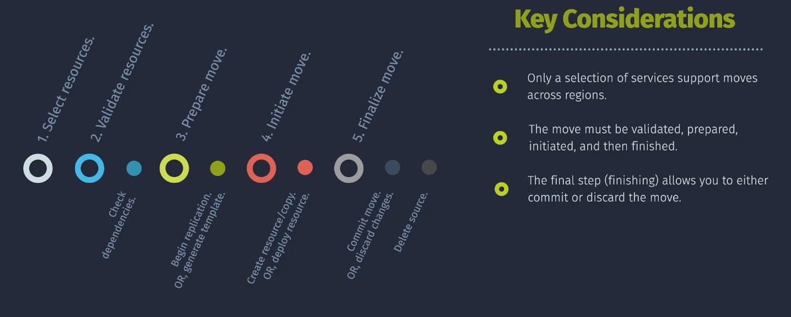

# Moving Azure Resources




Azure provides the flexibility to organize and manage your resources effectively. As your infrastructure grows and evolves, you may need to move resources to different resource groups, subscriptions, or even regions. Moving resources helps in:

- **Optimizing Costs:** Consolidate resources to manage and reduce costs.
- **Enhancing Security:** Segregate resources based on security requirements.
- **Improving Management:** Organize resources for better visibility and management.
- **Compliance:** Align resource placement with regulatory requirements.

Understanding the various methods to move Azure resources and their respective advantages is essential for maintaining a robust and efficient cloud environment.

## Why Move Azure Resources?

There are several reasons why you might need to move Azure resources:

1. **Resource Group Reorganization:** To better manage resources by grouping related services together.
2. **Subscription Consolidation:** To consolidate resources under a single subscription for billing or management purposes.
3. **Cost Management:** To leverage different pricing models or reservations available in specific subscriptions.
4. **Compliance and Governance:** To ensure resources reside in appropriate regions or subscriptions that meet regulatory standards.
5. **Migration to Different Regions:** To move resources closer to end-users for reduced latency or to disaster recovery sites.
6. **Lifecycle Management:** To segregate resources based on their lifecycle stages, such as development, testing, and production.

## Prerequisites and Limitations

Before moving Azure resources, it's crucial to understand the prerequisites and limitations to ensure a smooth transition.

### Prerequisites

1. **Permissions:**

   - **Source and Destination:** You must have appropriate permissions in both the source and destination resource groups or subscriptions.
   - **Role Assignments:** Typically, roles like `Owner` or `Contributor` are required.

2. **Resource Support:**

   - Not all Azure resources can be moved. Check the [Azure documentation](https://docs.microsoft.com/azure/azure-resource-manager/management/move-support-resources) for supported resources.

3. **Dependencies:**

   - Ensure that all dependent resources are moved together to maintain functionality.

4. **Region Compatibility:**
   - Some resources may have limitations when moving between regions.

### Limitations

1. **Unsupported Resources:**

   - Certain resources, such as Azure AD resources, cannot be moved using standard methods.

2. **Service-Specific Constraints:**

   - Some services have specific requirements or constraints when moving resources.

3. **Locked Resources:**

   - Resources with resource locks (`ReadOnly` or `Delete`) must have the locks removed before moving.

4. **Availability Zones:**

   - Resources with Availability Zones may have limitations when moving across regions.

5. **Downtime:**
   - Some resources may experience downtime during the move process.

## Use Cases

Understanding real-world scenarios where moving Azure resources is beneficial can provide context and guidance.

### 1. **Cost Optimization**

- **Scenario:** Consolidate resources from multiple subscriptions into a single subscription to leverage volume discounts.
- **Solution:** Use Azure Portal or PowerShell to move resources to the target subscription.

### 2. **Security and Compliance**

- **Scenario:** Segregate sensitive data into a dedicated resource group with stricter access controls.
- **Solution:** Move resources to a new resource group designed for sensitive information.

### 3. **Organizational Restructuring**

- **Scenario:** Align resources with new organizational units or departments.
- **Solution:** Reorganize resource groups or subscriptions to match the new structure.

### 4. **Disaster Recovery**

- **Scenario:** Replicate resources to a different region for disaster recovery purposes.
- **Solution:** Use Azure Resource Mover or ARM Templates/Bicep to deploy resources in the secondary region.

### 5. **Project Lifecycle Management**

- **Scenario:** Move resources from a development resource group to a production resource group as the project matures.
- **Solution:** Utilize Azure CLI or PowerShell to transition resources seamlessly.

## Methods to Move Azure Resources

Azure provides multiple methods to move resources, each with its own advantages and use cases. The primary methods include:

1. **Using Azure Portal**
2. **Using Azure PowerShell**
3. **Using Azure CLI**
4. **Using Azure Resource Mover**
5. **Using ARM Templates/Bicep**

Each method offers different levels of automation, flexibility, and control.

### 1. Using Azure Portal

The Azure Portal provides a user-friendly interface to move resources between resource groups or subscriptions. It's suitable for ad-hoc moves and smaller deployments.

### 2. Using Azure PowerShell

Azure PowerShell offers scripting capabilities to automate the movement of resources. It's ideal for batch operations and integration into PowerShell-based automation workflows.

### 3. Using Azure CLI

Azure CLI provides command-line tools for moving resources, offering cross-platform support and ease of integration into shell scripts and CI/CD pipelines.

### 4. Using Azure Resource Mover

Azure Resource Mover is a dedicated service for moving resources across regions. It provides a streamlined process with advanced capabilities for regional migrations.

### 5. Using ARM Templates/Bicep

ARM Templates and Bicep files allow you to define infrastructure as code, facilitating the recreation and deployment of resources in different groups or subscriptions.

## Step-by-Step Guides

This section provides detailed step-by-step procedures for moving Azure resources using the various methods outlined above.

### Moving Resources with Azure Portal

**Step 1: Navigate to the Azure Portal:**

- Go to [Azure Portal](https://portal.azure.com/) and sign in with your credentials.

**Step 2: Select the Resource Group:**

- In the left-hand menu, click on **Resource groups**.
- Select the resource group containing the resources you want to move.

**Step 3: Select Resources to Move:**

- In the resource group overview, click on **Move** at the top menu.
- Choose **Move to another resource group** or **Move to another subscription** based on your requirement.

**Step 4: Select Target Resource Group or Subscription:**

- If moving to another resource group:
  - Select the target resource group from the dropdown.
- If moving to another subscription:
  - Select the target subscription and optionally the target resource group.

**Step 5: Review and Validate:**

- Click **Review + move**.
- Review the list of resources to be moved and any dependencies.
- Click **Move** to initiate the process.

**Step 6: Monitor the Move:**

- Monitor the move operation under **Notifications** in the Azure Portal.
- Ensure that the move completes successfully.

**Note:** Some resources may have dependencies that require moving together. The portal will prompt you if there are any such dependencies.

### Moving Resources with Azure PowerShell

Azure PowerShell provides cmdlets to automate the movement of resources. Below is an example of moving a resource to a different resource group.

**Prerequisites:**

- Install the latest [Azure PowerShell](https://docs.microsoft.com/powershell/azure/install-az-ps).
- Authenticate using `Connect-AzAccount`.

**Step 1: Identify Resources to Move:**

List the resources you want to move. For example, to list all resources in a resource group:

```powershell
$sourceResourceGroup = "SourceRG"
$resources = Get-AzResource -ResourceGroupName $sourceResourceGroup
```

**Step 2: Validate Resources Can Be Moved:**

Ensure that the resources are supported for movement and have no locks.

```powershell
# Check for resource locks
$lockedResources = $resources | Where-Object { $_.Properties -and $_.Properties.locks }
if ($lockedResources) {
    Write-Host "Removing locks from resources..."
    foreach ($resource in $lockedResources) {
        Remove-AzResourceLock -LockId $resource.Properties.locks[0].id
    }
}
```

**Step 3: Move Resources:**

Use the `Move-AzResource` cmdlet to move resources to the target resource group or subscription.

**Example: Move to Another Resource Group:**

```powershell
$targetResourceGroup = "TargetRG"
$resourceIds = $resources.Id

Move-AzResource -DestinationResourceGroupName $targetResourceGroup -ResourceId $resourceIds
```

**Example: Move to Another Subscription:**

```powershell
$targetSubscriptionId = "xxxxxxxx-xxxx-xxxx-xxxx-xxxxxxxxxxxx"
$resourceIds = $resources.Id

Move-AzResource -DestinationSubscriptionId $targetSubscriptionId -ResourceId $resourceIds
```

**Step 4: Verify the Move:**

Confirm that the resources have been moved successfully.

```powershell
# Check the target resource group
Get-AzResource -ResourceGroupName $targetResourceGroup
```

### Moving Resources with Azure CLI

Azure CLI offers command-line capabilities to move resources. Below is an example of moving resources to a different subscription.

**Prerequisites:**

- Install the latest [Azure CLI](https://docs.microsoft.com/cli/azure/install-azure-cli).
- Authenticate using `az login`.

**Step 1: Identify Resources to Move:**

List the resources you want to move. For example, to list all resources in a resource group:

```bash
sourceResourceGroup="SourceRG"
resources=$(az resource list --resource-group $sourceResourceGroup --query "[].id" -o tsv)
```

**Step 2: Validate Resources Can Be Moved:**

Ensure that the resources are supported for movement and have no locks.

**Note:** Azure CLI does not provide direct commands to remove resource locks. You may need to use Azure Portal or PowerShell for that.

**Step 3: Move Resources:**

Use the `az resource move` command to move resources to the target resource group or subscription.

**Example: Move to Another Resource Group:**

```bash
targetResourceGroup="TargetRG"
az resource move --destination-group $targetResourceGroup --destination-subscription-id $(az account show --query id -o tsv) --ids $resources
```

**Example: Move to Another Subscription:**

```bash
targetSubscriptionId="xxxxxxxx-xxxx-xxxx-xxxx-xxxxxxxxxxxx"
az resource move --destination-subscription-id $targetSubscriptionId --destination-group $targetResourceGroup --ids $resources
```

**Step 4: Verify the Move:**

Confirm that the resources have been moved successfully.

```bash
az resource list --resource-group $targetResourceGroup
```

### Moving Resources with Azure Resource Mover

**Azure Resource Mover** is a dedicated service designed to simplify the process of moving resources across regions. It provides a centralized workflow with advanced capabilities for regional migrations.

**Prerequisites:**

- Ensure that the resources you intend to move are supported by Azure Resource Mover.
- Verify network connectivity and any service-specific prerequisites.

**Step 1: Create a Move Collection:**

A **Move Collection** groups related resources that you intend to move together.

```bash
az resource-mover collection create \
  --name MyMoveCollection \
  --source-region eastus \
  --destination-region westus \
  --resource-group MyResourceGroup
```

**Step 2: Add Resources to the Move Collection:**

Identify and add the resources you want to move.

```bash
az resource-mover move-resource create \
  --collection-name MyMoveCollection \
  --resource-group MyResourceGroup \
  --resource-id /subscriptions/{subscription-id}/resourceGroups/MyResourceGroup/providers/Microsoft.Compute/virtualMachines/MyVM
```

**Step 3: Validate the Move:**

Azure Resource Mover will validate the resources to ensure they can be moved without issues.

```bash
az resource-mover validate --collection-name MyMoveCollection
```

**Step 4: Initiate the Move:**

Start the move process after successful validation.

```bash
az resource-mover initiate-move --collection-name MyMoveCollection
```

**Step 5: Complete the Move:**

After the resources have been moved, complete the move to finalize the transition.

```bash
az resource-mover complete-move --collection-name MyMoveCollection
```

**Step 6: Verify the Move:**

Ensure that the resources are available in the destination region.

```bash
az resource list --resource-group TargetResourceGroup --location westus
```

**Note:** Azure Resource Mover supports moving multiple resources and handles dependencies automatically, making it ideal for complex migrations.

---

### Moving Resources with ARM Templates/Bicep

Using **ARM Templates** or **Bicep** files allows you to define your infrastructure as code, facilitating the recreation and deployment of resources in different resource groups, subscriptions, or regions.

#### Benefits

- **Automation:** Streamline deployments through scripts and pipelines.
- **Consistency:** Ensure environments are identical across deployments.
- **Version Control:** Track changes and collaborate effectively using version control systems like Git.

#### Example: Moving Resources Using Bicep Modules

**Step 1: Export Current Resources as Bicep Files:**

Use Azure CLI or PowerShell to export existing resources as Bicep files.

```bash
az group export --resource-group SourceRG --output bicep > sourceRG.bicep
```

**Step 2: Modify the Bicep File for the New Location:**

Adjust parameters such as resource group name, location, and any dependencies.

**Example: main.bicep:**

```bicep
targetScope = 'resourceGroup'

param storageAccountName string
param location string = 'westus'

resource storageAccount 'Microsoft.Storage/storageAccounts@2021-04-01' = {
  name: storageAccountName
  location: location
  sku: {
    name: 'Standard_LRS'
  }
  kind: 'StorageV2'
  properties: {}
}

output storageAccountId string = storageAccount.id
```

**Step 3: Deploy the Modified Bicep File to the Target Resource Group:**

Use Azure CLI or PowerShell to deploy the Bicep file to the new resource group.

**Using Azure CLI:**

```bash
az group create --name TargetRG --location westus

az deployment group create \
  --resource-group TargetRG \
  --template-file main.bicep \
  --parameters storageAccountName=mystorageacct
```

**Using PowerShell:**

```powershell
New-AzResourceGroup -Name TargetRG -Location westus

New-AzResourceGroupDeployment `
  -ResourceGroupName "TargetRG" `
  -TemplateFile "main.bicep" `
  -storageAccountName "mystorageacct"
```

**Step 4: Verify the Deployment:**

Ensure that the resources have been deployed successfully in the target resource group.

```bash
az resource list --resource-group TargetRG
```

**Note:** This method involves redeploying resources rather than moving them. It is suitable when moving across regions or when a clean redeployment is preferred.

## Best Practices

Adhering to best practices ensures that moving Azure resources is efficient, secure, and minimizes downtime.

1. **Plan Thoroughly:**

   - Assess dependencies between resources.
   - Understand the impact on applications and services.

2. **Backup Resources:**

   - Take backups or snapshots of critical resources before initiating a move.

3. **Use Automation:**

   - Leverage PowerShell, Azure CLI, or ARM Templates/Bicep for consistent and repeatable moves.

4. **Validate Before Moving:**

   - Use validation tools to ensure resources can be moved without issues.

5. **Monitor the Move:**

   - Keep track of the move process through Azure Portal notifications or command-line feedback.

6. **Communicate Downtime:**

   - Inform stakeholders about potential downtime or service interruptions.

7. **Secure Sensitive Data:**

   - Ensure that sensitive information is handled securely during the move.

8. **Test in Non-Production Environments:**

   - Perform test moves in staging environments to identify and resolve potential issues.

9. **Review and Update Documentation:**

   - Update infrastructure documentation to reflect the new resource locations.

10. **Leverage Azure Resource Mover for Regional Moves:**
    - Use Azure Resource Mover for moving resources across regions to benefit from its specialized features.

## Common Pitfalls

Avoiding common mistakes can save time and prevent disruptions during the resource movement process.

1. **Unsupported Resource Types:**

   - Attempting to move unsupported resources can cause failures. Always check Azure's [supported resources](https://docs.microsoft.com/azure/azure-resource-manager/management/move-support-resources).

2. **Ignoring Dependencies:**

   - Not moving dependent resources together can break applications. Ensure all dependencies are identified and moved.

3. **Resource Locks:**

   - Locked resources cannot be moved. Remove locks before initiating the move.

4. **Permissions Issues:**

   - Insufficient permissions can halt the move process. Verify that you have the necessary roles in both source and destination.

5. **Region Limitations:**

   - Some regions have specific constraints or lack support for certain resource types.

6. **Overlooking Quotas:**

   - Ensure that the destination subscription or resource group has sufficient quotas for the resources being moved.

7. **Downtime Underestimation:**

   - Underestimating the potential downtime can disrupt services. Plan accordingly.

8. **Incomplete Validation:**

   - Skipping validation steps can lead to unexpected issues during the move.

9. **Failing to Update References:**

   - Post-move, some resource references may need updating to reflect their new locations.

10. **Not Testing the Move:**
    - Moving without testing in a controlled environment can introduce unforeseen problems.

## Summary

Moving Azure resources is a fundamental aspect of managing and optimizing your cloud infrastructure. Whether reorganizing for better management, optimizing costs, enhancing security, or complying with regulatory standards, Azure provides multiple methods to facilitate resource movement. By understanding the various tools and best practices, you can ensure that moving resources is conducted efficiently, securely, and with minimal disruption to your services.

- **Deployment Modes:** Choose between **Complete** and **Incremental** deployments based on your operational needs.
- **Deployment Scopes:** Define the appropriate scope (Resource Group, Subscription, Management Group, Tenant) for your deployments.
- **Modular Templates:** Utilize **Nested Templates**, **Linked Templates**, and **Bicep Modules** to organize and reuse deployment components.
- **Best Practices:** Plan thoroughly, validate moves, use automation, and follow security best practices to ensure successful resource movement.
- **Avoid Pitfalls:** Be aware of common mistakes such as unsupported resources, dependency issues, and permission constraints to prevent deployment failures.
