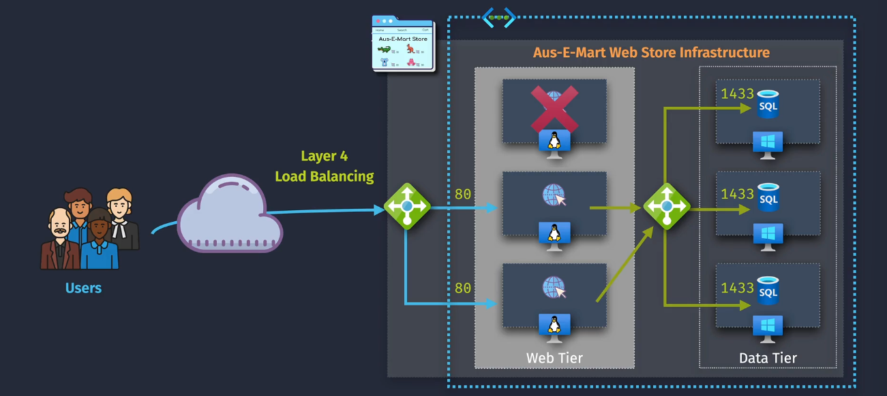
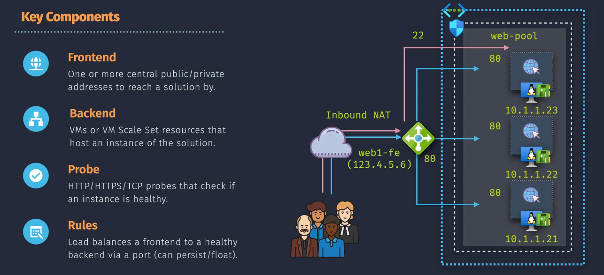
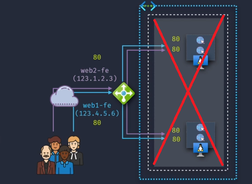
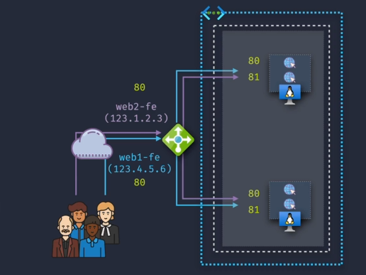
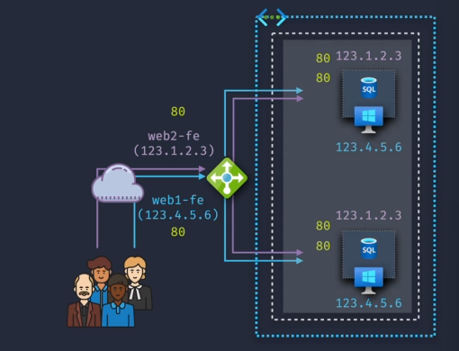
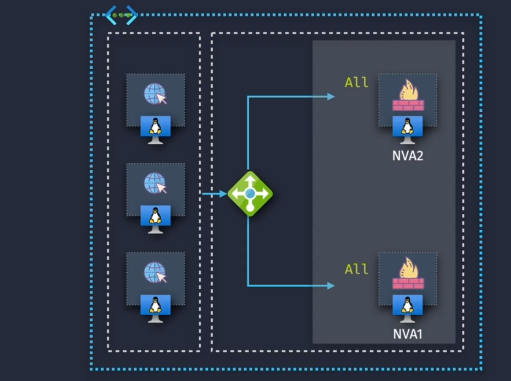

# Azure Load Balancer

Azure Load Balancer is a highly available and scalable Layer 4 (Transport Layer) load-balancing service that distributes incoming network traffic across multiple virtual machines (VMs) or instances. It ensures high availability and reliability by preventing any single resource from becoming a bottleneck.

## Key Features

**Azure Load Balancer** is designed to handle large volumes of traffic with low latency. It operates at the Transport Layer (Layer 4) and supports both inbound and outbound scenarios, providing features like:

- **High Availability:** Ensures your applications remain accessible by distributing traffic across multiple instances.
- **Scalability:** Automatically scales to handle varying traffic loads without manual intervention.
- **Health Monitoring:** Continuously checks the health of your resources to route traffic only to healthy instances.
- **Flexible Configuration:** Supports both public and internal load balancing for different networking needs.

## Load Balancer Types

Azure Load Balancer comes in two primary types, each serving distinct networking requirements:

### 1. **Public Load Balancer**

- **Purpose:** Distributes incoming internet traffic to VMs within a virtual network.
- **Use Case:** Ideal for balancing traffic to public-facing applications like web servers or APIs.
- **Features:**
  - Frontend IP is accessible from the internet.
  - Supports both TCP and UDP protocols.

### 2. **Internal Load Balancer (ILB)**

- **Purpose:** Distributes traffic within a virtual network or between connected networks.
- **Use Case:** Suitable for internal applications such as databases, backend services, or multi-tier applications.
- **Features:**
  - Frontend IP is accessible only within the virtual network or connected networks.
  - Enhances security by keeping traffic internal.

## Key Components

Understanding the core components of Azure Load Balancer is essential for effective configuration and management:

### 1. **Frontend IP Configuration**

- **Description:** Represents the IP address that clients use to connect to the load balancer.
- **Types:**
  - **Public IP:** For public load balancers accessible from the internet.
  - **Private IP:** For internal load balancers accessible within a virtual network.

### 2. **Backend Pool**

- **Description:** A collection of VMs or instances that receive traffic from the load balancer.
- **Configuration:** You can include individual VMs, VM scale sets, or availability sets.

### 3. **Load Balancing Rules**

- **Description:** Define how traffic is distributed from the frontend to the backend pool.
- **Parameters:**
  - **Protocol:** TCP or UDP.
  - **Port:** Specific port numbers or ranges.
  - **Session Persistence:** Determines if connections should stick to the same backend instance.

### 4. **Health Probes**

- **Description:** Continuously monitor the health of backend instances.
- **Function:** Ensures traffic is only sent to healthy and responsive instances.
- **Types:**
  - **TCP Probe:** Checks if a specific TCP port is open.
  - **HTTP Probe:** Sends an HTTP request to a specific URL and checks for a successful response.

### 5. **Inbound NAT rules**

**Inbound NAT (Network Address Translation) rules** in Azure Load Balancer are used to forward traffic from a specific port of a public IP address (or a private IP in the case of an internal load balancer) to a specific port of a virtual machine in the backend pool. This is useful for scenarios where you need direct access to a specific VM for services like SSH or RDP.

#### **Example Use Case:**

Suppose you have three VMs in the backend pool, and you want to allow remote desktop access (RDP) to each VM via different ports on the same public IP address.

1. **Frontend IP Configuration**:
   - **Public IP Address**: `20.50.30.10`
2. **Backend Pool**:
   - **VM1**: `10.0.0.4`
   - **VM2**: `10.0.0.5`
   - **VM3**: `10.0.0.6`
3. **Inbound NAT Rules**:
   - **Rule 1**: Forward port `50001` on the public IP `20.50.30.10` to port `3389` on `VM1` (`10.0.0.4`)
   - **Rule 2**: Forward port `50002` on the public IP `20.50.30.10` to port `3389` on `VM2` (`10.0.0.5`)
   - **Rule 3**: Forward port `50003` on the public IP `20.50.30.10` to port `3389` on `VM3` (`10.0.0.6`)

## SKU Types

Azure Load Balancer offers two SKU types, each with different features and capabilities:

### 1. **Basic SKU**

- **Cost:** Lower cost option suitable for small-scale or non-critical applications.
- **Features:**

  - Limited to 100 frontend IP configurations.
  - No Support for AZs.
  - Support Only HTTP/TCP health Probes.
  - Traffic opened by default (requires NSG for security)
  - Doesn't support HA Ports.
  - NO SLA.

- **Use Case:** Ideal for development, testing, or small production environments with minimal traffic.

### 2. **Standard SKU**

- **Cost:** Higher cost but offers enhanced features and performance.
- **Features:**

  - Supports up to 1,000 frontend IP configurations.
  - Supports AZs.
  - Support HTTP/HTTPS/TCP health Probes.
  - Traffic blocked by default.
  - Supports HA Ports.
  - 99.99% SLA

- **Use Case:** Suitable for large-scale, high-traffic, and mission-critical applications requiring robust performance and availability.

## Important Considerations

When configuring Azure Load Balancer, it's crucial to be aware of certain options and settings to optimize performance and security.

### 1. **Sticky Sessions (Persistence)**

- **What It Is:** Ensures that a client consistently connects to the same backend instance for the duration of a session.
- **How It Works:**
  - **Enabled:** Uses cookies or source IP affinity to maintain session persistence.
  - **Disabled:** Distributes requests to backend instances without maintaining session consistency.
- **Use Case:** Useful for applications that store session state locally on the backend instances, such as certain web applications.

### 2. **Matching SKUs**

- **What It Is:** Ensures that the SKU of the public IP address matches the SKU of the load balancer.
- **Why It Matters:**
  - **Consistency:** Prevents configuration mismatches that can lead to connectivity issues.
  - **Compatibility:** Certain features are only available when SKUs align correctly.
- **Recommendation:** Always verify that the public IP SKU (Basic or Standard) matches the load balancer SKU to ensure seamless operation.

### 3. **Floating IPs**

- **What It Is:** Allows the load balancer to direct traffic to multiple backend instances on the same port using the same frontend IP.
- **How It Works:**
  - **Enabled:** Supports direct server return (DSR), allowing backend instances to respond directly to clients.
  - **Disabled:** All responses go through the load balancer, which can add slight latency.
- **Use Case:** Essential for scenarios requiring high availability and failover, such as active-active configurations.

### 4. **HA Ports (High Availability Ports)**

- **What It Is:** Allows the load balancer to handle all protocols on all ports simultaneously.
- **How It Works:**
  - **Enabled:** Supports multiple protocols (TCP, UDP) across all ports, ensuring comprehensive load balancing coverage.
  - **Disabled:** Restricts load balancing to specific protocols and ports as defined by rules.
- **Use Case:** Necessary for applications that require simultaneous handling of diverse protocols and a wide range of ports, ensuring all traffic is appropriately balanced.

## Summary

**Azure Load Balancer** is a powerful and flexible service that ensures your applications remain highly available, scalable, and reliable by efficiently distributing network traffic across multiple resources. Understanding its types, key components, use cases, SKU options, and important configuration considerations is essential for optimizing your Azure infrastructure.

- **Types:** Choose between **Public Load Balancer** for internet-facing applications and **Internal Load Balancer** for internal traffic distribution.
- **Key Components:** Frontend IPs, backend pools, load balancing rules, health probes, and inbound/outbound rules form the backbone of effective load balancing.
- **Use Cases:** Ideal for web applications, gaming services, database clusters, multi-tier architectures, and hybrid deployments.
- **SKU Types:** Select **Basic** for cost-effective, small-scale deployments or **Standard** for enhanced features and large-scale applications.
- **Important Considerations:** Configure sticky sessions, ensure SKU matching, utilize floating IPs, and enable HA ports to meet your specific networking needs.
