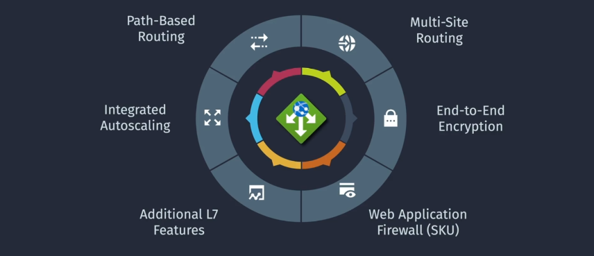

# Azure Application Gateway

**Azure Application Gateway** is a web traffic load balancer that enables you to manage traffic to your web applications. Unlike traditional load balancers that operate at the network layer (Layer 4), Application Gateway operates at the application layer (Layer 7), allowing it to make routing decisions based on HTTP request attributes such as URL path or host headers.

**Key Features:**

- **Layer 7 Load Balancing:** Advanced routing based on application-level information.
- **SSL Termination:** Offload SSL decryption to reduce the load on backend servers.
- **Web Application Firewall (WAF):** Protects against common web vulnerabilities like SQL injection and cross-site scripting (XSS).
- **URL-Based Routing:** Direct traffic to different backend pools based on URL paths.
- **Autoscaling:** Automatically adjusts capacity based on traffic demands.
- **Session Affinity:** Ensures user sessions are consistently routed to the same backend instance.

## Application Gateway Tiers Types

Azure Application Gateway offers different deployment modes and configurations to cater to various application needs:

### 1. **Standard Application Gateway**

- **Purpose:** Provides essential load balancing features suitable for most web applications.
- **Features:**

  - Basic routing capabilities.
  - SSL termination.
  - Session affinity.

### 2. **Web Application Firewall (WAF) Application Gateway**

- **Purpose:** Offers enhanced security features by integrating a Web Application Firewall.
- **Features:**

  - Protection against common web vulnerabilities.
  - Customizable WAF rules.
  - Logging and monitoring of security events.

### 3. **Standard_v2 and WAF_v2 SKUs**

- **Purpose:** Advanced versions of the Standard and WAF Application Gateways with improved performance and scalability.
- **Features:**

  - Autoscaling based on traffic load.
  - Zone redundancy for higher availability.
  - Enhanced performance and reduced latency.

## Key Components

Understanding the core components of Azure Application Gateway is essential for effective configuration and management:

### 1. **Frontend IP Configuration**

- **Description:** Represents the IP address that clients use to connect to the Application Gateway.
- **Types:**
  - **Public IP:** Accessible from the internet.
  - **Private IP:** Accessible only within a virtual network.

### 2. **Backend Pool**

- **Description:** A collection of backend servers (e.g., virtual machines, VM scale sets, App Services) that receive traffic from the Application Gateway.
- **Configuration:** You can group backend resources based on application tiers or other logical separations.

### 3. **Listeners**

- **Description:** Define how the Application Gateway listens for incoming traffic.
- **Types:**

  - **HTTP Listener:** For unsecured traffic.
  - **HTTPS Listener:** For secured traffic with SSL certificates.

### 4. **Routing Rules**

- **Description:** Determine how incoming traffic is directed to backend pools based on specified criteria.
- **Types:**

  - **Basic Rules:** Simple path-based routing.
  - **Path-Based Rules:** Direct traffic based on URL paths.
  - **Multi-Site Routing:** Host-based routing for multiple domains.

### 5. **HTTP Settings**

- **Description:** Define how the Application Gateway communicates with backend servers.
- **Parameters:**

  - **Protocol:** HTTP or HTTPS.
  - **Port:** Backend port.
  - **Cookie-Based Affinity:** Enables session persistence.
  - **Connection Draining:** Ensures graceful removal of backend instances.

### 6. **Web Application Firewall (WAF) Policies**

- **Description:** Configurable policies that define how the WAF protects your applications.
- **Features:**
  - Custom rule sets.
  - OWASP Core Rule Sets.
  - Exclusions and overrides.

### 7. **Health Probes**

- **Description:** Continuously monitor the health of backend servers to ensure traffic is only sent to healthy instances.
- **Types:**
  - **HTTP Probe:** Checks a specific URL path.
  - **TCP Probe:** Checks if a specific TCP port is open.

## Important Considerations

When configuring Azure Application Gateway, it's crucial to be aware of certain options and settings to optimize performance, security, and cost-efficiency.

### 1. **SSL Termination**

- **What It Is:** The process of decrypting SSL/TLS traffic at the Application Gateway, relieving backend servers from the overhead of encryption.
- **Benefits:**
  - Reduces CPU usage on backend servers.
  - Simplifies certificate management by centralizing it at the gateway.
- **Configuration:**
  - Upload SSL certificates to the Application Gateway.
  - Associate certificates with HTTPS listeners.
- **Considerations:**
  - Ensure secure storage and management of SSL certificates.
  - Use strong encryption standards to maintain security.

### 2. **Web Application Firewall (WAF)**

- **What It Is:** An integrated security feature that protects web applications from common threats and vulnerabilities.
- **Benefits:**
  - Protects against SQL injection, XSS, and other OWASP top 10 threats.
  - Provides customizable rule sets for tailored security.
  - Logs and monitors security events for auditing and compliance.
- **Configuration:**
  - Enable WAF during Application Gateway setup or later via settings.
  - Select appropriate rule sets and configure custom rules as needed.
- **Considerations:**
  - Regularly update rule sets to protect against emerging threats.
  - Monitor WAF logs to identify and respond to security incidents.

### 3. **Routing Rules**

- **What It Is:** Defines how incoming traffic is directed to backend pools based on specific criteria.
- **Types:**
  - **Basic Rules:** Simple one-to-one mapping of listeners to backend pools.
  - **Path-Based Rules:** Direct traffic to different backend pools based on URL paths (e.g., `/api` goes to API servers, `/images` goes to storage servers).
  - **Multi-Site Routing:** Route traffic based on host headers, allowing multiple domains to be handled by a single Application Gateway.
- **Benefits:**
  - Enhances application performance by directing traffic efficiently.
  - Simplifies management of multi-tier or multi-service applications.
- **Considerations:**
  - Plan routing rules carefully to avoid conflicts and ensure optimal traffic distribution.
  - Regularly review and update routing rules as application requirements evolve.

### 4. **Autoscaling**

- **What It Is:** Automatically adjusts the number of Application Gateway instances based on traffic load to maintain performance and cost-efficiency.
- **Benefits:**
  - Ensures the Application Gateway can handle peak traffic without manual intervention.
  - Optimizes costs by scaling down during low traffic periods.
- **Configuration:**
  - Enable autoscaling in the Application Gateway settings.
  - Define minimum and maximum instance counts based on expected traffic patterns.
- **Considerations:**
  - Monitor autoscaling actions to ensure they align with traffic demands.
  - Set appropriate scaling thresholds to prevent over-scaling or under-scaling.

## Summary

**Azure Application Gateway** is a powerful and versatile web traffic load balancer that enhances the availability, scalability, and security of your web applications. By operating at the application layer, it offers advanced routing capabilities, SSL termination, and integrated security features like Web Application Firewall (WAF), making it an ideal choice for modern, secure web deployments.

- **Overview:** Provides Layer 7 load balancing with advanced routing, SSL termination, and WAF.
- **Types:** Standard, WAF, Standard_v2, and WAF_v2 SKUs cater to different needs.
- **Key Components:** Frontend IPs, backend pools, listeners, routing rules, HTTP settings, WAF policies, and health probes form the foundation of Application Gateway.
- **Use Cases:** Ideal for web applications, microservices, secure deployments, SSL offloading, multi-tier architectures, and hybrid environments.
- **SKU Types:** Choose between Standard and WAF SKUs, with the v2 variants offering enhanced features and scalability.
- **Important Considerations:** Configure SSL termination, enable and manage WAF, design effective routing rules, and leverage autoscaling for optimal performance and cost-efficiency.
