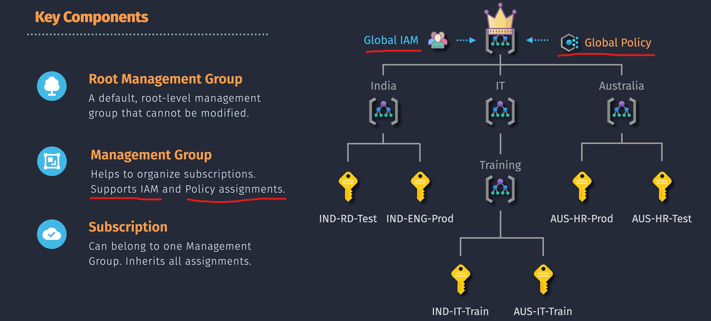

# **Azure Management Groups**

Azure Management Groups provide a way to manage and govern multiple Azure subscriptions under a single hierarchy. They help streamline governance by allowing you to apply policies, access controls, and compliance standards across multiple subscriptions.

## Practical Example

Imagine you have multiple subscriptions for different departments in your organization. Create a management group for each department and apply policies that restrict VM creation to specific regions or enforce specific security standards. This ensures that all resources within each department adhere to the same governance rules.

## Key Features

1. **Hierarchical Structure**:

   - Supports a tree-like hierarchy with one parent (Management Group or Subscription) and up to six levels of depth.
   - Allows you to organize subscriptions into a structured format.

2. **Policy and Access Management**:

   - Apply policies and access controls at the management group level, cascading down to all subscriptions and resources within the group.

3. **Single Directory Support**:

   - A single directory can support up to 10,000 management groups.

4. **Centralized Management**:
   - Provides a centralized way to manage and enforce governance across multiple subscriptions.

## Important Considerations

1. **Subscription Trust**:

   - All subscriptions within a management group must trust the same tenant.

2. **Admin Permissions**:

   - Global Administrators must elevate their permissions first and can then assign roles within the management group.

3. **Structure Design**:

   - Keep the management group hierarchy reasonably flat, ideally with no more than three to four levels to reduce complexity.

4. **Organizational Mapping**:

   - Align the management group structure with your organization’s structure for better resource management based on business units, projects, or other organizational units.

5. **Policy Assignment**:

   - Use management groups for consistent policy enforcement rather than billing purposes.

6. **Access Control**:

   - Utilize Azure role-based access control (RBAC) to manage access to management groups effectively.

7. **Compliance and Security**:

   - Ensure all subscriptions within a management group comply with the same security and compliance standards to simplify governance.

8. **Cost Management**:
   - Management groups are not currently supported in cost management features for Microsoft Customer Agreement (MCA) subscriptions.
