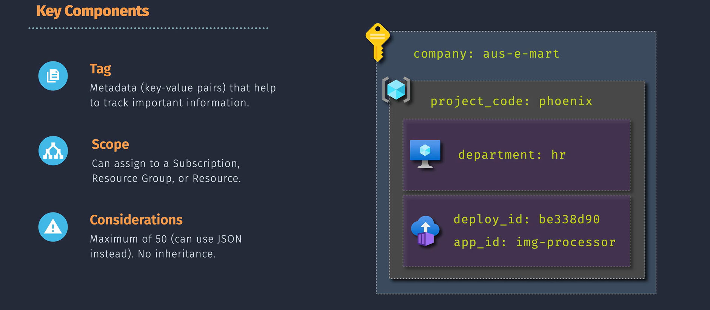

# Resource Tagging in Azure

Resource tagging in Azure involves adding metadata to your resources in the form of key-value pairs. These tags help you organize, manage, and track resources based on settings relevant to your organization.

## Practical Example

Imagine you want to track the deployment environment for your resources. You can add a tag with the key "Environment" and the value "Production" to resources deployed in the production environment. This way, you can easily filter and report on production resources.

## Important Considerations

1. **Tags are Not Inherited by Default**: When you apply tags to a resource group, the resources within that group do not automatically inherit those tags. Each resource needs to be tagged individually if necessary.
2. **Limit on Tags**: Each resource, resource group, and subscription can have a maximum of 50 tag name-value pairs.
3. **Tags for Management Groups**: You can apply tags to your Azure resources, resource groups, and subscriptions, but not to management groups.
4. **Using JSON for More Tags**: If you need to apply more tags than the maximum allowed number, use a JSON string for the tag value. The JSON string can contain many values that you apply to a single tag name.
5. **Resource Type Support**: Not all resource types support tags, so ensure the resources you're working with can be tagged.
6. **Azure Policy Enforcement**:
   - If you have an Azure policy that enforces a specific tag on all resources, the resource creation will fail if it is created without this tag.
   - Tags only affect new resources created or modified after the policy is applied.
7. **Case Sensitivity**: Tag names are case-insensitive, but tag values are case-sensitive. Ensure consistency to avoid issues with filtering and reporting.
8. **Sensitive Information**: Avoid adding sensitive information to tags, as they are stored as plain text and can be exposed through various methods.

## Recommendations (Best Practices)

1. **Define a Clear Tagging Strategy**: Establish a consistent tagging convention that aligns with your organization’s needs, including deciding on key-value pairs and their application.
2. **Automate Tagging**: Use automation tools and policies to enforce tagging rules and ensure compliance. This can include using Azure Policy to require specific tags on resource creation.
3. **Regular Review and Cleanup**: Periodically review and clean up tags to ensure they remain relevant and useful. Remove outdated or unused tags to maintain clarity.
4. **Consistency in Tagging**: Apply tags consistently across all resources to maintain accuracy in reporting and management.
5. **Usage Tracking**: Use tags to track resource usage and costs effectively. Tags can help identify which departments or projects are consuming resources.
