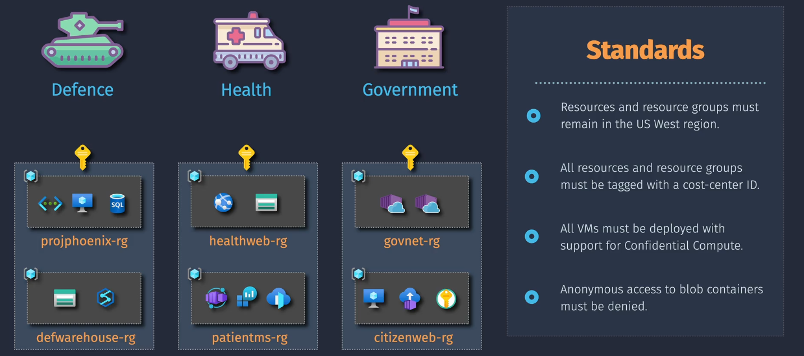
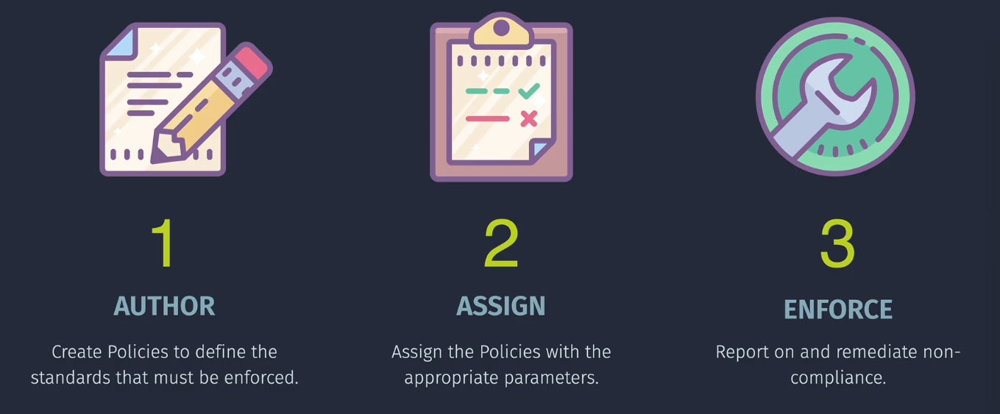

# Azure Policy


**Azure Policy** is like the set of rules your parents give you to keep your room tidy and safe. In the cloud, Azure Policy helps ensure that your Azure resources follow specific standards and guidelines. This way, your applications are secure, compliant, and running efficiently. Whether it's making sure all your virtual machines have certain settings or that your data is stored in specific regions, Azure Policy automates these checks and enforcements for you.

## Key Components

Azure Policy consists of several key components that work together to enforce and manage policies across your Azure environment:




### **1. Policy Definitions**

A **Policy Definition** is the core building block of Azure Policy. It specifies the rules and conditions that resources must meet. For example, a policy might enforce that all storage accounts must use HTTPS or disallow the creation of public IPs.

- **Structure**: A Policy Definition contains metadata, parameters, and logical conditions.
- **Types of Effects**: Policies define what happens when a rule is violated, such as:
  - **Deny**: Blocks resource creation or updates that don't comply.
  - **Audit**: Logs non-compliance but doesn’t block operations.
  - **Append**: Adds additional properties to a resource.
  - **Modify**: Updates resource properties to bring them into compliance.
- **Scope**: Defined at different levels (Subscription, Resource Group, or Management Group).

Example:


```json
{
  "properties": {
    "displayName": "Enforce tag on resource groups",
    "policyType": "BuiltIn",
    "mode": "Indexed",
    "description": "Enforces existence of a tag on resource groups.",
    "metadata": {
      "version": "1.0.0",
      "category": "Tags"
    },
    "parameters": {
      "tagName": {
        "type": "String",
        "metadata": {
          "displayName": "Tag Name",
          "description": "Name of the tag, such as costCenter"
        }
      }
    },
    "policyRule": {
      "if": {
        "field": "[concat('tags[', parameters('tagName'), ']')]",
        "exists": "false"
      },
      "then": {
        "effect": "deny"
      }
    }
  },
  "id": "/subscriptions/<subscription-id>/providers/Microsoft.Authorization/policyDefinitions/5ce4f70e-41e3-4e2c-8b37-9f1d1c2f2b5e",
  "type": "Microsoft.Authorization/policyDefinitions",
  "name": "5ce4f70e-41e3-4e2c-8b37-9f1d1c2f2b5e"
```

### **2. Policy Assignments**

A **Policy Assignment** binds a Policy Definition to a specific scope, such as a subscription, management group, or resource group. While Policy Definitions are generic, Assignments make them actionable within a targeted area.

- **Scope Customization**: You can narrow the focus of a Policy Assignment by using filters like resource types or locations.
- **Parameters**: Many Policy Definitions are parameterized, allowing flexibility during assignment (e.g., specifying allowed regions).
- **Inheritance**: Assignments inherit down the resource hierarchy, applying to all child resources unless explicitly excluded.

Example:

- Assign a policy that enforces virtual machines to use specific SKU types within a resource group.

### **3. Policy Exemptions**

A **Policy Exemption** allows you to exclude specific resources from policy enforcement temporarily or permanently. This helps when a resource has valid exceptions to organizational rules or during migration periods.

- **Granularity**: Exemptions can be applied at the individual resource level or for groups of resources.
- **Validity Period**: You can define time-bound exemptions for temporary use cases.
- **Rationale**: Always specify the justification for an exemption to maintain auditability.

Example Use Case:

- Exclude a legacy virtual machine from a "tagging policy" until it’s phased out.

## Key Definitions

### **Built-in Policies**

- **What It Does:** Offers a library of pre-built policies for common scenarios.
- **Why It's Important:** Saves time by providing ready-to-use policies that you can apply immediately without creating them from scratch.

### **Custom Policies**

- **What It Does:** Allows you to create your own policies tailored to your specific needs.
- **Why It's Important:** Provides flexibility to enforce unique organizational standards that aren't covered by built-in policies.

### **Initiatives (Policy Sets)**

- **What It Is:** A collection of policy definitions grouped together to achieve a common goal.
- **Function:** Simplifies the management and assignment of multiple related policies, ensuring comprehensive coverage of specific compliance areas.

### **Policy Enforcement**

- Imagine you have a set of rules at school, like “always wear your uniform” or “no running in the hallways.” Enforcing a policy means making sure everyone follows those rules. If someone doesn’t, the teacher might remind them or give them a consequence, like a time-out.

- In Azure, policy enforcement means making sure that all your resources follow certain rules or standards set by your organization. For example, you might have a policy that requires all data to be encrypted, and Azure Policy will check to make sure this is happening.

- If you disable policy enforcement, Azure will still evaluate your resources to see if they comply with the rules, but it won't take any action if they don't. This means you won't get any alerts or logs about non-compliant resources, and nothing will be automatically fixed or blocked. It's like having rules but not enforcing them.

### **Compliance Dashboard**

- **What It Is:** A visual interface that shows the compliance status of your Azure resources.
- **Function:** Provides insights into which resources are compliant or non-compliant, helping you monitor and improve your Azure environment's adherence to policies.

### **Remediation Tasks**

- **Purpose**: To bring non-compliant resources into compliance.
- **How**: By applying the necessary changes automatically. For example, if a policy requires all storage accounts to be encrypted, a remediation task will encrypt any non-compliant storage accounts.
- **Outcome**: Non-compliant resources are modified to meet the policy requirements.

### **Exemptions Tasks**

- **Purpose**: To temporarily exclude certain resources from policy evaluation.
- **How**: By creating an exemption, specific resources are not evaluated or enforced by the policy. This is useful when a resource needs to be out of compliance for a valid reason, like a planned deletion.
- **Outcome**: The exempted resources are not modified and do not count towards compliance metrics.

- Exemptions can be categorized into two types: **Waiver** and **Mitigated**. Here's a simple explanation:
  - **Waiver**: This means the policy is intentionally not applied to a resource or set of resources. It's like saying, "We know this resource doesn't follow the rule, but that's okay for now."
  - **Mitigated**: This means the conditions of the policy have been satisfied by other means. It's like saying, "We've found another way to meet the policy requirement, so this resource is considered compliant."

## Important Considerations

### Notes and Tips

- **Policy Inheritance:** Policies assigned at a higher scope (e.g., subscription) are inherited by all resources within that scope, ensuring consistent enforcement.
- **Exemptions:** You can exempt specific resources or resource groups from certain policies if necessary.
- **Audit vs. Enforce:** Use the **"Audit"** effect to monitor compliance without enforcing rules, which is useful for tracking and reporting before strict enforcement.
- **Compliance Reports:** Regularly review compliance reports to identify and address non-compliant resources proactively.
- **Versioning:** Keep your policy definitions updated to incorporate new best practices and organizational changes.

### Common Pitfalls

- **Overly Restrictive Policies:** Setting policies that are too strict can hinder productivity. Ensure policies balance security and operational needs.
- **Lack of Tagging Strategy:** Without a clear tagging strategy, enforcing and tracking policies can become challenging. Define and implement consistent tags across all resources.
- **Ignoring Compliance Reports:** Regularly ignoring compliance reports can lead to unmanaged risks and inefficiencies. Make it a habit to review and act on these reports.
- **Not Using Initiatives:** Managing multiple individual policies can be cumbersome. Use initiatives to group related policies for easier management and assignment.

## Recommendations and Best Practices

### 1. **Start with Built-in Policies**

- **Why:** Azure provides a library of pre-built policies that cover common compliance and security scenarios.
- **How:** Browse the **"Definitions"** section in Azure Policy and assign relevant built-in policies to your scopes.

### 2. **Define a Clear Tagging Strategy**

- **Why:** Tags help organize resources, making it easier to apply and monitor policies.
- **How:** Establish a consistent tagging convention (e.g., `Environment: Production`, `Department: IT`) and enforce it using Azure Policy.

### 3. **Use Initiatives for Grouped Policies**

- **Why:** Initiatives simplify the management of multiple related policies, ensuring comprehensive coverage.
- **How:** Create or use existing initiatives to group policies that address similar compliance areas, such as security or cost management.

### 4. **Regularly Review Compliance Status**

- **Why:** Continuous monitoring ensures that your Azure environment remains compliant with organizational standards.
- **How:** Utilize the **"Compliance"** dashboard in Azure Policy to track and address non-compliant resources.

### 5. **Automate Remediation Tasks**

- **Why:** Automating the fixing of non-compliant resources reduces manual effort and ensures timely compliance.
- **How:** Define **"DeployIfNotExists"** or **"Modify"** effects in your policy definitions to automate remediation actions.

### 6. **Integrate with Azure DevOps**

- **Why:** Ensures that policies are enforced during the development and deployment phases, preventing non-compliant resources from being created.
- **How:** Incorporate policy checks in your CI/CD pipelines using Azure Policy integrations.

### 7. **Educate Your Team**

- **Why:** Ensures that everyone understands the importance of compliance and how to adhere to policies.
- **How:** Provide training sessions and documentation on Azure Policy usage and best practices.

### 8. **Monitor Policy Assignments**

- **Why:** Ensures that policies are correctly assigned and functioning as intended.
- **How:** Regularly audit policy assignments and verify that they are applied to the correct scopes.

### 9. **Leverage Azure Advisor**

- **Why:** Azure Advisor provides personalized recommendations that can complement your policy enforcement.
- **How:** Review Azure Advisor's recommendations and implement suggestions to optimize your Azure environment.

### 10. **Keep Policies Updated**

- **Why:** Organizational requirements and Azure services evolve, necessitating updates to your policies.
- **How:** Periodically review and update your policy definitions to reflect current standards and best practices.

## Implementation Overview

Setting up Azure Policy is like creating a rulebook for your household to keep everything in order. You define the rules (policy definitions), apply them to specific areas (assignments), and continuously check if everything follows the rules (compliance tracking). Here's a simple way to understand how it works:

1. **Create Policy Definitions:** Define the rules that your Azure resources should follow.
2. **Assign Policies:** Apply these rules to specific scopes like subscriptions or resource groups.
3. **Monitor Compliance:** Use the compliance dashboard to see which resources meet the rules and which don't.
4. **Remediate Non-compliance:** Automatically fix resources that don't comply with the policies.
5. **Review and Update:** Regularly update your policies to adapt to new requirements or changes in your environment.

### Demo 1: Implementing a Policy to Enforce Tagging on Azure Resources

Let's walk through a simple demo to set up an Azure Policy that ensures all your Azure resources have specific tags. Tags help you organize and categorize your resources, making management easier.

#### Step 1: Create a Policy Definition

1. **Log in to Azure Portal:**

   - Go to [Azure Portal](https://portal.azure.com/) and sign in with your Azure account.

2. **Navigate to Azure Policy:**

   - In the left-hand menu, click on **"All services"**.
   - Search for **"Policy"** and select it.

3. **Create a New Policy Definition:**

   - Click on **"Definitions"** in the Policy dashboard.
   - Click **" + Policy definition"**.

4. **Configure the Policy Definition:**

   - **Name:** `Require Resource Tagging`
   - **Description:** `Ensures that all resources have specific tags for organization.`
   - **Category:** `Tags`
   - **Policy Rule:**

     ```json
     {
       "if": {
         "not": {
           "field": "tags",
           "exists": "true"
         }
       },
       "then": {
         "effect": "deny"
       }
     }
     ```

   - **Parameters:** (Optional) Define specific tags if needed.
   - Click **"Save"** to create the policy.

#### Step 2: Assign the Policy

1. **Assign the Policy to a Scope:**

   - In the Azure Policy dashboard, click on **"Assignments"**.
   - Click **" + Assign policy"**.

2. **Configure the Policy Assignment:**
   - **Scope:** Select the subscription or resource group you want to apply the policy to.
   - **Policy Definition:** Search for and select `Require Resource Tagging`.
   - **Assignment Name:** `Enforce Resource Tagging`
   - **Parameters:** (Optional) Specify required tags.
   - Click **"Review + create"** and then **"Create"**.

#### Step 3: Test the Policy

1. **Create a New Resource:**

   - Attempt to create a new resource (e.g., Virtual Machine) without the required tags.

2. **Observe the Policy Enforcement:**

   - Azure will deny the creation of the resource, displaying a message that tags are required.

3. **Create a Resource with Tags:**
   - Now, create the same resource but include the required tags.
   - The creation will succeed, showing that the policy is correctly enforced.

#### Step 4: Monitor Compliance

1. **Check Compliance Status:**
   - In the Azure Policy dashboard, go to **"Compliance"**.
   - Select the scope where the policy is assigned.
   - View the compliance state, which should show non-compliant resources if any exist.

### Demo 2: Setting Up a Budget and Alert for Azure Spending

In this demo, we'll set up a budget and corresponding alerts to monitor your Azure spending, ensuring you stay within your financial limits.

#### Step 1: Create a Budget

1. **Log in to Azure Portal:**

   - Go to [Azure Portal](https://portal.azure.com/) and sign in with your Azure account.

2. **Navigate to Cost Management:**

   - In the left-hand menu, click on **"Cost Management + Billing"**.
   - Click on **"Cost Management"** and then **"Budgets"**.

3. **Create a New Budget:**

   - Click **" + Add"** to create a new budget.

4. **Configure the Budget:**
   - **Name:** `MonthlyAzureBudget`
   - **Scope:** Select the subscription or resource group to apply the budget.
   - **Time Period:** Choose **"Monthly"**.
   - **Budget Amount:** Enter your budget limit (e.g., `$1,000`).
   - Click **"Next"** to set up alerts.

#### Step 2: Configure Alerts

1. **Set Alert Thresholds:**

   - **50% Threshold:**
     - **Alert Name:** `50% of Budget`
     - **Threshold:** `50%`
     - **Action Group:** Select an existing action group or create a new one.
   - **75% Threshold:**
     - **Alert Name:** `75% of Budget`
     - **Threshold:** `75%`
     - **Action Group:** Select an existing action group or create a new one.
   - **90% Threshold:**
     - **Alert Name:** `90% of Budget`
     - **Threshold:** `90%`
     - **Action Group:** Select an existing action group or create a new one.

2. **Create or Select an Action Group:**

   - **Action Group Name:** `BudgetAlerts`
   - **Actions:** Configure notifications (e.g., email, SMS) for the relevant stakeholders.
   - Click **"OK"** to save the action group.

3. **Review and Create Budget:**
   - Review your budget and alert configurations.
   - Click **"Create"** to finalize the budget setup.

#### Step 3: Monitor and Respond to Alerts

1. **Receive Notifications:**

   - As your spending approaches the defined thresholds, Azure will send notifications based on your action group settings.
   - For example, when you reach 50% of your budget, an email alert will be sent.

2. **Take Action:**
   - Upon receiving alerts, review your Azure usage.
   - Optimize resources, shut down unnecessary services, or adjust your budget as needed to stay within limits.

## Summary

**Azure Policy** is an essential tool for enforcing organizational standards and ensuring compliance across your Azure environment. By defining and assigning policies, monitoring compliance, and automating remediation, you can maintain a secure, efficient, and well-governed cloud infrastructure.

- **Key Features:** Policy definitions, assignments, compliance tracking, remediation tasks, built-in and custom policies.
- **Key Components:** Policy Definitions, Initiatives, Assignments, Compliance Dashboard, Remediation Tasks.
- **Implementation Demos:** Showed how to enforce resource tagging and set up spending budgets with alerts.
- **Best Practices:** Start with built-in policies, define a clear tagging strategy, use initiatives, regularly review compliance, automate remediation, integrate with DevOps, educate your team, monitor policy assignments, leverage Azure Advisor, and keep policies updated.
