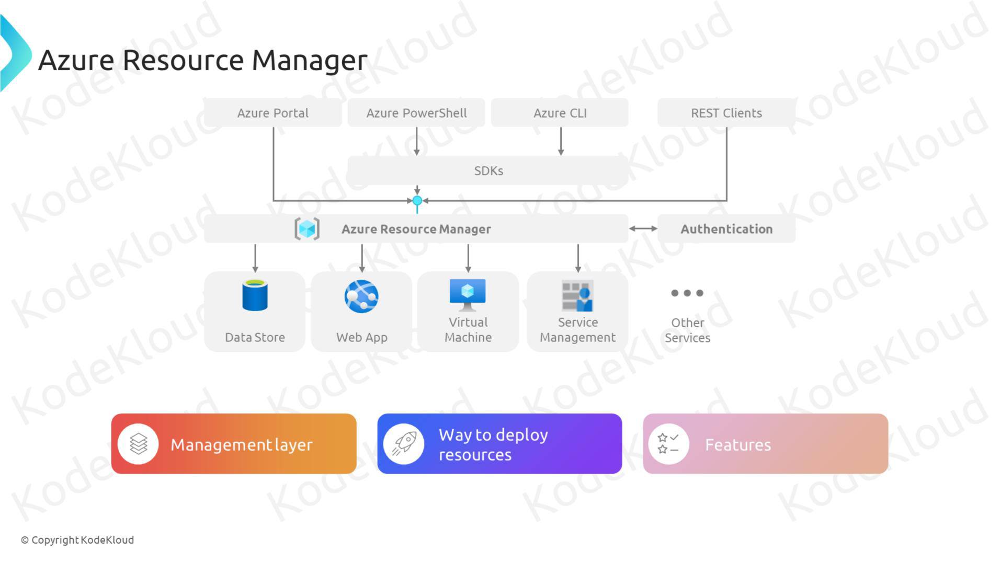

# Azure Resource Manager



Imagine Azure as a large city where **Azure Resource Manager (ARM)** acts as the city's planner and manager. Just like a city planner organizes buildings, roads, and services to ensure everything works smoothly, ARM organizes and manages your Azure resources. Whether you're deploying virtual machines, databases, or networking components, ARM ensures they are efficiently managed, consistently configured, and securely deployed.

## Key Features

Azure Resource Manager offers a range of powerful features to help you manage your Azure environment effectively:

### 1. **Resource Grouping**

- **What It Does:** Organizes related resources into manageable groups.
- **Why It's Important:** Simplifies management by allowing you to handle multiple resources as a single entity, such as deploying, updating, or deleting them together.

### 2. **Consistent Management Layer**

- **What It Does:** Provides a consistent management interface for all Azure services.
- **Why It's Important:** Ensures uniformity in how resources are managed, regardless of the service or resource type.

### 3. **Access Control**

- **What It Does:** Integrates with Azure Role-Based Access Control (RBAC) to manage who can access and modify resources.
- **Why It's Important:** Enhances security by allowing precise control over permissions at various scopes like subscriptions, resource groups, or individual resources.

### 4. **Declarative Syntax**

- **What It Does:** Allows you to define the desired state of your resources using JSON or other declarative formats.
- **Why It's Important:** Simplifies deployments by enabling you to specify what you want, and ARM handles the how.

### 5. **Dependency Management**

- **What It Does:** Automatically handles dependencies between resources during deployment.
- **Why It's Important:** Ensures that resources are created in the correct order, preventing deployment failures and inconsistencies.

### 6. **Tagging**

- **What It Does:** Adds metadata to resources in the form of tags.
- **Why It's Important:** Facilitates organization, cost management, and automation by categorizing resources based on criteria like department, environment, or project.

## Key Components

Azure Resource Manager consists of several key components that work together to provide comprehensive resource management:

### 1. **Resource Groups**

- **What They Are:** Containers that hold related Azure resources.
- **Function:** Allow you to manage, monitor, and organize resources collectively based on lifecycle, permissions, and policies.

### 2. **Resources**

- **What They Are:** Individual services or components deployed within Azure, such as virtual machines, storage accounts, and databases.
- **Function:** Represent the actual services and infrastructure that make up your Azure environment.

### 3. **Resource Providers**

- **What They Are:** Services that offer specific types of resources (e.g., Microsoft.Compute for virtual machines).
- **Function:** Facilitate the creation, management, and configuration of resources by providing the necessary APIs and services.

### 4. **Templates**

_Note: Although the focus is not on templates, it's important to understand their relationship with ARM._

- **What They Are:** JSON files that define the infrastructure and configuration for your Azure resources.
- **Function:** Enable declarative deployments by specifying the desired state of resources, which ARM then implements.

### 5. **Locks**

- **What They Are:** Mechanisms to prevent accidental deletion or modification of resources.
- **Function:** Protect critical resources by applying read-only or delete locks.

## How Azure Resource Manager Works

Azure Resource Manager operates as a management layer that interacts with Azure's underlying services to deploy, manage, and monitor resources. Here's a simplified overview of how ARM works:

1. **Define the Desired State:**

   - Specify the resources you need and their configurations using the Azure Portal, Azure CLI, Azure PowerShell, or REST APIs.

2. **Submit the Deployment:**

   - Send the deployment request to ARM, which processes the instructions.

3. **ARM Orchestrates the Deployment:**

   - ARM handles resource provisioning, ensuring dependencies are managed and resources are deployed in the correct order.

4. **Monitor and Manage:**

   - Use ARM's management tools to monitor the health, performance, and compliance of your resources.

5. **Update or Delete Resources:**
   - Modify or remove resources as needed, with ARM ensuring changes are applied consistently across the environment.

## Examples of Using Azure Resource Manager

### Example 1: Creating a Resource Group and Deploying Resources via Azure Portal

1. **Create a Resource Group:**

   - Log in to the [Azure Portal](https://portal.azure.com/).
   - Click on **"Resource groups"** in the left-hand menu.
   - Click **"Add"** and provide a **Name** (e.g., `MyResourceGroup`) and **Region** (e.g., `East US`).
   - Click **"Review + create"** and then **"Create"**.

2. **Deploy a Virtual Machine:**
   - Navigate to **"Virtual Machines"**.
   - Click **"Add"** and fill in the required details (e.g., VM name, image, size).
   - Select the **Resource Group** you created earlier (`MyResourceGroup`).
   - Configure networking and other settings as needed.
   - Click **"Review + create"** and then **"Create"**.

### Example 2: Managing Resources with Azure CLI

1. **Install Azure CLI:**

   - Download and install Azure CLI from [here](https://docs.microsoft.com/cli/azure/install-azure-cli).

2. **Log In to Azure:**

   ```bash
   az login
   ```

3. **Create a Resource Group:**

   ```bash
   az group create --name MyResourceGroup --location eastus
   ```

4. **Create a Storage Account:**

   ```bash
   az storage account create --name mystorageaccount --resource-group MyResourceGroup --location eastus --sku Standard_LRS
   ```

5. **List All Resource Groups:**

   ```bash
   az group list --output table
   ```

## Use Cases

Azure Resource Manager is versatile and supports a wide range of use cases, including:

### 1. **Infrastructure as Code (IaC)**

- **Description:** Automate the deployment and management of infrastructure using code.
- **Benefit:** Ensures consistency, reduces manual errors, and enables version control of your infrastructure.

### 2. **Resource Organization**

- **Description:** Group related resources for easier management and billing.
- **Benefit:** Simplifies resource tracking, access control, and cost management.

### 3. **Compliance and Governance**

- **Description:** Enforce organizational policies and standards across resources.
- **Benefit:** Maintains security, compliance, and operational best practices consistently.

### 4. **Scalability and Flexibility**

- **Description:** Easily scale resources up or down based on demand.
- **Benefit:** Optimizes performance and cost by adjusting resources to meet current needs.

### 5. **Disaster Recovery and High Availability**

- **Description:** Deploy resources across multiple regions to ensure availability.
- **Benefit:** Minimizes downtime and data loss by providing redundancy and failover capabilities.

## Important Considerations

### Notes and Tips

- **Resource Naming Conventions:** Establish consistent naming conventions for resource groups and resources to improve organization and manageability.
- **Tagging Strategy:** Use tags to categorize resources based on criteria like environment (`Development`, `Production`), department (`IT`, `Finance`), or project. This aids in cost management, automation, and reporting.
- **Lock Critical Resources:** Apply resource locks to prevent accidental deletion or modification of essential resources.
- **Use Role-Based Access Control (RBAC):** Combine ARM with RBAC to control who can deploy and manage resources within resource groups and subscriptions.
- **Monitor Resource Health:** Regularly check the health and performance of your resources using Azure Monitor integrated with ARM.
- **Automate with Scripts:** Utilize Azure CLI or PowerShell scripts to automate repetitive tasks and deployments, enhancing efficiency and reducing errors.

### Common Pitfalls

- **Overlapping Resource Groups:** Avoid placing unrelated resources in the same resource group, as this can complicate management and permissions.
- **Ignoring Dependencies:** Ensure that resource dependencies are correctly defined and managed to prevent deployment failures.
- **Lack of Tagging:** Without a proper tagging strategy, tracking and managing resources becomes challenging, especially in large environments.
- **Insufficient RBAC Implementation:** Not properly configuring RBAC can lead to security vulnerabilities or operational inefficiencies.
- **Neglecting Cost Management:** Failing to monitor and manage resource usage can result in unexpected costs. Use Azure Cost Management in conjunction with ARM to stay within budget.

## Recommendations and Best Practices

### 1. **Implement a Consistent Tagging Strategy**

- **Why:** Facilitates organization, cost management, and automation.
- **How:** Define and enforce tags like `Environment`, `Department`, and `Project` across all resources.

### 2. **Use Resource Groups Effectively**

- **Why:** Enhances manageability and aligns resources with lifecycle and permissions.
- **How:** Group resources that share the same lifecycle, permissions, or management policies.

### 3. **Adopt Infrastructure as Code (IaC)**

- **Why:** Ensures consistency, repeatability, and version control of your infrastructure deployments.
- **How:** Use tools like Azure CLI, PowerShell, or ARM templates to define and deploy resources programmatically.

### 4. **Leverage Role-Based Access Control (RBAC)**

- **Why:** Enhances security by granting the least privilege necessary.
- **How:** Assign appropriate roles to users and groups at the subscription, resource group, or resource level.

### 5. **Monitor and Optimize Resource Usage**

- **Why:** Ensures resources are used efficiently and costs are managed effectively.
- **How:** Use Azure Monitor and Azure Cost Management to track performance and spending, and adjust resources as needed.

### 6. **Apply Resource Locks to Critical Resources**

- **Why:** Prevents accidental deletion or modification of essential resources.
- **How:** Apply `Read-only` or `Delete` locks to key resources within resource groups.

### 7. **Regularly Review and Update Policies**

- **Why:** Keeps your Azure environment aligned with evolving organizational standards and best practices.
- **How:** Periodically audit resource configurations, access controls, and tagging to ensure compliance.

### 8. **Automate Routine Tasks**

- **Why:** Saves time, reduces manual errors, and ensures consistency.
- **How:** Use scripts, Azure Automation, or DevOps pipelines to automate deployments, updates, and maintenance tasks.

### 9. **Ensure Proper Dependency Management**

- **Why:** Prevents deployment failures and ensures resources are created in the correct order.
- **How:** Define dependencies explicitly when deploying resources and use ARM's dependency management features.

### 10. **Educate Your Team**

- **Why:** Ensures that everyone understands how to use ARM effectively and follows best practices.
- **How:** Provide training sessions, documentation, and resources on Azure Resource Manager and related tools.

## Summary

**Azure Resource Manager (ARM)** is the foundational management layer in Azure that enables you to organize, deploy, and manage your cloud resources efficiently. By leveraging ARM's features like resource grouping, consistent management, access control, and dependency management, you can maintain a well-organized, secure, and optimized Azure environment.

- **Resource Groups:** Organize related resources for simplified management.
- **Consistent Management Layer:** Provides uniform interfaces and tools for all Azure services.
- **Access Control:** Integrates with RBAC to secure your resources.
- **Declarative Syntax and Dependency Management:** Streamlines deployments and ensures resources are correctly configured.
- **Tagging:** Enhances organization, cost tracking, and automation.

## 📊 Additional Resources

- [Azure Resource Manager Documentation](https://docs.microsoft.com/azure/azure-resource-manager/)
- [Azure Resource Manager Overview](https://docs.microsoft.com/azure/azure-resource-manager/management/overview)
- [Manage Resources with Azure Resource Manager](https://docs.microsoft.com/azure/azure-resource-manager/management/manage-resource-groups-portal)
- [Azure Best Practices for Resource Management](https://docs.microsoft.com/azure/azure-resource-manager/management/best-practices)
- [Azure Resource Manager REST API](https://docs.microsoft.com/rest/api/resources/)
