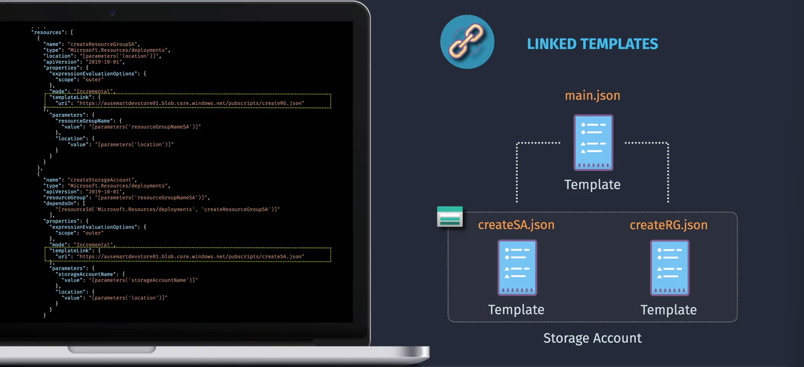

# Advanced Templates

## Table of Contents

1. [✅ Deployment Modes](#deployment-modes)
   - [Incremental Deployment](#1-incremental-mode)
   - [Complete Deployment](#2-complete-mode)
2. ✅ [Deployment Scopes](#deployment-scopes)
3. ✅ [Modular Templates](#modular-templates)
   - [Nested Templates](#1-nested-templates)
   - [Linked Templates](#2-linked-templates)
   - [Bicep Modules](#3-bicep-modules)
4. [Best Practices](#best-practices)
5. [Summary](#summary)
6. [Additional Resources](#additional-resources)

## Deployment Modes

Understanding **Deployment Modes** is crucial for managing how your ARM Templates apply changes to your Azure resources. Azure Resource Manager supports two primary deployment modes: **Complete Deployment** and **Incremental Deployment**.

**Incremental Mode** updates without deleting, while **Complete Mode** ensures everything matches the template, even if that means deleting existing resources not defined in it.

If you don't specify the deployment mode in Azure, the default is Incremental Mode.

### 1. Incremental Mode

- **How It Works**: Adds or updates the resources defined in the deployment template, without affecting existing resources that are not included in the template.
- **Use Case**: Use this when you want to add new resources or update existing ones without impacting any other resources in your resource group.
- **Example**: If your template defines a new storage account, the deployment will add that storage account while leaving all other resources in the resource group unchanged.

#### Example: Incremental Deployment Using Azure CLI

```bash
az deployment group create \
  --resource-group MyResourceGroup \
  --template-file azuredeploy.json \
  --mode Incremental \
  --parameters vmName=MyTestVM adminUsername=azureuser adminPassword=YourPassword123!
```

### 2. Complete Mode

- **How It Works**: Adds or updates resources as per the template and removes any existing resources in the resource group that are not included in the template.
- **Use Case**: Use this when you want to ensure that the resource group matches exactly what is defined in your template, removing anything that doesn't belong.
- **Example**: If your template defines one storage account, the deployment will add that storage account and delete any other resources that aren't defined in the template.

#### Example: Complete Deployment Using Azure CLI

```bash
az deployment group create \
  --resource-group MyResourceGroup \
  --template-file azuredeploy.json \
  --mode Complete \
  --parameters vmName=MyTestVM adminUsername=azureuser adminPassword=YourPassword123!
```

## Deployment Scopes

**Deployment Scopes** determine the level at which resources are deployed in Azure. Understanding these scopes is essential for organizing and managing resources effectively.

### Available Scopes

1. **Resource Group:** The most common scope, where resources are grouped logically.
2. **Subscription:** Deploy resources across multiple resource groups within a subscription.
3. **Management Group:** Apply deployments across multiple subscriptions.
4. **Tenant:** The highest scope, allowing deployments across all subscriptions within an Azure Active Directory tenant.

### Example: Deploying at Different Scopes

#### Deploying to a Resource Group Using Azure CLI

```bash
az deployment group create \
  --resource-group MyResourceGroup \
  --template-file azuredeploy.json \
  --parameters @azuredeploy.parameters.json
```

#### Deploying to a Subscription Using Azure CLI

```bash
az deployment sub create \
  --location eastus \
  --template-file azuredeploy.json \
  --parameters @azuredeploy.parameters.json
```

#### Deploying to a Management Group Using Azure CLI

```bash
az deployment mg create \
  --management-group-id MyManagementGroup \
  --location eastus \
  --template-file azuredeploy.json \
  --parameters @azuredeploy.parameters.json
```

## Modular Templates


Modular Templates enhance the manageability, readability, and reusability of your deployment scripts. By breaking down complex deployments into smaller, reusable components, you can streamline your infrastructure as code (IaC) practices.

### 1. Nested Templates


**Nested Templates** involve embedding one ARM Template within another. This approach allows you to organize complex deployments by separating concerns and managing dependencies effectively.

**Parent Template (mainTemplate.json):**

```json
{
  "$schema": "https://schema.management.azure.com/schemas/2019-04-01/deploymentTemplate.json#",
  "contentVersion": "1.0.0.0",
  "parameters": {
    "storageAccountName": {
      "type": "string"
    },
    "location": {
      "type": "string",
      "defaultValue": "[resourceGroup().location]"
    }
  },
  "resources": [
    {
      "type": "Microsoft.Resources/deployments",
      "apiVersion": "2021-04-01",
      "name": "nestedDeployment",
      "properties": {
        "mode": "Incremental",
        "template": {
          "$schema": "https://schema.management.azure.com/schemas/2019-04-01/deploymentTemplate.json#",
          "contentVersion": "1.0.0.0",
          "parameters": {
            "storageAccountName": {
              "type": "string"
            },
            "location": {
              "type": "string"
            }
          },
          "resources": [
            {
              "type": "Microsoft.Storage/storageAccounts",
              "apiVersion": "2021-04-01",
              "name": "[parameters('storageAccountName')]",
              "location": "[parameters('location')]",
              "sku": {
                "name": "Standard_LRS"
              },
              "kind": "StorageV2",
              "properties": {}
            }
          ]
        },
        "parameters": {
          "storageAccountName": {
            "value": "[parameters('storageAccountName')]"
          },
          "location": {
            "value": "[parameters('location')]"
          }
        }
      }
    }
  ]
}
```

You can deploy this parent template using Azure CLI or PowerShell:

```sh
az deployment group create --resource-group <your-resource-group> --template-file mainTemplate.json --parameters storageAccountName=<your-storage-account-name>
```

### 2. Linked Templates



**Linked Templates** refer to separate ARM Template files that are stored externally (e.g., in Azure Blob Storage or GitHub) and referenced within a main template. This approach promotes reusability and better organization.

**Main Template (`mainTemplate.json`):**

```json
{
  "$schema": "https://schema.management.azure.com/schemas/2019-04-01/deploymentTemplate.json#",
  "contentVersion": "1.0.0.0",
  "parameters": {
    "storageAccountName": {
      "type": "string"
    }
  },
  "resources": [
    {
      "type": "Microsoft.Resources/deployments",
      "apiVersion": "2021-04-01",
      "name": "linkedStorageDeployment",
      "properties": {
        "mode": "Incremental",
        "templateLink": {
          "uri": "https://<your-storage-account>.blob.core.windows.net/templates/storageTemplate.json",
          "contentVersion": "1.0.0.0"
        },
        "parameters": {
          "storageAccountName": {
            "value": "[parameters('storageAccountName')]"
          }
        }
      }
    }
  ]
}
```

**Storage Template (`storageTemplate.json`):**

```json
{
  "$schema": "https://schema.management.azure.com/schemas/2019-04-01/deploymentTemplate.json#",
  "contentVersion": "1.0.0.0",
  "parameters": {
    "storageAccountName": {
      "type": "string"
    }
  },
  "resources": [
    {
      "type": "Microsoft.Storage/storageAccounts",
      "apiVersion": "2021-04-01",
      "name": "[parameters('storageAccountName')]",
      "location": "[resourceGroup().location]",
      "sku": {
        "name": "Standard_LRS"
      },
      "kind": "StorageV2",
      "properties": {}
    }
  ]
}
```

**Deployment Command Using Azure CLI:**

```bash
az deployment group create \
  --resource-group MyResourceGroup \
  --template-file mainTemplate.json \
  --parameters storageAccountName=mystorageacct
```

**Note:** Ensure that the linked template (`storageTemplate.json`) is accessible via the provided URI.

### 3. Bicep Modules


**Bicep Modules** are reusable components in Bicep that encapsulate a set of resources and configurations. Modules promote DRY (Don't Repeat Yourself) principles, enhancing the reusability and maintainability of your Bicep files.

**Module File (`storage.bicep`):**

```bicep
// storage.bicep
param storageAccountName string
param location string = resourceGroup().location
param skuName string = 'Standard_LRS'

resource storageAccount 'Microsoft.Storage/storageAccounts@2021-04-01' = {
  name: storageAccountName
  location: location
  sku: {
    name: skuName
  }
  kind: 'StorageV2'
  properties: {}
}

output storageAccountId string = storageAccount.id
```

**Main Bicep File (`main.bicep`):**

```bicep
// main.bicep
param vmName string = 'MyVM'
param adminUsername string
param adminPassword secureString
param environment string = 'development'

var location = resourceGroup().location
var vmSize = if (environment == 'production') 'Standard_DS2_v2' else 'Standard_DS1_v2'
var nicName = '${vmName}NIC'

module storageModule './storage.bicep' = {
  name: 'storageDeployment'
  params: {
    storageAccountName: toLower('${vmName}storage')
    location: location
  }
}

resource nic 'Microsoft.Network/networkInterfaces@2021-02-01' = {
  name: nicName
  location: location
  properties: {
    ipConfigurations: [
      {
        name: 'ipconfig1'
        properties: {
          subnet: {
            id: '/subscriptions/{subscription-id}/resourceGroups/{resource-group}/providers/Microsoft.Network/virtualNetworks/{vnet}/subnets/{subnet}'
          }
          privateIPAllocationMethod: 'Dynamic'
        }
      }
    ]
  }
}

resource vm 'Microsoft.Compute/virtualMachines@2021-07-01' = {
  name: vmName
  location: location
  properties: {
    hardwareProfile: {
      vmSize: vmSize
    }
    osProfile: {
      computerName: vmName
      adminUsername: adminUsername
      adminPassword: adminPassword
    }
    storageProfile: {
      imageReference: {
        publisher: 'MicrosoftWindowsServer'
        offer: 'WindowsServer'
        sku: '2019-Datacenter'
        version: 'latest'
      }
      osDisk: {
        createOption: 'FromImage'
      }
    }
    networkProfile: {
      networkInterfaces: [
        {
          id: nic.id
        }
      ]
    }
  }
}

output vmId string = vm.id
output storageAccountId string = storageModule.outputs.storageAccountId
```

**Deployment Command Using Azure CLI:**

```bash
az deployment group create \
  --resource-group MyResourceGroup \
  --template-file main.bicep \
  --parameters vmName=MyTestVM adminUsername=azureuser adminPassword=YourPassword123! environment=production
```

**Explanation:**

- **Module Definition (`storage.bicep`):** Defines a storage account resource with parameters for the storage account name, location, and SKU.
- **Main Template (`main.bicep`):** Imports the `storage.bicep` module, passing the necessary parameters. It also defines a network interface and a virtual machine, linking to the storage account via outputs.

## Best Practices

Adhering to best practices ensures that your advanced templates are efficient, secure, and maintainable.

1. **Modularize Templates:**

   - **Why:** Enhances readability and maintainability.
   - **How:** Break down large templates into smaller, reusable modules (Nested, Linked, Bicep Modules).

2. **Use Parameterization:**

   - **Why:** Increases flexibility and reusability across different environments.
   - **How:** Define parameters for values that change between deployments.

3. **Maintain Consistent Naming Conventions:**

   - **Why:** Improves organization and ease of management.
   - **How:** Use descriptive and standardized naming patterns for resources.

4. **Secure Sensitive Information:**

   - **Why:** Protects credentials and sensitive data.
   - **How:** Use `secureString` for passwords and consider integrating Azure Key Vault for secrets.

5. **Validate Templates Before Deployment:**

   - **Why:** Prevents deployment failures and ensures template integrity.
   - **How:** Use validation commands (`az deployment group validate` or `New-AzResourceGroupDeployment -WhatIf`) to check templates.

6. **Version Control Your Templates:**

   - **Why:** Enables tracking changes, collaboration, and rollback capabilities.
   - **How:** Store templates in a Git repository or similar version control system.

7. **Document Your Templates:**

   - **Why:** Facilitates understanding and maintenance, especially in collaborative environments.
   - **How:** Add comments and metadata within your templates to explain sections and parameters.

8. **Automate Deployments:**
   - **Why:** Streamlines the deployment process and reduces manual errors.
   - **How:** Integrate templates with CI/CD pipelines using Azure DevOps, GitHub Actions, or other automation tools.

## Summary

**Advanced Templates** in Azure empower you to manage complex deployments with efficiency and precision. By understanding and implementing **Deployment Modes**, **Deployment Scopes**, and **Modular Templates**, you can create scalable, maintainable, and reusable infrastructure as code. Whether using ARM Templates or Bicep, these advanced concepts enhance your ability to automate and manage Azure resources effectively.

- **Deployment Modes:** Choose between **Complete** and **Incremental** deployments based on your operational needs.
- **Deployment Scopes:** Define the appropriate scope (Resource Group, Subscription, Management Group, Tenant) for your deployments.
- **Modular Templates:** Utilize **Nested Templates**, **Linked Templates**, and **Bicep Modules** to organize and reuse deployment components.

By adhering to best practices and leveraging these advanced techniques, you can optimize your Azure infrastructure deployments, ensuring consistency, security, and scalability.

## Additional Resources

- [Azure Resource Manager Documentation](https://docs.microsoft.com/azure/azure-resource-manager/)
- [Bicep Documentation](https://docs.microsoft.com/azure/azure-resource-manager/bicep/)
- [ARM Template Reference](https://docs.microsoft.com/azure/templates/)
- [Bicep GitHub Repository](https://github.com/Azure/bicep)
- [Azure Quickstart Templates on GitHub](https://github.com/Azure/azure-quickstart-templates)
- [Learn Bicep](https://docs.microsoft.com/learn/modules/intro-to-bicep/)
- [Azure CLI for Bicep](https://docs.microsoft.com/azure/azure-resource-manager/bicep/install)
- [Visual Studio Code - Bicep Extension](https://marketplace.visualstudio.com/items?itemName=ms-azuretools.vscode-bicep)
- [Best Practices for ARM Templates](https://docs.microsoft.com/azure/azure-resource-manager/templates/best-practices)
- [Best Practices for Bicep](https://docs.microsoft.com/azure/azure-resource-manager/bicep/bicep-best-practices)
- [Azure Marketplace Documentation](https://docs.microsoft.com/azure/marketplace/)
- [Deploy ARM Templates with Azure PowerShell](https://docs.microsoft.com/powershell/azure/overview)
