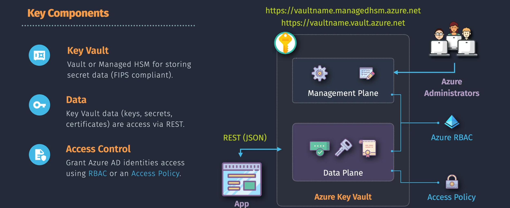

# Azure Key Vault





Imagine having a highly secure, centralized repository where you can store and manage sensitive information like secrets, keys, and certificates. **Azure Key Vault** offers just that, providing a robust solution for safeguarding your application's cryptographic keys and secrets. Whether you're building a simple web application or a complex enterprise solution, Azure Key Vault ensures that your critical data remains protected.

## Introduction

**Azure Key Vault** is a cloud service offered by Microsoft Azure that provides secure storage and management of cryptographic keys, secrets, and certificates. It acts as a centralized repository, allowing you to safeguard your application's sensitive information and control access to it. Key Vault integrates seamlessly with other Azure services, enabling secure key management without the need to handle cryptographic operations within your application code.

### Key Points

- **Centralized Management:** Store and manage keys, secrets, and certificates in one place.
- **Enhanced Security:** Leverage hardware security modules (HSMs) to protect your cryptographic keys.
- **Access Control:** Define granular access policies to control who can access your secrets and keys.
- **Audit and Compliance:** Monitor and audit access to your Key Vault resources for compliance and security purposes.
- **Integration:** Easily integrate with Azure services like Azure Functions, Azure App Service, and more.

## Key Features

Azure Key Vault offers a range of features designed to enhance the security, management, and usability of your sensitive information.

- **Secrets Management:** Securely store and tightly control access to tokens, passwords, API keys, and other secrets.
- **Key Management:** Create and control encryption keys used to encrypt your data.
- **Certificate Management:** Provision, manage, and deploy SSL/TLS certificates for your Azure and non-Azure resources.
- **Managed HSM (Hardware Security Module):** Utilize dedicated HSMs for heightened security of cryptographic keys.
- **Access Policies:** Define precise access controls using Azure Active Directory (AAD) identities.
- **Integration with Azure Services:** Seamlessly integrate with services like Azure Virtual Machines, Azure App Service, and more.
- **Logging and Monitoring:** Use Azure Monitor and Azure Activity Logs to track access and operations on your Key Vault.

## Key Components

Azure Key Vault is composed of several key components that work together to provide comprehensive secret and key management.

### 1. Secrets

- **Definition:** Secure storage for sensitive information such as passwords, API keys, connection strings, and other confidential data.
- **Usage:** Applications retrieve secrets at runtime, ensuring that sensitive information is not hard-coded or stored insecurely.
- **Example:**

  ```plaintext
  APIKey = "12345-ABCDE"
  DatabasePassword = "SecureP@ssw0rd!"
  ```

### 2. Keys

- **Definition:** Cryptographic keys used for encryption, decryption, signing, and verifying data.
- **Usage:** Keys can be used with Azure services to encrypt data or for cryptographic operations within your applications.
- **Types:**
  - **Software-protected Keys:** Managed in software.
  - **HSM-protected Keys:** Stored in hardware security modules for enhanced security.

### 3. Certificates

- **Definition:** SSL/TLS certificates used to secure communication between clients and servers.
- **Usage:** Manage the lifecycle of certificates, including issuance, renewal, and revocation.
- **Features:**
  - **Automated Certificate Management:** Integrate with certificate authorities for automated renewal.
  - **Secure Storage:** Store certificates securely without exposing private keys.

### 4. Managed HSM

- **Definition:** A fully managed, highly available, single-tenant HSM (Hardware Security Module) designed for stringent security requirements.
- **Usage:** Store and manage cryptographic keys with FIPS 140-2 Level 3 validated HSMs.
- **Benefits:**
  - **Isolation:** Dedicated HSMs for each customer.
  - **Compliance:** Meet regulatory and compliance standards requiring dedicated HSMs.

## How to Use Azure Key Vault

Azure Key Vault can be utilized in various ways to manage your secrets, keys, and certificates. Below are the primary steps to get started.

### Creating a Key Vault

You can create an Azure Key Vault using the Azure Portal, Azure CLI, PowerShell, or ARM Templates/Bicep.

#### Using Azure Portal

1. **Navigate to Azure Portal:**

   - Go to [Azure Portal](https://portal.azure.com/).

2. **Create a New Key Vault:**

   - Click on **Create a resource**.
   - Search for **Key Vault** and select it.
   - Click **Create**.

3. **Configure Key Vault Settings:**

   - **Subscription:** Select your Azure subscription.
   - **Resource Group:** Choose an existing resource group or create a new one.
   - **Key Vault Name:** Enter a unique name.
   - **Region:** Select the desired Azure region.
   - **Pricing Tier:** Choose between **Standard** and **Premium** based on your needs.
   - **Access Policies:** Configure initial access policies (can be modified later).

4. **Review and Create:**
   - Review the configuration settings.
   - Click **Create** to deploy the Key Vault.

#### Using Azure CLI

```bash
az keyvault create \
  --name MyKeyVault \
  --resource-group MyResourceGroup \
  --location eastus \
  --sku standard \
  --enabled-for-deployment true \
  --enabled-for-template-deployment true
```

### Storing Secrets

Storing secrets in Azure Key Vault ensures that sensitive information is securely managed and accessed by authorized applications and users.

#### Using Azure Portal

1. **Navigate to Your Key Vault:**

   - Go to your Key Vault in the Azure Portal.

2. **Add a Secret:**
   - Click on **Secrets** in the left-hand menu.
   - Click **Generate/Import**.
   - **Upload Options:** Choose between **Manual**, **Certificate**, or **Import**.
   - **Name:** Enter a unique name for the secret.
   - **Value:** Enter the secret value (e.g., password, API key).
   - Click **Create** to store the secret.

#### Using Azure CLI

```bash
az keyvault secret set \
  --vault-name MyKeyVault \
  --name MySecret \
  --value "SuperSecretValue123!"
```

### Managing Keys

Azure Key Vault allows you to create, import, and manage cryptographic keys used for encryption and decryption.

#### Using Azure Portal

1. **Navigate to Your Key Vault:**

   - Go to your Key Vault in the Azure Portal.

2. **Add a Key:**
   - Click on **Keys** in the left-hand menu.
   - Click **Generate/Import**.
   - **Method of Creation:** Choose between **Generate** or **Import**.
   - **Key Name:** Enter a unique name for the key.
   - **Key Type:** Select the key type (e.g., RSA, EC).
   - **Key Size:** Choose the key size (e.g., 2048, 4096 bits).
   - Click **Create** to generate or import the key.

#### Using Azure CLI

```bash
az keyvault key create \
  --vault-name MyKeyVault \
  --name MyKey \
  --kty RSA \
  --size 2048
```

### Handling Certificates

Azure Key Vault simplifies the management of SSL/TLS certificates, including provisioning, renewal, and revocation.

#### Using Azure Portal

1. **Navigate to Your Key Vault:**

   - Go to your Key Vault in the Azure Portal.

2. **Add a Certificate:**
   - Click on **Certificates** in the left-hand menu.
   - Click **Generate/Import**.
   - **Method of Creation:** Choose between **Generate** or **Import**.
   - **Name:** Enter a unique name for the certificate.
   - **Certificate Type:** Select the type (e.g., Basic, Extended).
   - Configure additional settings as needed.
   - Click **Create** to provision or import the certificate.

#### Using Azure CLI

```bash
az keyvault certificate create \
  --vault-name MyKeyVault \
  --name MyCertificate \
  --policy "$(az keyvault certificate get-default-policy)"
```

### Access Policies

Azure Key Vault uses access policies to define who can access its secrets, keys, and certificates. These policies provide granular control over permissions.

#### Using Azure Portal

1. **Navigate to Your Key Vault:**

   - Go to your Key Vault in the Azure Portal.

2. **Configure Access Policies:**
   - Click on **Access policies** in the left-hand menu.
   - Click **Add Access Policy**.
   - **Configure Permissions:** Select the permissions for secrets, keys, and certificates.
   - **Select Principal:** Choose the Azure AD user, group, or application to grant access.
   - Click **Add** to apply the policy.
   - Click **Save** to finalize the changes.

#### Using Azure CLI

```bash
az keyvault set-policy \
  --name MyKeyVault \
  --upn user@example.com \
  --secret-permissions get list
```

## Common Tasks Using PowerShell and Azure CLI

Azure Key Vault integrates seamlessly with both PowerShell and Azure CLI, enabling automation and efficient management of your secrets, keys, and certificates. Below are some common tasks along with their corresponding commands and examples.

### 1. Create a Key Vault

#### **Azure CLI**

```bash
az keyvault create \
  --name MyKeyVault \
  --resource-group MyResourceGroup \
  --location eastus \
  --sku standard \
  --enabled-for-deployment true \
  --enabled-for-template-deployment true
```

### 2. Add a Secret

#### **Azure CLI**

```bash
az keyvault secret set \
  --vault-name MyKeyVault \
  --name MySecret \
  --value "SuperSecretValue123!"
```

### 3. Retrieve a Secret

#### **Azure CLI**

```bash
az keyvault secret show \
  --vault-name MyKeyVault \
  --name MySecret \
  --query value -o tsv
```

### 4. Add a Key

#### **Azure CLI**

```bash
az keyvault key create \
  --vault-name MyKeyVault \
  --name MyKey \
  --kty RSA \
  --size 2048
```

### 5. Retrieve a Key

#### **Azure CLI**

```bash
az keyvault key show \
  --vault-name MyKeyVault \
  --name MyKey
```

### 6. Add a Certificate

#### **Azure CLI**

```bash
az keyvault certificate create \
  --vault-name MyKeyVault \
  --name MyCertificate \
  --policy "$(az keyvault certificate get-default-policy)"
```

### 7. Manage Access Policies

#### **Azure CLI**

- **Add Access Policy:**

  ```bash
  az keyvault set-policy \
    --name MyKeyVault \
    --upn user@example.com \
    --secret-permissions get list
  ```

- **Remove Access Policy:**

  ```bash
  az keyvault delete-policy \
    --name MyKeyVault \
    --upn user@example.com
  ```

## Best Practices

Adhering to best practices ensures that your use of Azure Key Vault is secure, efficient, and aligns with industry standards.

1. **Use Managed Identities**

   - **Why:** Simplifies authentication and enhances security by eliminating the need for hard-coded credentials.
   - **How:** Assign a managed identity to your Azure resources and grant Key Vault access via access policies.

2. **Implement Granular Access Control**

   - **Why:** Limits exposure and follows the principle of least privilege.
   - **How:** Define specific permissions for secrets, keys, and certificates based on roles and responsibilities.

3. **Enable Soft-Delete and Purge Protection**

   - **Why:** Protects against accidental or malicious deletion of vaults and their contents.
   - **How:** Configure soft-delete and purge protection settings during Key Vault creation or via policies.

4. **Regularly Rotate Secrets and Keys**

   - **Why:** Minimizes the risk of compromised credentials.
   - **How:** Use automation scripts or Azure policies to enforce regular rotation schedules.

5. **Monitor and Audit Access**

   - **Why:** Detects unauthorized access and ensures compliance.
   - **How:** Enable logging with Azure Monitor and review access logs regularly.

6. **Secure Key Vault Access with Network Controls**

   - **Why:** Restricts access to Key Vault from trusted networks only.
   - **How:** Use virtual network service endpoints, firewall rules, and private endpoints to control access.

7. **Use Tags for Organization**

   - **Why:** Facilitates resource management and cost tracking.
   - **How:** Apply consistent tagging strategies to Key Vaults and their resources.

8. **Leverage Bicep or ARM Templates for Infrastructure as Code**

   - **Why:** Ensures consistent and repeatable deployments.
   - **How:** Define Key Vault configurations in Bicep or ARM Templates and integrate them into CI/CD pipelines.

9. **Encrypt Data at Rest and in Transit**

   - **Why:** Enhances data security by protecting it from unauthorized access during storage and transmission.
   - **How:** Utilize Azure Key Vault to manage encryption keys and enforce TLS for data transmission.

10. **Educate and Train Teams**
    - **Why:** Ensures that all team members understand the importance and proper usage of Key Vault.
    - **How:** Provide training sessions and documentation on Key Vault best practices and security measures.

## Use Cases

Azure Key Vault is versatile and can be employed in various scenarios to enhance the security and management of your applications and services.

### 1. **Securely Store Application Secrets**

- **Scenario:** Your application requires access to database connection strings, API keys, and other sensitive information.
- **Solution:** Store these secrets in Azure Key Vault and configure your application to retrieve them at runtime using managed identities.

### 2. **Manage Cryptographic Keys for Encryption**

- **Scenario:** You need to encrypt sensitive data stored in Azure Storage or Azure SQL Database.
- **Solution:** Use Azure Key Vault to generate and manage encryption keys, and configure Azure services to use these keys for data encryption.

### 3. **Automate SSL/TLS Certificate Management**

- **Scenario:** Your web applications require SSL/TLS certificates for secure communication.
- **Solution:** Use Azure Key Vault to provision, store, and manage certificates, and automate certificate renewal processes.

### 4. **Implement Role-Based Access Control (RBAC)**

- **Scenario:** Different teams require access to specific secrets and keys based on their roles.
- **Solution:** Define access policies in Azure Key Vault that grant precise permissions to users, groups, or applications.

### 5. **Facilitate Compliance and Auditing**

- **Scenario:** Your organization needs to comply with regulatory standards that require secure management of sensitive data.
- **Solution:** Use Azure Key Vault's auditing capabilities to monitor access and changes, ensuring compliance with security policies.

### 6. **Enable Secure CI/CD Pipelines**

- **Scenario:** Your CI/CD pipelines need to access secrets and keys for deployment processes.
- **Solution:** Integrate Azure Key Vault with your CI/CD tools (e.g., Azure DevOps, GitHub Actions) to securely fetch and use secrets during deployments.

### 7. **Protect Secrets in Serverless Applications**

- **Scenario:** You are building serverless applications using Azure Functions that require access to sensitive configuration settings.
- **Solution:** Store secrets in Azure Key Vault and configure Azure Functions to access them securely at runtime.

---

## Security Considerations

Ensuring the security of your Key Vault and the secrets it contains is paramount. Below are key security considerations to keep in mind.

1. **Access Control**

   - **Implement Least Privilege:** Grant only the necessary permissions required for users and applications.
   - **Use Managed Identities:** Avoid hard-coded credentials by leveraging Azure Managed Identities for authentication.

2. **Network Security**

   - **Restrict Network Access:** Use virtual network service endpoints and firewalls to limit access to your Key Vault.
   - **Private Endpoints:** Enhance security by integrating Key Vault with Azure Private Link.

3. **Encryption**

   - **Data at Rest:** Ensure that all secrets, keys, and certificates are encrypted at rest using Azure-managed or customer-managed keys.
   - **Data in Transit:** Enforce TLS encryption for all data transmitted to and from Key Vault.

4. **Audit and Monitoring**

   - **Enable Logging:** Use Azure Monitor and Azure Activity Logs to track access and operations on Key Vault.
   - **Set Up Alerts:** Configure alerts for unusual activities or access attempts.

5. **Backup and Recovery**

   - **Enable Soft-Delete:** Protect against accidental deletions by enabling soft-delete, which retains deleted vaults and objects for a specified period.
   - **Purge Protection:** Prevent permanent deletion of Key Vault objects by enabling purge protection.

6. **Key Rotation**

   - **Regularly Rotate Keys and Secrets:** Automate the rotation of keys and secrets to reduce the risk of compromised credentials.

7. **Compliance**
   - **Understand Regulatory Requirements:** Ensure that your Key Vault configurations comply with industry standards and regulatory requirements relevant to your organization.

---

## Limitations

While Azure Key Vault is a powerful tool for managing secrets and cryptographic keys, it has certain limitations that you should be aware of:

1. **Resource Movement**

   - **Inflexibility in Resource Moves:** Moving Key Vaults between subscriptions or regions can be complex and may require exporting and redeploying secrets and keys.

2. **Supported Resource Types**

   - **Limited Integration with Non-Azure Services:** Some third-party services may have limited or no integration with Azure Key Vault.

3. **Throughput Limits**

   - **API Rate Limits:** Azure Key Vault enforces API rate limits, which can impact high-frequency applications.

4. **Pricing Considerations**

   - **Cost Implications:** Premium features like Managed HSM incur additional costs compared to the standard tier.

5. **Data Residency**

   - **Regional Availability:** Key Vaults are region-specific, which may affect applications requiring multi-region support.

6. **Feature Parity**
   - **Ongoing Development:** While Azure Key Vault is continuously evolving, some advanced cryptographic operations may not yet be supported.

## Summary

**Azure Key Vault** is an essential service for securely managing your application's secrets, cryptographic keys, and certificates. By centralizing the storage and control of sensitive information, Key Vault enhances security, simplifies management, and ensures compliance with industry standards. Leveraging Azure Key Vault's robust features and adhering to best practices allows you to protect your critical data effectively and integrate seamlessly with other Azure services.

- **Centralized Management:** Simplify the handling of secrets, keys, and certificates.
- **Enhanced Security:** Utilize hardware security modules and enforce strict access controls.
- **Seamless Integration:** Easily integrate with Azure services and automate secret retrieval.
- **Compliance and Auditing:** Meet regulatory requirements and maintain comprehensive audit logs.
- **Operational Efficiency:** Reduce the complexity of managing sensitive information within your applications.

## Additional Resources

- [Azure Key Vault Documentation](https://docs.microsoft.com/azure/key-vault/)
- [Quickstart: Create a Key Vault](https://docs.microsoft.com/azure/key-vault/general/quick-create-portal)
- [Azure Key Vault Pricing](https://azure.microsoft.com/pricing/details/key-vault/)
- [Best Practices for Using Azure Key Vault](https://docs.microsoft.com/azure/key-vault/general/best-practices)
- [Azure Key Vault Samples on GitHub](https://github.com/Azure-Samples/key-vault-samples)
- [Secure your Azure Functions with Key Vault](https://docs.microsoft.com/azure/azure-functions/functions-how-to-use-azure-key-vault)
- [Azure CLI Key Vault Commands](https://docs.microsoft.com/cli/azure/keyvault)
- [Azure PowerShell Key Vault Cmdlets](https://docs.microsoft.com/powershell/module/az.keyvault/)
- [Azure Key Vault REST API Reference](https://docs.microsoft.com/rest/api/keyvault/)
- [Azure Key Vault Managed HSM Documentation](https://docs.microsoft.com/azure/key-vault/managed-hsm/)
- [Azure Monitor Integration with Key Vault](https://docs.microsoft.com/azure/key-vault/general/monitor-key-vault)
- [Azure Private Link for Key Vault](https://docs.microsoft.com/azure/key-vault/general/private-link-overview)
