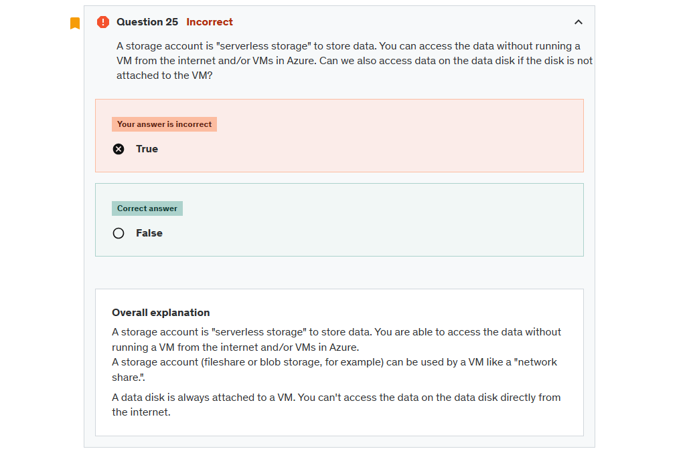
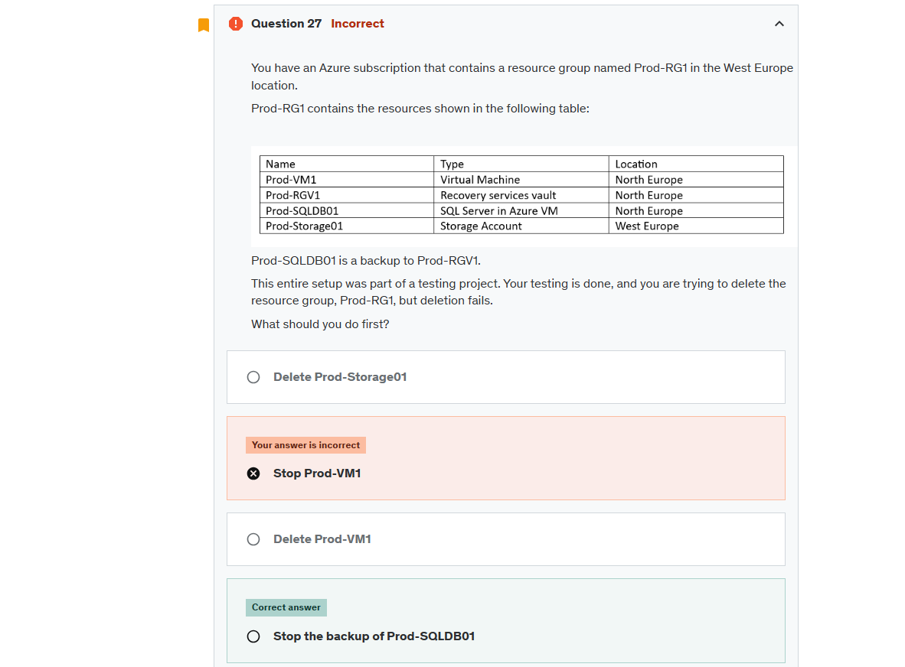
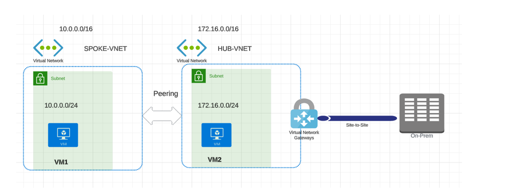

# Exams

## Q25



## q27



```txt
Overall explanation
You can't delete a vault that contains protected data sources (for example, IaaS VMs, SQL databases, or Azure file shares).

You can't delete a vault that contains backup data. Once backup data is deleted, it will go into the soft deleted state.

You can't delete a vault that contains backup data in the soft deleted state.

You can't delete a vault that has registered storage accounts.

So, before you can delete a recovery services vault, you need to stop the backup and delete the backup data.
```

## Q28



```txt
You have an Azure subscription, and below is the hub and spoke topology given.

HUB-VNET is connected to on-premises using a site-to-site VPN, and SPOKE-VNET is peering into HUB-VNET.

How VM1 can communicate with On-premises using the same HUB-VNET virtual network gateway.
Select yes if the statement is true. Otherwise, select no.

Statement: You are planning to use Gateway Transit.
```

- What is Gateway Transit

## other Questions

- Review logs query
- Review Azure Recovery and Backup Services
- you should be monster in powershell for at least creating and configure all common resources
