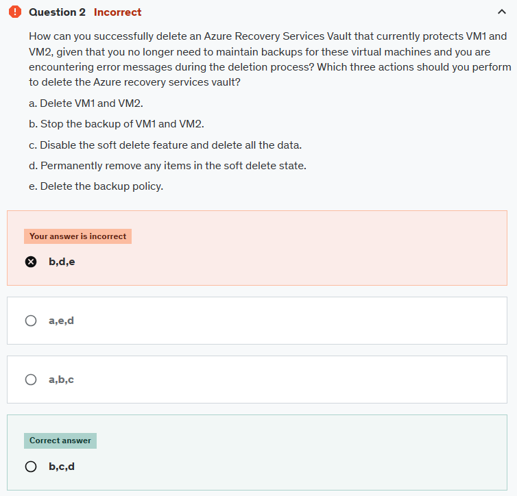
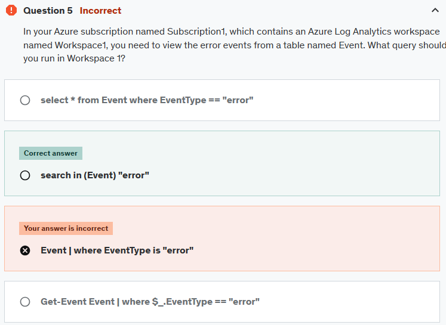
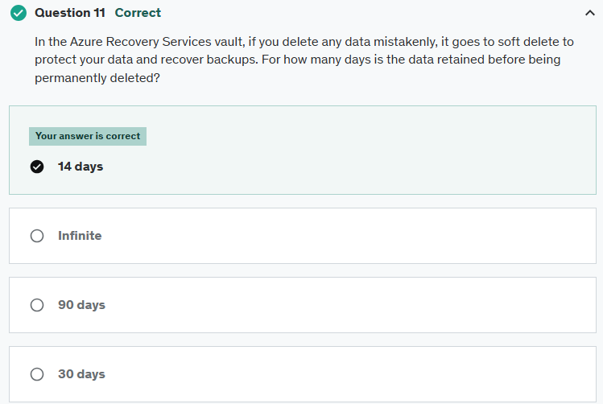
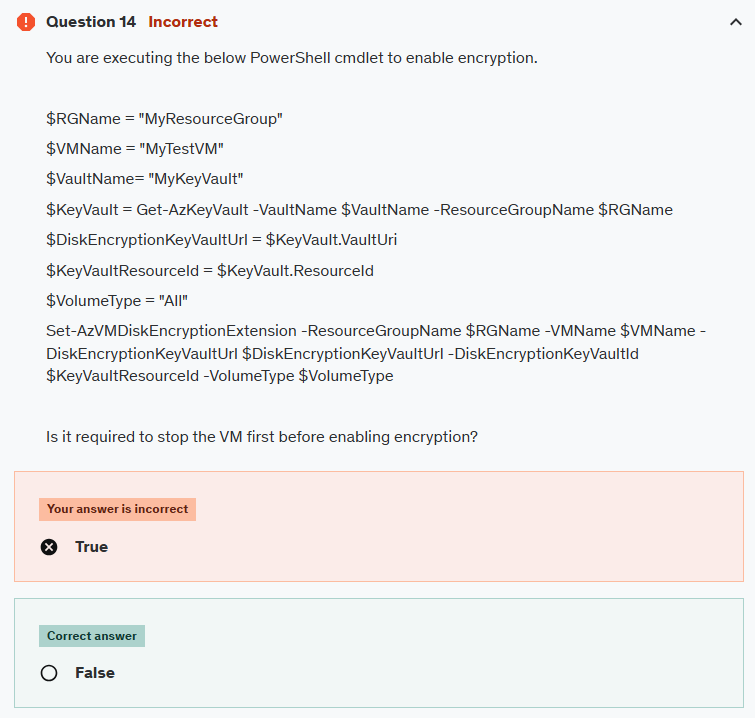
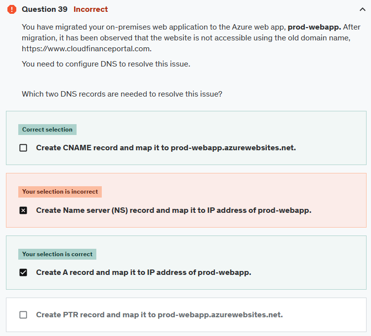

# Practice Test 1 : Azure Administrator - Az-104 - Results

## Wrong Questions

### Q2

**Answer:**

Soft delete is enabled by default on newly created vaults to protect backup data from accidental or malicious deletes. Backup data that exists in a soft deleted state before disabling this feature will remain in a soft deleted state for a period of 14 days. If you wish to permanently delete these immediately, then you need to undelete and delete them again to get them permanently deleted.

[https://learn.microsoft.com/en-us/azure/backup/backup-azure-delete-vault?tabs=portal](https://learn.microsoft.com/en-us/azure/backup/backup-azure-delete-vault?tabs=portal)  
[https://learn.microsoft.com/en-us/azure/backup/backup-azure-security-feature-cloud](https://learn.microsoft.com/en-us/azure/backup/backup-azure-security-feature-cloud)

### Q5

**Answer:**

[https://learn.microsoft.com/en-us/kusto/query/search-operator?view=azure-data-explorer&preserve-view=true](https://learn.microsoft.com/en-us/kusto/query/search-operator?view=azure-data-explorer&preserve-view=true)

### Q11

**Answer:**

[https://learn.microsoft.com/en-us/azure/backup/backup-azure-enhanced-soft-delete-configure-manage?tabs=recovery-services-vault](https://learn.microsoft.com/en-us/azure/backup/backup-azure-enhanced-soft-delete-configure-manage?tabs=recovery-services-vault)

## Q14

**Answer:**

We can enable encryption on a running IaaS virtual machine in Azure.

[https://learn.microsoft.com/en-us/powershell/module/az.compute/set-azvmdiskencryptionextension?view=azps-13.0.0&viewFallbackFrom=azps-10.4.1](https://learn.microsoft.com/en-us/powershell/module/az.compute/set-azvmdiskencryptionextension?view=azps-13.0.0&viewFallbackFrom=azps-10.4.1)

### Q25

### Q27

**Answer:**

- You can't delete a vault that contains protected data sources (for example, IaaS VMs, SQL databases, or Azure file shares).
- You can't delete a vault that contains backup data. Once backup data is deleted, it will go into the soft deleted state.
- You can't delete a vault that contains backup data in the soft deleted state.
- You can't delete a vault that has registered storage accounts.
- So, before you can delete a recovery services vault, you need to stop the backup and delete the backup data.

### Q28

**Answer:**

**Gateway transit** is a peering property that lets one virtual network use the VPN gateway in the peered virtual network for cross-premises or VNet-to-VNet connectivity.

## Q37

**Answer:**

You need to establish three alert rules, each corresponding to a specific condition: restarting a virtual machine, powering off a virtual machine, and deallocating a virtual machine.

Additionally, you should create a single action group, which can be linked to multiple alert rules. Within this action group, you will define multiple actions.

To cater to three administrators, you must create three distinct actions within the action group.

## Q39

**Answer:**

**A record:** points the domain (**www.cloudfinanceportal.com**) to the specific IP address where your Azure Web App is hosted. Make sure the IP address you provide is the correct public IP address of your Azure Web app.

**The CNAME record:** allows you to alias one domain name to another.

[https://learn.microsoft.com/en-us/azure/app-service/app-service-web-tutorial-custom-domain?tabs=root%2Cazurecli](https://learn.microsoft.com/en-us/azure/app-service/app-service-web-tutorial-custom-domain?tabs=root%2Cazurecli)

## Q50

**Answer:**

The Connection Monitor monitors communication at regular intervals. It informs you of changes in reachability and latency.

[https://learn.microsoft.com/en-us/azure/network-watcher/connection-monitor-overview](https://learn.microsoft.com/en-us/azure/network-watcher/connection-monitor-overview)

## Notes Questions

- Review logs query
- Review Azure Recovery and Backup Services
- you should be monster in powershell for at least creating and configure all common resources
- maximum number of email messages that will be sent in an hour for azure alert is **100**
- Adding a group to an administrative unit brings the group itself into the management scope of the administrative unit, but not the members of the group.
- A data disk is always attached to a VM. You can't access the data on the data disk directly from the internet.
- You can't delete a vault that contains protected data sources (for example, IaaS VMs, SQL databases, or Azure file shares).
- You can't delete a vault that contains backup data. Once backup data is deleted, it will go into the soft deleted state.
- You can't delete a vault that contains backup data in the soft deleted state.
- You can't delete a vault that has registered storage accounts.
- So, before you can delete a recovery services vault, you need to stop the backup and delete the backup data.
- **Gateway transit** is a peering property that lets one virtual network use the VPN gateway in the peered virtual network for cross-premises or VNet-to-VNet connectivity.
- A VM can only be added to an availability set when it is created. To change the availability set, you need to delete and then recreate the virtual machine.
- Both SMS and voice are limited to no more than one notification **every five minutes**.
