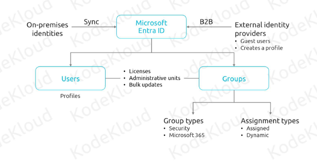
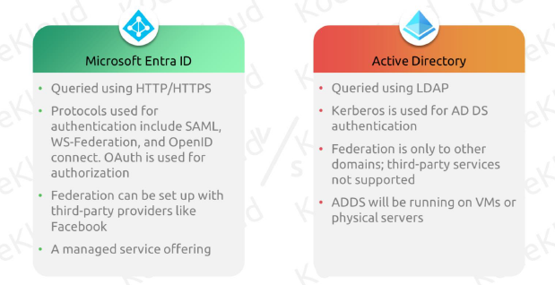
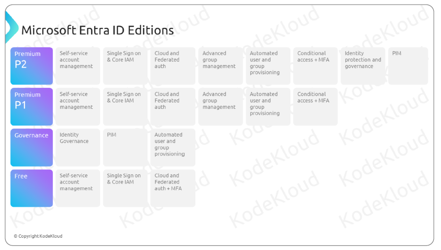
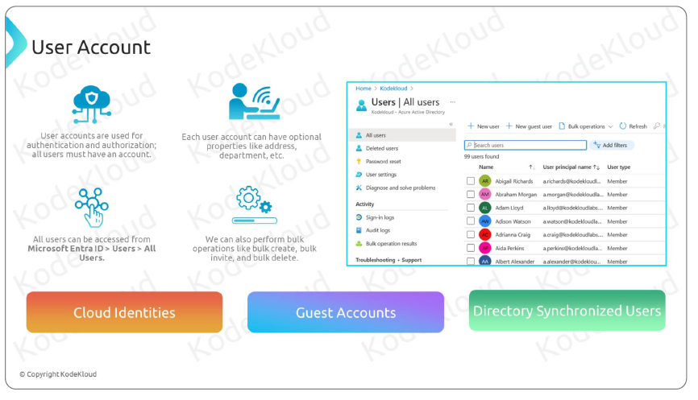
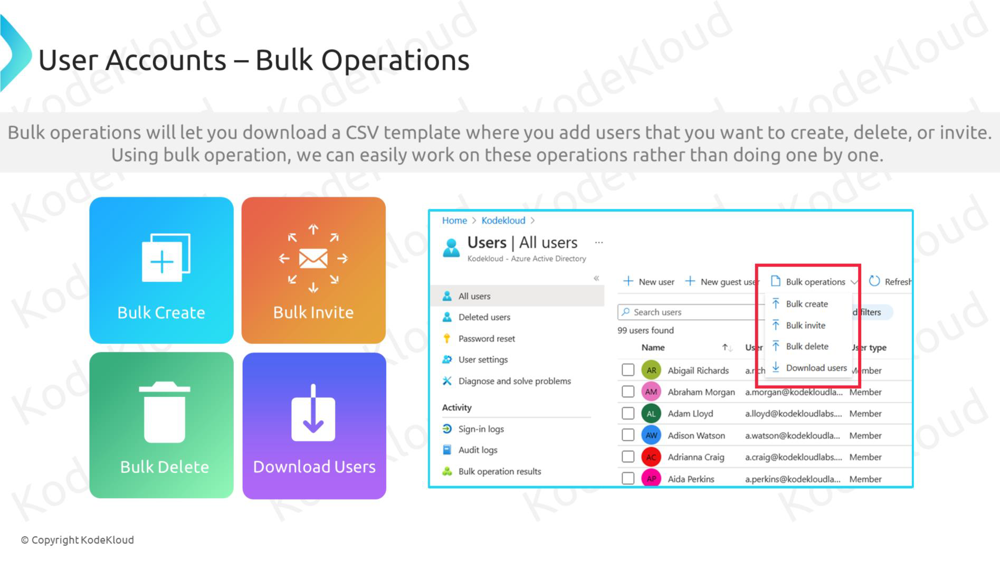
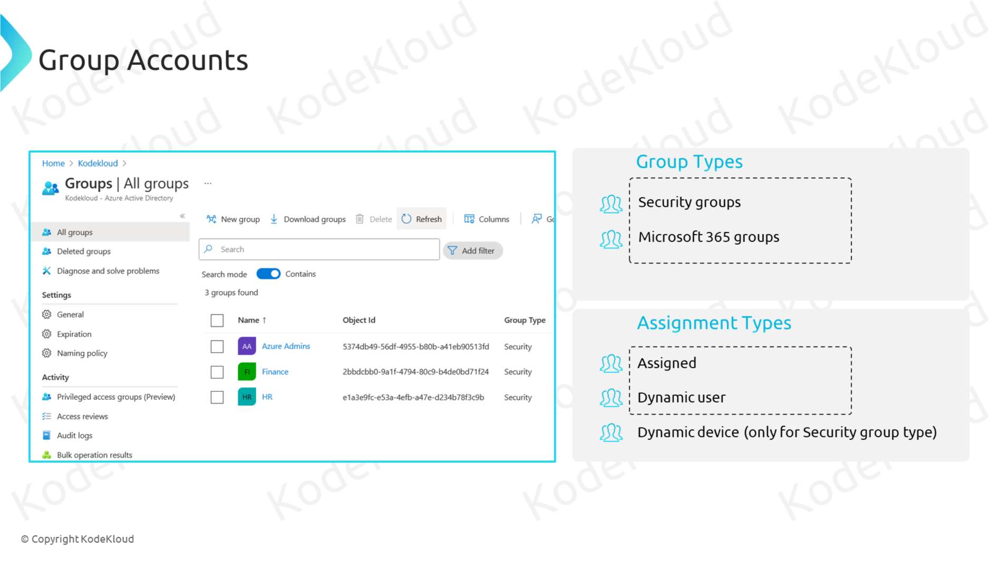
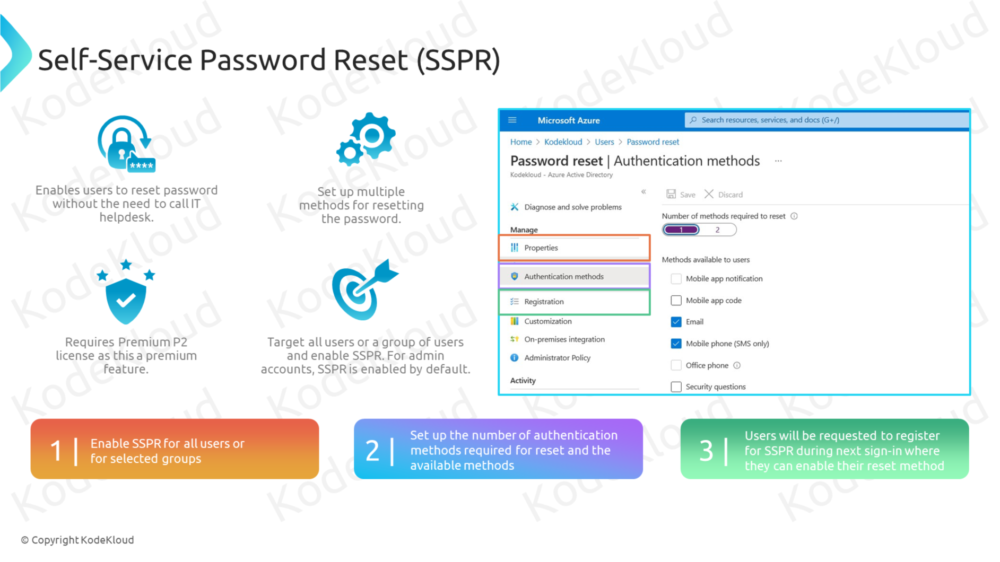

# Administer Identity

## Microsoft Entra ID

### **1. Entra ID vs AD**

When managing user identities and access in an organization, two key systems often come into play: **Microsoft Entra ID** and **Active Directory (AD)**. Here's a simple breakdown of what each one is and how they differ.

#### **🌐 What is Microsoft Entra ID?**

**Microsoft Entra ID** (formerly known as **Azure Active Directory** or **Azure AD**) is a **cloud-based** identity and access management service. It helps organizations manage user identities, secure access to applications, and protect data across various devices and locations.

##### **Key Features of Microsoft Entra ID:**

- **Cloud-Based:** Accessible from anywhere with an internet connection.
- **Single Sign-On (SSO):** Users can log in once and access multiple applications without re-entering credentials.
- **Multi-Factor Authentication (MFA):** Adds an extra layer of security by requiring additional verification steps.
- **Integration with SaaS Applications:** Easily connects with popular cloud services like Microsoft 365, Salesforce, and more.
- **Conditional Access:** Controls access based on conditions like user location, device compliance, and risk levels.
- **Self-Service Password Reset:** Allows users to reset their passwords without IT assistance.

#### **🏢 What is Active Directory (AD)?**

**Active Directory (AD)** is a **on-premises** directory service developed by Microsoft. It’s primarily used to manage computers, users, and other resources within a Windows domain network.

##### **Key Features of Active Directory:**

- **On-Premises:** Typically hosted on servers within an organization's physical location.
- **Domain Management:** Organizes network resources into domains for easier management.
- **Group Policy:** Allows administrators to enforce specific configurations and security settings on user devices.
- **Authentication and Authorization:** Verifies user identities and controls access to resources within the network.
- **Local Resource Management:** Manages access to printers, file shares, and other local network resources.

#### **🔄 Key Differences Between Microsoft Entra ID and Active Directory**

| Feature                     | **Microsoft Entra ID**                                        | **Active Directory (AD)**                                     |
| --------------------------- | ------------------------------------------------------------- | ------------------------------------------------------------- |
| **Deployment**              | Cloud-based                                                   | On-premises                                                   |
| **Accessibility**           | Accessible from anywhere via the internet                     | Limited to the organization's local network                   |
| **Integration**             | Integrates seamlessly with cloud apps (SaaS)                  | Integrates with on-premises applications                      |
| **Management**              | Managed through the Azure portal                              | Managed through on-premises tools like AD Users and Computers |
| **Security Features**       | Advanced cloud security features like MFA, Conditional Access | Traditional security through group policies and firewalls     |
| **Scalability**             | Easily scalable to accommodate growth                         | Scaling requires additional on-premises infrastructure        |
| **Updates and Maintenance** | Automatically updated by Microsoft                            | Requires manual updates and maintenance by IT staff           |
| **Use Cases**               | Ideal for modern, remote, and hybrid work environments        | Best suited for traditional, on-site network setups           |

#### **🔗 How They Work Together**

Many organizations use both **Microsoft Entra ID** and **Active Directory** in a **hybrid setup** to leverage the strengths of each:

- **Hybrid Identity:** Connects on-premises AD with Entra ID, allowing users to access both local and cloud resources seamlessly.
- **Azure AD Connect:** A tool that synchronizes user identities between AD and Entra ID, ensuring consistency across environments.
- **Single Sign-On (SSO):** Users can use the same credentials to access both on-premises and cloud applications.

#### **📈 Why the Difference Matters**

- **Flexibility:** Entra ID offers greater flexibility for remote and hybrid work scenarios.
- **Security:** Enhanced cloud security features help protect against modern threats.
- **Management Efficiency:** Cloud-based management reduces the need for extensive on-premises infrastructure and maintenance.
- **Future-Proofing:** As organizations move more services to the cloud, Entra ID provides the necessary tools to manage identities effectively.

#### **🔍 In Summary**

- **Microsoft Entra ID** is a **cloud-based** identity and access management service designed for modern, flexible, and secure access to cloud and on-premises applications.
- **Active Directory (AD)** is an **on-premises** directory service primarily used to manage local network resources and user access within a traditional IT environment.
- **Together**, they enable organizations to create a robust and flexible identity management system that supports both legacy and modern applications.

Feel free to ask if you have more questions or need further clarification!

### **2. Microsoft Entra ID Editions**

### **3. Device Identity**

**Microsoft Entra ID** manages **device identities** to secure and control access to organizational resources. There are three main types of device identities:

1. **🔗 Entra ID Registered Devices**

   - **Who Uses It:** Personal or **BYOD (Bring Your Own Device)**.
   - **Purpose:** Allows users to access work applications while keeping personal data separate.
   - **Management:** Limited IT control, typically managed through Mobile Device Management (MDM) solutions like Microsoft Intune.
   - **Example:** An employee’s personal smartphone accessing work emails.

2. **🏢 Entra ID Joined Devices**

   - **Who Uses It:** **Company-owned** devices.
   - **Purpose:** Fully managed by the organization for secure and seamless access to corporate resources.
   - **Management:** Fully controlled by IT using tools like Microsoft Endpoint Manager and Group Policies.
   - **Example:** A company-issued laptop that automatically accesses internal applications upon login.

3. **🔄 Hybrid Azure AD Joined Devices**
   - **Who Uses It:** **Organization-owned** devices connected to both on-premises Active Directory (AD) and Microsoft Entra ID.
   - **Purpose:** Ideal for organizations transitioning to the cloud, providing access to both local and cloud resources.
   - **Management:** Managed using both on-premises tools (e.g., Group Policies) and cloud-based tools (e.g., Microsoft Intune).
   - **Example:** A company laptop that accesses internal servers and Microsoft 365 services seamlessly.

#### **🔍 Key Differences**

| Feature                 | **Registered Devices**               | **Joined Devices**                        | **Hybrid Joined Devices**                                      |
| ----------------------- | ------------------------------------ | ----------------------------------------- | -------------------------------------------------------------- |
| **Ownership**           | User-Owned (BYOD)                    | Organization-Owned                        | Organization-Owned                                             |
| **Management Level**    | Limited IT Control                   | Full IT Control                           | Combined IT Control (On-Premises + Cloud)                      |
| **Integration**         | Registered with Entra ID             | Fully Joined to Entra ID                  | Joined to On-Premises AD & Entra ID                            |
| **Use Case**            | Personal devices accessing work apps | Corporate devices accessing all resources | Devices needing access to both on-premises and cloud resources |
| **Security Management** | Conditional Access via MDM           | Comprehensive security policies           | Security policies from both on-premises AD and Entra ID        |

#### **🎯 When to Use Each Type**

- **Entra ID Registered Devices:** Best for organizations supporting BYOD policies, offering flexibility while maintaining security.
- **Entra ID Joined Devices:** Ideal for companies that provide and manage all work devices, ensuring full control and security.
- **Hybrid Azure AD Joined Devices:** Suitable for organizations transitioning to the cloud, requiring access to both on-premises and cloud-based resources.

## User and Group Accounts

### **1. 👤 User Accounts**

Managing user accounts in **Microsoft Entra ID** ensures secure and efficient access to your organization’s resources. Here are the three main types of user accounts you need to know:

#### **1. ☁️ Cloud Identities**

- **What They Are:**  
  User accounts **only exist in Microsoft Entra ID**.

- **Types:**

  - **Internal Cloud Users:** Created and managed within your Entra ID.
  - **External Cloud Users:** From another Entra ID tenant, accessing your resources via federation.

- **Use Cases:**

  - Employees accessing Microsoft 365.
  - Partners accessing shared applications without needing separate accounts.

- **Example:**  
  `john.doe@yourcompany.com` created directly in your Entra ID.

---

#### **2. 👥 Guest Accounts**

- **What They Are:**  
  **External users** invited to collaborate, existing **outside your Azure tenant**.

- **Characteristics:**

  - Use **Microsoft Accounts** (e.g., Outlook.com) or other social identities.
  - Limited access based on invitations.

- **Use Cases:**

  - Contractors, partners, or clients needing temporary access.
  - Collaborating on projects in Microsoft Teams or SharePoint.

- **Example:**  
  `jane.doe@gmail.com` invited to a project in Microsoft Teams.

---

#### **3. 🔗 Directory Synchronized Users**

- **What They Are:**  
  User accounts **synchronized from your on-premises Active Directory (AD)** to Entra ID.

- **Characteristics:**

  - Managed in your local AD.
  - Automatically synced using **Azure AD Connect**.

- **Use Cases:**

  - Employees needing access to both on-premises and cloud resources.
  - Organizations maintaining a single source of truth for user information.

- **Example:**  
  An employee `mike.smith@yourcompany.com` managed in your local AD and synced to Entra ID for cloud access.

### Bulk Operations

1. **Bulk create**: Create users in bulk
1. **Bulk invite**: Invite external users for collaboration in bulk
1. **Bulk delete**: Delete existing users in bulk
1. **Download users**: Creates export of all users in the directory

### Group Accounts

### Self-Service Password Reset (SSPR)

Microsoft Entra self-service password reset (SSPR) gives users the ability to change or reset their password, with no administrator or help desk involvement. If a user's account is locked or they forget their password, they can follow prompts to unblock themselves and get back to work. This ability reduces help desk calls and loss of productivity when a user can't sign in to their device or an application.

> https://aka.ms/sspr

#### Authentication methods

When a user is enabled for SSPR, they must register at least one authentication method.

The following authentication methods are available for SSPR:

1. Mobile app notification
1. Mobile app code
1. Email
1. Mobile phone
1. Office phone (available only for tenants with paid subscriptions)
1. Security questions

Users can only reset their password if they register an authentication method that the administrator has enabled.

#### Number of authentication methods required

You can configure the number of the available authentication methods a user must provide to reset or unlock their password. This value can be set to `either one or two`.

Users should register multiple authentication methods so they can sign-in another way if they're unable to access one method.

If a user doesn't register the minimum number of required methods, they see an error page when they try to use SSPR. They need to request that an administrator reset their password.
