# Administer Governance and Compliance

## Configure Subscription and azure resource manager

### 1. Managing Subscriptions

Think of an **Azure Subscription** as a **container** that holds all the resources you use in Microsoft Azure. These resources can include virtual machines, databases, storage accounts, and more. Here’s a straightforward way to understand it:

#### **Key Points:**

- **1. Billing Boundary:**

  - **Definition:** A subscription defines the boundary for billing. This means all the usage and costs for resources are tracked and billed under a specific subscription.
  - **Example:** If your team is working on a project, you might create a separate subscription to easily track and manage the costs associated with that project.

- **2. Resource Mapping:**

  - **Definition:** Any resource you create in Azure is linked to a particular subscription.
  - **Example:** When you create a virtual machine, it’s associated with the subscription you’re currently using in the Azure portal.

- **3. Environmental Boundaries:**

  - **Definition:** Subscriptions help set up boundaries between different environments, such as development, testing, and production.
  - **Example:** You might have one subscription for development and another for production to ensure resources are managed and billed separately.

- **4. Unique Identifier:**

  - **Definition:** Each subscription has a unique ID called a **Subscription ID**.
  - **Purpose:** This ID is used to uniquely identify and manage the subscription within Azure.

- **5. Multiple Subscriptions per Account:**

  - **Definition:** A single Azure account can have multiple subscriptions.
  - **Benefit:** This allows for better organization and management of resources, especially in larger organizations or for different projects.

- **6. Access and Identity:**

  - **Definition:** Users (identities) that are part of Microsoft Entra ID (formerly Azure Active Directory) or other trusted Microsoft cloud services can sign up for and access subscriptions.
  - **Purpose:** This ensures secure and managed access to the resources within each subscription.

- **7. Subscription Types:**

  - **Definition:** Azure offers different types of subscriptions tailored to various use cases.
  - **Purpose:** Choosing the right subscription type helps optimize costs and management based on your specific needs.

- **8. Access Management Scope:**
  - **Definition:** Subscriptions act as a scope for managing who has access to what resources.
  - **Example:** You can assign roles and permissions at the subscription level to control who can create, modify, or delete resources within that subscription.

#### **2. Types of Azure Subscriptions**

Azure provides several subscription types to cater to different needs and scenarios. Here’s a simplified overview:

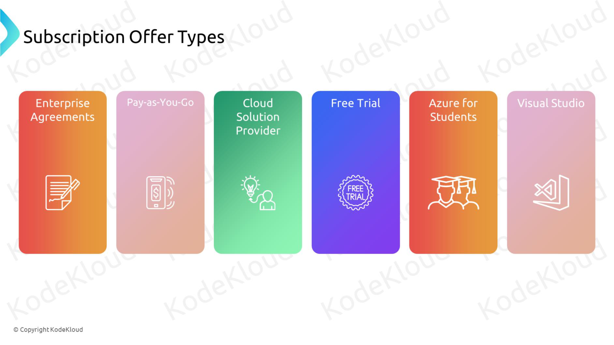

##### **1. Enterprise Agreement (EA)**

- **Who It’s For:** Large organizations with significant Azure usage.
- **Benefits:**
  - Volume discounts on Azure services.
  - Flexible billing options.
  - Centralized management of multiple subscriptions.

##### **2. Pay-As-You-Go (PAYG)**

- **Who It’s For:** Businesses with variable workloads and those who prefer not to commit upfront.
- **Benefits:**
  - Pay only for what you use.
  - No long-term commitments.
  - Easy to start and scale.

##### **3. Cloud Solution Provider (CSP)**

- **Who It’s For:** Organizations that prefer to work with Microsoft partners for additional services and support.
- **Benefits:**
  - Managed services through partners.
  - Flexible billing handled by the partner.
  - Access to partner expertise and support.

##### **4. Free Trial**

- **Who It’s For:** Individuals or organizations new to Azure looking to explore its services.
- **Benefits:**
  - Free access to popular Azure services for 12 months.
  - \$200 credit for the first 30 days.
  - Ideal for testing and learning.

##### **5. Azure for Students**

- **Who It’s For:** Students who want to learn and experiment with Azure without incurring costs.
- **Benefits:**
  - Free access to certain Azure services.
  - No credit card required.
  - Perfect for educational projects and learning.

##### **6. Visual Studio Subscriptions**

- **Who It’s For:** Developers and teams using Visual Studio for development.
- **Benefits:**
  - Monthly Azure credits.
  - Access to developer tools and services.
  - Ideal for building and testing applications.

### 2. Resource Group and Limits

#### What is Resource Groups

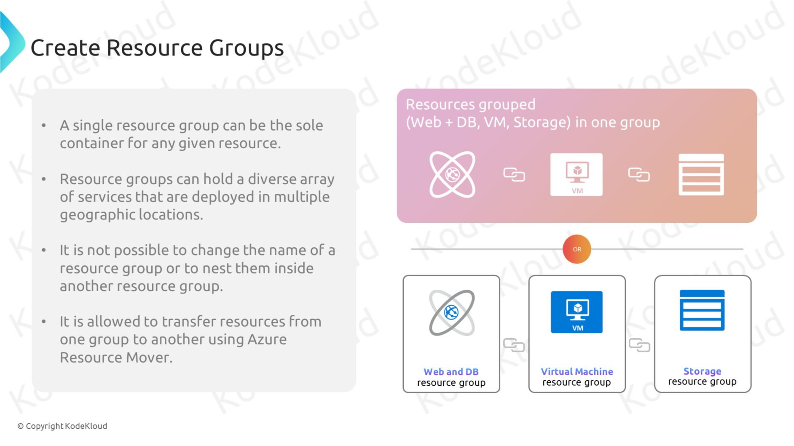

- Resource group is containers that group related Azure resources.
- Resource groups can hold a diverse array of services that are deployed in multiple geographic locations
- it is not possible to change the name of the resource group or to nest them inside another resource group
- it is allowed to transfer resource from one group to another using azure resource mover.

#### What is Resource Group Limits and Quota

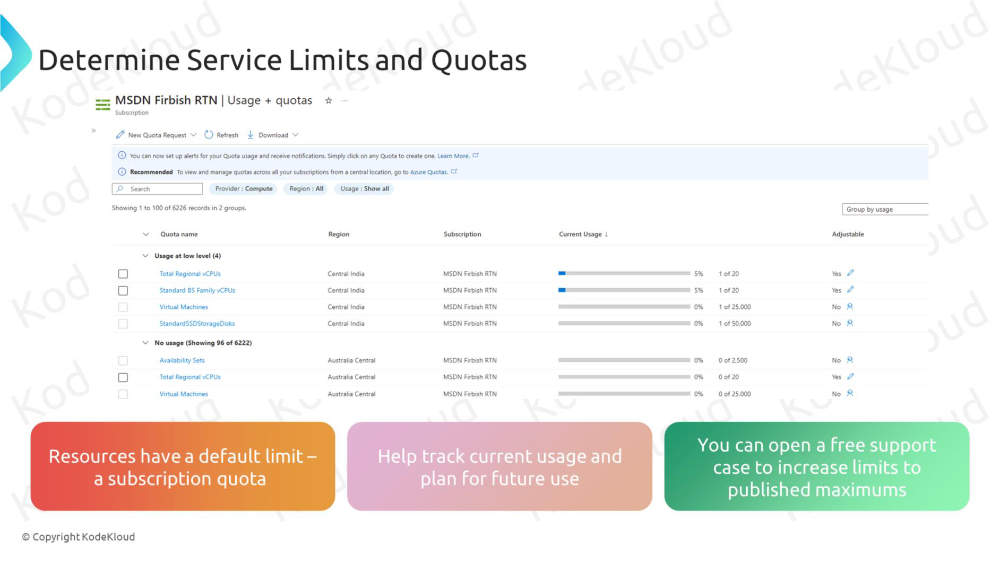

In Azure, Resource Groups are logical containers that organize resources like virtual machines, storage accounts, and databases. However, Azure enforces certain limits (quotas) on Resource Groups and the resources within them. These limits are essential to ensure stability, performance, and efficient resource management across Azure’s infrastructure.

- **Each Azure subscription can contain up to 980 resource groups. This limit helps organize resources without overwhelming the subscription.**

- **Each resource group can contain up to 800 resources in a single region.**

- **Resource group names must be unique within the subscription.**

- **Resource quotas within resource groups vary depending on the specific resource type**

- **For certain limits, Azure allows quota increases upon request**

### 3. Understanding the Hierarchy

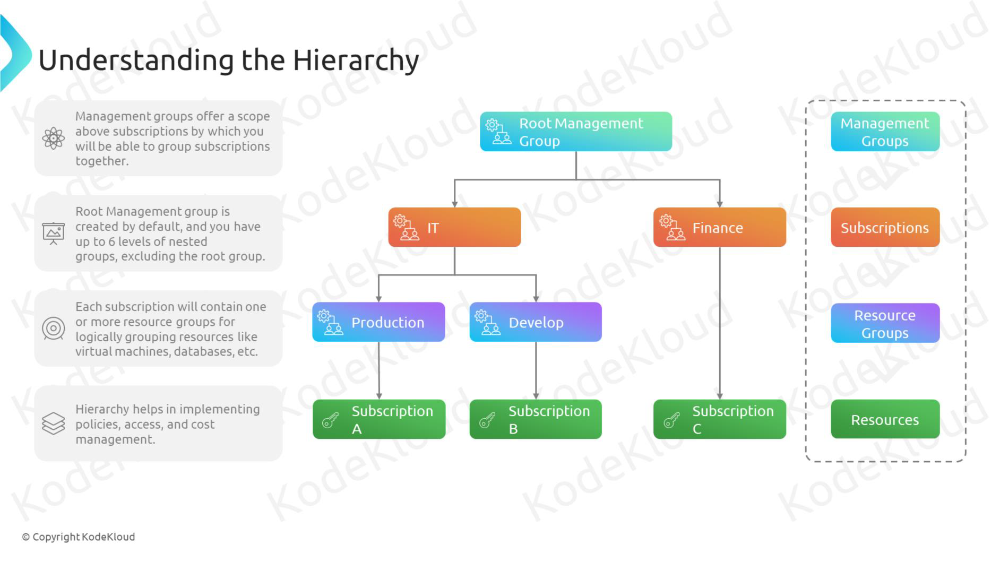

### 4. Azure Resource Tags

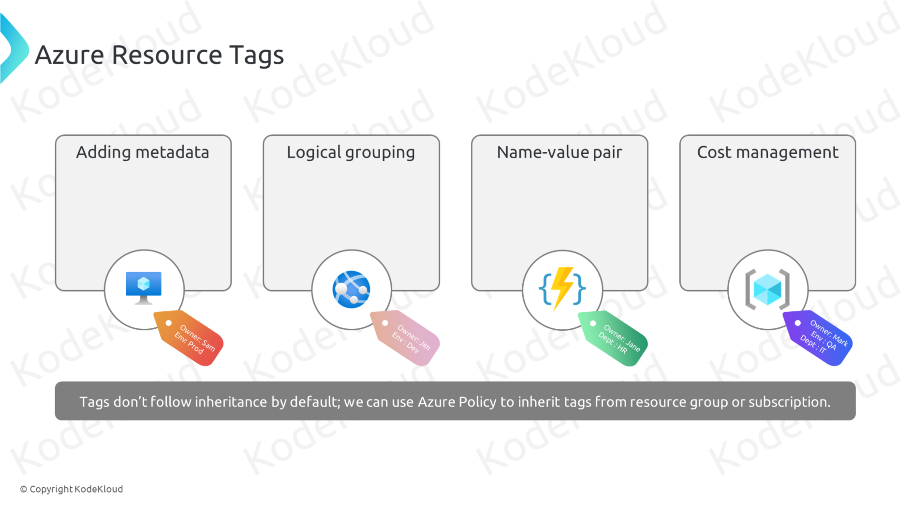

Tags are metadata elements that you apply to your Azure resources. They're key-value pairs that help you identify resources based on settings that are relevant to your organization.

- **You can apply tags to your Azure resources, resource groups, and subscriptions, but not to management groups.**

- **Each resource, resource group, and subscription can have a maximum of 50 tag name-value pairs.**

- **If you need to apply more tags than the maximum allowed number, use a JSON string for the tag value. The JSON string can contain many of the values that you apply to a single tag name.**

- **Not all resource types support tags**

- You have an Azure policy that enforces a specific tag on all resources. What happens if a resource is created without this tag?

  - **the resource creation fails**

- **They only affect new resources created or modified after the policy is applied.**

### 5. Azure Resource Locks

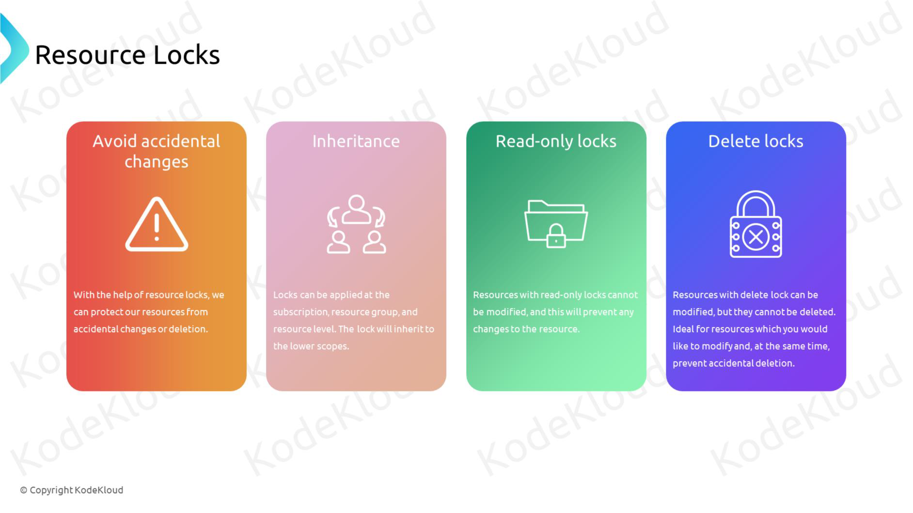

### 6. Manage Costs

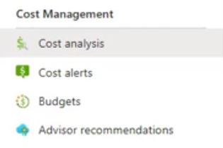
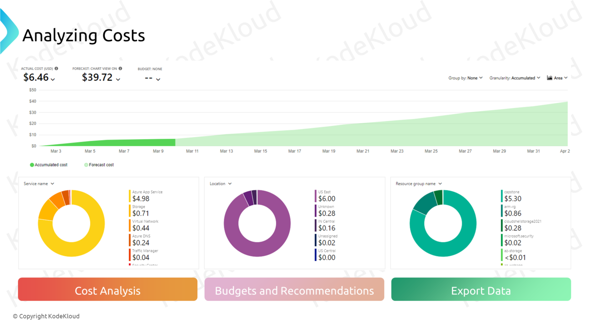
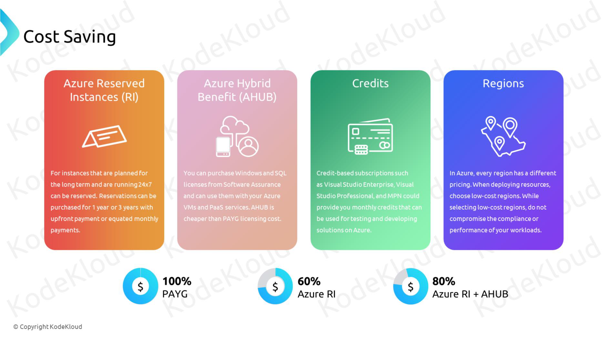

## Configure Azure Policies

### 1. Azure Policy

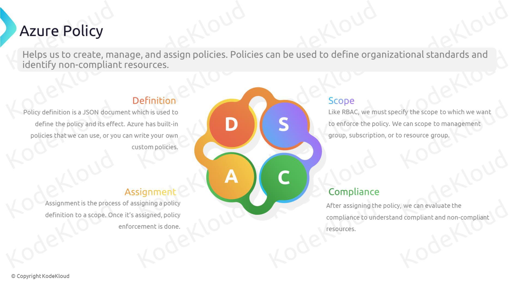
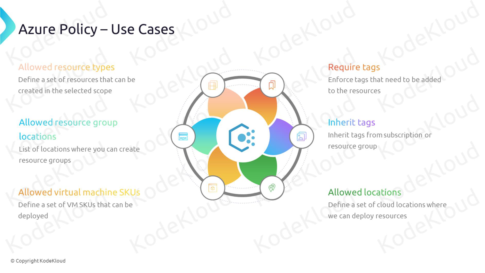

### 2. Initiative

-In Azure, an initiative is a collection of policies grouped together to achieve a specific goal or standard. An initiative definition allows you to manage multiple policies as a single unit, which simplifies the process of applying, managing, and tracking compliance across multiple policies. Here’s a closer look at initiatives in Azure:

- Example
  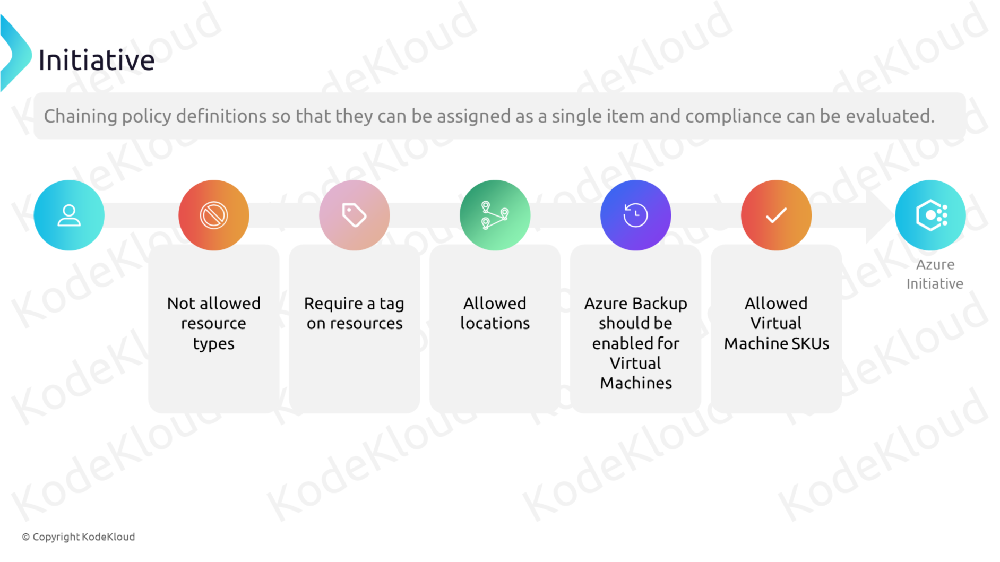

## Configure Azure RBAC

### 1. RBAC

### 2. Azure RBAC 🆚 Microsoft Entra ID Roles

## Note

- [Azure Price Calculator](https://azure.microsoft.com/en-us/pricing/calculator/)
