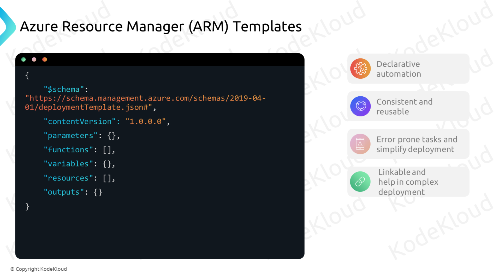
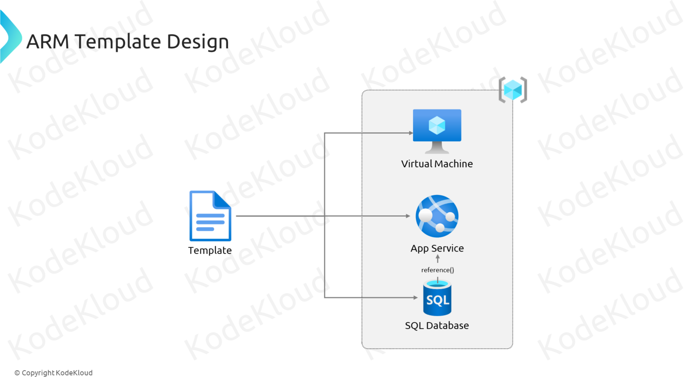
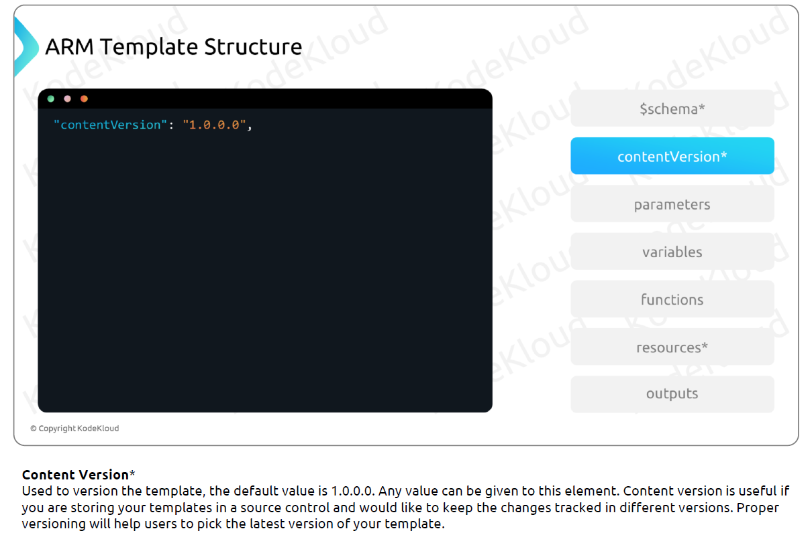

# Administer Azure Resources


## Configure Azure Resources with Tools



- **Declarative automation**:
  ARM templates uses JSON file. In declarative automation, you need to declare theresources but not how to create them. Creating the resources is Resource Manager’s responsibility.

- **Consistent and reusable**:
  Environments deployed via ARM template will be consistent. With the help of parameters, we can share and reuse the template to create environment from scratch.

- **Error prone tasks and simplify deployment**:
  If we are creating environment manually chances of human error will be there and with ARM templates, we can deploy all the resources we define in a single operation.

- **Linkable and helps complex deployment**:
  You can write small ARM templates and link them to a parent template. This helps in managing different parts of the templateefficiently. With ARM templates, we can deploy complex environments in the correct dependency order.

## Configure Azure Resources with ARM Templates





### using arm template .json





```json
{
  "$schema": "https://schema.management.azure.com/schemas/2019-04-01/deploymentTemplate.json#",
  "contentVersion": "1.0.0.0",
  "parameters": {
    "location": {
      "type": "string",
      "allowedValues": ["eastus", "westus"],
      "defaultValue": "eastus",
      "metadata": {
        "description": "Location for all resources."
      }
    },
    "part": {
      "type": "string",
      "minLength": 4,
      "maxLength": 7,
      "metadata": {
        "description": "Prefix for the storage account name."
      }
    }
  },
  "variables": {
    "name": "[concat(parameters('part'), 'res')]"
  },
  "resources": [
    {
      "type": "Microsoft.Storage/storageAccounts",
      "apiVersion": "2021-04-01",
      "name": "[concat('st889', variables('name'))]",
      "location": "[parameters('location')]",
      "kind": "StorageV2",
      "sku": {
        "name": "Standard_LRS"
      },
      "properties": {}
    }
  ]
}
```

```bash
# connect using device
az login --use-device-code

# set subs
az account set --subscription <name or id>

# deploy resource from template file
az deployment group create --resource-group <name or id> --template-file <path to template file>
```

### using arm template .bicep

```bicep
@allowed([
    'eastus'
    'westus'
])
param location string = 'eastus'

@minLength(4)
@maxLength(7)
param part string

var name = '${part}res'

resource storageaccount 'Microsoft.Storage/storageAccounts@2021-04-01' {
    name: 'st889${name}'
    location: location
    kind: 'StorageV2'
    sku: {
        name: 'Standard_LRS'
    }
    properties: {}
}
```

```bash
# connect using device
az login --use-device-code

# set subs
az account set --subscription <name or id>

# deploy resource from template file
az deployment group create --resource-group <name or id> --template-file <path to template file>
```
