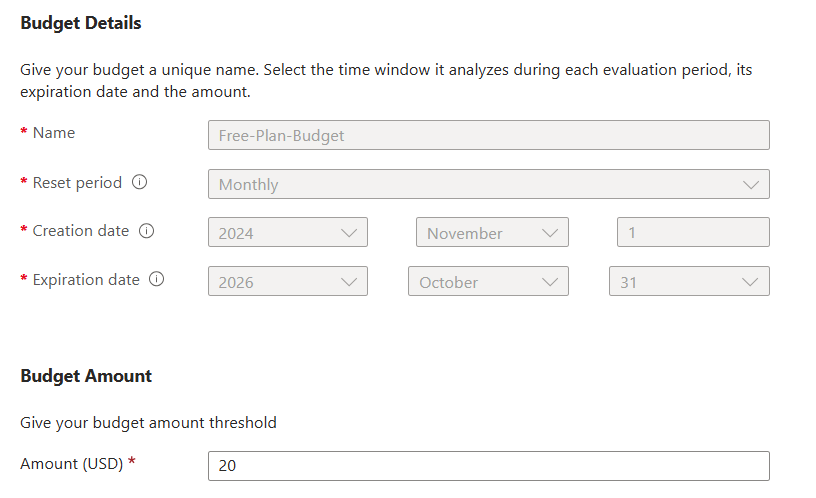
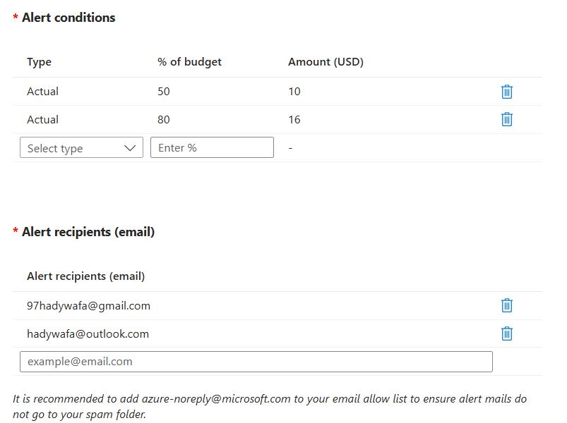

# Azure Free Account

## **Free Azure Account Features**

When you create a free Azure account, you receive:

1. **\$200 Credit for 30 Days:**
   - Use it to explore any Azure services, including virtual machines, databases, and app hosting.
2. **12 Months of Free Popular Services:**
   - Includes free tiers for services like virtual machines, databases, storage, and more.
3. **Always-Free Services:**
   - Services like App Services (1 GB storage) and Functions (1 million requests/month).

## **Entra ID Access in Free Azure Account**

A free Azure account includes a **Free Tier of Microsoft Entra ID (Azure AD)** for managing identities and access. Here’s what’s included:

- **Core Features:**

  - **User Management:** Create and manage users and groups.
  - **Basic Single Sign-On (SSO):** Integrate with Microsoft and third-party applications.
  - **Authentication:**
    - Support for basic multi-factor authentication (MFA) using security defaults.
  - **Azure Portal Access:** Use the Entra ID tenant to log into the Azure Portal and manage Azure resources.

- **Limitations:**
  - No advanced features like conditional access, identity protection, or dynamic groups.
  - For advanced features, you need to upgrade to **Entra ID Premium P1 or P2** (either standalone or bundled with higher Microsoft 365 plans).

## **Relationship Between Azure, Entra ID, and Microsoft 365**

1. **Azure Free Account:**

   - Automatically creates a **Microsoft Entra ID tenant** (Free Tier) to manage user identities and access.
   - No direct Microsoft 365 access unless you subscribe separately.

2. **Microsoft 365:**

   - Includes **Microsoft Entra ID** with varying tiers (Free, P1, or P2) depending on the plan.
   - Allows you to log into the Azure portal but does **not** include access to Azure resources.

3. **Microsoft Entra ID (Standalone):**
   - Can be purchased separately or is included in certain Microsoft 365 and Azure plans.

## Check your current Azure credit

1. **Sign in to the Azure portal** [https://portal.azure.com](https://portal.azure.com)
2. **Search for "Cost Management + Billing"** and click on the search result.
3. **Select the billing account** for which you want to track the credit balance. Make sure it's of type **Microsoft Customer Agreement**.
4. **On the left-hand side**, select **Payment methods** and then **Azure credits**.
5. **Check the balance section** to see your **current balance** and **estimated balance**.

You're correct that **Azure Free Account** includes **Microsoft Entra ID (formerly Azure Active Directory)** at the **Free Tier** level. Let me refine and categorize Microsoft subscriptions more systematically based on their **purpose** and what they offer.

## Create Budget limit

