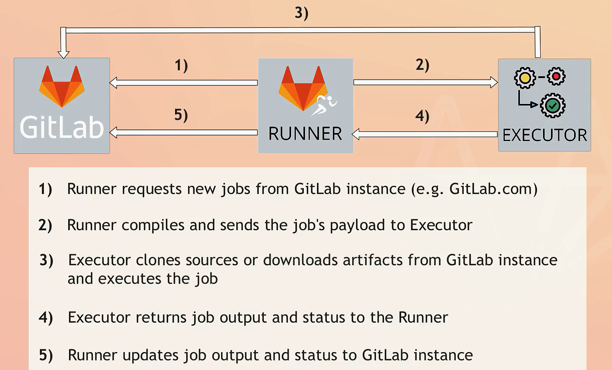
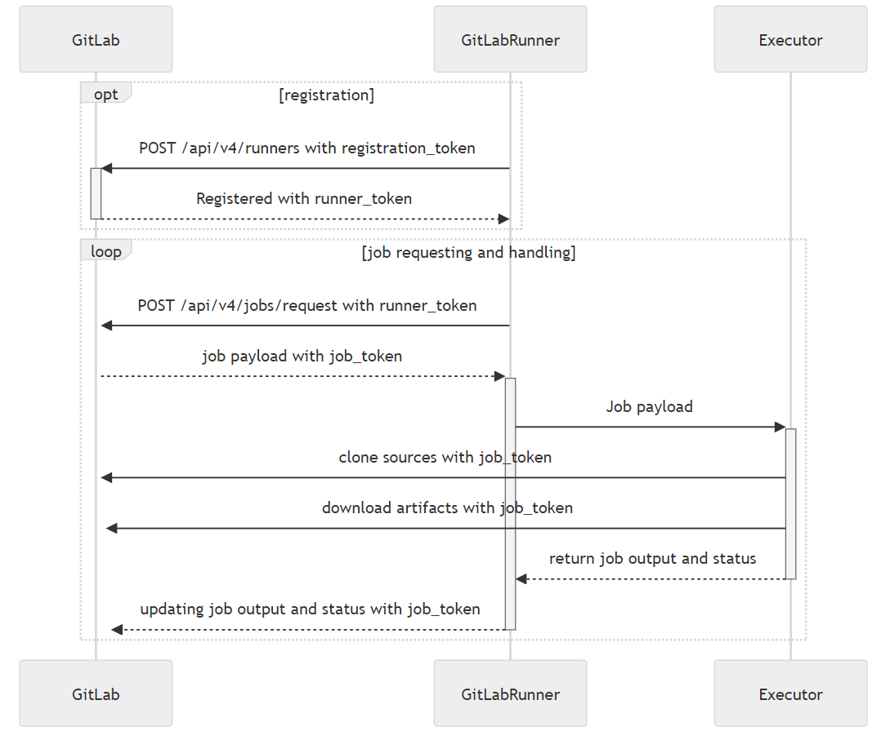
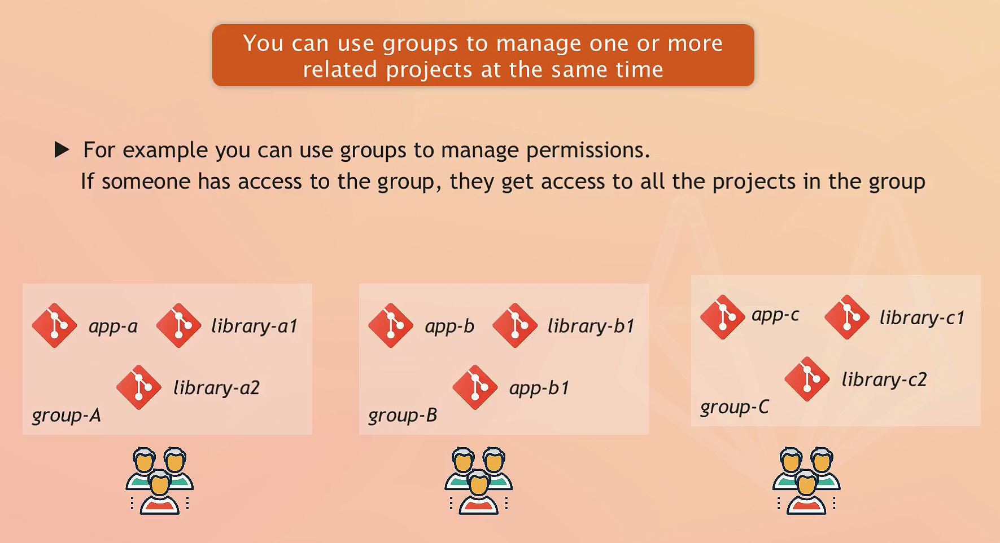
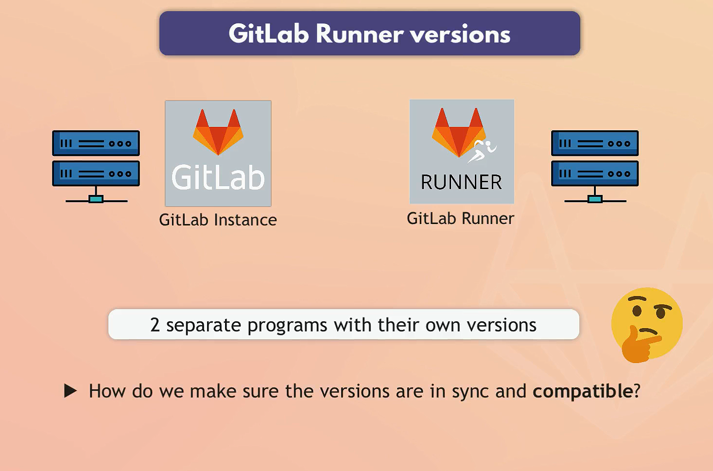
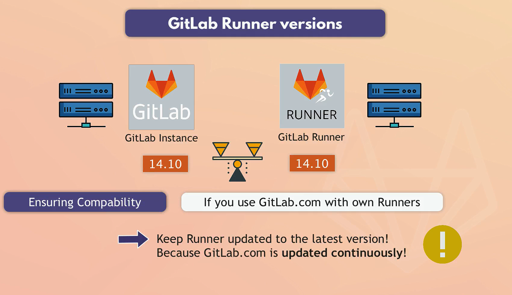

# GitLab Architecture

## GitLab Components

GitLab CI/CD architecture comprises several components that work together to automate the build, test, and deployment processes of your projects.




### 1. GitLab Server

The GitLab Server is the central component of the GitLab CI/CD system. It handles user interactions, project management, and coordination of CI/CD pipelines.

#### Key points

- **Main Component**: The core part of the GitLab CI/CD system that provides the user interface and API for managing repositories, issues, merge requests, and CI/CD pipelines.

- **Pipeline Configuration**: Users define their CI/CD pipelines using a `.gitlab-ci.yml` file within their repositories. This file specifies the stages, jobs, and conditions for executing the pipeline.

- **Manages the Pipeline Execution**: The GitLab Server orchestrates the execution of CI/CD pipelines by coordinating with GitLab Runners. It schedules jobs, monitors their progress, and handles job retries if necessary.

- **Stores the Pipeline Results**: The GitLab Server stores the results of pipeline executions, including job logs, artifacts, and status reports. This information is accessible via the GitLab web interface and API for review and analysis.

- **On-Premises or GitLab.com**: GitLab can be self-hosted (on-premises) or used as a cloud service through GitLab.com. The self-hosted option allows organizations to maintain control over their infrastructure, while GitLab.com provides a managed service with less maintenance overhead.

#### Pricing

- **GitLab.com**: Offers various pricing plans:
  - **Free**: Basic features for individual users or small teams.
  - **Premium**: Advanced features, ideal for teams requiring enhanced collaboration and support.
  - **Ultimate**: Comprehensive features for enterprises needing security, compliance, and high availability.
  - Details of the pricing plans can be found on the [GitLab pricing page](https://about.gitlab.com/pricing/).

- **Self-Hosted (On-Premises)**:
  - **Core**: Free and open-source version with essential features.
  - **Premium**: Paid version with additional features and support.
  - **Ultimate**: Paid version with full features for large enterprises.
  - Pricing for self-hosted plans is also available on the [GitLab pricing page](https://about.gitlab.com/pricing/).

### 2. GitLab Runners

GitLab Runners are lightweight agents that execute the jobs defined in your CI/CD pipelines. They provide the execution environment for your jobs and can be configured in various ways to meet the specific needs of your projects.

- **Agents that Run Your CI/CD Jobs**: Runners are responsible for executing the scripts and commands defined in your `.gitlab-ci.yml` file. They pick up jobs from the GitLab Server and run them in the specified environment.
- **Installation**: Runners are programs that you should install on a machine that's separate from the one that hosts the GitLab instance. They can be installed on physical servers, virtual machines, or cloud instances, providing flexibility in your infrastructure setup.
- **Job Assignment**: The GitLab Server assigns jobs to available Runners based on their tags and availability. You can configure specific tags in your `.gitlab-ci.yml` file to ensure jobs are executed by appropriate Runners.

#### Types of Runners

There are three types of runners, based on who you want to have access:

1. **Instance Runners**:
   - Accessible to all projects on a GitLab instance.
   - Useful for organizations that want a common pool of resources for all projects.

2. **Group Runners**:
   - Available to all projects and subgroups within a specific group.
   - Ideal for teams or departments that share resources but operate independently of other groups.

3. **Project Runners**:
   - Dedicated to individual projects.
   - Provides the highest level of control and isolation, ensuring that resources are used exclusively by the designated project.

#### Shared vs. Specific Runners

- **Shared Runners**:
  - Provided by GitLab and available to all projects in a GitLab instance across all accounts.
  - Free Usage: 400 CI/CD minutes per month
  - Convenient for general use and do not require individual setup or maintenance.
  - Managed by GitLab, they automatically scale to handle CI/CD workloads from multiple projects.
  
- **Specific Runners**:
  - Set up by users for their specific projects or groups.
  - Dedicated to particular projects or groups, providing more control over the environment and resources.

#### Executor Types

GitLab Runners can use different executors to define how and where the jobs will be executed. Each executor type offers a unique way to run CI/CD jobs:

1. **Shell Executor**: Executes jobs directly in the shell of the machine where the Runner is installed. Suitable for straightforward tasks that do not require isolation.
2. **Docker Executor**: Runs jobs in Docker containers, providing isolation and consistency. Each job runs in a separate container, making it ideal for complex builds and environments.
3. **Docker Machine Executor**: Automatically provisions and manages Docker hosts using Docker Machine, useful for dynamic scaling.
4. **Kubernetes Executor**: Executes jobs in a Kubernetes cluster, leveraging Kubernetes pods for running jobs. It is useful for leveraging container orchestration and scaling capabilities.
5. **SSH Executor**: Runs jobs on remote machines accessed via SSH. Useful for utilizing existing infrastructure without direct Runner installation.
6. **VirtualBox Executor**: Runs jobs in VirtualBox virtual machines, providing a virtualized environment for job execution.
7. **Parallels Executor**: Similar to VirtualBox but specifically for Parallels virtual machines, suitable for macOS environments.

## Example Configuration

Here’s an example of how you can configure your jobs to use specific runners with tags:

```yaml
image: node:20.15.0

workflow:
  rules:
    - if: $CI_COMMIT_BRANCH != "main" && $CI_PIPELINE_SOURCE != "merge_request_event"
      when: never
    - when: always

stages:
  - test
  - build
  - deploy

variables:
  image_repository: docker.io/my-docker-id/myapp
  image_tag: "v1.0"

test_job:
  stage: test
  script:
    - echo "Running tests"
  tags:
    - local
    - wsl
    - shell  # Assuming you want to run this on the runner with [local, wsl, shell]

build_job:
  stage: build
  script:
    - echo "Building the project"
  tags:
    - local
    - wsl
    - docker  # Assuming you want to run this on the runner with [local, wsl, docker]

deploy_job:
  image: node:20
  stage: deploy
  script:
    - npm --version
  tags:
    - local
    - wsl
    - docker  # Assuming you want to run this on the runner with [local, wsl, docker]
```

## General Notes

### Group of Repositories



- Group is Contain of Multi Repositories.
- Each Repository must be under only one Group.
- there is default Group with your Account Name.

Certainly! Here is the updated section for the GitLab Server with additional information about on-premises and GitLab.com options, as well as pricing details:

### **1 executor per runner**

1. when you register a runner, you must choose an executor.
1. **1 executor per runner**.
1. if you want multiple executor on same server then you need to register multiple runners on same host.

### Pricing for Shared Runners on GitLab.com

GitLab.com provides shared runners that can be used across all projects in a GitLab instance. The pricing for using these shared runners is tiered based on the GitLab plan you are subscribed to:

1. **Free Tier**:
   - **Free Usage**: 400 CI/CD minutes per month.
   - **Additional Minutes**: Purchase additional minutes as needed.

2. **Premium Tier**:
   - **Free Usage**: 10,000 CI/CD minutes per month.
   - **Additional Minutes**: Purchase additional minutes at a reduced rate compared to the Free tier.

3. **Ultimate Tier**:
   - **Free Usage**: 50,000 CI/CD minutes per month.
   - **Additional Minutes**: Purchase additional minutes at a further reduced rate compared to the Premium tier.

### GitLab Runner Versions



