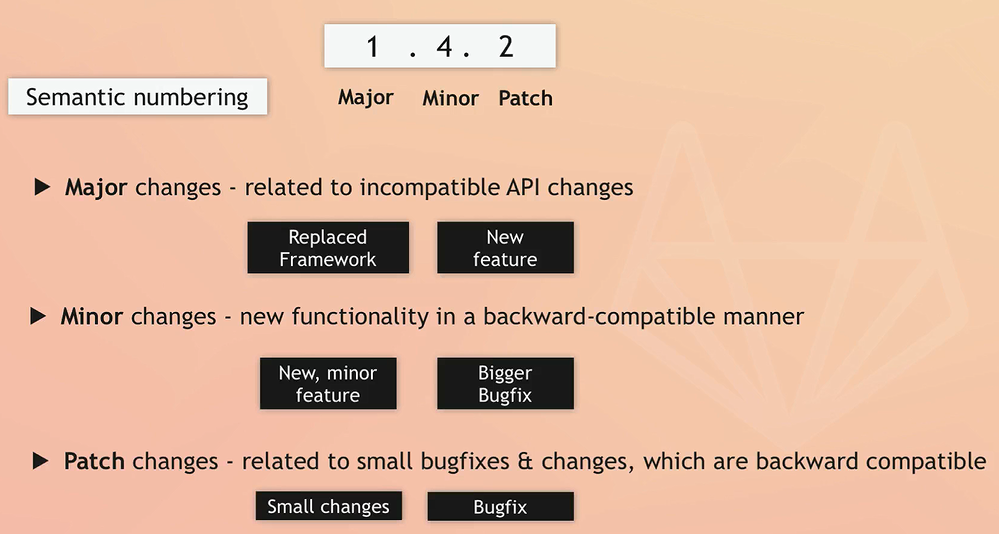
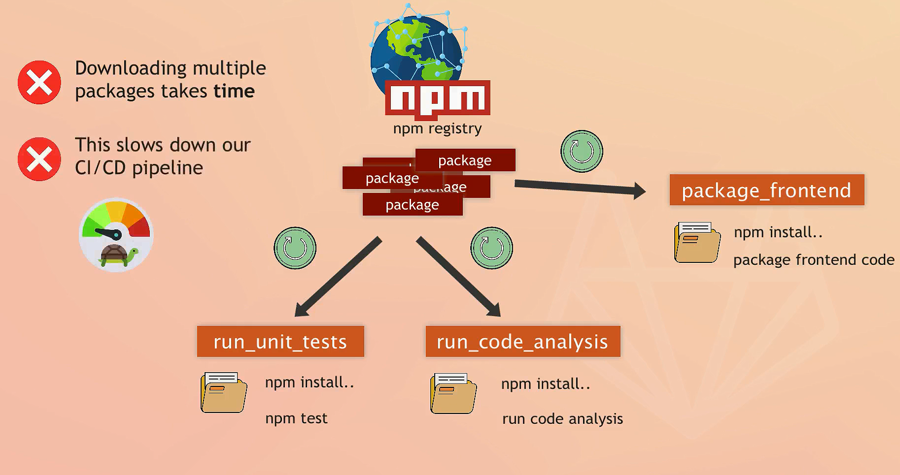
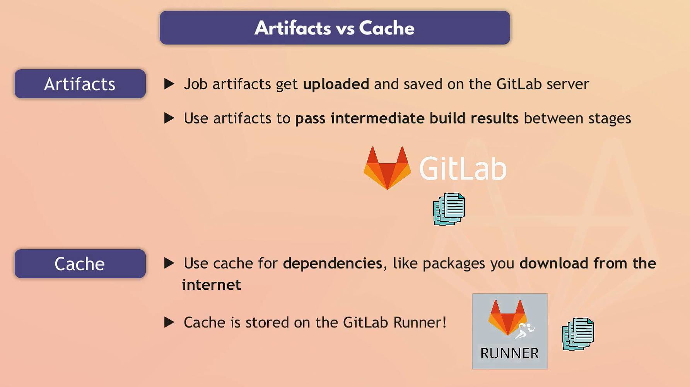
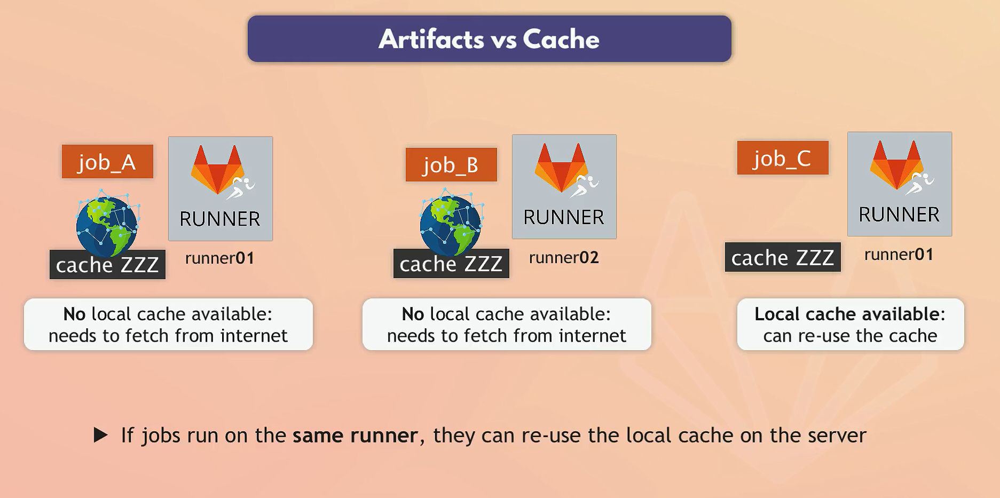
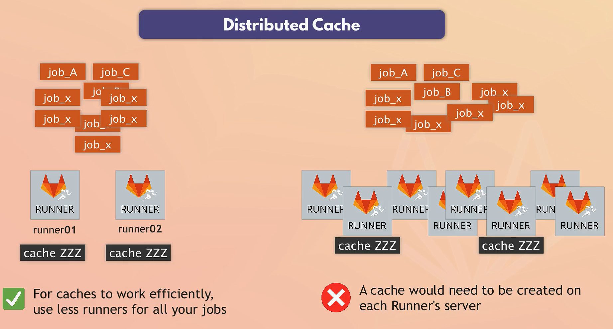
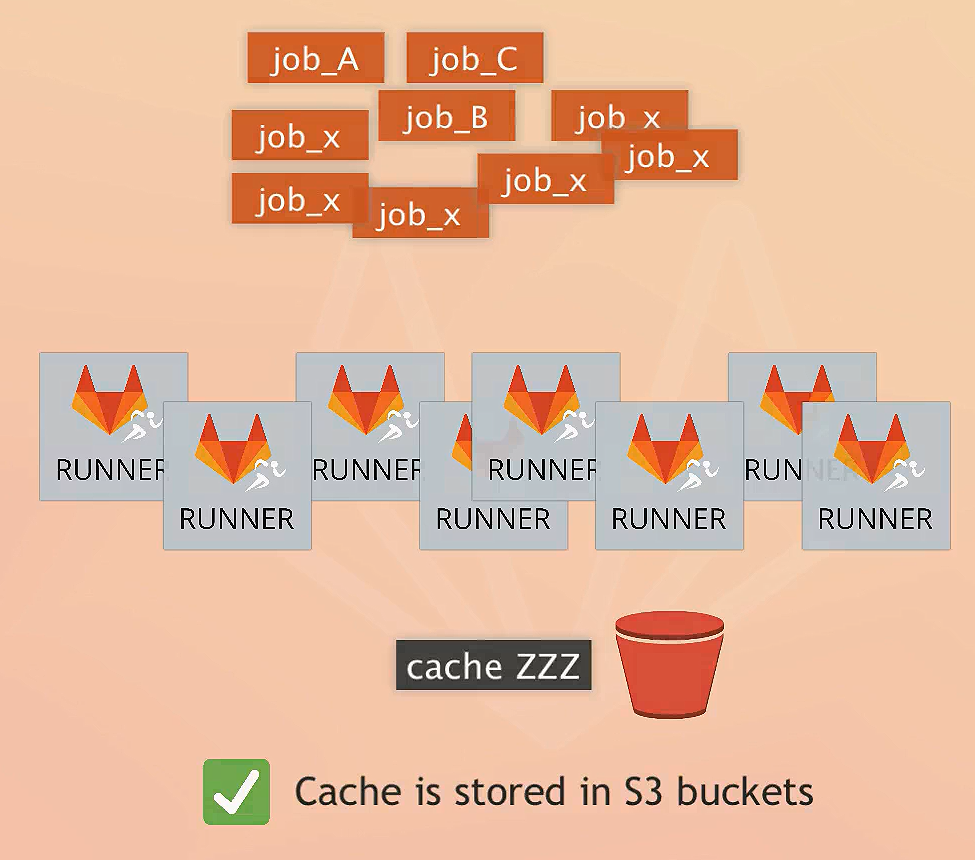
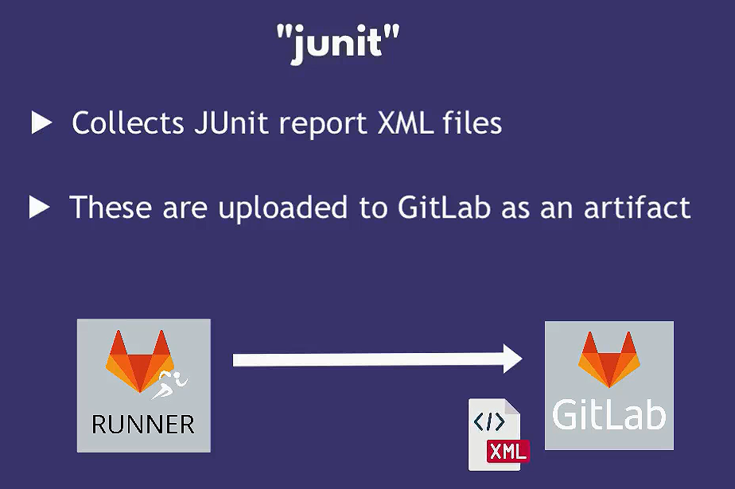

# GitLab Advanced Feature

## GitLab Container Registry

- Registry to store Docker images
- Every GitLab project can have its own space to store its Docker images
- By default, the Registry is **visible to everyone with access to the project**.
- GitLab provides temporary credentials for the Container Registry in your CI/CD pipeline
  - **CI_REGISTRY_USER**
  - **CI_REGISTRY_PASSWORD**

### Predefined Variables

- `CI_REGISTRY`: the address of GitLab Container Registry >> **registry.gitlab.com**
- `CI_REGISTRY_IMAGE`: the address of the project's Container Registry >> **registry.gitlab.com/hadywafa/node-app**

### Login

```bash
docker login -u $CI_REGISTRY_USER -p $CI_REGISTRY_PASSWORD  $CI_REGISTRY
```

### Add an image to this registry

You should include the repository location in the image name.

```bash
docker build -t $CI_REGISTRY_IMAGE:$IMAGE_TAG  .
 
docker push $CI_REGISTRY_IMAGE:$IMAGE_TAG
```

## Deployment Environments in GitLab

Deployment environments in GitLab are used to define where your code should be deployed during the CI/CD process. These environments help you manage different stages of your application lifecycle, such as development, staging, and production.

### Key Concepts

1. **Environment**: Represents a target deployment location, such as `development`, `staging`, or `production`.
2. **Environment URL**: A URL where the deployed application can be accessed.
3. **Deployments**: The process of deploying code to an environment. GitLab tracks deployments and associates them with specific environments.
4. **Review Apps**: Temporary environments created dynamically for each merge request to preview changes before merging.
5. **Protected Environments**: Environments that require special permissions to deploy to, ensuring that only authorized users can deploy to critical environments like production.

### Defining Environments

Environments are defined in the `.gitlab-ci.yml` file within your project. Each job that deploys code to an environment should specify the environment name.

Example:

```yaml
stages:
  - build
  - test
  - deploy

build_job:
  stage: build
  script:
    - echo "Building the project"

test_job:
  stage: test
  script:
    - echo "Running tests"

deploy_dev:
  stage: deploy
  script:
    - echo "Deploying to development"
    - ./deploy_to_dev.sh
  environment:
    name: development
    url: http://dev.example.com

deploy_staging:
  stage: deploy
  script:
    - echo "Deploying to staging"
    - ./deploy_to_staging.sh
  environment:
    name: staging
    url: http://staging.example.com

deploy_prod:
  stage: deploy
  script:
    - echo "Deploying to production"
    - ./deploy_to_prod.sh
  environment:
    name: production
    url: http://www.example.com
  only:
    - main
  when: manual
```

In this example, there are three deployment jobs (`deploy_dev`, `deploy_staging`, `deploy_prod`) each targeting different environments (`development`, `staging`, `production`). The `url` field specifies the URL where the deployed application can be accessed.

### Using Review Apps

Review Apps are dynamically created environments for each merge request, allowing you to preview changes before merging them into the main branch.

Example:

```yaml
stages:
  - build
  - test
  - deploy

build_job:
  stage: build
  script:
    - echo "Building the project"

test_job:
  stage: test
  script:
    - echo "Running tests"

review_app:
  stage: deploy
  script:
    - echo "Deploying review app"
    - ./deploy_review_app.sh
  environment:
    name: review/$CI_COMMIT_REF_NAME
    url: http://review-$CI_COMMIT_REF_SLUG.example.com
  only:
    - merge_requests
```

In this example, a review app environment is created for each merge request, with the environment name and URL dynamically generated based on the branch name or merge request ID.

### Protecting Environments

To ensure that only authorized users can deploy to critical environments, you can protect environments in GitLab.

Steps to protect an environment:

1. Go to your project.
2. Click on **Settings** > **CI / CD**.
3. Expand the **Protected Environments** section.
4. Specify the environment name you want to protect (e.g., `production`).
5. Define the roles allowed to deploy to this environment.

## Auto-increment images tag

Tagging your application image correctly in GitLab CI/CD is crucial for ensuring that each version of your application is unique and traceable. There are a few approaches you can take, and the best one depends on your specific workflow and requirements. Here’s a comparison of common methods:


### 1. Developer-Defined Version Tags

#### Description

The developer defines the version tag, often based on a version property in the code, such as `package.json` in a Node.js project or `AssemblyInfo.cs` in a .NET project.

#### Pros

- **Precision**: Tags are explicitly defined by the developer, ensuring they match the intended release version.
- **Consistency**: Aligns with semantic versioning practices (e.g., `1.0.0`, `1.0.1`).

#### Cons

- **Manual Step**: Requires developers to update version numbers, which can be forgotten or done incorrectly.
- **Complexity**: Additional logic may be needed to read and parse version numbers from the code.

#### Example

```yaml
deploy:
  stage: deploy
  script:
    - export VERSION=$(grep -Po '(?<="version": ")[^"]*' package.json)
    - docker build -t myapp:$VERSION .
    - docker push myapp:$VERSION
```

### 2. Pipeline Number Tags

#### Description

The pipeline number or a combination of pipeline ID and other variables (like commit hash) is used to generate the tag.

#### Pros

- **Automation**: No manual intervention is required from developers.
- **Uniqueness**: Each tag is guaranteed to be unique.
- **Simplicity**: Easy to implement using GitLab CI/CD variables.

#### Cons

- **Readability**: Tags may be less meaningful (e.g., `myapp:1234`).

#### Example

```yaml
deploy:
  stage: deploy
  script:
    - docker build -t myapp:$CI_PIPELINE_ID .
    - docker push myapp:$CI_PIPELINE_ID
```

### 3. Git Commit Hash Tags

#### Description

Tags are based on the Git commit hash, providing a unique identifier for each build.

#### Pros

- **Traceability**: Easily trace back to the exact commit.
- **Automation**: No manual steps required.

#### Cons

- **Readability**: Tags are less human-friendly (e.g., `myapp:abc123`).

#### Example

```yaml
deploy:
  stage: deploy
  script:
    - docker build -t myapp:$CI_COMMIT_SHA .
    - docker push myapp:$CI_COMMIT_SHA
```

### Best Practices for Tagging

1. **Use Semantic Versioning**: If your release process is tightly controlled and you can enforce version updates, using semantic versioning is best. It provides clear, human-readable versioning.
2. **Combine Methods**: Use a combination of a developer-defined version and an automatic identifier to ensure uniqueness and traceability. For example, `myapp:1.0.0-$CI_PIPELINE_ID`.
3. **Document the Process**: Ensure the process is well-documented so that all team members understand how and when versions are tagged.

### Recommended Approach

Combining developer-defined versions with pipeline numbers or commit hashes offers a good balance between readability, traceability, and automation. Here’s how you can implement it:

#### Example: Combining Semantic Versioning with Pipeline Number

```yaml
deploy:
  stage: deploy
  script:
    - export VERSION=$(grep -Po '(?<="version": ")[^"]*' package.json)
    - docker build -t myapp:$VERSION-$CI_PIPELINE_ID .
    - docker push myapp:$VERSION-$CI_PIPELINE_ID
```

## Passing Variables Between Jobs in GitLab CI

In GitLab CI, you can pass variables between jobs in the same pipeline using two main methods: **artifacts** and **dotenv**. Both methods allow you to share data, but they work differently and have distinct use cases.

### 1. Using Artifacts to Pass Variables

Artifacts in GitLab CI are files generated by one job and made available to subsequent jobs. You can use artifacts to store data such as environment variables and pass them between jobs.

#### Example: Using Artifacts to Pass Variables

**Step 1: Define a file to store your variables in the first job.**

```yaml
stages:
  - build
  - deploy

build_image:
  stage: build
  script:
    - export IMAGE_VERSION=$(date +%Y%m%d%H%M%S)  # Generate an image version
    - echo "IMAGE_VERSION=$IMAGE_VERSION" > image_version.txt  # Save the version to a file
    - echo "Building image with version: $IMAGE_VERSION"
    - docker build -t my-image:$IMAGE_VERSION .
  artifacts:
    paths:
      - image_version.txt  # Specify the file to be stored as an artifact
```

**Step 2: Retrieve and use the artifact in the subsequent job.**

```yaml
push_image:
  stage: deploy
  dependencies:
    - build_image  # Ensure this job depends on build_image to access its artifacts
  script:
    - IMAGE_VERSION=$(cat image_version.txt)  # Read the version from the artifact file
    - echo "Pushing image with version: $IMAGE_VERSION"
    - docker push my-image:$IMAGE_VERSION
  artifacts:
    paths:
      - image_version.txt  # Optionally, pass the artifact to another job if needed
```

### 2. Using `dotenv` to Pass Variables

The `dotenv` artifact report type in GitLab CI allows you to share environment variables directly between jobs without manually sourcing files. The variables are automatically imported into the environment of subsequent jobs.

#### Example: Using `dotenv` to Pass Variables

**Step 1: Define and store variables in a `.env` file in the first job.**

```yaml
stages:
  - build
  - deploy

build_image:
  stage: build
  script:
    - export IMAGE_VERSION=$(date +%Y%m%d%H%M%S)  # Generate an image version
    - echo "IMAGE_VERSION=$IMAGE_VERSION" >> build.env  # Save the version to a .env file
    - echo "Building image with version: $IMAGE_VERSION"
    - docker build -t my-image:$IMAGE_VERSION .
  artifacts:
    reports:
      dotenv: build.env  # Specify the .env file as a dotenv artifact
```

**Step 2: Retrieve and use the environment variables in the subsequent job.**

```yaml
push_image:
  stage: deploy
  dependencies:
    - build_image  # Ensure this job depends on build_image to access its artifacts
  script:
    - echo "Pushing image with version: $IMAGE_VERSION"
    - docker push my-image:$IMAGE_VERSION
```

### Comparison of Methods

#### Artifacts

- **Flexibility**: You can store any type of file as an artifact.
- **Manual Retrieval**: You need to manually read the data from the artifact file in subsequent jobs.
- **Use Cases**: Suitable for sharing complex data or files between jobs.

#### `dotenv`

- **Simplicity**: Environment variables are automatically imported into the subsequent jobs' environments.
- **Ease of Use**: No need to manually source files; GitLab handles it.
- **Use Cases**: Ideal for sharing simple key-value pairs as environment variables.

## Configure Caching to speed up pipeline execution







Caching in GitLab CI helps speed up your pipeline execution by storing and reusing files from previous jobs or pipeline runs. This is particularly useful for dependencies, build artifacts, and other frequently accessed files, reducing the need to re-download or rebuild them in each job.

### Benefits of Using Cache

1. **Reduced Download Times**: Speeds up jobs by caching dependency packages or other large files.
2. **Faster Build Times**: Reduces the need to recompile or rebuild unchanged components.
3. **Consistency**: Ensures that dependencies and other cached items are consistent across pipeline runs.

### How Cache Works

- **Cache Key**: Each cache entry is identified by a key. You can define a static key for a consistent cache or a dynamic key (e.g., based on job variables) for more granular control.
- **Cache Paths**: These are the directories or files you want to cache.
- **Policy**: Determines when the cache should be updated (`pull`, `push`, or `pull-push`).

### Cache Policies

You can specify when to update the cache using the `policy` attribute. The options are:

- **pull**: Only download the cache but do not update it.
- **push**: Only update the cache but do not download it.
- **pull-push**: Download the cache and update it after the job completes (default policy).

```yaml
stages:
  - build

cache:
  key: ${CI_COMMIT_REF_SLUG}
  paths:
    - node_modules/
  policy: pull-push  # Default is pull-push

build:
  stage: build
  script:
    - npm install
    - npm run build
```

### Example Configuration

```yaml
run_unit_tests:
  image: node:17-alpine3.14
  stage: test
  cache:
    key: "$CI_COMMIT_REF_NAME"
    paths:
      - app/node_modules
    policy: pull-push
  tags:
    - ec2
    - docker
    - remote
  before_script:
    - cd app
    - npm install
  script:
    - npm test

run_lint_checks:
  image: node:17-alpine3.14
  stage: test
  cache:
    key: "$CI_COMMIT_REF_NAME"
    path:
      - app/node_modules
    policy: pull
  tags:
    - ec2
    - docker
    - remote
  before_script:
    - cd app
    - npm install
  script:
    - echo "Running lint checks"
```

### Tips for Effective Caching

1. **Cache Key Strategy**: Choose a cache key strategy that balances reusability and specificity. Using commit hashes (`${CI_COMMIT_SHA}`) for granular caching or branch names (`${CI_COMMIT_REF_NAME}`) for broader caching.
2. **Cache Size**: Be mindful of cache size limits (typically 500MB in GitLab). Avoid caching unnecessary large files.
3. **Dependency Updates**: If dependencies change frequently, a more granular cache key strategy (e.g., using a hash of `package-lock.json`) might be beneficial.
4. **Cache Invalidation**: Be aware of scenarios where caches need invalidation (e.g., major dependency updates). Adjust the cache key accordingly to force cache refresh.
5. All jobs that uses same cache key uses the same cache data.

## Job Templates in GitLab

Job templates in GitLab are reusable configurations that simplify and standardize CI/CD pipelines. They promote best practices, reduce redundancy, and enhance maintainability. Here's an overview of their usage and benefits:

### Types of Job Templates

1. **Custom Job Templates**:
   - Defined within the same `.gitlab-ci.yml` file or in external files within the same repository.
   - Use the `extends` keyword to reuse configurations.

2. **GitLab Built-in Templates**:
   - Predefined templates provided by GitLab for common CI/CD tasks.
   - Included using the `include` keyword with the `template` parameter.

### Key Concepts

1. **Defining Job Templates**:
   - **Custom Template**:

     ```yaml
     .build-template:
       image: node:14
       before_script:
         - npm install
     ```

   - **Including Custom Template**:

     ```yaml
     include:
       - local: '/templates/.build-template.yml'
     ```

2. **Extending Job Templates**:
   - Jobs can extend a template to inherit its configuration:

     ```yaml
     build:
       extends: .build-template
       script:
         - npm run build
     ```

3. **Using GitLab Built-in Templates**:
   - **Including Built-in Template**:

     ```yaml
     include:
       - template: Jobs/SAST.gitlab-ci.yml
     ```

### Job Template Locations

The possible sub-keys for `include` are:

- **template**: Predefined GitLab CI templates.
- **local**: Local files within the repository.
- **project**: Files from other projects in GitLab.
- **remote**: External URLs pointing to CI configuration files.

Example:

```yaml
include:
  - project: mymicroservice-cicd/ci-templates
      ref: main
      file:
        - build.yml
        - deploy.yml
  - remote: https://gitlab.com/awesome-project/raw/master/.before-script-template.yml
  - template: Auto-DevOps.gitlab-ci.yml
  - local: .install.yml
```

### Benefits

1. **Consistency**:
   - Ensures that all jobs follow a consistent setup and configuration.

2. **Maintainability**:
   - Simplifies updating job configurations. Changes to a template propagate to all jobs extending it.

3. **Reusability**:
   - Reuse common job configurations across multiple projects and pipelines.

4. **Modularity**:
   - Separate concerns by organizing different job types into separate template files.

5. **Standardization**:
   - Leverage GitLab's best practices and continuously improved predefined templates.

### Examples

1. **Custom Job Template**:

   ```yaml
   .build-template:
     image: node:14
     before_script:
       - npm install

   build:
     extends: .build-template
     script:
       - npm run build
   ```

2. **Including and Extending Built-in Templates**:

   ```yaml
   include:
     - template: Jobs/SAST.gitlab-ci.yml

   stages:
     - build
     - test
     - security
     - deploy

   build:
     stage: build
     script:
       - npm run build

   test:
     stage: test
     script:
       - npm test

   deploy:
     stage: deploy
     script:
       - npm run deploy
   ```

By leveraging job templates, you can enhance the efficiency, consistency, and maintainability of your CI/CD pipelines in GitLab.

## Notes

### Show Test Result Report to in GitLab



```yml
run_unit_tests:
image: node:17-alpine3.14
tags:
    - ec2
    - docker
    - remote
before_script:
    - cd app
    - npm install
script:
    - npm run test
artifacts:
    when: always  # generate artifact event before job is failed. 
    reports:
    junit:
        - app/junit.xml
```

### **needs 🆚 dependencies tags**

#### needs

- Tells GitLab **push_image** needs to wait with execution until **build_image** completed
- artifacts from the jobs listed will be downloaded by default
- no need to define **dependencies** separately

#### dependencies

- Tells GitLab which artifact it needs or not from other jobs
- by default job will download all artifact from previous stages, with empty array, you configure the job to not download any artifacts.

    ```yml
    test_dev:
      stage: deploy
      dependencies: []
      script:
        - echo "testing"
    ```

- control which dependencies should downloaded will speed up execution

### - Variable is only available in the job it was defined = job environment

### - Every job get executed in its own new environment
