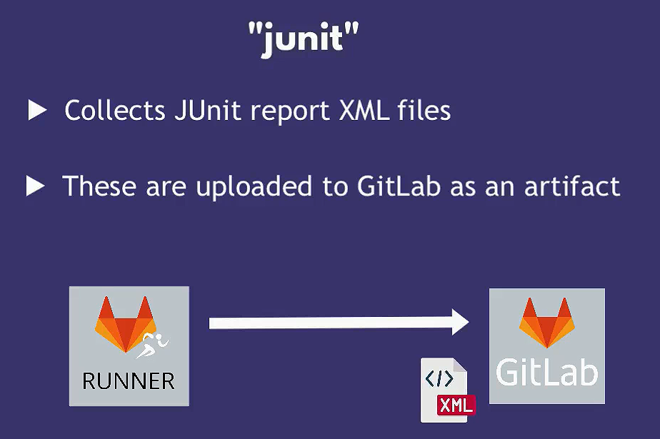

# GitLab Advanced Feature

## GitLab Container Registry

- Registry to store Docker images
- Every GitLab project can have its own space to store its Docker images
- By default, the Registry is **visible to everyone with access to the project**.
- GitLab provides temporary credentials for the Container Registry in your CI/CD pipeline
  - **CI_REGISTRY_USER**
  - **CI_REGISTRY_PASSWORD**

### Predefined Variables

- `CI_REGISTRY`: the address of GitLab Container Registry >> **registry.gitlab.com**
- `CI_REGISTRY_IMAGE`: the address of the project's Container Registry >> **registry.gitlab.com/hadywafa/node-app**

### Login

```bash
docker login -u $CI_REGISTRY_USER -p $CI_REGISTRY_PASSWORD  $CI_REGISTRY
```

### Add an image to this registry

You should include the repository location in the image name.

```bash
docker build -t $CI_REGISTRY_IMAGE:$IMAGE_TAG  .
 
docker push $CI_REGISTRY_IMAGE:$IMAGE_TAG
```

## Deployment Environments in GitLab

Deployment environments in GitLab are used to define where your code should be deployed during the CI/CD process. These environments help you manage different stages of your application lifecycle, such as development, staging, and production.

### Key Concepts

1. **Environment**: Represents a target deployment location, such as `development`, `staging`, or `production`.
2. **Environment URL**: A URL where the deployed application can be accessed.
3. **Deployments**: The process of deploying code to an environment. GitLab tracks deployments and associates them with specific environments.
4. **Review Apps**: Temporary environments created dynamically for each merge request to preview changes before merging.
5. **Protected Environments**: Environments that require special permissions to deploy to, ensuring that only authorized users can deploy to critical environments like production.

### Defining Environments

Environments are defined in the `.gitlab-ci.yml` file within your project. Each job that deploys code to an environment should specify the environment name.

Example:

```yaml
stages:
  - build
  - test
  - deploy

build_job:
  stage: build
  script:
    - echo "Building the project"

test_job:
  stage: test
  script:
    - echo "Running tests"

deploy_dev:
  stage: deploy
  script:
    - echo "Deploying to development"
    - ./deploy_to_dev.sh
  environment:
    name: development
    url: http://dev.example.com

deploy_staging:
  stage: deploy
  script:
    - echo "Deploying to staging"
    - ./deploy_to_staging.sh
  environment:
    name: staging
    url: http://staging.example.com

deploy_prod:
  stage: deploy
  script:
    - echo "Deploying to production"
    - ./deploy_to_prod.sh
  environment:
    name: production
    url: http://www.example.com
  only:
    - main
  when: manual
```

In this example, there are three deployment jobs (`deploy_dev`, `deploy_staging`, `deploy_prod`) each targeting different environments (`development`, `staging`, `production`). The `url` field specifies the URL where the deployed application can be accessed.

### Using Review Apps

Review Apps are dynamically created environments for each merge request, allowing you to preview changes before merging them into the main branch.

Example:

```yaml
stages:
  - build
  - test
  - deploy

build_job:
  stage: build
  script:
    - echo "Building the project"

test_job:
  stage: test
  script:
    - echo "Running tests"

review_app:
  stage: deploy
  script:
    - echo "Deploying review app"
    - ./deploy_review_app.sh
  environment:
    name: review/$CI_COMMIT_REF_NAME
    url: http://review-$CI_COMMIT_REF_SLUG.example.com
  only:
    - merge_requests
```

In this example, a review app environment is created for each merge request, with the environment name and URL dynamically generated based on the branch name or merge request ID.

### Protecting Environments

To ensure that only authorized users can deploy to critical environments, you can protect environments in GitLab.

Steps to protect an environment:

1. Go to your project.
2. Click on **Settings** > **CI / CD**.
3. Expand the **Protected Environments** section.
4. Specify the environment name you want to protect (e.g., `production`).
5. Define the roles allowed to deploy to this environment.

## Auto-increment images tag

## Deploy to Docker Compose

## Deploy to Docker K8s

## Notes

### Show Test Result Report to in GitLab



```yml
run_unit_tests:
  image: node:17-alpine3.14
  tags:
    - ec2
    - docker
    - remote
  before_script:
    - cd app
    - npm install
  script:
    - npm run test
  artifacts:
    when: always  # generate artifact event before job is failed. 
    reports:
      junit:
        - app/junit.xml
```

### needs 🆚 dependencies tags
