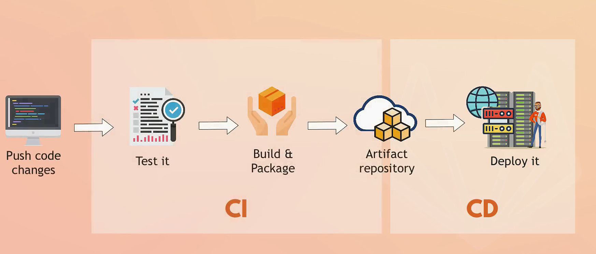
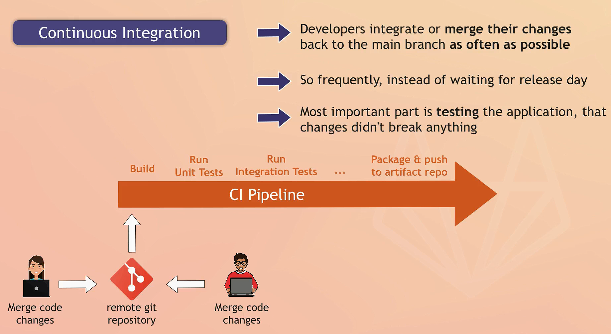
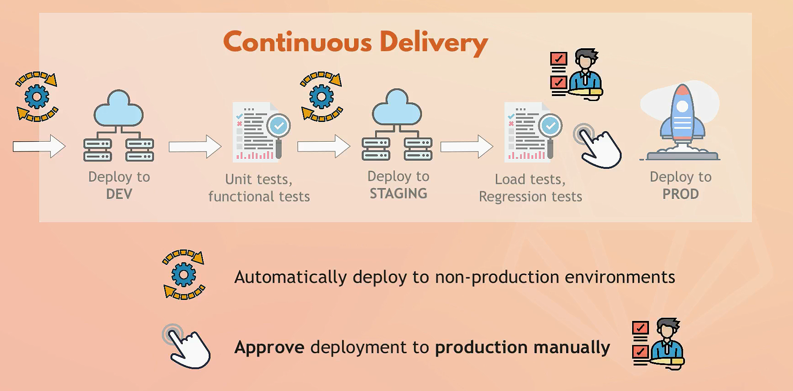

# GitLab CI





## Basic Syntax

A GitLab CI/CD pipeline is defined by a `.gitlab-ci.yml` file placed in the root of your repository. This file contains the various stages, jobs, and scripts that will be executed.

### Key Concepts and Keywords

1. **Stages**: Defines the order in which jobs are executed.
1. **Jobs**: Individual tasks that are part of the pipeline.
1. **Scripts**: Commands executed by the job.
1. **Artifacts**: Files generated by jobs that can be passed between stages.
1. **Cache**: Temporary storage to speed up subsequent pipeline runs.
1. **Variables**: Custom variables used in scripts.
1. **Services**: Docker services that can be linked to jobs.
1. **Image**: Docker image used to run the jobs.
1. **Before_script**: Commands that run before each job.
1. **After_script**: Commands that run after each job.
1. **Only/Except**: Conditions to control when jobs run.

### Examples

- Example 1: Basic Pipeline

```yaml
stages:
  - build
  - test
  - deploy

build_job:
  stage: build
  script:
    - echo "Building the project"

test_job:
  stage: test
  script:
    - echo "Running tests"

deploy_job:
  stage: deploy
  script:
    - echo "Deploying the project"
  only:
    - master
```

- Example 2: Using Docker Image

```yaml
image: python:3.8

stages:
  - build
  - test

build_job:
  stage: build
  script:
    - pip install -r requirements.txt
    - python setup.py build

test_job:
  stage: test
  script:
    - pytest
```

- Example 3: Artifacts and Cache

```yaml
stages:
  - build
  - test

build_job:
  stage: build
  script:
    - mkdir -p build
    - echo "Building project" > build/output.txt
  artifacts:
    paths:
      - build/

test_job:
  stage: test
  script:
    - cat build/output.txt
  dependencies:
    - build_job
```

- Example 4: Variables and Environments

```yaml
stages:
  - deploy

variables:
  STAGING_SERVER: "staging.example.com"
  PRODUCTION_SERVER: "prod.example.com"

deploy_staging:
  stage: deploy
  script:
    - echo "Deploying to staging server"
    - ssh deploy@$STAGING_SERVER "deploy_script.sh"
  environment:
    name: staging
    url: http://staging.example.com
  only:
    - develop

deploy_production:
  stage: deploy
  script:
    - echo "Deploying to production server"
    - ssh deploy@$PRODUCTION_SERVER "deploy_script.sh"
  environment:
    name: production
    url: http://prod.example.com
  only:
    - master
```

- Example 5: Conditional Jobs

```yaml
stages:
  - build
  - test
  - deploy

build_job:
  stage: build
  script:
    - echo "Building the project"

test_job:
  stage: test
  script:
    - echo "Running tests"
  only:
    - branches # all branches.
  except:
    - master

deploy_job:
  stage: deploy
  script:
    - echo "Deploying the project"
  only:
    - master
```

- Example 6: Using Before and After Scripts

```yaml
before_script:
  - echo "This runs before every job"

stages:
  - build
  - test
  - deploy

build_job:
  stage: build
  script:
    - echo "Building the project"

test_job:
  stage: test
  script:
    - echo "Running tests"

after_script:
  - echo "This runs after every job"
```

- Real Examples : Asp.net Core app

```yaml
image: mcr.microsoft.com/dotnet/core/sdk:3.1

stages:
  - build
  - test
  - deploy

variables:
  PROJECT_NAME: "YourAspNetCoreProject"
  BUILD_DIR: "build"
  TEST_RESULTS: "test_results"

before_script:
  - echo "Starting ASP.NET Core CI process"

build_job:
  stage: build
  script:
    - echo "Building the project"
    - dotnet restore
    - dotnet build --configuration Release --output $BUILD_DIR
  artifacts:
    paths:
      - $BUILD_DIR/

test_job:
  stage: test
  script:
    - echo "Running tests"
    - mkdir -p $TEST_RESULTS
    - dotnet test --logger "trx;LogFileName=$TEST_RESULTS/test_results.trx"
  artifacts:
    when: always
    paths:
      - $TEST_RESULTS/

deploy_job:
  stage: deploy
  script:
    - echo "Deploying the project"
    - dotnet publish -c Release -o $BUILD_DIR
  only:
    - master
```

- Real Examples : Angular app

```yaml
image: node:14

stages:
  - install
  - build
  - test
  - deploy

variables:
  NODE_ENV: production

before_script:
  - echo "Starting Angular CI process"
  - npm install -g @angular/cli

install_job:
  stage: install
  script:
    - echo "Installing dependencies"
    - npm install

build_job:
  stage: build
  script:
    - echo "Building the project"
    - ng build --prod
  artifacts:
    paths:
      - dist/

test_job:
  stage: test
  script:
    - echo "Running tests"
    - ng test --watch=false --browsers=ChromeHeadless
  artifacts:
    when: always
    paths:
      - coverage/

deploy_job:
  stage: deploy
  script:
    - echo "Deploying the project"
    - npm run deploy
  only:
    - master
```

## Advanced Syntax

### Conditions

#### Key Conditions and Keywords

1. **only**: Specifies that a job will run only for certain branches, tags, or other conditions.
2. **except**: Specifies that a job will not run for certain branches, tags, or other conditions.
3. **rules**: Provides more advanced control, allowing complex conditions using logical operators and environment variables.

#### Detailed Explanation

- `only`  
    The `only` keyword is used to specify which branches, tags, or pipeline events should trigger the job. It can be used with branches, tags, merge requests, schedules, and more.

    ```yaml
    job_name:
    script: "echo 'This job runs only on certain branches'"
    only:
        - master          # Only runs on the master branch
        - develop         # Only runs on the develop branch
        - branches        # Runs  for all branches
        - /^feature-.*$/  # Only runs on branches matching the regex pattern
        - tags            # Runs only for tagged commits
        - merge_requests  # Runs only for merge requests
    ```

- `except`  
    The `except` keyword is used to specify which branches, tags, or pipeline events should not trigger the job.

    ```yaml
    job_name:
    script: "echo 'This job runs except on certain branches'"
    except:
        - master          # Does not run on the master branch
        - develop         # Does not run on the develop branch
        - /^hotfix-.*$/   # Does not run on branches matching the regex pattern
        - tags            # Does not run for tagged commits
        - merge_requests  # Does not run for merge requests
    ```

- `rules`  
    The `rules` keyword offers more advanced and flexible conditions for controlling job execution. It allows combining conditions using logical operators and using predefined GitLab CI/CD variables.

    ```yaml
    job_name:
    script: "echo 'This job runs based on rules'"
    rules:
        - if: '$CI_COMMIT_BRANCH == "master"'      # Runs if the branch is master
        - if: '$CI_COMMIT_BRANCH == "develop"'     # Runs if the branch is develop
        - if: '$CI_PIPELINE_SOURCE == "merge_request_event"'  # Runs for merge requests
        - if: '$CI_COMMIT_TAG'                     # Runs if the commit is tagged
        - if: '$SCHEDULED_PIPELINE'                # Runs if the pipeline is scheduled (using custom variable)
        when: always                             # Overrides default behavior to always run
    ```

#### Using Conditions in Real Examples

- Example 1: Triggering Jobs for Specific Branches

```yaml
stages:
  - build
  - test
  - deploy

build_job:
  stage: build
  script:
    - echo "Building the project"
  only:
    - master
    - develop
    - /^feature-.*$/

test_job:
  stage: test
  script:
    - echo "Running tests"
  except:
    - /^hotfix-.*$/

deploy_job:
  stage: deploy
  script:
    - echo "Deploying the project"
  only:
    - master
  rules:
    - if: '$CI_COMMIT_BRANCH == "master"'
```

- Example 2: Triggering Jobs for Merge Requests

```yaml
stages:
  - build
  - test
  - deploy

build_job:
  stage: build
  script:
    - echo "Building the project"
  only:
    - merge_requests
    - branches

test_job:
  stage: test
  script:
    - echo "Running tests"
  rules:
    - if: '$CI_PIPELINE_SOURCE == "merge_request_event"'

deploy_job:
  stage: deploy
  script:
    - echo "Deploying the project"
  only:
    - master
  rules:
    - if: '$CI_COMMIT_BRANCH == "master"'
```

- Example 3: Advanced Conditions with Rules

```yaml
stages:
  - build
  - test
  - deploy

build_job:
  stage: build
  script:
    - echo "Building the project"
  rules:
    - if: '$CI_COMMIT_BRANCH == "master"'
    - if: '$CI_COMMIT_BRANCH =~ /^feature-.*$/'

test_job:
  stage: test
  script:
    - echo "Running tests"
  rules:
    - if: '$CI_PIPELINE_SOURCE == "merge_request_event"'
    - if: '$CI_COMMIT_BRANCH == "develop"'
    - if: '$CI_COMMIT_TAG'

deploy_job:
  stage: deploy
  script:
    - echo "Deploying the project"
  rules:
    - if: '$CI_COMMIT_BRANCH == "master"'
      when: manual        # Requires manual intervention to run
    - if: '$CI_PIPELINE_SOURCE == "schedule"'
      when: on_success    # Runs on success of previous stages
```

#### Predefined Variables

GitLab CI/CD provides several predefined variables that can be used in conditions:

- `$CI_COMMIT_BRANCH`: The branch name for which the project is built.
- `$CI_COMMIT_TAG`: The tag name for which the project is built.
- `$CI_PIPELINE_SOURCE`: The event that triggered the pipeline (e.g., `push`, `merge_request_event`, `schedule`).
- `$CI_COMMIT_REF_NAME`: The branch or tag name for which the project is built.
