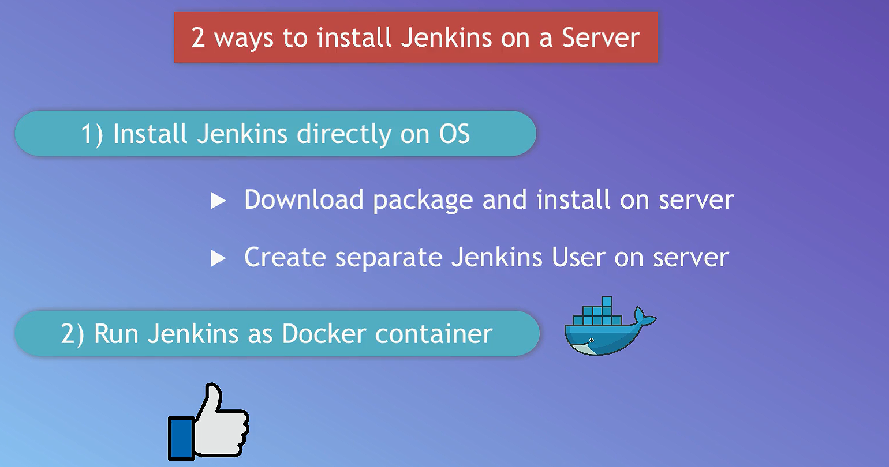
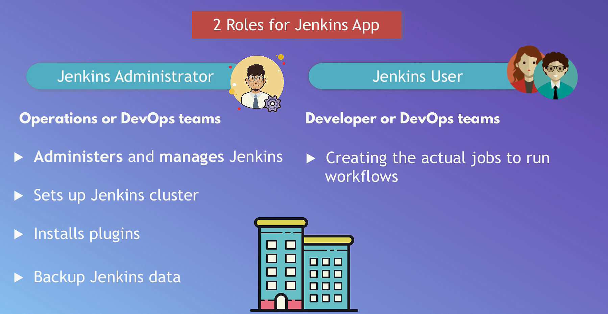
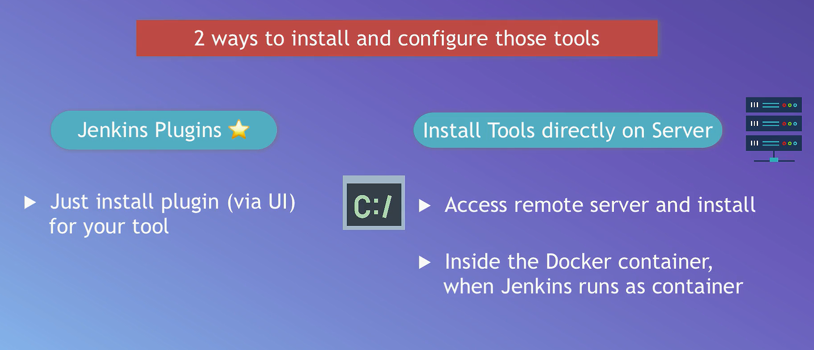
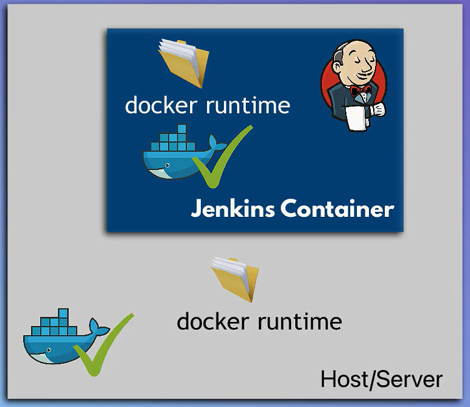

# Jenkins

## Fundamentals

### What is Jenkins ?

[`Jenkins`](https://www.jenkins.io/) is an open-source automation server widely used for continuous integration and continuous delivery (CI/CD) in software development. It facilitates the automation of building, testing, and deploying applications, helping teams deliver high-quality software more efficiently.





### Install Jenkins as Docker Container

1. open inbound firewall 8080 port
1. connect to ec2 instance
    > ssh my-first-server
1. setup docker
    > sudo apt update
    >
    > sudo apt install docker.io
    >
    > sudo usermod -aG docker $USER

1. restart terminal session
1. pull image / run container
    > docker run -p 80:8080 -p 50000:50000 -d -v jenkins_home:/var/jenkins_home jenkins/jenkins:lts
1. set admin password
    > docker volume inspect jenkins_home
    > cat /var/lib/docker/jenkins_home/_data/secret/initialAdminPassword

## Docker inside Jenkins Container



**Docker-in-Docker (DinD)** allows Docker to run inside a Docker container. This setup enables Jenkins to build, run, and manage Docker containers,
also allows for efficient CI/CD pipelines with Docker while keeping resource usage manageable.

### How It Works

- **Shared Docker Daemon**: Both Jenkins and Docker operations inside the container share the same Docker daemon from the host. This means any Docker containers Jenkins manages are actually managed by the host's Docker system.

- **No Separate Docker Runtime**: There’s no separate Docker runtime inside the Jenkins container. All Docker commands issued within the container affect the host's Docker environment.

### Implications

- **Centralized Management**: All Docker containers are managed in a centralized way by the host's Docker daemon.

- **Shared Resources**: Jenkins containers and other containers use the same resources (images, containers, networks, volumes) on the host.

### Steps

#### 1. Mount the Docker runtime and start the Jenkins container with DinD support

When you run the Jenkins container with `-v /var/run/docker.sock:/var/run/docker.sock`, you're sharing the host machine's Docker daemon with the Jenkins container. This means Jenkins can control Docker on the host directly.

```bash
docker run -d \
-u root \
-p 80:8080 \
-p 50000:50000 \
-v jenkins_home:/var/jenkins_home \
-v /var/run/docker.sock:/var/run/docker.sock \
jenkins/jenkins:lts
```

#### 2. Run a script inside the Jenkins container to install Docker

```bash
docker exec -u 0 -it [container-id] bash
```

```bash
curl https://get.docker.com/ > dockerinstall && chmod 777 dockerinstall && ./dockerinstall
```

#### 3. Change the permission of the `docker.sock` file inside the Jenkins container

```bash
chmod 666 /var/run/docker.sock
```

- The `docker.sock` file is a Unix socket file used by the Docker daemon to communicate with the Docker client.
- Modifies permissions to allow Jenkins to communicate with the Docker daemon.
- chmod 666: Grants read and write permissions to all users for the Docker socket.
- if you restart the container, you need to run this command again.

## Job Types in Jenkins

Jenkins supports various job types, each designed for specific tasks within the CI/CD process. Here are the most important ones:

1. **Freestyle Projects**:
   - Basic, flexible jobs for simple tasks.
   - Configured through the Jenkins UI.
   - Limited to input field of plugin.
   - not recommended for complex CI/CD workflows.

2. **Pipeline Projects**:
   - Defined using a Jenkinsfile with Groovy syntax.
   - Allows complex, multi-stage builds and is recommended for modern CI/CD practices.

     ```groovy
     pipeline {
       agent any
       stages {
         stage('Build') {
           steps {
             sh 'echo Building...'
           }
         }
         stage('Test') {
           steps {
             sh 'echo Testing...'
           }
         }
         stage('Deploy') {
           steps {
             sh 'echo Deploying...'
           }
         }
       }
     }
     ```

3. **Multibranch Pipeline**:
   - Automatically creates pipelines for each branch in a repository.
   - Useful for managing different branches with distinct Jenkins files.

     ```groovy
     # Jenkinsfile in each branch
     pipeline {
       agent any
       stages {
         stage('Branch Specific') {
           steps {
             sh 'echo Running on branch-specific pipeline...'
           }
         }
       }
     }
     ```

4. **Folder Projects**:
   - Organizes multiple jobs into a single folder.
   - Helps manage and structure jobs in large Jenkins instances.

5. **GitHub Organization**:
   - Automatically discovers and manages repositories in a GitHub organization.
   - Each repository's Jenkinsfile defines its pipeline.

6. **External Job**:
   - Tracks the execution of jobs that run outside Jenkins.
   - Useful for monitoring jobs not directly managed by Jenkins.

### Summary

- **Freestyle**: Simple, flexible, and good for straightforward tasks.
- **Pipeline**: Advanced, Groovy-based, ideal for complex CI/CD workflows.
- **Multibranch Pipeline**: Manages pipelines per branch, ideal for multi-branch development.
- **Folders**: Organizes jobs for better management.
- **GitHub Organization**: Integrates with GitHub for seamless project management.
- **External Job**: Monitors external processes not directly controlled by Jenkins.

## Build Tools vs. Plugins

- **Build Tools**:
  - **Purpose**: Automate tasks like compiling code, running tests, and packaging applications.
  - **Examples**: Maven, Gradle, NPM. They focus on project-specific tasks and dependency management.

- **Plugins**:
  - **Purpose**: Extend Jenkins' functionality. They integrate with various tools, provide UI enhancements, and add new features.
  - **Examples**: Git plugin (for SCM integration), Docker plugin (for managing containers), Slack plugin (for notifications).

## Docker Containers As Build Agents for Jenkins

- You can run build steps inside Docker containers using the Docker plugin.
- This allows you to isolate environments, similar to GitLab CI, and improve performance by leveraging container technology.
- Each job can specify its container, providing a consistent and clean environment for builds.

### Benefits of Using Containers

1. **Isolation**: Each job runs in its environment, avoiding conflicts.
2. **Consistency**: Ensures builds have the same dependencies and tools each time.
3. **Performance**: Containers can be optimized for speed and efficiency.

### Example in Jenkinsfile

```groovy
pipeline {
  agent {
    docker {
      image 'maven:3.8.1-jdk-11'
    }
  }
  stages {
    stage('Build') {
      steps {
        sh 'mvn clean install'
      }
    }
  }
}
```

### Example 1: ASP.NET Core Application

```groovy
pipeline {
  agent {
    docker {
      label 'dotnet' // Use Docker agent template defined for .NET Core
      image 'mcr.microsoft.com/dotnet/sdk:5.0' // .NET Core SDK Docker image
      args '-v $HOME/.nuget:/root/.nuget' // Mounting .nuget cache for faster builds
    }
  }
  environment {
    ASPNETCORE_ENVIRONMENT = 'Production'
  }
  stages {
    stage('Build') {
      steps {
        script {
          sh 'dotnet restore'
          sh 'dotnet build -c Release'
        }
      }
    }
    stage('Test') {
      steps {
        script {
          sh 'dotnet test --no-build'
        }
      }
    }
    stage('Publish') {
      steps {
        script {
          sh 'dotnet publish -c Release -o ./publish'
        }
      }
    }
  }
}
```

### Example 2: Angular Application

```groovy
pipeline {
  agent {
    docker {
      label 'node' // Use Docker agent template defined for Node.js
      image 'node:14' // Node.js Docker image
      args '-v $HOME/.npm:/root/.npm' // Mounting .npm cache for faster builds
    }
  }
  environment {
    NODE_ENV = 'production'
  }
  stages {
    stage('Install Dependencies') {
      steps {
        script {
          sh 'npm install'
        }
      }
    }
    stage('Build') {
      steps {
        script {
          sh 'npm run build -- --prod'
        }
      }
    }
    stage('Test') {
      steps {
        script {
          sh 'npm run test'
        }
      }
    }
  }
}
```

### Notes

- **Customization**: Modify the Docker image (`image`) and commands (`steps`) as per your specific project setup and requirements.
- **Cache Management**: Using `-v $HOME/.nuget:/root/.nuget` and `-v $HOME/.npm:/root/.npm` mounts helps speed up builds by caching dependencies between builds.
- **Pipeline Execution**: Ensure Jenkins is configured with Docker integration as described earlier to utilize Docker containers effectively as build agents.

These examples demonstrate how to leverage Docker containers as build agents in Jenkins pipelines for ASP.NET Core and Angular applications, providing flexibility, consistency, and reproducibility in your CI/CD workflows. Adjust the specifics according to your project's needs and Docker image availability.

## Notes

### **daemon.json**

**daemon.json** file is a configuration file used by the Docker daemon to specify various settings to customize the behavior and functionality of the Docker daemon according to you specific needs.

```vim
{
    "insecure-registries": ["myregistrydomain.com:5000"]
}
```  
