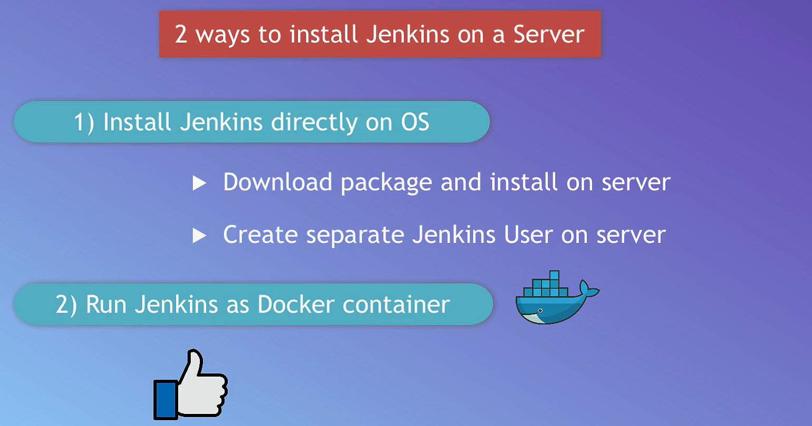

# Jenkins (Day 23)

## Fundamentals

### What is Jenkins ?

[`Jenkins`](https://www.jenkins.io/) is an open-source automation server widely used for continuous integration and continuous delivery (CI/CD) in software development. It facilitates the automation of building, testing, and deploying applications, helping teams deliver high-quality software more efficiently.

### Install Jenkins as Docker Container

1. open inbound firewall 8080 port
1. connect to ec2 instance
    > ssh my-first-server
1. setup docker
    > sudo apt update
    >
    > sudo apt install docker.io
    >
    > sudo usermod -aG docker $USER

1. restart terminal session
1. pull image / run container
    > docker run -p 80:8080 -p 50000:50000 -d -v jenkins_home:/var/jenkins_home jenkins/jenkins:lts
1. set admin password
    > docker volume inspect jenkins_home
    > cat /var/lib/docker/jenkins_home/_data/secret/initialAdminPassword

## Jobs types in Jenkins

## Docker inside Jenkins

1.
1.
1.
1.
1.
