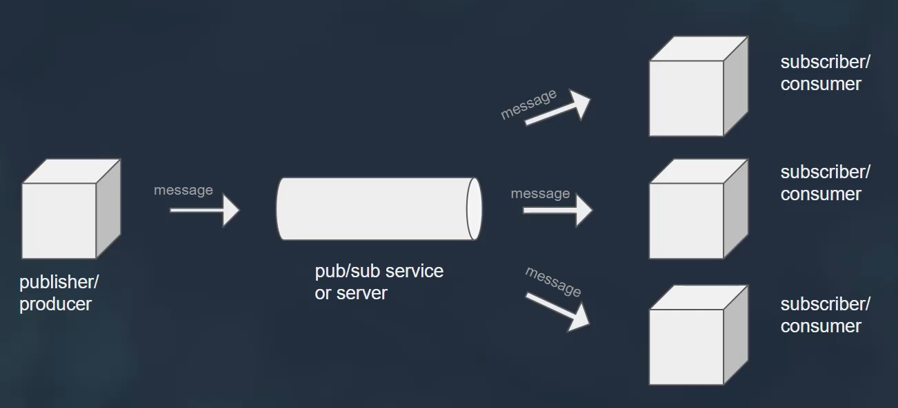
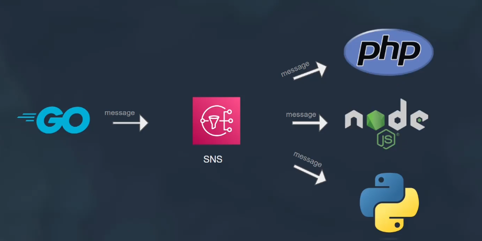
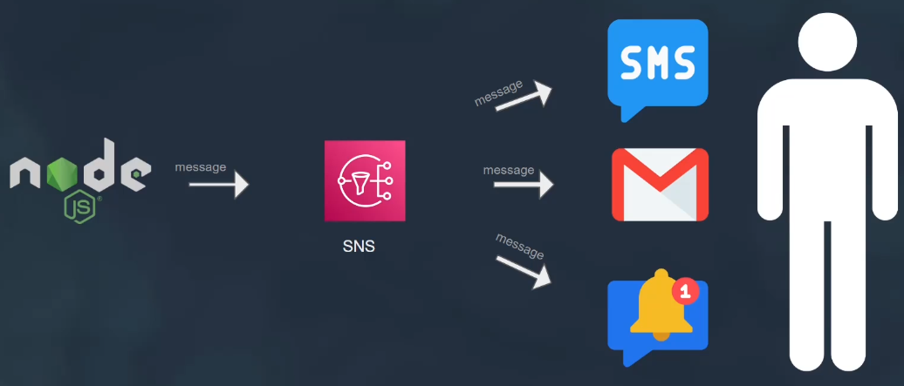

# Simple Notification Service (SNS)

 Amazon Simple Notification Service (SNS) is a fully managed messaging service provided by AWS that enables the decoupling of microservices, distributed systems, and serverless applications. SNS facilitates the coordination and communication between different components by sending messages, notifications, or alerts from publishers to subscribers.

## Types

### 1. A2A (Application to Application)

   1. publisher to sns topic
   1. subscriber to sns topic

### 2. A2P (Application to Person)

## Key Features of Amazon SNS

1. **Topic-Based Publish/Subscriber Model**:
   - **Topics**: A topic is a logical access point for sending messages to multiple subscribers. Publishers send messages to topics, and SNS distributes these messages to all the subscribers of that topic.
   - **Publishers**: Any service or application that sends messages to an SNS topic.
   - **Subscribers**: Endpoints that receive messages from an SNS topic. Subscribers can include AWS `Lambda functions`, `SQS queues`, `HTTP/S endpoints`, and `email addresses`.

2. **Message Delivery**:
   - SNS supports different protocols for message delivery, including HTTP/S, email, SMS, SQS, and Lambda functions.
   - **Fan-Out Pattern**: One message can be sent to multiple endpoints (e.g., all subscribers to a topic).

3. **Message Filtering**:
   - SNS allows message filtering policies to be set for topics. This means subscribers can receive only the messages that are relevant to them based on message attributes.

4. **Mobile Notifications**:
   - SNS can send messages directly to mobile devices through push notifications using platforms like Apple Push Notification Service (APNs) and Google Cloud Messaging (GCM).

5. **Durability and Scalability**:
   - SNS automatically scales to handle very large volumes of messages, ensuring messages are delivered reliably and promptly.

6. **Security**:
   - Access control can be managed through AWS Identity and Access Management (IAM) policies, ensuring that only authorized users and applications can publish to or subscribe to SNS topics.

## How SNS Works

1. **Create a Topic**:
   - You create a topic in the AWS Management Console, CLI, or SDKs. This topic will act as the communication channel.

2. **Subscribe to the Topic**:
   - Subscribers (such as email addresses, Lambda functions, SQS queues, or HTTP endpoints) subscribe to the topic to receive messages.

3. **Publish Messages**:
   - Publishers send messages to the topic. SNS then handles the message delivery to all the subscribers.

4. **Receive Messages**:
   - Subscribers receive the messages through the endpoint specified during subscription (e.g., an email address will receive an email, a Lambda function will get triggered, etc.).

## Example Use Cases

1. **Application Alerts**:
   - Developers can use SNS to send alerts and notifications about application events or errors to monitoring systems or on-call teams.

2. **Fan-Out**:
   - A single event can trigger multiple processes. For example, an image upload can trigger several functions to process the image, update databases, and notify users.

3. **Mobile Push Notifications**:
   - SNS can be used to send push notifications to mobile apps, informing users of updates, messages, or other events.

### Summary

Amazon SNS is a versatile and scalable messaging service that allows decoupling of microservices through a topic-based publish/subscribe model. It supports multiple message delivery protocols, ensuring that messages are delivered reliably and promptly to all intended subscribers. SNS's flexibility and ease of integration with other AWS services make it ideal for various use cases, including application alerts, fan-out messaging patterns, and mobile push notifications.

For more detailed information, you can refer to the [official AWS SNS documentation](https://docs.aws.amazon.com/sns/latest/dg/welcome.html)【32†source】.
