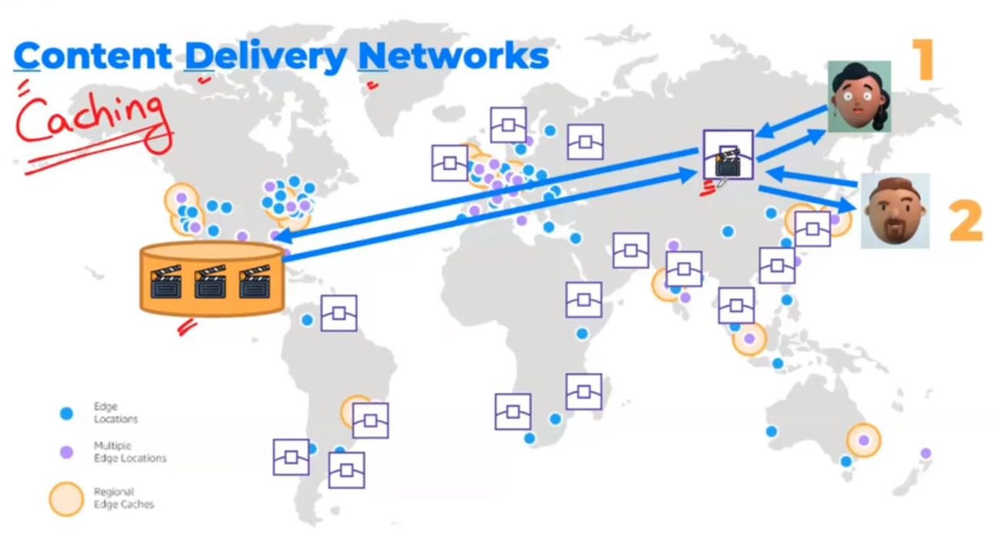

# AWS CloudFront

Amazon CloudFront is a fast content delivery network (CDN) service that securely delivers data, videos, applications, and APIs to customers globally with low latency and high transfer speeds. Here’s an in-depth look at CloudFront:



## Key Features of CloudFront

1. **Global Edge Network**
   - CloudFront has a network of edge locations and regional edge caches worldwide, ensuring content is delivered to end users with the lowest possible latency.

2. **Content Delivery**
   - **Static Content**: Distribute static files such as HTML, CSS, JavaScript, and images.
   - **Dynamic Content**: Serve dynamic, personalized, and real-time content, leveraging features like Lambda@Edge for serverless compute at the edge.
   - **Streaming**: Deliver media with live or on-demand streaming using HTTP/S, RTMP, or other streaming protocols.

3. **Security**
   - **Encryption**: Supports HTTPS, SSL/TLS encryption, and integration with AWS Certificate Manager (ACM) for SSL certificates.
   - **DDoS Protection**: Built-in protection against DDoS attacks via AWS Shield.
   - **Access Control**: Supports signed URLs and cookies for secure content delivery, restricting access to authorized users.

4. **Performance**
   - **Caching**: Reduces latency by caching content at edge locations.
   - **Origin Shield**: Provides an additional layer of caching to protect your origin from excess traffic.
   - **Compression**: Automatically compresses certain file types for efficient delivery.

5. **Scalability**
   - Automatically scales to meet the demands of your traffic, accommodating spikes in demand seamlessly.

6. **Cost-Effectiveness**
   - Pay-as-you-go pricing model, with no upfront fees or long-term contracts.

## How CloudFront Works

1. **Distribution**: You create a CloudFront distribution, which is a configuration entity that tells CloudFront where your origin servers are located and how to cache and deliver content.
   - **Web Distribution**: For websites, APIs, and HTTP(S) content.
   - **RTMP Distribution**: For streaming media using Adobe’s RTMP protocol (less commonly used now).

2. **Origins**: CloudFront fetches content from one or more origin servers.
   - **S3 Buckets**: For static files.
   - **Custom Origins**: Such as EC2 instances, Elastic Load Balancing, or any web server.

3. **Edge Locations**: When a user requests content, CloudFront routes the request to the nearest edge location for the fastest possible delivery.

4. **Caching**: If the content is cached at the edge location, CloudFront immediately serves the cached content. If not, it fetches the content from the origin server, caches it at the edge, and serves it to the user.

5. **Delivery**: Subsequent requests for the same content are served from the cache, improving performance and reducing load on the origin server.

## Setting Up CloudFront

### Step-by-Step Guide

1. **Create a Distribution**
   - Go to the AWS Management Console.
   - Navigate to CloudFront and create a new distribution.
   - Choose the type of distribution: Web or RTMP.

2. **Configure Origins and Behaviors**
   - **Origin Settings**: Specify the origin (e.g., S3 bucket, custom origin).
   - **Default Cache Behavior**: Set caching policies, viewer protocols (HTTP or HTTPS), allowed HTTP methods, and forward headers/cookies.

3. **Configure Distribution Settings**
   - **Price Class**: Choose the edge locations to use (all locations or a subset for cost savings).
   - **SSL/TLS**: Configure SSL certificates for HTTPS.
   - **Logging**: Enable logging to track requests.

4. **Deploy and Monitor**
   - Once configured, deploy the distribution. It may take a few minutes to propagate.
   - Monitor the distribution using AWS CloudWatch and CloudFront reports.

## Use Cases

- **Website Acceleration**: Speed up the delivery of websites by caching static content at edge locations.
- **API Acceleration**: Reduce the latency of API responses by caching responses at edge locations.
- **Software Distribution**: Efficiently distribute large files like software binaries, patches, and updates.
- **Live Streaming and Video on Demand**: Deliver high-quality video streams to a global audience.
- **Security and Access Control**: Serve sensitive data securely with features like signed URLs and AWS WAF integration.

## Benefits

- **Low Latency**: Content is delivered from the edge location closest to the user.
- **High Availability**: Built on the highly reliable AWS infrastructure.
- **Scalability**: Automatically handles traffic spikes.
- **Security**: Comprehensive security features to protect content and applications.
- **Cost-Effective**: Pay only for what you use with no upfront costs.

## Example: Setting Up a Simple Web Distribution

Here’s a basic example of setting up a CloudFront distribution for an S3 bucket:

### 1. Create an S3 Bucket

```sh
aws s3api create-bucket --bucket my-cloudfront-bucket --region us-west-2 --create-bucket-configuration LocationConstraint=us-west-2
```

### 2. Upload Content to the S3 Bucket

```sh
aws s3 cp mywebsite/index.html s3://my-cloudfront-bucket/index.html
```

### 3. Create a CloudFront Distribution

```sh
aws cloudfront create-distribution --origin-domain-name my-cloudfront-bucket.s3.amazonaws.com --default-root-object index.html
```

### 4. Configure the Distribution in the AWS Console

- Go to the CloudFront console, find your new distribution, and customize settings such as caching behavior, SSL, and logging.

By leveraging CloudFront, you can deliver content with improved performance, reliability, and security, ensuring a better experience for your users worldwide.
