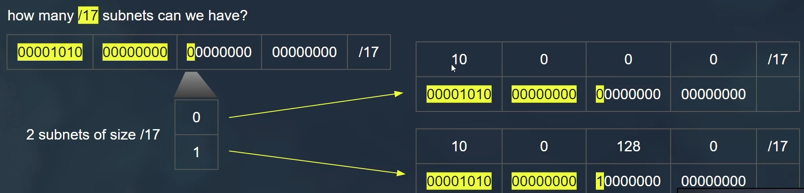

# Virtual Private Cloud

## Components

- Each vpc must be in one region.
- Each vpc have multi nested subnets.
- Each subnet must be in one AZ.
- Private subnet has not public ips.
- Each subnet has range of ips.
- There is default created vpc per aws account

## Understanding IP in AWS

### each byte can contain 255 possible numbers

### network devices working with binary data

### IP = Network Number + Host Number

### Class full addressing (old)

### CIDR Classless Inter-Domain Routing (new)

## Design VPC subnets in AWS

### We create subnets from host id not from network id

### Calculation of Subnets

- To identical subnets of **/17**

- To identical subnets of **/18**

- To mixed size subnets
 

- CIDR address should not overlaps with existing subnet CIDR with

### Reserved IPs for any subnets

## Example Design VPC subnets in AWS

## Network Connections

### 1. Peering

- **Purpose**: Connects two VPCs privately.
- **Use Case**: Allows resources in different VPCs to communicate as if they were within the same network.
- **Benefits**: Low latency, no bandwidth bottleneck, and cost-effective for inter-VPC traffic.

### 2. Transit Gateway

- **Purpose**: Acts as a central hub to connect multiple VPCs, on-premises networks, and remote networks.
- **Use Case**: Simplifies complex network architectures by centralizing connections.
- **Benefits**: Scalable, simplifies routing, reduces peering connections, and improves management.

### 3. AWS Direct Connect

- **Purpose**: Provides a dedicated network connection from on-premises data centers to AWS.
- **Use Case**: High-throughput, low-latency access to AWS services.
- **Benefits**: Consistent network performance, increased bandwidth, and reduced data transfer costs.

### 4. AWS Site-to-Site VPN

- **Purpose**: Establishes a secure and encrypted connection between on-premises networks and AWS.
- **Use Case**: Extends your on-premises network to AWS securely over the internet.
- **Benefits**: Cost-effective, quick setup, secure communication, and redundancy.

### 5. Internet Gateway

- **Purpose**: Enables communication between instances in a VPC and the internet.
- **Use Case**: Allows instances to receive incoming traffic from the internet and send outbound traffic to the internet.
- **Benefits**: Scalability, high availability, and seamless internet access for VPC resources.

### 6. NAT Gateway

- **Purpose**: Allows instances in a private subnet to access the internet while preventing inbound traffic from the internet.
- **Use Case**: Secure outbound internet access for instances in private subnets.
- **Benefits**: Managed service, high availability, and scalability without managing NAT instances.

### Summary

- **Peering**: Direct VPC-to-VPC connection.
- **Transit Gateway**: Central hub for connecting multiple networks.
- **AWS Direct Connect**: Dedicated physical connection to AWS.
- **AWS Site-to-Site VPN**: Secure connection over the internet to AWS.
- **Internet Gateway**: Internet access for VPC resources.
- **NAT Gateway**: Outbound internet access for private subnet instances.

These gateways and connections help create a robust, scalable, and secure network infrastructure within AWS, catering to different connectivity needs.
