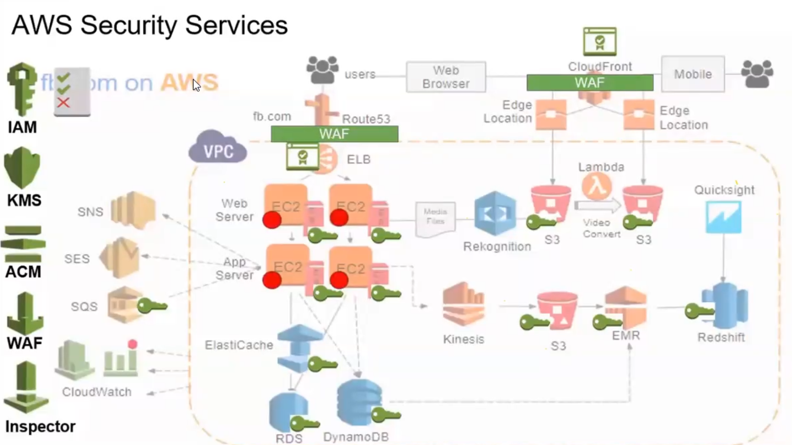

# AWS Services (Day 22)

## AWS Components

1. Region
    - it is Specific region in a country
    - Each Region zone has many (AZ)
1. Availability Zone (AZ)
    - it is collection of data center
1. Edge Location
    - storage is responsible only for caching

- Example without aws services

- Example with aws services

