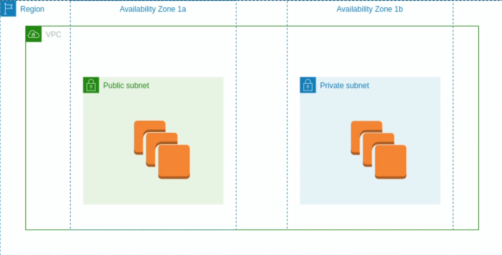
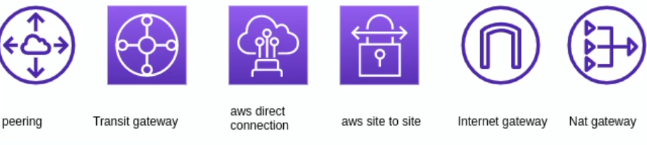
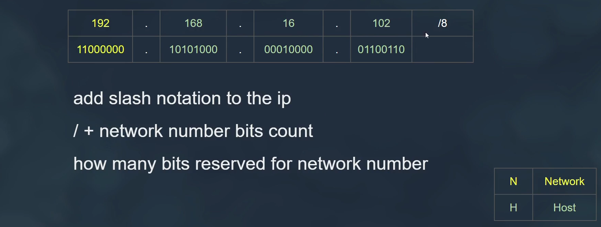
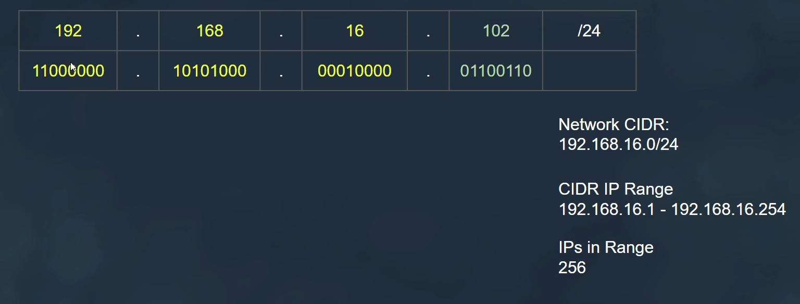
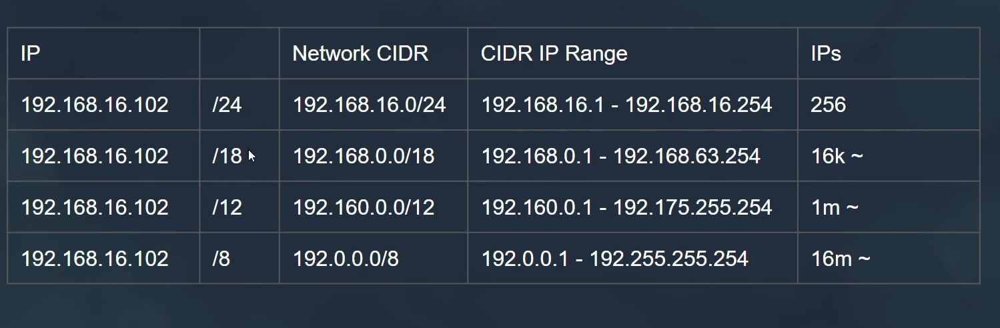
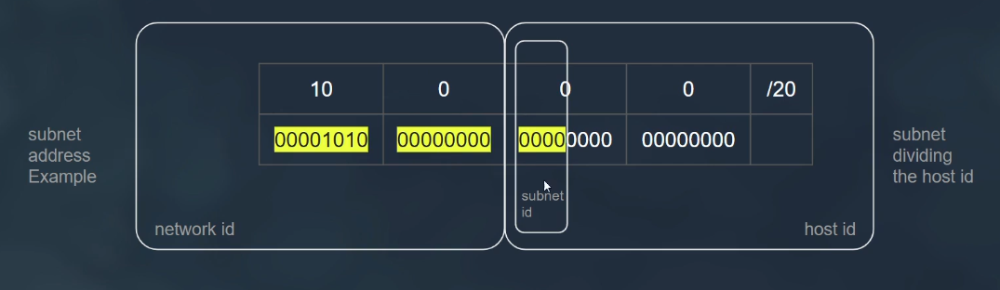
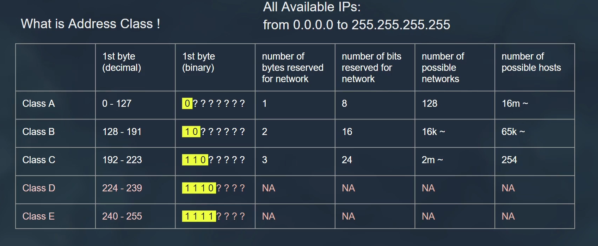
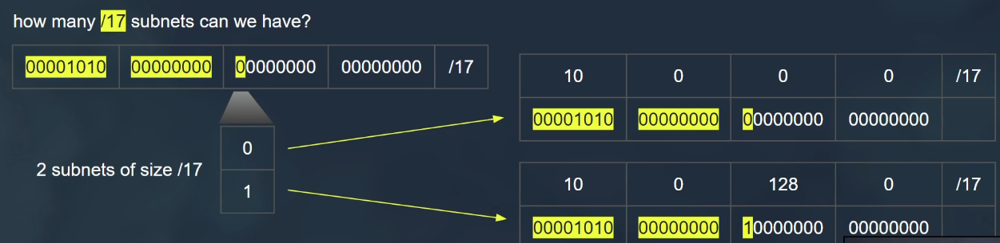
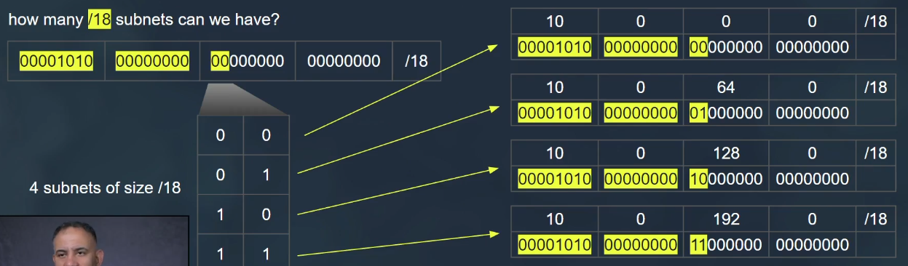
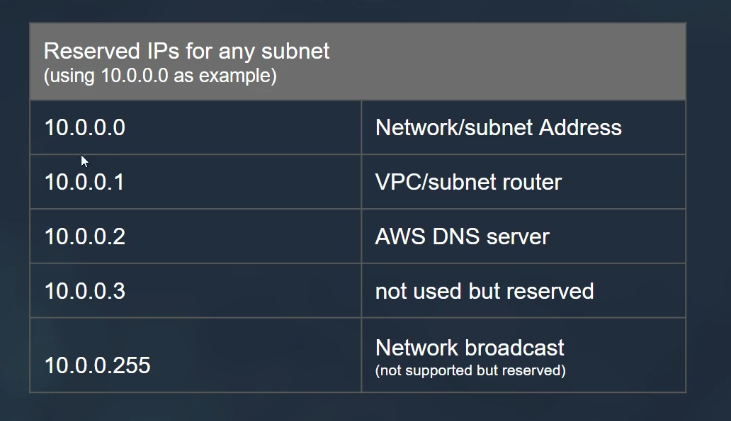

# Virtual Private Cloud

## Components

- Each vpc must be in one region.
- Each vpc have multi nested subnets.
- Each subnet must be in one AZ.
- Private subnet has not public ips.
- Each subnet has range of ips.
- There is default created vpc per aws account

## Network Connections

## Understanding IP in AWS

- each byte can contain 255 possible numbers

- network devices working with binary data

- IP = Network Number + Host Number

- class full addressing (old)

- CIDR Classless Inter-Domain Routing (new)

## Understand Subnets in AWS

