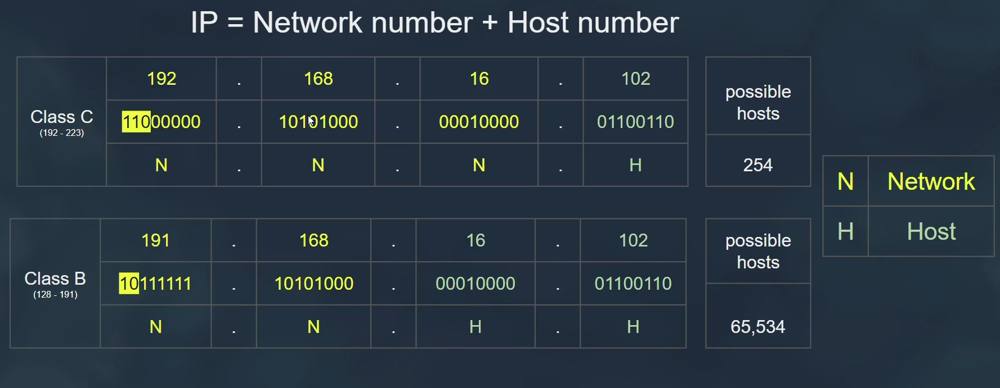
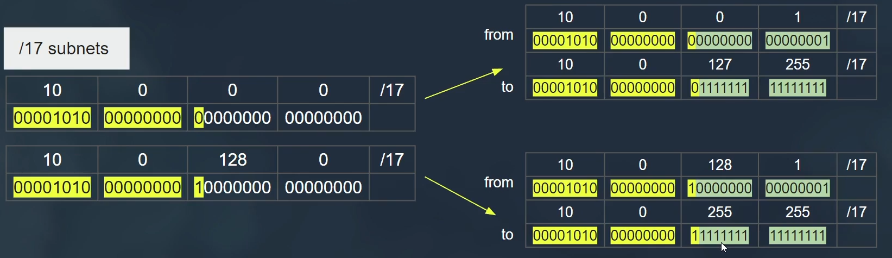
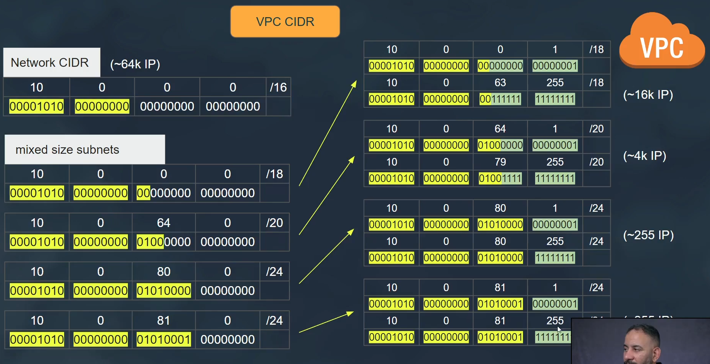

# Virtual Private Cloud

## Components

- Each vpc must be in one region.
- Each vpc have multi nested subnets.
- Each subnet must be in one AZ.
- Private subnet has not public ips.
- Each subnet has range of ips.
- There is default created vpc per aws account

## Network Connections

## Understanding IP in AWS

### each byte can contain 255 possible numbers

### network devices working with binary data

### IP = Network Number + Host Number

### Class full addressing (old)

### CIDR Classless Inter-Domain Routing (new)

## Design VPC subnets in AWS

### We create subnets from host id not from network id

### Calculation of Subnets

- To identical subnets of **/17**

- To identical subnets of **/18**

- To mixed size subnets
 

- CIDR address should not overlaps with existing subnet CIDR with

### Reserved IPs for any subnets

## Example Design VPC subnets in AWS
