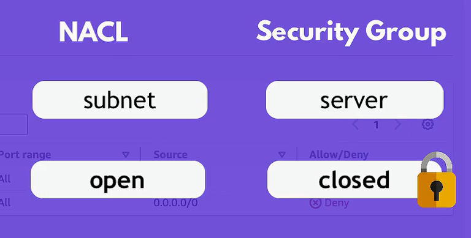

# Notes

## Route Table in AWS VPC

A route table in AWS VPC (Virtual Private Cloud) is a set of rules, called routes, that are used to determine where network traffic is directed. Each subnet in your VPC must be associated with a route table, which controls the routing for that subnet. A route table contains a set of rules, known as routes, that are used to determine where network traffic from your subnet or gateway is directed.

### Key Concepts of Route Tables in AWS VPC

1. **Route Table**: A collection of routes that define the paths to different network destinations. Each route specifies a destination CIDR block and a target (such as an Internet Gateway, NAT Gateway, or another VPC).

2. **Main Route Table**: Each VPC automatically comes with a main route table that all subnets are initially associated with. You can change the main route table and create additional custom route tables.

3. **Custom Route Table**: You can create additional route tables and associate them with one or more subnets. This allows for more granular control over network routing within your VPC.

4. **Route**: An entry in a route table that specifies a destination and a target. Routes define where traffic for specific IP address ranges is directed.

### Components of a Route Table

- **Destination**: The destination CIDR block for the route. It specifies the IP address range that the route applies to.
- **Target**: The target for the traffic that matches the destination. This could be an Internet Gateway, NAT Gateway, VPC Peering Connection, VPN Connection, or an instance acting as a NAT.

### AWS Route Table Basics

Think of an AWS route table like a map that helps network traffic know where to go, similar to how a GPS helps you find the right roads to get to your destination. Here's a breakdown of the key columns and their meanings:

1. **Destination**
2. **Target**
3. **Status**
4. **Propagated**

### Detailed Explanation

#### Destination

- **What it is**: This column specifies the destination for the traffic, like the address you want to visit.
- **Analogy**: Imagine you're driving and you have addresses for different places you want to go.
- **Example**:
  - `0.0.0.0/0`: This means "anywhere in the world" (the whole internet).
  - `10.0.1.0/24`: This means "anywhere in the 10.0.1.x neighborhood" (a specific range of IP addresses within your VPC).

#### Target

- **What it is**: This column tells the traffic where to go next to reach the destination, like the road or path you need to take.
- **Analogy**: If you want to get to the mall, your GPS might tell you to take Main Street.
- **Example**:
  - `igw-xxxxxxxx`: An Internet Gateway (like a bridge to the internet).
  - `nat-xxxxxxxx`: A NAT Gateway (like a detour that allows private networks to access the internet).
  - `local`: Stay within the VPC, like a local road within your town.

#### Status

- **What it is**: This column shows whether the route is active or not.
- **Analogy**: Like a road sign that tells you if the road is open or closed.
- **Example**:
  - `active`: The route is open and working.
  - `blackhole`: The route is broken or not working (like a road that’s closed or has a detour).

#### Propagated

- **What it is**: This indicates whether the route was automatically added by AWS (like when you set up a VPN).
- **Analogy**: Imagine you have automatic updates for your GPS that add new roads or fix old ones.
- **Example**:
  - `yes`: AWS added this route automatically, you didn’t have to do it yourself.
  - `no`: You (or someone in your team) manually added this route.

### Visual Example

Here's what a route table might look like in AWS, with an explanation for each part:

| Destination | Target       | Status  | Propagated |
|-------------|--------------|---------|------------|
| 0.0.0.0/0   | igw-12345678 | active  | no         |
| 10.0.1.0/24 | local        | active  | no         |
| 10.0.2.0/24 | nat-87654321 | active  | no         |

- **0.0.0.0/0 -> igw-12345678**: Traffic going anywhere in the world (0.0.0.0/0) should use the internet gateway (igw-12345678). This lets your servers talk to the internet.
- **10.0.1.0/24 -> local**: Traffic going to the 10.0.1.x network stays within the VPC.
- **10.0.2.0/24 -> nat-87654321**: Traffic going to the 10.0.2.x network should go through the NAT gateway (nat-87654321), allowing private subnet instances to access the internet.

### Common Route Table Targets

- **Internet Gateway (igw-xxxxxx)**: Routes traffic to the internet. Typically used for public subnets.
- **NAT Gateway (nat-xxxxxx)**: Routes traffic from private subnets to the internet via a NAT gateway.
- **VPC Peering Connection (pcx-xxxxxx)**: Routes traffic to another VPC via a VPC peering connection.
- **Virtual Private Gateway (vgw-xxxxxx)**: Routes traffic to an on-premises network via a VPN connection.
- **Instance ID (i-xxxxxx)**: Routes traffic to a specific instance, often used in more advanced routing scenarios like NAT instances.

### Best Practices for Using Route Tables

1. **Separate Public and Private Subnets**: Use separate route tables for public and private subnets. Public subnets should have a route to an Internet Gateway, while private subnets should have routes to a NAT Gateway or NAT instance.

2. **Minimize Route Table Complexity**: Keep your route tables as simple as possible. Complex route tables can make network troubleshooting more difficult.

3. **Use Descriptive Names**: Name your route tables and routes clearly to reflect their purpose and usage.

4. **Secure Private Subnets**: Ensure private subnets do not have direct routes to the Internet Gateway. Instead, use NAT Gateways for secure internet access.

### Summary

A route table in AWS VPC is a critical component that directs network traffic within and outside of the VPC. It contains routes that determine the paths for traffic to various destinations, such as the internet, other VPCs, or on-premises networks. By understanding and correctly configuring route tables, you can effectively manage and secure the network traffic in your AWS environment.

- **Destination**: Where the traffic is headed.
- **Target**: The next hop or path to take.
- **Status**: Whether the route is active.
- **Propagated**: If the route was added automatically by AWS.

## Firewalls in AWS VPC

- NACL vs Sg

- NACL
  - Network Access Control List
  - Stateless
  - Applied at subnet level
  - Rules are evaluated in order

- Security Group
  - Stateful
  - Applied at instance level
  - Rules are evaluated in order
