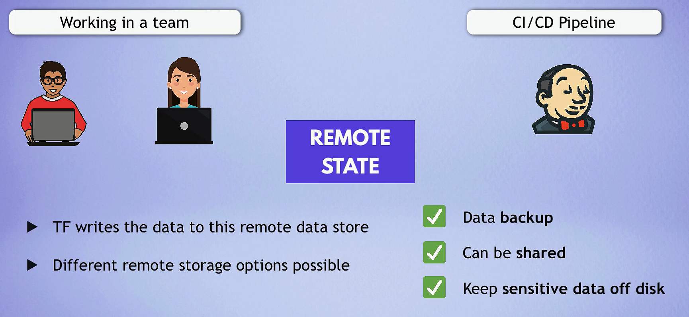

# Terraform Syntax

## **Terraform File Structure**

Terraform projects typically follow a specific file structure to organize configurations, variables, and modules effectively. Here are two common project structures:

### Simplified Project Structure

```bash
my-terraform-project/
├── modules/               # Reusable modules
│   ├── module1/
│   ├── module2/
├── environments/          # Environment-specific configurations
│   ├── dev/
│   ├── staging/
│   └── prod/
├── main.tf                # Root configuration file
├── providers.tf           # Provider configurations
├── variables.tf           # Variable definitions
├── outputs.tf             # Output values
└── terraform.tfvars       # Default variable values
```

### Advanced Project Structure

```txt
my-terraform-project/
├── modules/
│   ├── vpc/
│   │   ├── main.tf
│   │   ├── variables.tf
│   │   └── outputs.tf
│   ├── ec2/
│   │   ├── main.tf
│   │   ├── variables.tf
│   │   └── outputs.tf
│   └── s3/
│       ├── main.tf
│       ├── variables.tf
│       └── outputs.tf
├── environments/
│   ├── dev/
│   │   ├── main.tf
│   │   ├── variables.tf
│   │   └── terraform.tfvars
│   ├── staging/
│   │   ├── main.tf
│   │   ├── variables.tf
│   │   └── terraform.tfvars
│   └── prod/
│       ├── main.tf
│       ├── variables.tf
│       └── terraform.tfvars
├── main.tf
├── providers.tf
├── variables.tf
├── outputs.tf
└── terraform.tfvars
```

## **File Descriptions**

- **`main.tf`**: The primary configuration file where resources are defined.
- **`providers.tf`**: Contains the `terraform` block that defines required providers and their configurations.
- **`variables.tf`**: Defines input variables used throughout the project.
- **`outputs.tf`**: Specifies output values that can be useful after deploying resources.
- **`terraform.tfvars`**: Provides default values for variables defined in `variables.tf`.
- **`modules/`**: Directory containing reusable modules for specific resource configurations.
- **`environments/`**: Contains environment-specific configurations (e.g., `dev`, `staging`, `prod`).

## **Syntax Overview**

### **Terraform Configuration Language (HCL)**

Terraform uses HashiCorp Configuration Language (HCL), which is a declarative language used to define infrastructure resources.

**Example:**

```hcl
resource "aws_instance" "example" {
  ami           = "ami-0c55b159cbfafe1f0"
  instance_type = "t2.micro"

  tags = {
    Name = "ExampleInstance"
  }
}
```

### **Defining Providers**

Providers allow Terraform to interact with various cloud providers and services. Use the `required_providers` block to specify providers.

**Example:**

```hcl
terraform {
  required_providers {
    aws = {
      source  = "hashicorp/aws"
      version = ">= 3.0.0"
    }
  }
}

provider "aws" {
  region = var.region
}
```

### **Defining Resources**

Resources are the components of your infrastructure. Use the `resource` block to define them.

**Example:**

```hcl
resource "aws_vpc" "my_vpc" {
  cidr_block = "10.0.0.0/16"

  tags = {
    Name = "MyVPC"
  }
}
```

### **Defining Variables**

Variables allow you to parameterize your configurations. Use the `variable` block to define input variables.

**Example:**

```hcl
variable "region" {
  description = "The AWS region to deploy to"
  type        = string
  default     = "us-west-2"
}
```

### **Defining Outputs**

Outputs allow you to extract information about your resources after deployment.

**Example:**

```hcl
output "vpc_id" {
  value = aws_vpc.my_vpc.id
}
```

## **Recommended Approaches**

### 1. **Use Modules for Reusability**

- **Modularization**: Break down complex infrastructure into smaller, reusable modules. This improves organization and promotes code reuse.

**Example Structure for a Module:**

```txt
modules/
└── vpc/
    ├── main.tf
    ├── variables.tf
    └── outputs.tf
```

### 2. **Environment-Specific Configurations**

- **Separate Environments**: Organize configurations for different environments (e.g., `dev`, `staging`, `prod`) using separate directories. This helps prevent accidental changes to production resources.

**Example Structure for Environments:**

```txt
environments/
├── dev/
│   ├── main.tf
│   ├── variables.tf
│   └── terraform.tfvars
├── staging/
│   ├── main.tf
│   ├── variables.tf
│   └── terraform.tfvars
└── prod/
    ├── main.tf
    ├── variables.tf
    └── terraform.tfvars
```

**How to Run Terraform Commands for Specific Environments:**

```bash
terraform init -reconfigure -backend-config=environments/dev/backend.tfvars
terraform plan -var-file=environments/dev/terraform.tfvars
terraform apply -var-file=environments/dev/terraform.tfvars
```

### 3. **Use Descriptive Naming Conventions**

- **Resource Naming**: Use descriptive names for resources and variables to enhance clarity.

**Example:**

```hcl
resource "aws_s3_bucket" "my_app_bucket" {
  bucket = "my-app-bucket"
}
```

### 4. **Version Control for State Files**



- **Remote State Management**: Store Terraform state files in a remote backend (e.g., AWS S3, Terraform Cloud) to manage state collaboratively and prevent conflicts.

**Example for S3 Backend:**

```hcl
terraform {
  backend "s3" {
    bucket         = "my-tf-bucket-name"
    key            = "my-tf/terraform.tfstate"
    region         = "us-west-2"
  }
}
```

### 5. **Use `terraform.tfvars` for Default Variables**

- **Variable Files**: Use `terraform.tfvars` to provide default values for variables, keeping sensitive or environment-specific data out of the main configuration files.

**Example:**

`terraform.tfvars`:

```hcl
region = "us-west-2"
access_key = "your-access-key"
secret_key = "your-secret-key"
```

### 6. **Organize Resources Logically**

- **Resource Grouping**: Group related resources together within a module or directory. This improves readability and maintainability.

**Example:**

```hcl
module "networking" {
  source = "./modules/networking"
}

module "compute" {
  source = "./modules/compute"
}
```

### 7. **Use Output Values for Inter-Module Communication**

- **Outputs for Modules**: Use output values to share data between modules, allowing for better encapsulation and reuse.

**Example:**

In a VPC module:

```hcl
output "vpc_id" {
  value = aws_vpc.my_vpc.id
}
```

In the main configuration:

```hcl
module "vpc" {
  source = "./modules/vpc"
}

resource "aws_subnet" "my_subnet" {
  vpc_id     = module.vpc.vpc_id
  cidr_block  = "10.0.1.0/24"
}
```

## **Best Practices for Terraform**

### 1. **Keep Your Code DRY (Don’t Repeat Yourself)**

- **Use Variables and Modules**: Avoid repetition by utilizing variables and modules effectively.

### 2. **Implement Version Control**

- **Use Git**: Maintain your Terraform code in a version control system (like Git) to track changes and collaborate with team members.

### 3. **Document Your Code**

- **Add Comments**: Use comments to explain complex configurations or to provide context for why certain decisions were made.

**Example:**

```hcl
# Create a VPC with a specific CIDR block
resource "aws_vpc" "my_vpc" {
  cidr_block = "10.0.0.0/16"
}
```

### 4. **Use `terraform plan` Before Applying Changes**

- **Always Plan**: Run `terraform plan` before applying changes to understand what Terraform intends to change.

```bash
terraform plan
```

### 5. **Regularly Review and Refactor**

- **Maintain Code Quality**: Regularly review and refactor your Terraform code to improve clarity and maintainability.

### 6. **Secure Sensitive Data**

- **Use Terraform Variables and Environment Variables**: Store sensitive data (e.g., access keys, passwords) securely and avoid hardcoding them in your configuration files.

**Example:**

```hcl
variable "db_password" {
  type      = string
  sensitive = true
}
```

- **Use Environment Variables**: Pass sensitive data through environment variables or secure storage solutions.

```bash
export TF_VAR_db_password="your-db-password"
```

### 7. **Use `locals` for Reusable Values**

- **Use Local Values**: Define local values for commonly used expressions to avoid repetition and enhance readability.

**Example:**

```hcl
locals {
  environment = "dev"
  region      = "us-west-2"
}
```

## **Common Terraform Commands**

| Command                   | Description                                                  |
| ------------------------- | ------------------------------------------------------------ |
| `terraform init`          | Initializes a Terraform working directory.                   |
| `terraform init -upgrade` | Upgrade old dependencies.                                    |
| `terraform plan`          | Prepares an execution plan, showing what will happen.        |
| `terraform apply`         | Applies the changes required to reach the desired state.     |
| `terraform destroy`       | Destroys all resources managed by the Terraform state.       |
| `terraform fmt`           | Formats Terraform configuration files to a canonical format. |
| `terraform validate`      | Validates the configuration files for correctness.           |
| `terraform output`        | Displays output values from your configuration.              |
| `terraform state`         | Manages the state file directly.                             |
