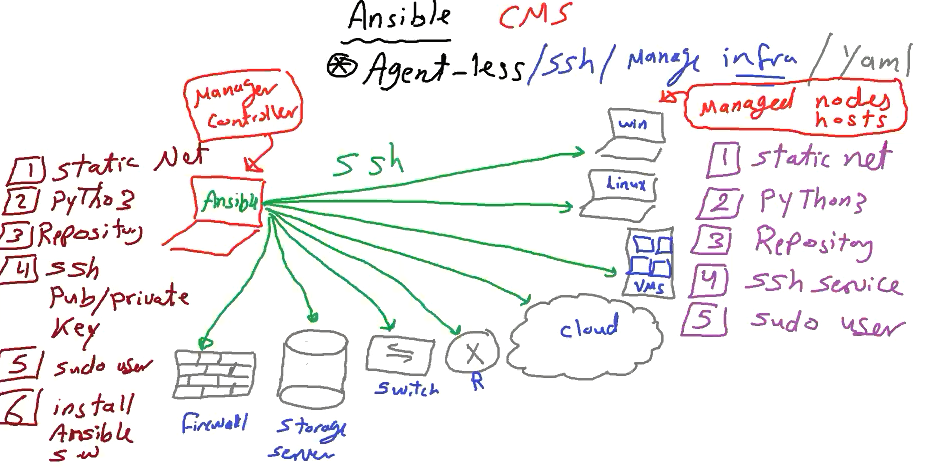
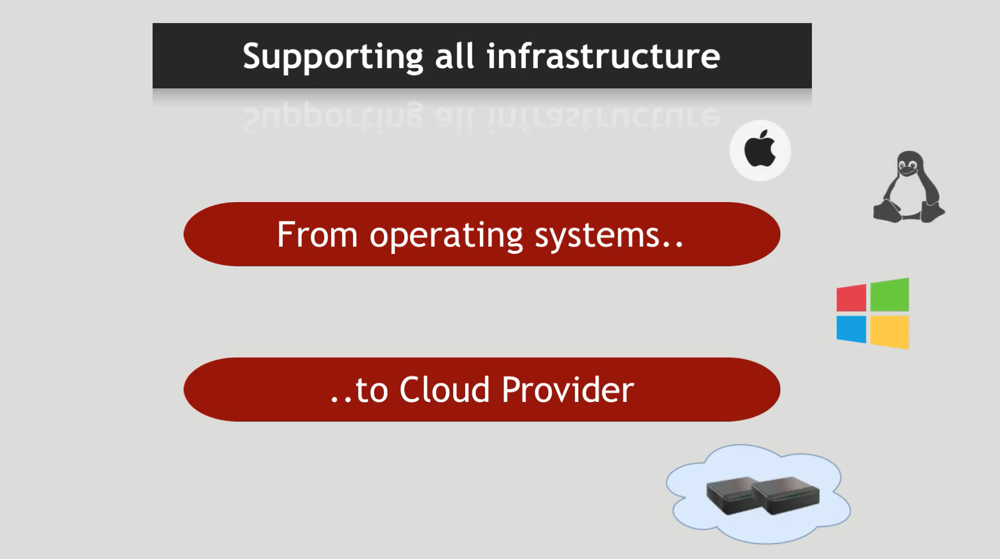
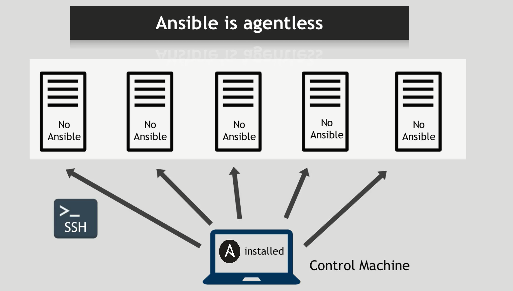
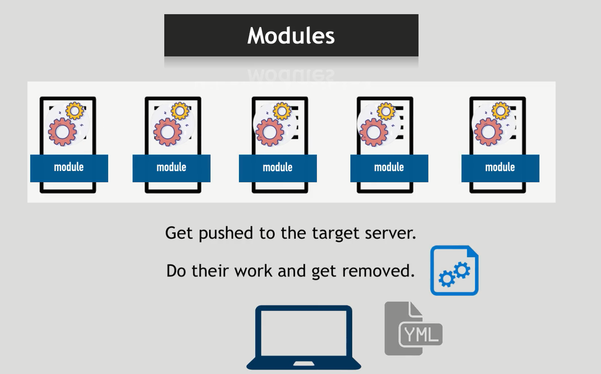
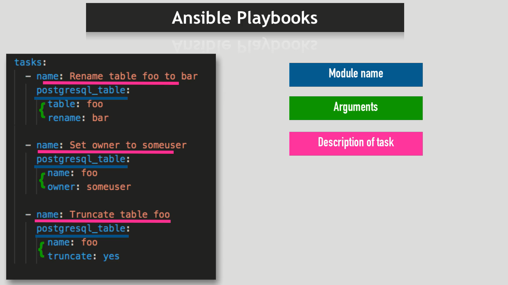
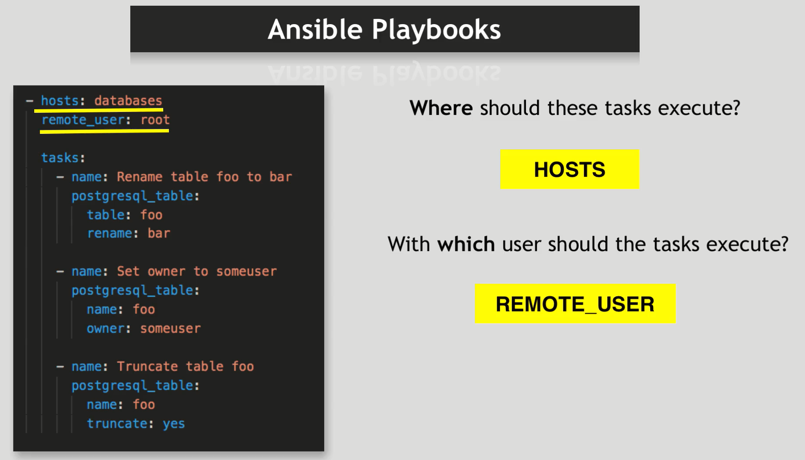
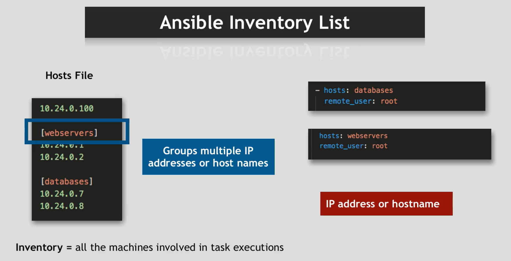
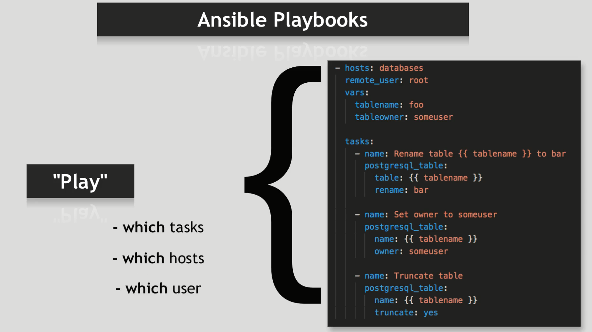
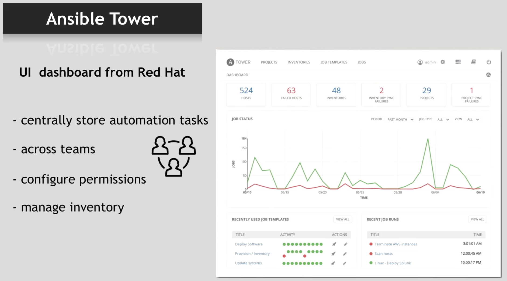

# Ansible

Ansible is an open-source automation tool used for IT tasks such as configuration management, application deployment, orchestration, and provisioning. It enables infrastructure as code (IaC), allowing users to define the desired state of their systems and applications through simple, human-readable YAML files.










## Key Features of Ansible

1. **Agent-less**: Ansible does not require any agent software to be installed on the managed nodes. It uses SSH (or WinRM for Windows) to communicate with nodes.

2. **Simple and Easy to Learn**: Ansible uses YAML (Yet Another Markup Language) for writing playbooks, which are easy to read and write.

3. **Idempotent**: Ansible ensures that applying the same playbook multiple times will result in the same state, preventing unintended changes.

4. **Powerful and Flexible**: Ansible can manage a wide range of devices, from servers and cloud instances to networking equipment and more.

5. **Modular**: Ansible's functionality can be extended with custom modules, plugins, and roles.

## Core Concepts

1. **Playbooks**: YAML files that define a series of tasks to be executed on the managed nodes. Playbooks are the main way to define configurations and automate processes.

2. **Inventory**: A file that defines the hosts (nodes) to be managed. Inventories can be static or dynamic.

3. **Modules**: Reusable units of code that perform specific tasks such as installing packages, managing services, or configuring files. Ansible comes with a wide range of built-in modules.

4. **Tasks**: Individual actions that Ansible executes. Tasks are the building blocks of playbooks.

5. **Roles**: A way to organize playbooks and other Ansible components. Roles allow for the reuse of Ansible code across multiple projects.

6. **Handlers**: Special tasks that are triggered by other tasks. Handlers are typically used to restart services or reload configurations only when necessary.

## Key Components of Ansible Architecture

1. **Control Node**

   - The machine where Ansible is installed and from which all Ansible commands and playbooks are run.
   - The control node can be any machine with Python installed, including a developer's laptop, a dedicated server, or a virtual machine.

2. **Managed Nodes**

   - The target machines that Ansible manages, configures, and orchestrates.
   - Managed nodes do not require any special Ansible agent. Ansible communicates with them over SSH for Unix/Linux systems or WinRM for Windows systems.

3. **Inventory**

   - A file or script that lists the managed nodes (hosts) and can group them for easier management.
   - Can be a static file (e.g., `hosts.ini`) or dynamic, pulling data from cloud services, directories, or other sources.

4. **Playbooks**

   - YAML files that define the automation tasks to be executed on the managed nodes.
   - A playbook consists of one or more "plays," which are mappings of hosts to tasks.

5. **Modules**

   - Discrete units of code that perform specific tasks like installing packages, managing services, or executing commands.
   - Ansible includes a wide range of built-in modules, and users can write custom modules as needed.

6. **Plugins**

   - Extend Ansible’s functionality. Various types include:
     - **Action Plugins:** Execute during task execution.
     - **Cache Plugins:** Save facts between playbook runs.
     - **Connection Plugins:** Handle communication with managed nodes.
     - **Lookup Plugins:** Retrieve data from external sources.
     - **Filter Plugins:** Transform data within Jinja2 templates.
     - **Test Plugins:** Validate conditions in playbooks.

7. **Roles**

   - A way to group playbooks, tasks, variables, files, templates, and modules together to organize and reuse Ansible code.
   - Roles can be shared and downloaded from Ansible Galaxy, a repository for community-contributed roles.

8. **Handlers**

   - Tasks that are triggered by other tasks. Typically used to restart services or reload configurations only when changes are made.

9. **Facts**

   - Data collected about managed nodes during playbook execution.
   - Facts are gathered by Ansible modules and can be used to make decisions in playbooks.

10. **Templates**
    - Files that contain variables and are processed using the Jinja2 templating engine to generate configuration files dynamically.

### Workflow

1. **Define Inventory:** Create an inventory file that lists the managed nodes and their groups.
2. **Write Playbooks:** Develop playbooks to describe the desired state of the infrastructure and applications.
3. **Execute Playbooks:** Use the `ansible-playbook` command to run playbooks against the inventory, applying configurations and tasks to the managed nodes.
4. **Modules and Plugins:** Playbooks call Ansible modules and plugins to perform actions on the managed nodes.
5. **Gather Facts:** Ansible collects facts about the managed nodes and uses this information to make decisions and conditionally execute tasks.
6. **Use Handlers and Roles:** Handlers and roles help in organizing tasks and ensuring efficient and reusable automation.

### Example Inventory File

```ini
[webservers]
web1.example.com
web2.example.com

[dbservers]
db1.example.com
db2.example.com
```

### Example Playbook

```yaml
---
- name: Ensure web servers are running
  hosts: prod
  become: yes

  tasks:
    - name: Install Nginx
      apt:
        name: nginx
        state: present

    - name: Start Nginx service
      service:
        name: nginx
        state: started

- name: Ensure database servers are configured
  hosts: dev
  become: yes

  tasks:
    - name: Install PostgreSQL
      apt:
        name: postgresql
        state: present

    - name: Start PostgreSQL service
      service:
        name: postgresql
        state: started
```

## Installation (production)

To set up Ansible, you'll need to configure both the control node (where Ansible runs) and the managed nodes (the target systems that Ansible will manage). Below are detailed steps for setting up both types of nodes.

### 1.**Control Node Setup**

1. install tools (python3, openssh-server, net-tools)
1. ssh pub/private key
1. install ansible

```sh
# 1. install python3
sudo apt install python3 openssh-server -y

# 2. ssh pub/private key
ssh-keygen -t rsa -b 4096 -C "HadyWafa@outlook.com"

# 3. install ansible
sudo apt install ansible-core -y

# verify installation
ansible --version
```

### 2. **Managed Node Setup**

1. Create a User for Ansible with Sudo Privileges
1. install tools (python3, openssh-server, net-tools, sshd)
1. Start and Enable SSH Service
1. To know the ip address of the managed node
1. Set Up SSH Key-Based Authentication
1. Configure Ansible Inventory

```sh
# 1. Create a User for Ansible with Sudo Privileges
adduser ansible
usermod -aG sudo ansible
echo ansible ALL=(ALL) NOPASSWD: ALL >> /etc/sudoers

# 2. install tools (python3, openssh-server, net-tools, sshd)
apt install openssh-server python3 net-tools sudo vim -y

# 3. Start and Enable SSH Service
systemctl enable sshd # for container use: service ssh status
systemctl start sshd # for container use: service ssh start
```

### 3. **Configure Ansible Inventory**

#### 1. copy control node public key to foreach managed node

```sh
# 1.Copy the public key to each managed node
ssh-copy-id ansible@managed_node_ip
# verify SSH Access
ssh ansible@managed_node_ip
```

#### 2. Configure Ansible Configuration File

```sh
mkdir /etc/ansible
vim /etc/ansible/ansible.cfg
```

```ini
[defaults]
remote_user = ansible
inventory = /etc/ansible/hosts
host_key_checking = false

[privilege_escalation]
become = True
become_user = root
become_method = sudo
become_ask_pass = false
```

#### 3. Configure Ansible Inventory File

```sh
vim /etc/ansible/hosts
```

```ini
[prod]
node_1 ansible_host=172.18.0.3 ansible_user=ansible
node_2 ansible_host=172.18.0.4 ansible_user=ansible

[dev]
node_3 ansible_host=172.18.0.5 ansible_user=ansible
```

### 4. **Test Ansible Setup**

```sh
#  Ping Managed Nodes
ansible all -m ping
```

## Installation (local on containers)

### 1.**Control Node Setup**

1. Create master_node container
1. Install tools (python3, openssh-server, net-tools)
1. ssh pub/private key
1. Install ansible

```sh
# 1. create master_node container
docker run -d \
--name ansible_node \
--hostname ansible_node \
--ip 172.18.0.2 \
--network ansible_net \
--restart always \
ubuntu sleep infinity
# connect to the container
docker exec -it ansible_node bash

# 2. install python3
apt update
apt install python3 openssh-server -y

# 3. ssh pub/private key
ssh-keygen -t rsa -b 4096 -C "HadyWafa@outlook.com"

# 4. install ansible
apt install ansible-core -y

# verify installation
ansible --version

```

### 2.**Managed Node Setup**

1. Create managed_node container
1. Create a User for Ansible with Sudo Privileges
1. Install tools (python3, openssh-server, net-tools, sshd)
1. Start and Enable SSH Service

```sh
# 1. create managed_node container
docker run -d \
--name node_1 \
--hostname node_1 \
--ip 172.18.0.3 \
--network ansible_net \
--restart always \
ubuntu sleep infinity
# connect to the container
docker exec -it node_1 bash

# 2. Create a User for Ansible with Sudo Privileges
adduser ansible
usermod -aG sudo ansible
echo 'ansible ALL=(ALL) NOPASSWD: ALL' >> /etc/sudoers

# 3. install tools (python3, openssh-server, net-tools, sshd)
apt update
apt install openssh-server python3 net-tools sudo vim -y

# 4. Start and Enable SSH Service
service ssh start
```

```sh
# 1. create managed_node container
docker run -d \
--name node_2 \
--hostname node_2 \
--ip 172.18.0.4 \
--network ansible_net \
--restart always \
debian sleep infinity
# connect to the container
docker exec -it node_2 bash

# 2. Create a User for Ansible with Sudo Privileges
adduser ansible
usermod -aG sudo ansible
echo 'ansible ALL=(ALL) NOPASSWD: ALL' >> /etc/sudoers

# 3. install tools (python3, openssh-server, net-tools, sshd)
apt update
apt install openssh-server python3 net-tools sudo vim -y

# 4. Start and Enable SSH Service
service ssh start
```

```sh
# 1. create managed_node container
docker run -d \
--name node_3 \
--hostname node_3 \
--ip 172.18.0.5 \
--network ansible_net \
--restart always \
fedora sleep infinity
# connect to the container
docker exec -it node_3 bash

# 2. Create a User for Ansible with Sudo Privileges
adduser ansible
echo 'ansible:password' | chpasswd
usermod -aG wheel ansible
echo 'ansible ALL=(ALL) NOPASSWD: ALL' >> /etc/sudoers

# 3. install tools (python3, openssh-server, net-tools, sshd)
dnf update
dnf install openssh-server python3 net-tools sudo vim -y

# 4. Start and Enable SSH Service
ssh-keygen -A
/usr/sbin/sshd
```

## Conclusion

- Ansible follows a push-based model, where the control node pushes configurations and commands to the managed nodes. The control node connects to the managed nodes over SSH (or WinRM for Windows) and executes tasks defined in playbooks.

- Ansible uses a declarative approach, meaning that users define the desired state of the system, and Ansible ensures that the system is in that state. This is in contrast to imperative approaches, where users define the steps to achieve a desired state.

- Ansible uses a client-server architecture, where the control node is the client and the managed nodes are the servers. The control node can manage multiple managed nodes simultaneously, making it easy to scale and automate infrastructure tasks.

- Modules works with modules, which are small programs that Ansible runs on the managed nodes to perform specific tasks. Modules can be written in any programming language and are executed on the managed nodes, not the control node.

- Modules are idempotent, meaning that applying the same module multiple times will result in the same state. This ensures that Ansible playbooks can be run multiple times without causing unintended changes.

- Ansible uses a simple and human-readable syntax based on YAML (Yet Another Markup Language) for defining playbooks. Playbooks are organized into tasks, which are executed sequentially on the managed nodes.

- Ansible uses an inventory file to define the hosts (nodes) that it will manage. The inventory file can be static or dynamic and can include information such as IP addresses, hostname, and groupings of hosts.

- Ansible can be extended with custom modules, plugins, and roles to meet specific requirements. Users can write their own modules in any programming language and share them with the Ansible community.

- Ansible's architecture is designed to be simple, flexible, and efficient, leveraging a declarative approach to automate IT infrastructure tasks. Below is an overview of the key components and how they interact within the Ansible ecosystem.
