# Prometheus

## Prometheus Architecture

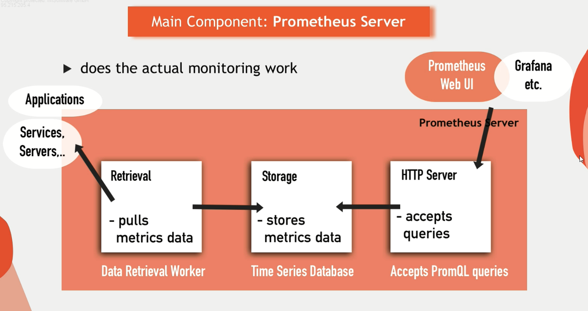

### Prometheus Metrics

- Prometheus collects metrics from various systems and services.
- Metrics are key-value pairs that represent the state of a system at a specific point in time.
- Metrics are used to monitor the health and performance of systems and services.
  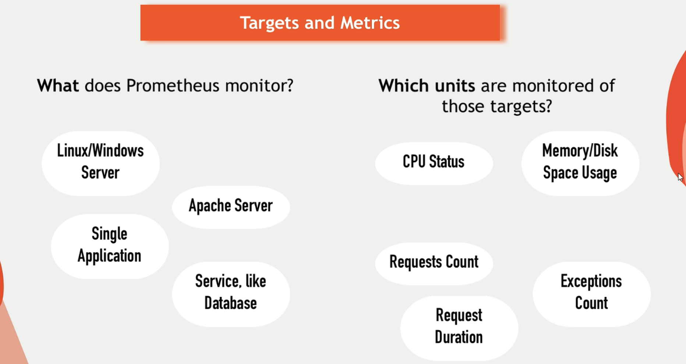
  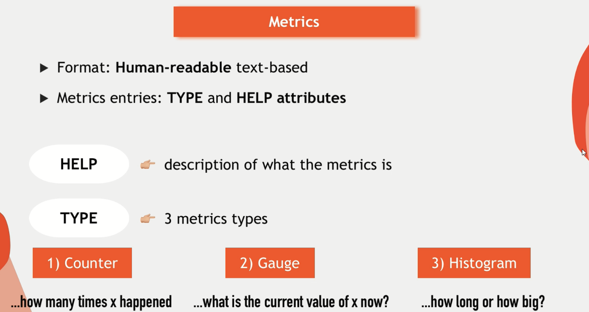
  

### Prometheus Exporters

- Prometheus exporters are agents that collect metrics from various systems and services and expose them in a format that Prometheus can understand.
- Exporters are used to monitor third-party systems that do not natively expose Prometheus metrics.
  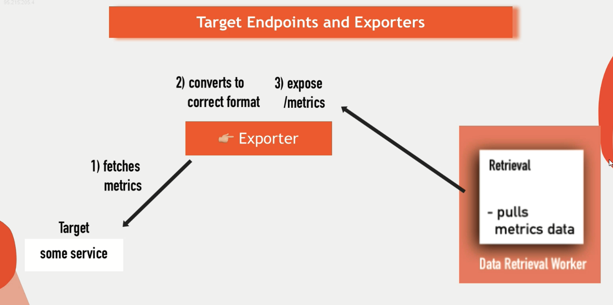
  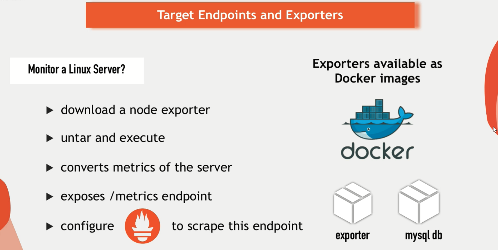
  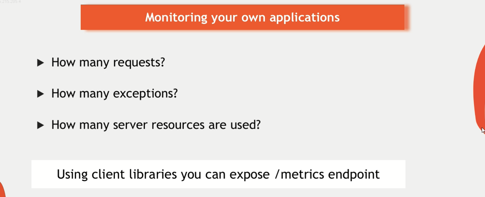

### Pull vs Push Metrics

- Prometheus uses a pull-based model to collect metrics from targets.
- In a pull-based model, Prometheus scrapes metrics from targets at regular intervals.
- This model is more reliable and scalable than a push-based model.
  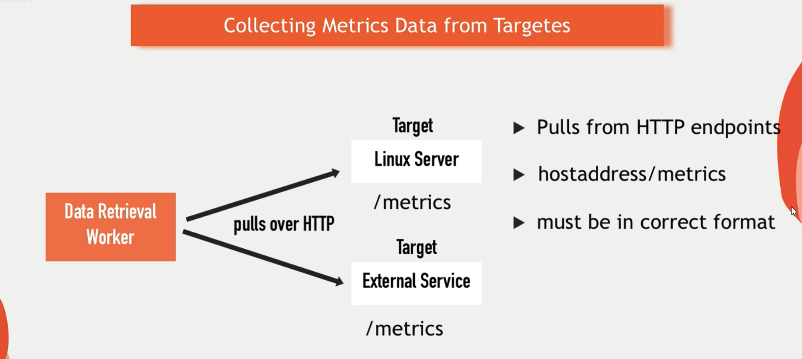
  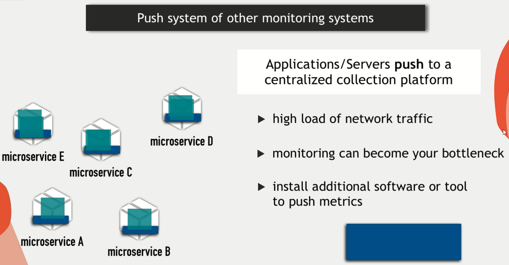

### Configuration in Prometheus

- Prometheus uses a configuration file to define the targets to scrape and other settings.
- The configuration file is written in YAML format and is used to define jobs, targets, and other settings.
  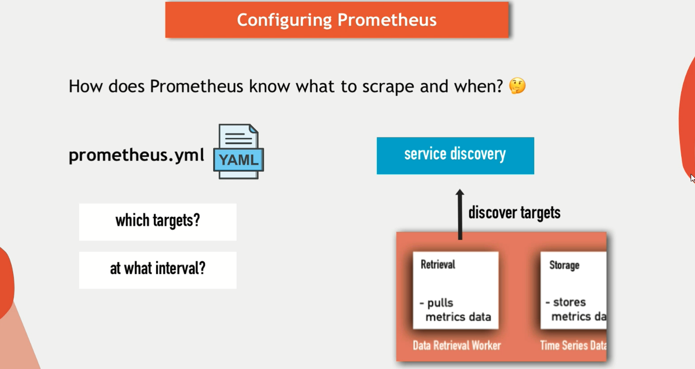
  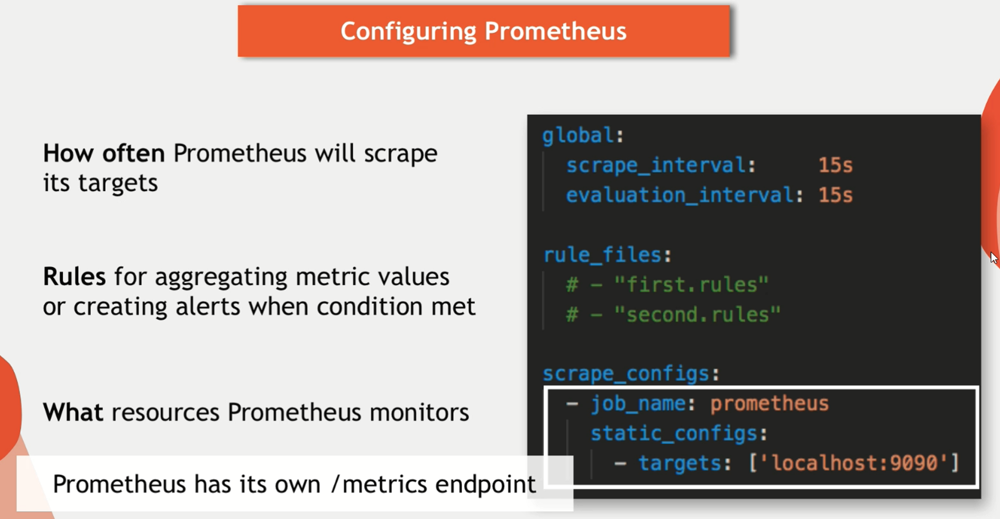
  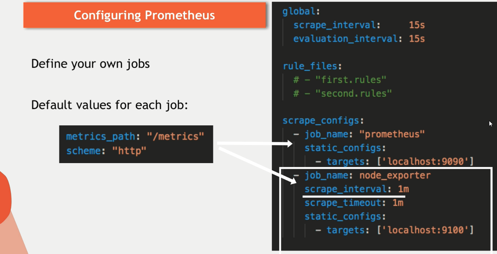

### Alerting in Prometheus

- Prometheus supports alerting based on predefined rules.
- Alerts are defined using PromQL expressions and are evaluated at regular intervals.
  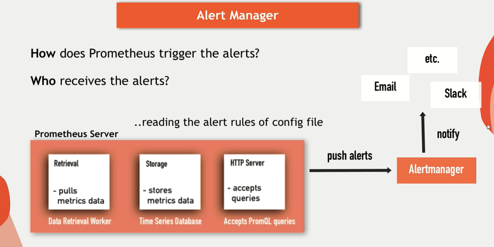

### Prometheus Data Storage

- Prometheus stores metrics in a time series database.
- The database is optimized for time series data and is designed to handle high write loads.
- Data is stored in a compressed format to save disk space.
- Prometheus supports long-term storage using remote storage adapters.

  - Remote storage adapters allow storing metrics in external databases like InfluxDB, Google Cloud Storage, etc.
  - This helps in archiving metrics for long-term analysis and retention.

  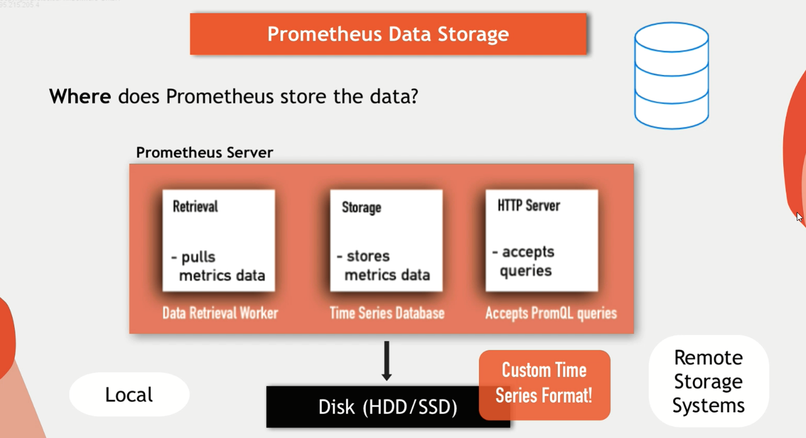

### Prometheus Query Language (PromQL)

- Prometheus Query Language (PromQL) is a powerful query language used to query and analyze metrics.
- PromQL supports a wide range of functions and operators to filter, aggregate, and transform metrics.
- PromQL is used to create dashboards, alerts, and reports in Prometheus.
  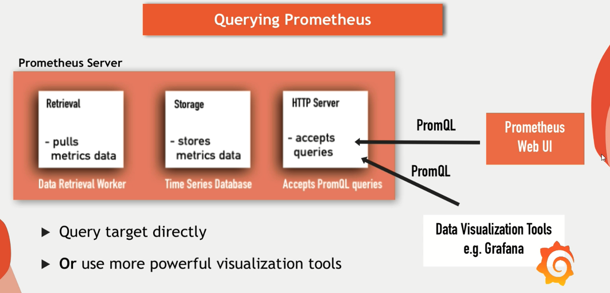
  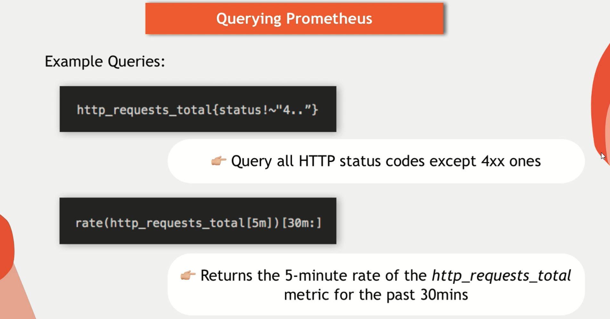

### Prometheus with k8s

- Prometheus can be deployed on Kubernetes to monitor the health and performance of Kubernetes clusters.
- Prometheus can scrape metrics from Kubernetes API objects like pods, nodes, deployments, etc.
  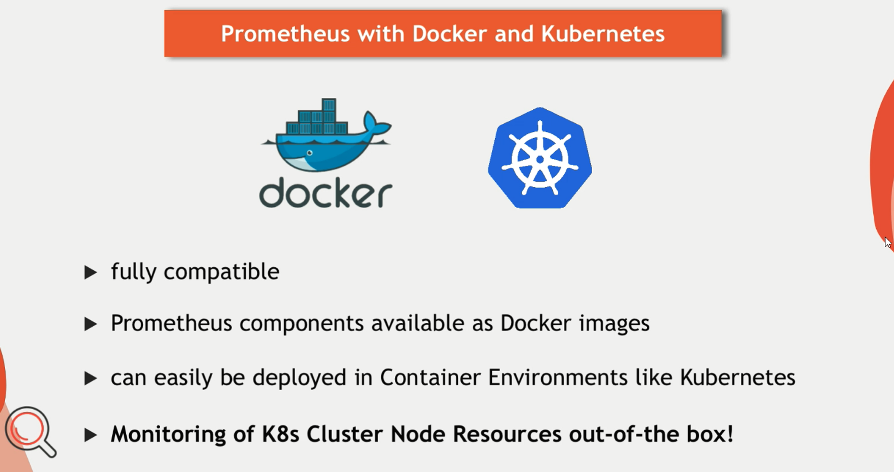

## Installation (using helm)

Using a Helm chart simplifies the installation and management of the entire Prometheus stack in a Kubernetes environment. Here's a brief overview of how to install the Prometheus stack using Helm:

```bash
# 1.pull the prometheus helm chart
helm repo add prometheus-community https://prometheus-community.github.io/helm-charts

# 2.update the helm repo
helm repo update

# 3.install the prometheus stack in the isolated namespace
helm install prometheus-stack prometheus-community/kube-prometheus-stack \
--namespace=prometheus-stack \
--create-namespace
```

### **Accessing the Components**

- **Prometheus**: Usually available at `http://<prometheus-service-url>/graph`
- **Alertmanager**: Available at `http://<alertmanager-service-url>`
- **Grafana**: Available at `http://<grafana-service-url>`

## Understanding the prometheus stack

The Prometheus stack consists of several key components, each playing a specific role in monitoring and alerting. Here's a simple overview of each component:

### **Deployment**

#### 1. `kube-prometheus-operator`

- **Role**: Simplifies the deployment and management of Prometheus on Kubernetes.
- **Function**: Manages Prometheus instances, AlertManager instances, and related configurations using Kubernetes Custom Resource Definitions (CRDs).
- **Key Features**:
  - **Automation**: Automates the creation and management of Prometheus instances.
  - **Configuration**: Manages configurations and ensures Prometheus and AlertManager are correctly set up.

#### 2. `kube-state-metrics`

- **Role**: An exporter that generates metrics about the state of Kubernetes objects.
- **Function**: Collects metrics about Kubernetes API objects (such as deployments, nodes, pods) and makes them available to Prometheus.
- **Key Features**:
  - **Kubernetes Metrics**: Provides detailed metrics about the state and health of Kubernetes resources.
  - **Integration**: Works seamlessly with Prometheus to provide insights into Kubernetes clusters.

#### 3. `grafana`

- **Role**: A visualization and dashboard tool.
- **Function**: Provides a web interface to create, explore, and share dashboards using data from Prometheus and other data sources.
- **Key Features**:
  - **Visualization**: Allows creating complex and interactive visualizations.
  - **Dashboards**: Pre-built and customizable dashboards for various use cases.
  - **Alerts**: Supports creating and managing alerts based on data visualized in Grafana.

### **DaemonSet**

DaemonSet is a Kubernetes controller that ensures that all (or some) Nodes run a copy of a Pod, it used to run a single instance of a Pod on each Node in the cluster.

#### 1. `node-exporter`

- **Role**: An exporter for hardware and OS metrics.
- **Function**: Collects and exposes system-level metrics such as CPU, memory, disk usage, and network statistics.
- **Key Features**:
  - **System Metrics**: Provides essential metrics about the health and performance of the system.
  - **Compatibility**: Works with Linux and other Unix-like operating systems.

### **StatefulSet**

#### 1. `kube-prom-prometheus`

- **Role**: The core component that scrapes and stores time series data.
- **Function**: It collects metrics from configured targets at specified intervals, stores the data, and makes it available for querying.
- **Key Features**:
  - **Scraping**: Collects metrics from HTTP endpoints.
  - **Storage**: Stores scraped metrics in a time series database.
  - **Querying**: Provides a powerful query language called PromQL to query and analyze the metrics.

#### 2. `kube-prom-alertmanager`

- **Role**: Handles alerts sent by the Prometheus server.
- **Function**: Manages alert notifications by grouping, deduplicating, and routing them to various receivers like email, Slack, PagerDuty, etc.
- **Key Features**:
  - **Grouping**: Groups similar alerts to reduce noise.
  - **Routing**: Sends alerts to specified notification channels based on rules.
  - **Silencing**: Temporarily suppresses notifications for certain alerts.
