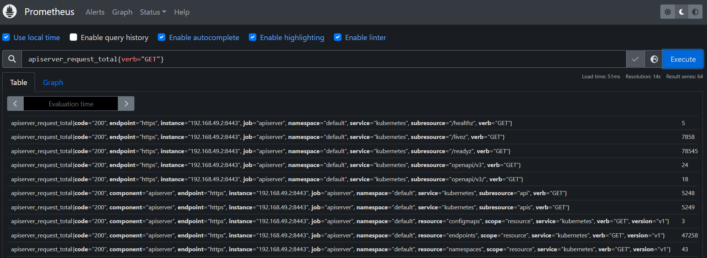

# Prometheus UI



- Prometheus has a built-in UI for monitoring and alerting.
- You can access the Prometheus UI by visiting `http://localhost:9090` in your web browser.

  ```shell
  kubectl port-forward svc/prometheus-stack-kube-prom-prometheus 9090:80 -n prometheus-stack
  ```

## **Status Menu**

### **Targets**

- **Description**: Displays all endpoints (targets) that Prometheus is scraping.
- **Source of Info**: Configured in Prometheus' `prometheus.yml` file under the `scrape_configs` section.
- **How to Use**:
  - Monitor the health status (up/down) of each target.
  - Check scrape duration and errors.
  - Identify and troubleshoot targets that are down or slow to respond.

### **Rules**

- **Description**: Lists all recording and alerting rules.
- **Source of Info**: Defined in rule files specified in the Prometheus configuration.
- **How to Use**:
  - Verify if rules are correctly defined and active.
  - Check the last evaluation time and duration.
  - Debug issues with rules by reviewing their status and results.

### **Alerts**

- **Description**: Shows the current state of alerting rules.
- **Source of Info**: Evaluated by Prometheus based on the alerting rules configuration.
- **How to Use**:
  - View active alerts and their status (pending, firing).
  - Understand the conditions that triggered each alert.
  - Take action based on alert severity and status.

### **Service Discovery**

- **Description**: Displays all targets discovered through service discovery mechanisms.
- **Source of Info**: Configured service discovery integrations (e.g., Kubernetes, Consul).
- **How to Use**:
  - Review dynamically discovered targets.
  - Ensure service discovery mechanisms are functioning correctly.
  - Adjust configurations if targets are missing or incorrect.

### **Config**

- **Description**: Shows the active Prometheus configuration.
- **Source of Info**: The `prometheus.yml` file and any other configuration files included.
- **How to Use**:
  - Review the configuration for accuracy.
  - Debug configuration issues by verifying settings.
  - Ensure changes in configuration files are correctly reflected.

### **Flags**

- **Description**: Lists the command-line flags Prometheus was started with.
- **Source of Info**: Command-line arguments passed when Prometheus was started.
- **How to Use**:
  - Review startup options and flags.
  - Adjust command-line arguments if necessary to change Prometheus behavior.

### **Runtime & Build Info**

- **Description**: Provides information about Prometheus's runtime environment and build version.
- **Source of Info**: Internal Prometheus metadata.
- **How to Use**:
  - Check the Prometheus version and build date.
  - Review runtime settings and environment details.
  - Ensure the Prometheus instance is up-to-date.

## **Graph Menu**

- **Description**: Allows you to visualize metrics using PromQL queries.
- **Source of Info**: Time-series data collected by Prometheus.
- **How to Use**:
  - Enter PromQL queries to generate graphs.
  - Adjust the time range and resolution for detailed analysis.
  - Save and reuse frequently used queries for quick access.

## **Alerts Menu**

- **Description**: Displays currently active alerts and their status.
- **Source of Info**: Evaluated by Prometheus based on the alerting rules configuration.
- **How to Use**:
  - Monitor active alerts and understand their current state.
  - Investigate and resolve issues causing alerts to fire.
  - Ensure alert rules are working as intended.
