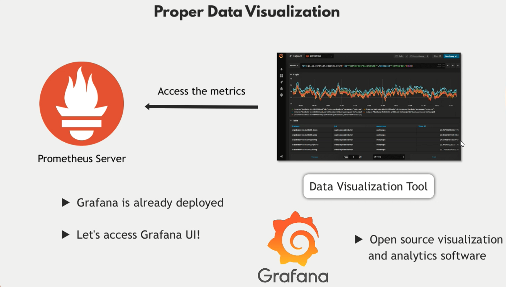

# Grafana Documentation



## Table of Contents

1. Introduction to Grafana
2. Setting Up Grafana
   - Installation
   - Adding Data Sources
3. Working with Dashboards and Panels
   - Creating Dashboards
   - Adding and Configuring Panels
4. Querying Data
   - Query Editors
   - Supported Query Languages
5. Visualizations
   - Types of Visualizations
   - Customizing Visualizations
6. Configuring Query Intervals and Understanding the Pull Mechanism
   - Pull vs. Push Mechanism
   - Grafana's Use of the Pull Mechanism
   - Configuring Query Intervals
7. User Management and Permissions
8. Alerting in Grafana
9. Plugins
10. Best Practices
11. Troubleshooting and FAQs

## 1. Introduction to Grafana

Grafana is an open-source platform for monitoring and observability. It allows you to query, visualize, alert on, and understand your metrics, logs, and traces no matter where they are stored.

## 2. Setting Up Grafana

### Installation

Grafana can be installed on various operating systems and cloud platforms. Detailed installation instructions can be found on the [official Grafana documentation](https://grafana.com/docs/grafana/latest/installation/).

### Adding Data Sources

1. Navigate to **Configuration > Data Sources**.
2. Click **Add data source**.
3. Select the desired data source type (e.g., Prometheus, InfluxDB).
4. Enter the necessary connection details and click **Save & Test**.

## 3. Working with Dashboards and Panels

- dashboards are collections of panels that visualize data from data sources.
- panels are individual visualizations (e.g., graphs, tables) that display data.
- row groups panels together in a dashboard.
- each dashboard can have multiple rows with multiple panels (for organized).

### Creating Dashboards

1. Navigate to **Dashboards > Manage**.
2. Click **New Dashboard**.
3. Add panels to the dashboard by clicking **Add new panel**.

### Adding and Configuring Panels

1. Select the type of panel you want to add (e.g., graph, table).
2. Configure the panel settings, including queries, visualizations, and thresholds.

## 4. Querying Data

### Query Editors

Grafana supports various query editors depending on the data source, such as PromQL for Prometheus, Flux for InfluxDB, and SQL for relational databases.

### Supported Query Languages

- **PromQL**: Used for querying Prometheus.
- **Flux**: Used for querying InfluxDB.
- **SQL**: Used for querying relational databases like MySQL, PostgreSQL.

## 5. Visualizations

### Types of Visualizations

- Graph
- Table
- Heatmap
- Gauge
- Bar Gauge
- Singlestat
- Text

### Customizing Visualizations

Each panel type offers various customization options, including color schemes, axes configuration, legends, and more.

## 6. Configuring Query Intervals and Understanding the Pull Mechanism

### Pull vs. Push Mechanism

#### Pull Mechanism

- **Definition**: The data collector (e.g., Grafana) actively requests data from data sources at regular intervals.
- **Advantages**:
  - **Control**: Fine-tuned data retrieval by controlling when and how often data is fetched.
  - **Load Management**: Efficiently manage the load on both the data collector and data sources by adjusting query intervals.

#### Push Mechanism

- **Definition**: Data sources actively send data to the data collector without being requested.
- **Advantages**:
  - **Real-time Data**: Near real-time updates as data is sent immediately when available.
  - **Simplicity**: Simplifies architecture as data sources handle the responsibility of sending data.

### Grafana's Use of the Pull Mechanism

Grafana primarily operates using a pull mechanism to fetch data from various data sources by sending queries and receiving data in response.

### How the Pull Mechanism Works in Grafana

1. **Querying Data**: Grafana sends queries to data sources based on configured intervals or user interactions.
2. **Data Retrieval**: Data sources respond with the requested data.
3. **Visualization**: Grafana processes and visualizes the data in dashboards.

### Example Workflow: Prometheus with Grafana

1. **Set Up Prometheus**: Configure Prometheus to scrape metrics and store them.
2. **Add Prometheus as a Data Source in Grafana**: Navigate to **Configuration > Data Sources**, add Prometheus, and enter the server URL.
3. **Create and Configure a Dashboard**: Build a dashboard with panels that query Prometheus.
4. **Data Retrieval and Visualization**: Grafana sends HTTP requests to Prometheus, retrieves data, and visualizes it.

### Configuring Query Intervals in Grafana

#### Global Settings

1. **Global Refresh Interval**: Set in the `grafana.ini` configuration file.
   ```ini
   [dashboards]
   min_refresh_interval = 5s
   ```

#### Dashboard Settings

1. **Dashboard Auto-refresh**: Set the auto-refresh interval for each dashboard in the **Time range** section.

#### Panel Settings

1. **Panel-specific Query Interval**: Set the specific query interval in the **Query** tab of the panel.

## 7. User Management and Permissions

Grafana allows the creation of users, teams, and organizations, each with customizable permissions. Navigate to **Configuration > Users** to manage users and permissions.

## 8. Alerting in Grafana

Grafana supports alerting based on metrics thresholds. Alerts can be configured in the panel settings and sent to various notification channels such as email, Slack, or PagerDuty.

## 9. Plugins

Grafana has a rich ecosystem of plugins that extend its functionality. Plugins can be installed from the [Grafana plugin catalog](https://grafana.com/grafana/plugins).

## 10. Best Practices

- Use appropriate query intervals to balance performance and data freshness.
- Organize dashboards and panels for clarity and ease of use.
- Regularly update Grafana and its plugins for security and new features.

## 11. Troubleshooting and FAQs

Refer to the [official Grafana documentation](https://grafana.com/docs/grafana/latest/troubleshooting/) for common issues and their solutions. Frequently asked questions can also be found in the [Grafana community forums](https://community.grafana.com/).

---

This documentation provides a structured overview of Grafana, including its setup, usage, and advanced configurations.
