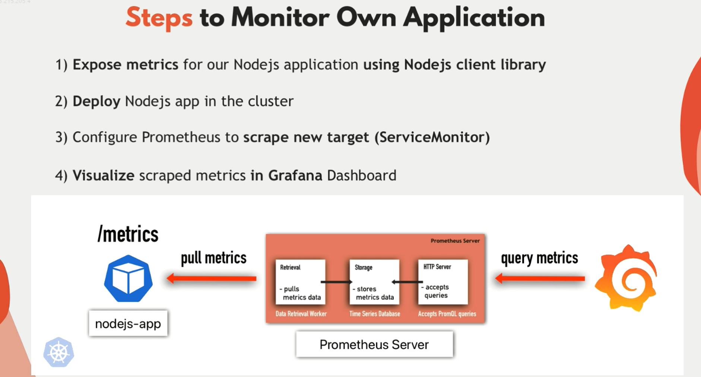
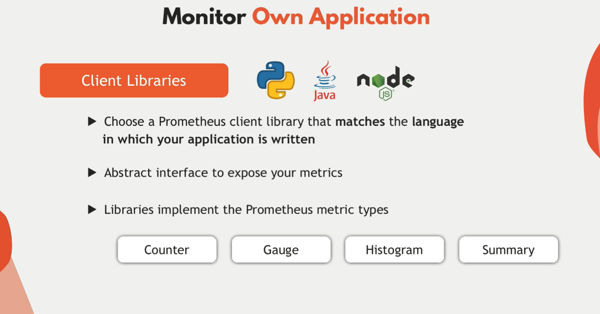

# Monitor your own application with Prometheus




## Monitoring Your Own Application with Prometheus in .NET

To monitor your .NET application using Prometheus, you can use the Prometheus .NET client library to expose metrics. Here’s a step-by-step guide to set up a simple ASP.NET Core API with Prometheus metrics, focusing on total requests and request duration.

### Steps to Monitor a .NET Application with Prometheus

1. **Setup ASP.NET Core Application with Prometheus Metrics**
1. **Create Dockerfile**
1. **Build and Push Docker Image**
1. **Create Kubernetes Deployment and Service**
1. **Create a ServiceMonitor**
1. **Expose the Application using Port-Forward**
1. **Verify Prometheus Configuration**
1. **Add a Dashboard in Grafana**
1. **Testing**

### 1. Setup ASP.NET Core Application with Prometheus Metrics

Create a new ASP.NET Core application and add Prometheus metrics.

**Program.cs:**

```csharp
using Microsoft.AspNetCore.Builder;
using Microsoft.Extensions.DependencyInjection;
using Microsoft.Extensions.Hosting;
using Prometheus;
using System.Diagnostics;
using System.Threading.Tasks;

var builder = WebApplication.CreateBuilder(args);
builder.WebHost.UseUrls("http://*:80");
// Add services to the container.
builder.Services.AddControllers();

var app = builder.Build();

// Middleware to track request metrics
app.Use(async (context, next) =>
{
    var stopwatch = Stopwatch.StartNew();
    try
    {
        await next.Invoke();
    }
    finally
    {
        stopwatch.Stop();
        Metrics.CreateCounter("http_requests_total", "Total number of HTTP requests.").Inc();
        Metrics.CreateHistogram("http_request_duration_seconds", "The duration of HTTP requests processed in seconds.")
               .Observe(stopwatch.Elapsed.TotalSeconds);
    }
});

// Configure the HTTP request pipeline.
if (app.Environment.IsDevelopment())
{
    app.UseDeveloperExceptionPage();
}
else
{
    app.UseExceptionHandler("/Home/Error");
    app.UseHsts();
}

app.UseHttpsRedirection();
app.UseStaticFiles();
app.UseRouting();
app.UseAuthorization();

// Add Prometheus metrics endpoint
app.MapControllers();
app.MapMetrics(); // Maps the /metrics endpoint for Prometheus

app.MapGet("/test/exception", () =>
{
    throw new Exception("Test exception");
});

app.MapGet("/test/success", () =>
{
    return Results.Ok("This is a successful response.");
});

app.Run();
```

### 2. Create Dockerfile

Create a `Dockerfile` for your application:

```Dockerfile

# Use the official .NET Core SDK as a build image
FROM mcr.microsoft.com/dotnet/sdk:8.0@sha256:35792ea4ad1db051981f62b313f1be3b46b1f45cadbaa3c288cd0d3056eefb83 AS build
WORKDIR /app
# Copy only the project file to leverage Docker cache
COPY *.csproj ./
# Restore dependencies
RUN dotnet restore
# Copy the rest of the application code
COPY . .
# Build the application
RUN dotnet publish -c Release -o out
# Use the official .NET Core runtime as a runtime image
FROM mcr.microsoft.com/dotnet/aspnet:8.0@sha256:6c4df091e4e531bb93bdbfe7e7f0998e7ced344f54426b7e874116a3dc3233ff AS runtime
WORKDIR /app
# Copy the published output from the build image
COPY --from=build /app/out .
# `--from=build:` This specifies the build stage from which to copy files. In this case, it refers to the previous build stage defined with AS build.
# Define the entry point for the application
ENTRYPOINT ["dotnet", "MyApiApp.dll"]
```

### 3. Build and Push Docker Image

Build the Docker image and push it to a container registry (e.g., Docker Hub):

```bash
docker build -t hadywafa/simpleapi:latest .
docker push hadywafa/simpleapi:latest
```

### 4. Create Kubernetes Deployment and Service

Create a Kubernetes deployment and service configuration in `simpleapi-deployment.yaml`:

```yaml
apiVersion: apps/v1
kind: Deployment
metadata:
  name: simpleapi
  labels:
    app: simpleapi
spec:
  replicas: 1
  selector:
    matchLabels:
      app: simpleapi
  template:
    metadata:
      labels:
        app: simpleapi
    spec:
      containers:
        - name: simpleapi
          image: hadywafa/simpleapi:latest
          ports:
            - containerPort: 80
              name: http
          resources:
            limits:
              cpu: "0.5"
              memory: "512Mi"
            requests:
              cpu: "0.1"
              memory: "256Mi"
---
apiVersion: v1
kind: Service
metadata:
  name: simpleapi
  labels:
    app: simpleapi
spec:
  type: ClusterIP
  selector:
    app: simpleapi
  ports:
    - protocol: TCP
      port: 80
      targetPort: 80
      name: http
```

Apply the configuration:

```bash
kubectl apply -f simpleapi-deployment.yaml
```

### 5. Create a ServiceMonitor

Create a `ServiceMonitor` to configure Prometheus to scrape the `/metrics` endpoint of your application. Save the following YAML configuration as `simpleapi-servicemonitor.yaml`:

```yaml
apiVersion: monitoring.coreos.com/v1
kind: ServiceMonitor
metadata:
  name: monitor-simpleapi
  namespace: prometheus-stack
  labels:
    release: prometheus-stack
    app: simpleapi
spec:
  selector:
    matchLabels:
      app: simpleapi
  namespaceSelector:
    matchNames:
      - default
  endpoints:
    - port: http
      path: /metrics
      interval: 15s
```

Apply the `ServiceMonitor` configuration:

```bash
kubectl apply -f simpleapi-servicemonitor.yaml
```

### 6. Expose the Application using Port-Forward

Forward a local port to the Kubernetes service:

```bash
kubectl port-forward service/simpleapi 8080:80
```

You can now access your application at `http://localhost:5000`.

### 7. Verify Prometheus Configuration

1. **Access Prometheus**:

   Port-forward the Prometheus service to access it locally:

   ```bash
   kubectl port-forward svc/prometheus-kube-prometheus-prometheus 9090:9090
   ```

   Access Prometheus at `http://localhost:9090`.

2. **Check Targets**:

   In Prometheus, navigate to `Status` -> `Targets` to verify that your `simpleapi` target is being scraped.

### 8. Add a Dashboard in Grafana

1. **Access Grafana**:

   Port-forward the Grafana service to access it locally:

   ```bash
   kubectl port-forward svc/prometheus-grafana 3000:80
   ```

   Access Grafana at `http://localhost:3000`.

2. **Add Prometheus as a Data Source**:

   - Go to `Configuration` -> `Data Sources`.
   - Click `Add data source`.
   - Choose `Prometheus` and set the URL to `http://prometheus-kube-prometheus-prometheus.default.svc:9090`.
   - Click `Save & Test`.

3. **Create a Dashboard**:

   - Go to `Create` -> `Dashboard`.
   - Add a new panel and choose `Prometheus` as the data source.
   - Enter a Prometheus query like `http_exceptions_total` to see metrics about exceptions from your application.

### 9. Testing

- Navigate to `http://localhost:5000/test/exception` to trigger the exception.
- Check Prometheus and Grafana to see the metrics and any potential errors logged from your application.
